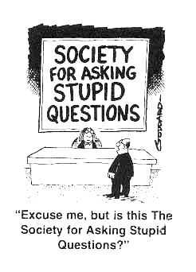
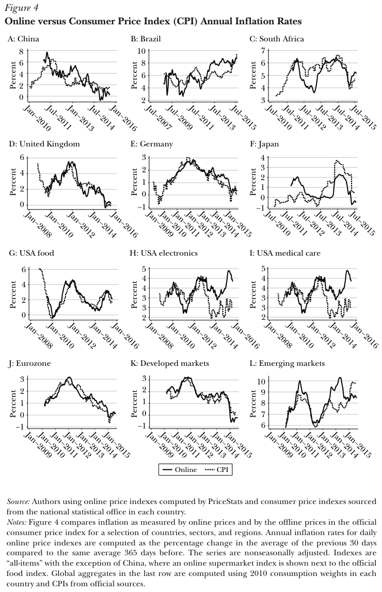
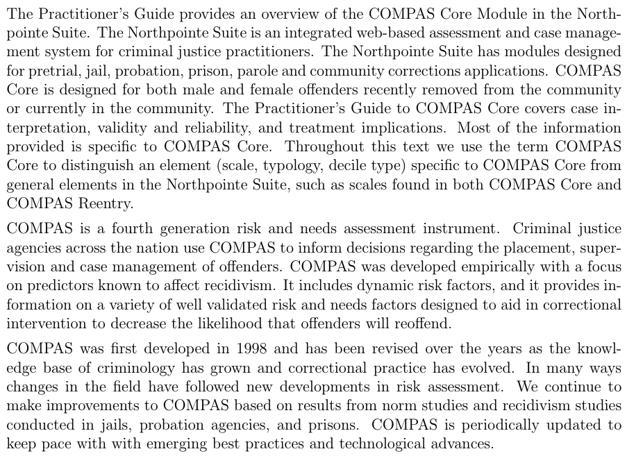
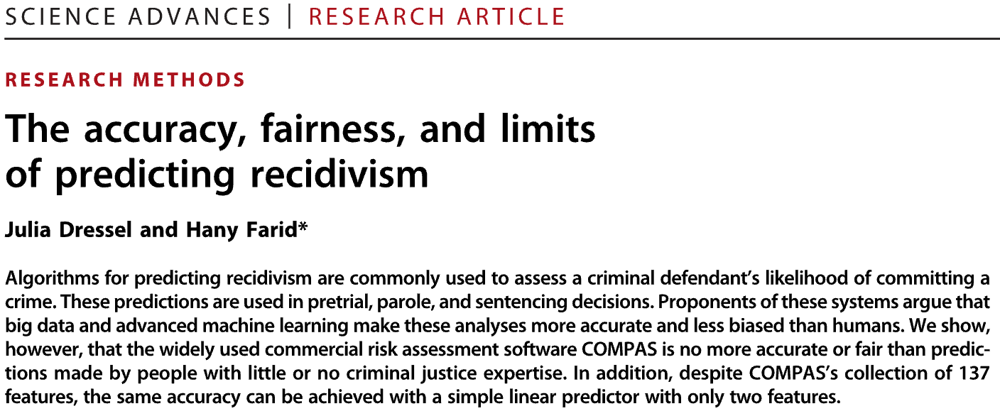
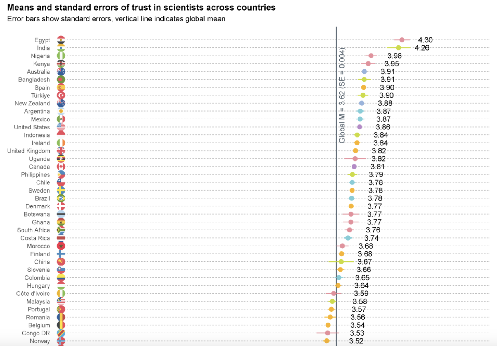
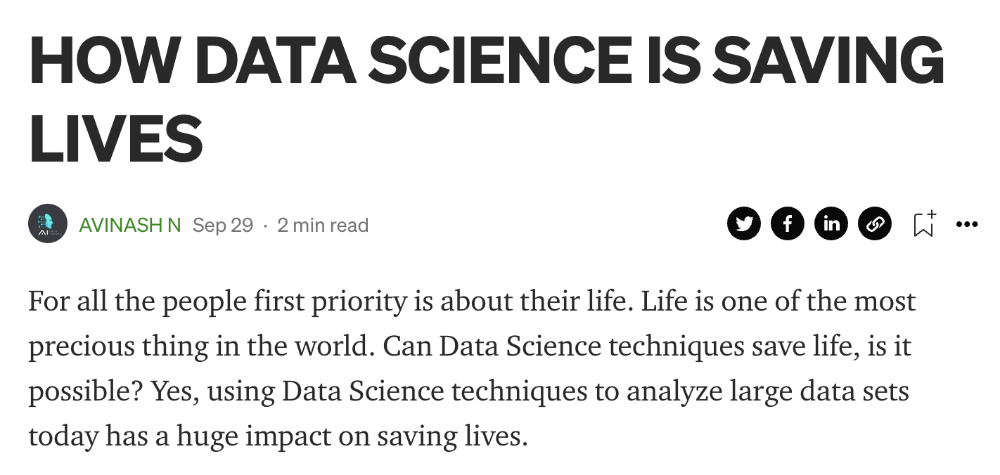
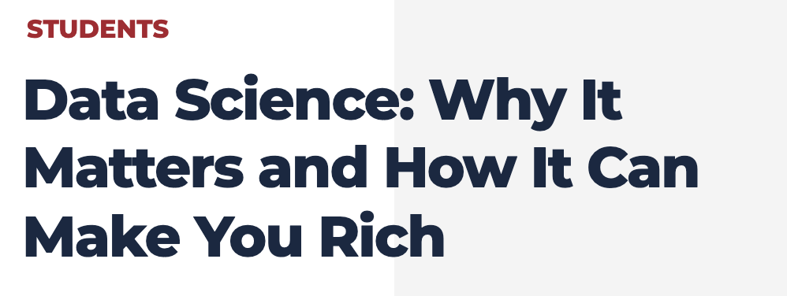
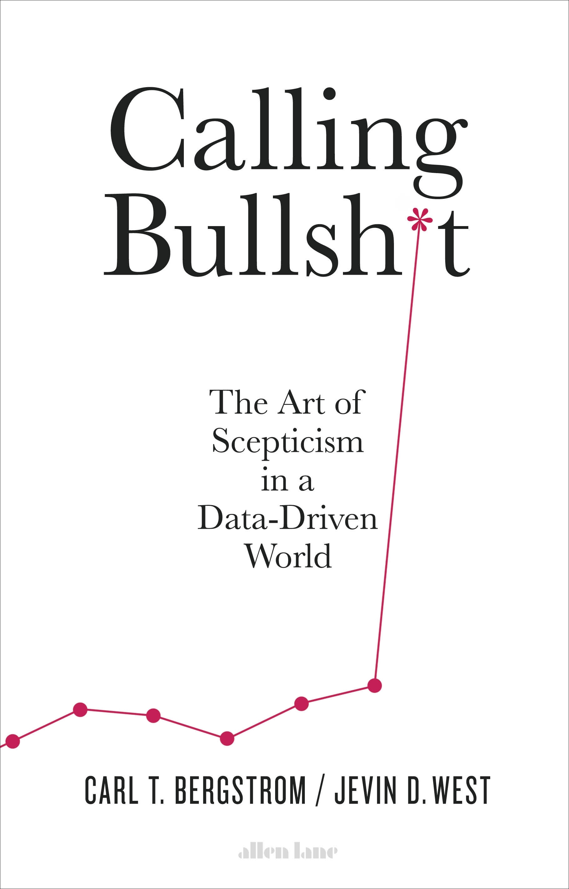
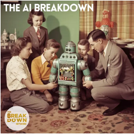
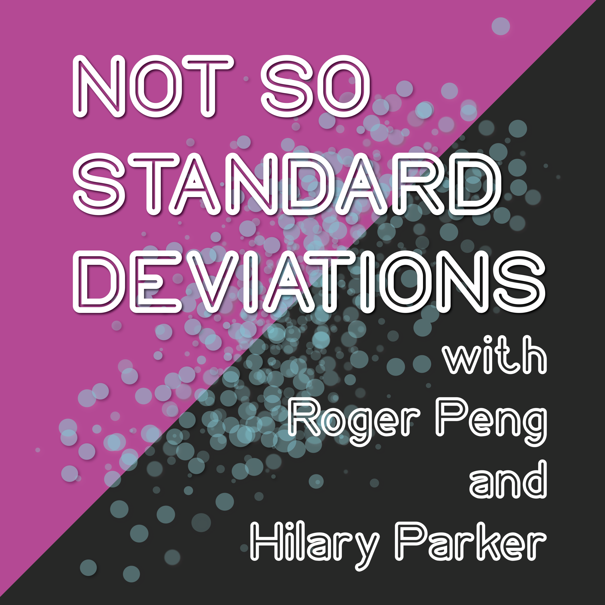

```{css, echo=FALSE} 
@media print { # print out incremental slides; see https://stackoverflow.com/questions/56373198/get-xaringan-incremental-animations-to-print-to-pdf/56374619#56374619
  .has-continuation {
    display: block !important;
  }
}
```

```{r setup, include=FALSE}
# figures formatting setup
options(htmltools.dir.version = FALSE)
library(knitr)
opts_chunk$set(
  prompt = T,
  fig.align="center", #fig.width=6, fig.height=4.5, 
  # out.width="748px", #out.length="520.75px",
  dpi=300, #fig.path='Figs/',
  cache=T, #echo=F, warning=F, message=F
  engine.opts = list(bash = "-l")
  )

## Next hook based on this SO answer: https://stackoverflow.com/a/39025054
knit_hooks$set(
  prompt = function(before, options, envir) {
    options(
      prompt = if (options$engine %in% c('sh','bash')) '$ ' else 'R> ',
      continue = if (options$engine %in% c('sh','bash')) '$ ' else '+ '
      )
})

library(tidyverse)
library(hrbrthemes)
library(fontawesome)
```


# Table of contents

</br></br>

1. [Welcome!](#welcome)

2. [What is data science?](#whatisdatascience)

3. [(Data) science for public policy](#science)

4. [Goals of this workshop](#goals)


---
class: inverse, center, middle
name: welcome

# Welcome!
<html><div style='float:left'></div><hr color='#EB811B' size=1px style="width:1000px; margin:auto;"/></html>


---
# Introductions

<br>

### Me

`r fa('address-book')` I'm [Simon Munzert](https://simonmunzert.github.io/) [si’mən munsɜrt], or just Simon [saɪmən].

`r fa('envelope')` [munzert@hertie-school.org](mailto:munzert@hertie-school.org)

`r fa('graduation-cap')` Professor of Data Science and Public Policy | Director of the Data Science Lab

<br>

--

### You

What's your name and position?

What has been your exposure to data science and statistics?

Do you have experience with quantitative evidence in your position?


---

# Workshop etiquette

.pull-left-wide[
<br>

- We have a lot of ground to cover. I brought plenty of material, but ultimately you have to **signal where your interests and needs are**. I am happy to go deeper, digress, or shift attention to other topics and examples (as long as they're in my comfort zone).

- Obviously, I am all but an expert in Georgian politics or policy issues that are currently salient. For sound evidence-based reasoning about policies, domain knowledge is key, and is explicitly part of many of the data-based tools and methods we will discuss. Please **bring your own knowledge and experience to the table**.

- Please take the opportunity to **ask questions anytime**. Some of the topics might lead you out of your comfort zone. But there are no stupid questions to ask, so please bring them on.
]

.pull-right-small-center[
<div align="center">
<br><br>

</div>
]


---
class: inverse, center, middle
name: whatisdatascience

# What is data science?
<html><div style='float:left'></div><hr color='#EB811B' size=1px style="width:1000px; margin:auto;"/></html>

---
# What is data science?

.pull-left[
## What is data science?

> "Data science is an interdisciplinary academic field that uses statistics, scientific computing, scientific methods, processes, algorithms and systems to extract or extrapolate knowledge and insights from potentially noisy, structured, or unstructured data." - [Wikipedia](https://en.wikipedia.org/wiki/Data_science)

> "Data science is a concept to unify statistics, data analysis, informatics, and their related methods to understand and analyze actual phenomena with data." - [Chikio Hayashi](https://www.springer.com/book/9784431702085)

Overall, there's **no consensus** - it is a buzzword after all. We're going to carry on with Conway's working definition.
]

.pull-right[
## A working definition

<div align="center"><br>

</div>

`Source` [Drew Conway, 2010](https://drewconway.com/zia/2013/3/26/the-data-science-venn-diagram) (adapted)
]


---
# Types of data-driven research and their role for policy

.pull-left-small2[
## 1. Description
- What is the state of the world?
- What are the trends over time?
- What are the differences between groups?

## The value for policy-making
- At the center of **monitoring**
- "How many people consume misinformation online?"
- "How many people are unemployed in a certain district?"
- "How does the distribution of income vary across educational segments of the population?"
]

--

.pull-left-small2[
## 2. Explanation
- What is the effect of a policy?
- Does the effect vary across groups?
- What are the mechanisms behind the effect?

## The value for policy-making
- At the center of **evaluation**
- "Did the minimum wage increase lead to a decrease in employment?"
- "Did the campaign affect the exposure to misinformation differently across groups?"
- "Why did the intervention not lead to the expected results?"
]

--

.pull-left-small2[
## 3. Prediction
- What is the path of an indicator?
- (When) will future events happen?
- What class does this observation most likely belong to?


## The value for policy-making
- At the center of **forecasting** but also **targeting** and **measurement**
- "Will there be conflict?"
- "How many people will be unemployed in a certain district next year?"
- "Which individuals are most likely to be affected by a policy?"
]


---
background-image: url("../pics/vintage-pipeline.jpeg")
background-size: contain
background-color: #000000

# The data science pipeline


---
# The data science pipeline

.pull-left[

**Preparatory work**

- **Problem definition** predict, infer, describe
- **Design** conceptualize, build data collection device
- **Data collection** recruit, collect, monitor

]

---
# The data science pipeline

.pull-left[
**Preparatory work**

- **Problem definition** predict, infer, describe
- **Design** conceptualize, build data collection device
- **Data collection** recruit, collect, monitor

**Data operation**
]

.pull-right-center[
<br><br><br>
<div align="center">

</div>

`Source` [H. Wickham, M. Çetinkaya-Rundel, G. Gronemund: R for Data Science](https://r4ds.hadley.nz/)
]

---
# The data science pipeline

.pull-left[
**Preparatory work**

  - **Problem definition** predict, infer, describe
  - **Design** conceptualize, build data collection device
  - **Data collection** recruit, collect, monitor

**Data operation**

   - **Wrangle**: import, tidy, manipulate
]

.pull-right-center[
<br><br><br>
<div align="center">

</div>

`Source` [H. Wickham, M. Çetinkaya-Rundel, G. Gronemund: R for Data Science](https://r4ds.hadley.nz/)
]


---
# The data science pipeline

.pull-left[
**Preparatory work**

  - **Problem definition** predict, infer, describe
  - **Design** conceptualize, build data collection device
  - **Data collection** recruit, collect, monitor

**Data operation**

   - **Wrangle**: import, tidy, manipulate
   - **Explore**: visualize, describe, discover
]

.pull-right-center[
<br><br><br>
<div align="center">

</div>

`Source` [H. Wickham, M. Çetinkaya-Rundel, G. Gronemund: R for Data Science](https://r4ds.hadley.nz/)
]


---
# The data science pipeline

.pull-left[
**Preparatory work**

  - **Problem definition** predict, infer, describe
  - **Design** conceptualize, build data collection device
  - **Data collection** recruit, collect, monitor

**Data operation**

   - **Wrangle**: import, tidy, manipulate
   - **Explore**: visualize, describe, discover
   - **Model**: build, test, infer, predict
]

.pull-right-center[
<br><br><br>
<div align="center">

</div>

`Source` [H. Wickham, M. Çetinkaya-Rundel, G. Gronemund: R for Data Science](https://r4ds.hadley.nz/)
]


---
# The data science pipeline

.pull-left[
**Preparatory work**

  - **Problem definition** predict, infer, describe
  - **Design** conceptualize, build data collection device
  - **Data collection** recruit, collect, monitor

**Data operation**

   - **Wrangle**: import, tidy, manipulate
   - **Explore**: visualize, describe, discover
   - **Model**: build, test, infer, predict

**Dissemination**

  - **Communicate**: to the public, media, policymakers
  - **Publish**: journals/proceedings, blogs, software
  - **Productize**: make usable, robust, scalable
]

.pull-right-center[
<br><br><br>
<div align="center">

</div>

`Source` [H. Wickham, M. Çetinkaya-Rundel, G. Gronemund: R for Data Science](https://r4ds.hadley.nz/)
]


---
# The data science pipeline

.pull-left[
**Preparatory work**

  - **Problem definition** predict, infer, describe
  - **Design** conceptualize, build data collection device
  - **Data collection** recruit, collect, monitor

**Data operation**

   - **Wrangle**: import, tidy, manipulate
   - **Explore**: visualize, describe, discover
   - **Model**: build, test, infer, predict

**Dissemination**

  - **Communicate**: to the public, media, policymakers
  - **Publish**: journals/proceedings, blogs, software
  - **Productize**: make usable, robust, scalable

**Meta skill: programming**
]

.pull-right-center[
<br><br><br>
<div align="center">

</div>

`Source` [H. Wickham, M. Çetinkaya-Rundel, G. Gronemund: R for Data Science](https://r4ds.hadley.nz/)
]


---
class: inverse, center, middle
name: science

# (Data) science for public policy

<html><div style='float:left'></div><hr color='#EB811B' size=1px style="width:1000px; margin:auto;"/></html>


---
background-image: url("../pics/pioneer-railway.jpg")
background-size: contain
background-color: #000000

# Some examples of data science research informing policy


---
# The MIT Billion Prices Project

.pull-left[
<div align="center">

</div>
]

.pull-right[
<div align="center">

</div>
]

<br>
**See also:** [https://thebillionpricesproject.com/](https://thebillionpricesproject.com/) and [https://www.pricestats.com/](https://www.pricestats.com/)

---
# The MIT Billion Prices Project

.pull-left[
<div align="center">

</div>
]

.pull-right[
<div align="center">

</div>
]

<br>
**See also:** [https://thebillionpricesproject.com/](https://thebillionpricesproject.com/) and [https://www.pricestats.com/](https://www.pricestats.com/)


---
# The COMPAS algorithm to predict criminals' recidivism

.pull-left[
## Background

- Correctional Offender Management Profiling for Alternative Sanctions (COMPAS) is a decision support tool developed by Northpointe (now Equivant) used by U.S. courts to **assess the likelihood of recidivism**
- Produced several scales (Pretrial release risk, General recidivism, Violent recidivism) based on factors such as age, criminal history, and substance abuse
- The algorithm is proprietary and its inner workings are not public

<br><br><br>

`Source` [Practitioner's Guide to COMPAS Core](https://s3.documentcloud.org/documents/2840784/Practitioner-s-Guide-to-COMPAS-Core.pdf)
]

.pull-right[
<div align="center">



</div>
]


---
# The COMPAS algorithm to predict criminals' recidivism

.pull-left[
## The ProPublica and other investigations

- In 2016, ProPublica published an investigation showing that COMPAS was **biased against African Americans**
- **Bias:** The algorithm was more likely for African Americans to wrongly predict that defendants would re-offend.
- **Accuracy:** only 20% of people predicted to commit violent crimes actually went on to do so (in a later study estimated with 65%, still worse than a group of humans with little expertise)

<br><br><br><br><br>
`Source` [ProPublica 2016](https://www.propublica.org/article/how-we-analyzed-the-compas-recidivism-algorithm)
]

.pull-right[
<div align="center">

</div>
]


---
# The COMPAS algorithm to predict criminals' recidivism

.pull-left[
## The ProPublica and other investigations

- In 2016, ProPublica published an investigation showing that COMPAS was **biased against African Americans**
- **Bias:** The algorithm was more likely for African Americans to wrongly predict that defendants would re-offend.
- **Accuracy:** only 20% of people predicted to commit violent crimes actually went on to do so (in a later study estimated with 65%, still worse than a group of humans with little expertise)

<br><br><br><br>

`Source` [Dressel and Fair, 2018, Science Advances](https://www.science.org/doi/epdf/10.1126/sciadv.aao5580)
]

.pull-right[
<div align="center">


</div>
]


---
# The Meta US 2020 Election study

.pull-left-center[
<div align="center">

<br>

</div>
]

.pull-right-center[
<div align="center">

<br>

</div>
]

---
# The Meta US 2020 Election study

.pull-left[
<br><br><br><br><br><br><br><br><br><br><br><br><br><br><br><br>
`Source` [Guess et al. 2023, Science](https://www.science.org/doi/epdf/10.1126/science.abp9364)
]

.pull-right[
<div align="center">

</div>
]


---
# The Meta US 2020 Election study

.pull-left-small[
<br><br><br><br><br><br><br><br><br><br><br><br><br><br><br><br>
`Source` [Guess et al. 2023, Science](https://www.science.org/doi/epdf/10.1126/science.abp9364)
]

.pull-right-wide[
<div align="center">

</div>
]


---
background-image: url("../pics/eiffel_tower_under_construction_11-950906312.jpg")
background-size: contain
background-color: #000000

# Fostering good data science for good public policy


---
# Trust in science

.pull-center[
<div align="center">
<br>


</div>
`Source` [Pew 2020](https://www.pewresearch.org/science/2020/09/29/science-and-scientists-held-in-high-esteem-across-global-publics/)
]


---
# Trust in science

.pull-center[
<div align="center">
<br>


</div>
`Source` [Cologna et al. 2024](https://osf.io/preprints/osf/6ay7s)
]


---
# Trust in science

.pull-center[
<div align="center">
<br>

</div>
`Source` [Cologna et al. 2024](https://osf.io/preprints/osf/6ay7s)
]


---
# Trust in data science

.pull-left[
<div align="center">
<br>



</div>
]

.pull-left[
<div align="center">
<br>



</div>
]

---
# Trust in data science?

.pull-left[
<div align="center">
<br><br><br>


</div>
]

.pull-left[
<div align="center">
<br><br><br>


</div>
]


---
# The replication crisis

.pull-left-wide2[
### What the crisis is about
- The finding that many scientific studies are difficult or impossible to reproduce.
- Reproducibility is a cornerstone of science as an enterprise of knowledge generation → bad.


### Factors fueling the replication crisis
- Solo, silo-ed investigators limited to small sample sizes
- Wrong incentives in science
- No pre-registration of hypotheses being tested
- Post-hoc cherry picking of hypotheses with best P values
- Only requiring P < .05
- No replication
- No data sharing

<br>
`Source` [Ioannidis 2005/PLOS Medicine](10.1371/journal.pmed.0020124)
]

.pull-right-small2[
<div align="center">

</div>
]


---

class: inverse, center, middle
name: goals

# Goals of this workshop
<html><div style='float:left'></div><hr color='#EB811B' size=1px style="width:1000px; margin:auto;"/></html>


---
# Data-based reasoning for policy-making

.pull-left-wide[
## 1. Thinking hard about causality

- Develop expectations that imply testable statements about effects.
- Prioritize designs that help isolate causal effects.
- Care about **internal validity**.

## 2. Measure the policy options and outcomes you want to learn about

- Find good empirical representations of your concepts of interest.
- Observe and/or manipulate wisely.
- Care about **measurement validity**.

## 3. Make conclusions about the real world

- Generalize with care.
- Don't oversell or misinterpret your findings.
- Account for uncertainty.
- Care about **external validity and statistical conclusion validity**.
]

.pull-right-small[
<div align="center">
<br><br>

</div>
]


---
# Learning goals for this workshop

<br> 

<style type="text/css">
.tg  {border-collapse:collapse;border-color:#ccc;border-spacing:0;}
.tg td{background-color:#fff;border-color:#ccc;border-style:solid;border-width:1px;color:#333;
  font-family:Arial, sans-serif;font-size:14px;overflow:hidden;padding:10px 5px;word-break:normal;}
.tg th{background-color:#f0f0f0;border-color:#ccc;border-style:solid;border-width:1px;color:#333;
  font-family:Arial, sans-serif;font-size:14px;font-weight:normal;overflow:hidden;padding:10px 5px;word-break:normal;}
.tg .tg-baqh{text-align:center;vertical-align:top}
.tg .tg-if4e{background-color:#f9f9f9;border-color:inherit;font-weight:bold;text-align:left;vertical-align:top}
.tg .tg-c3ow{border-color:inherit;text-align:center;vertical-align:top}
.tg .tg-0lax{text-align:left;vertical-align:top}
.tg .tg-btxf{background-color:#f9f9f9;border-color:inherit;text-align:left;vertical-align:top}
.tg .tg-zwlc{background-color:#f9f9f9;border-color:inherit;font-weight:bold;text-align:center;vertical-align:top}
.tg .tg-fymr{border-color:inherit;font-weight:bold;text-align:left;vertical-align:top}
.tg .tg-abip{background-color:#f9f9f9;border-color:inherit;text-align:center;vertical-align:top}
</style>
<table class="tg">
<thead>
  <tr>
    <th class="tg-0lax"></th>
    <th class="tg-baqh" colspan="6"><span style="font-weight:bold">Data science literacy</span></th>
  </tr>
</thead>
<tbody>
  <tr>
    <td class="tg-btxf"><span style="font-weight:bold">Day</span></td>
    <td class="tg-zwlc">Statistical literacy</td>
    <td class="tg-zwlc">Causal reasoning</td>
    <td class="tg-zwlc">Data literacy</td>
    <td class="tg-zwlc">AI literacy</td>
    <td class="tg-zwlc">Evidence consumption</td>
    <td class="tg-zwlc">Ethical reasoning</td>
  </tr>
  <tr>
    <td class="tg-fymr">1 - Fundamental data and statistical literacy</td>
    <td class="tg-c3ow">✅</td>
    <td class="tg-c3ow">✅</td>
    <td class="tg-c3ow">✅</td>
    <td class="tg-c3ow"></td>
    <td class="tg-c3ow">✅</td>
    <td class="tg-c3ow"></td>
  </tr>
  <tr>
    <td class="tg-if4e">2 - Policy evaluation and impact assessment</td>
    <td class="tg-abip">✅</td>
    <td class="tg-abip">✅</td>
    <td class="tg-abip"></td>
    <td class="tg-abip"></td>
    <td class="tg-abip">✅</td>
    <td class="tg-abip"></td>
  </tr>
  <tr>
    <td class="tg-fymr">3 - AI and big data for policy-making</td>
    <td class="tg-c3ow"></td>
    <td class="tg-c3ow"></td>
    <td class="tg-c3ow">✅</td>
    <td class="tg-c3ow">✅</td>
    <td class="tg-c3ow"></td>
    <td class="tg-c3ow">✅</td>
  </tr>
  <tr>
    <td class="tg-if4e">4 - Informed consumption of evidence</td>
    <td class="tg-abip">✅</td>
    <td class="tg-abip"></td>
    <td class="tg-abip"></td>
    <td class="tg-abip"></td>
    <td class="tg-abip">✅</td>
    <td class="tg-abip"></td>
  </tr>
  <tr>
    <td class="tg-fymr">5 - Data visualization and communication</td>
    <td class="tg-c3ow"></td>
    <td class="tg-c3ow"></td>
    <td class="tg-c3ow">✅</td>
    <td class="tg-c3ow"></td>
    <td class="tg-c3ow">✅</td>
    <td class="tg-c3ow"></td>
  </tr>
  <tr>
    <td class="tg-if4e">6 - Data management and ethics</td>
    <td class="tg-abip"></td>
    <td class="tg-abip"></td>
    <td class="tg-abip">✅</td>
    <td class="tg-abip">✅</td>
    <td class="tg-abip"></td>
    <td class="tg-abip">✅</td>
  </tr>
</tbody>
</table>


---
# Calling out bad evidence when you see it

.pull-left-small[

## 1. Learn not to be fooled by 

- big data
- garbage data
- garbage models
- weird samples
- claims of generality
- statistical significance
- implausibly large effect sizes
- highly precise forecasts
- overfitted models


## 2. Consume policy-relevant evidence effectively and efficiently

## 3. Apply elements of data science to policy-making

]

.pull-right-wide[
<br>
<div align="center">
 

</br>


</br>


</div>
]


---
# What we're not going to cover

.pull-left-small2[
## Programming
- Python, R, SQL, etc. skills are essential for data science
- The learning curve is steep and requires practice
- We're happy to provide a glimpse behind the curtain if that is of interest, and provide additional resources
<br><br><br>

<div align="center">
 
</div>
]

.pull-left-small2[
## Active modeling
- Building designs and models - explanatory and predictive - requires more theoretical and practical knowledge than we can cover in this workshop
- Focusing on the principles of statistical and causal reasoning should be sufficient to critically assess designs and models
<br><br>

<div align="center">
 
</div>
]

.pull-right-small2[
## Advanced machine learning, NLP
- ML, DL, NLP are technologies that drive many of the most exciting applications of data science
- Understanding what happens under the hood requires a solid foundation in math and stats
- We will focus on fundamental elements of ML-based research
<br><br><br>

<div align="center">
 
</div>
]


---
# Further reading

<div align="center">



<br>


</div>


---
# Further listening

<div align="center">
<br><br><br>




<br>




</div>


---
# Training programme material

.pull-left[
## Check out the website with materials at

[https://seramirezruiz.github.io/data-science-for-policymaking/](https://seramirezruiz.github.io/data-science-for-policymaking/)

<div align="center">
<br><br>

</div>
]

.pull-right[
<div align="center">
<br><br><br>

</div>

]


