```{css, echo=FALSE} 
@media print { # print out incremental slides; see https://stackoverflow.com/questions/56373198/get-xaringan-incremental-animations-to-print-to-pdf/56374619#56374619
  .has-continuation {
    display: block !important;
  }
}
```

```{r setup, include=FALSE}
# figures formatting setup
options(htmltools.dir.version = FALSE)
library(knitr)
opts_chunk$set(
  prompt = T,
  fig.align="center", #fig.width=6, fig.height=4.5, 
  # out.width="748px", #out.length="520.75px",
  dpi=300, #fig.path='Figs/',
  cache=T, #echo=F, warning=F, message=F
  engine.opts = list(bash = "-l")
  )

## Next hook based on this SO answer: https://stackoverflow.com/a/39025054
knit_hooks$set(
  prompt = function(before, options, envir) {
    options(
      prompt = if (options$engine %in% c('sh','bash')) '$ ' else 'R> ',
      continue = if (options$engine %in% c('sh','bash')) '$ ' else '+ '
      )
})

library(tidyverse)
library(hrbrthemes)
library(fontawesome)
```


# Table of contents

<br><br>

1. [Bad sampling: representativity is in the eye of the beholder](#sampling)

3. [Bad analytics: significance is not all that matters](#analytics)

3. [Bad inference: correlation does not imply causation](#inference)


---
class: inverse, center, middle
name: correlation

# Bad sampling: representativity is in the eye of the beholder
<html><div style='float:left'></div><hr color='#EB811B' size=1px style="width:1000px; margin:auto;"/></html>


---
# Fooled by "representativity"

<div align="center">
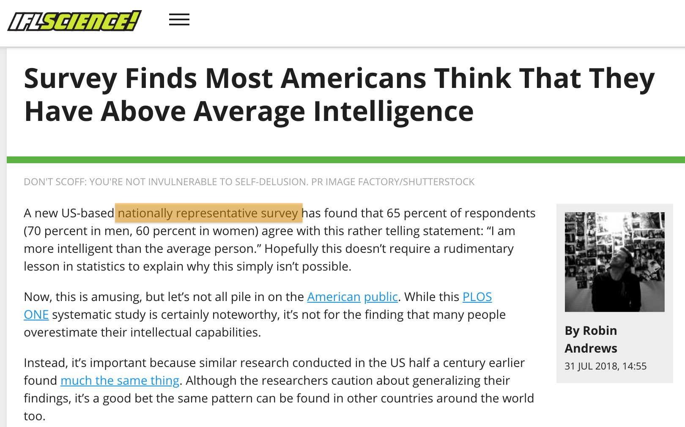
</div>

`Source` [Robin Andrews, IFLScience](https://www.iflscience.com/editors-blog/survey-finds-most-americans-think-that-they-have-above-average-intelligence/)


---
# Fooled by "representativity"

<div align="center">
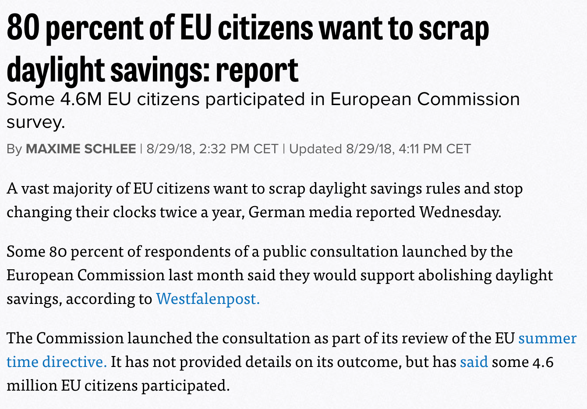
</div>

`Source` [Maxime Schlee, Politico](https://www.politico.eu/article/80-percent-of-eu-citizens-want-to-scrap-daylight-savings-report-summertime-directive/)


---
# Samples and representativity

.pull-left[
## A folk definition of representativity

A sample (or data in general) is "representative" if **conclusions drawn from the sample can be generalized** to the population of interest.
]

.pull-right[
## A more formal definition

A sample is representative if it is drawn in such a way that it is **statistically indistinguishable** from the population of interest.
]

<div align="center">
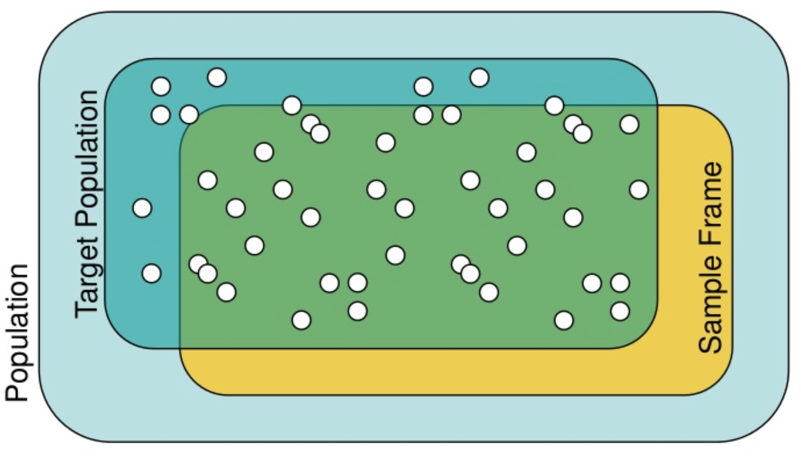
</div>


---
# The issue with the term "representativity"

## Why "representativity" is a problematic term

1. Whether a sample is representative depends on your interest.
2. You cannot call a sample "representative" a priori. 
3. Assessing the representativity of a sample requires strong assumptions about your knowledge on the population (but where does it come from?) and your measures of characteristics which should be "representative".


---
# Total survey error

.pull-left[
## Inference in survey research

- Learn something about the distribution of attributes in a population
- Collect information from  a subset of the population

## Two types of errors

- Errors of **measurement**: what you measure is not what you want to measure
- Errors of **representation**: the set of whom you observe is not generalizable to the population of interest
]

.pull-right[
## Total Survey Error framework

<div align="center">
<br>

</div>

`Source` [Groves et al. 2009, Survey Methodology](https://books.google.de/books?hl=de&lr=&id=HXoSpXvo3s4C)
]


---
# Measurement and sampling error in the wild

.pull-left[
## Overrepresentation and misreporting in election surveys

- Figures from postelection surveys often grossly overestimate election turnout. 
- Two distinct phenomena are responsible for this gap:
    1. Overrepresentation of actual voters
    2. Vote misreporting by actual nonvoters among survey respondents. 
- Vote validation studies help identify the issue at the individual level.
- Turnout bias can also affect analyses of downstream variables (e.g., voting behavior).
]

.pull-right[
<div align="center">
<br>
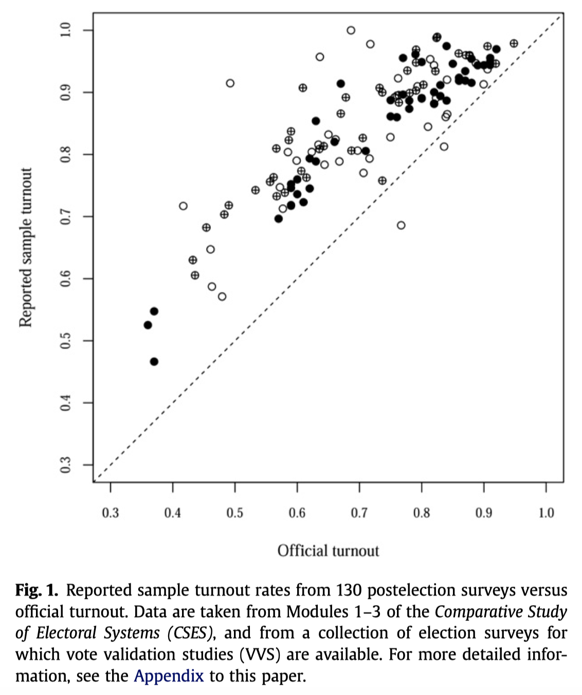
</div>

`Source` [Selb and Munzert 2013, Electoral Studies](https://kops.uni-konstanz.de/server/api/core/bitstreams/e755783d-acee-4592-a666-1562fc912906/content)
]

---
# Bad sampling: lessons learned


.pull-left[
## What does this mean for you?

- Don't take reported "representativity" at face value.
- Sample size alone does not guarantee representativity.
- Don't be fooled by "big data" (it's not representative by default).
- Don't be fooled by "convenience samples" (they are not representative by default).
- Probability sampling is not a panacea because people still self-select into/out of samples.
- Bad sampling is not restricted to surveys (think, e.g., about social media data, case selection for a medical trial, or selection of countries for a policy study).
]

.pull-right[
## Instead, look for the following: 

1. **Transparency** about the sampling process.
2. **Assessment** of the representativity of the sample.
3. **Validation** of the sample against external benchmarks.
4. **Common sense** (does it make sense to call the representative?)
]


---
# Discussion

.pull-left[

## Points for discussion

1. At which point of the policy cycle could which type of consultation be useful?
2. What are distinct pros and cons of different consultation types for monitoring and evaluation?

<div align="center">
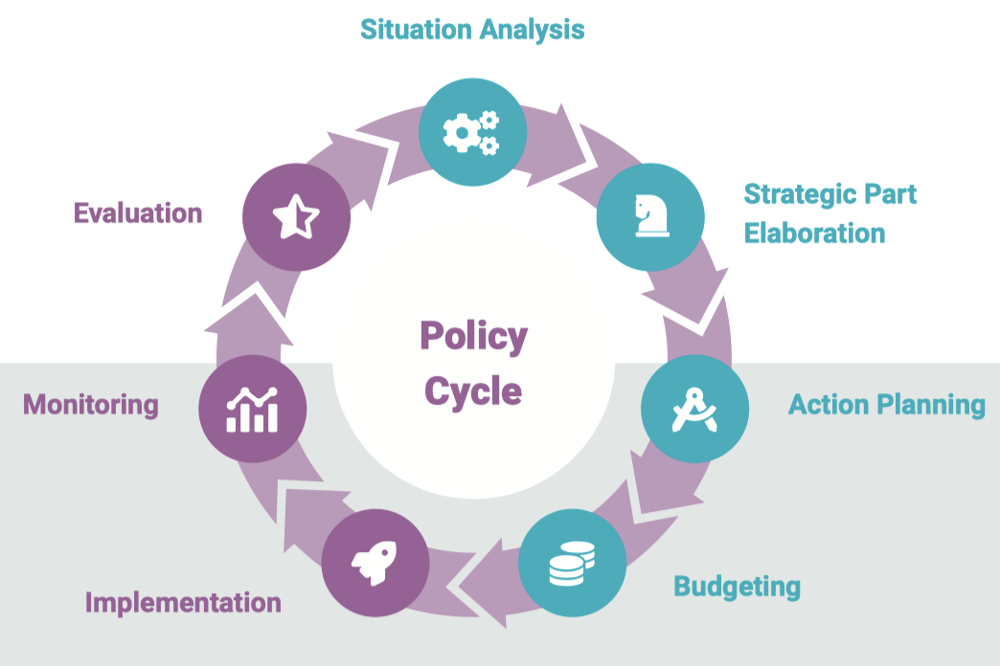
</div>

`Source` Policy Planning, Monitoring and Evaluation Handbook, Government of Georgia
]

.pull-right[
<div align="center">
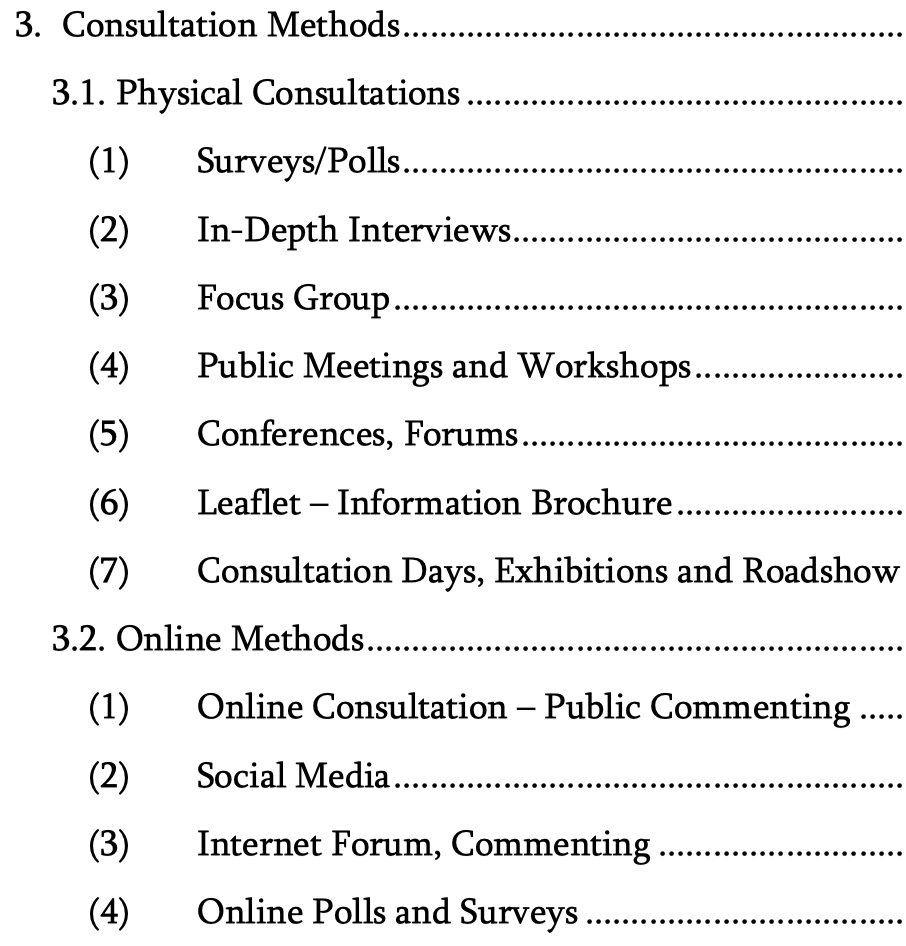
</div>

`Source` Annex 11: Guideline for Public Consultations, Government of Georgia
]


---
class: inverse, center, middle
name: analytics

# Bad analytics: significance is not all that matters
<html><div style='float:left'></div><hr color='#EB811B' size=1px style="width:1000px; margin:auto;"/></html>


---
# Back to statistical significance

.pull-left[
## Statistical significance in practice
- By convention, Type I errors should be avoided at all cost
- A result is regarded statistically significant when it is very unlikely to have occurred under a true null hypothesis
- A significance level $\alpha$ gives the probability of Type I error. Commonly set to 5%
]

--

.pull-right[
## Some problems
- Just because an effect is significant does not mean it is substantively meaningful (large).
- There is an incentive for researchers to produce statistically significant findings. $\rightarrow$ publication bias
- Statistical significance is (also) a function of sample size. It is **trivial to generate significant findings with big data**.
- Unfortunately, it's also often **trivial to generate significant findings with small data** when you are flexible with regards to your hypotheses.
]

---
# Don't get duped by stretched expressions of significance

> "The following list is culled from peer-reviewed journal articles in which (a) the authors set themselves the threshold of 0.05 for significance, (b) failed to achieve that threshold value for p and (c) described it in such a way as to make it seem more interesting." [Matthew Hankins, Probable Error](https://goo.gl/iUGz7a)

<br>

> *(barely) not statistically significant (p=0.052), a barely detectable statistically significant difference (p=0.073), a borderline significant trend (p=0.09), a certain trend toward significance (p=0.08), a clear tendency to significance (p=0.052), a clear trend (p<0.09), a clear, strong trend (p=0.09), ..., very closely brushed the limit of statistical significance (p=0.051), very narrowly missed significance (p<0.06), very nearly significant (p=0.0656), very slightly non-significant (p=0.10), very slightly significant (p<0.1), 
virtually significant (p=0.059), weak significance (p>0.10), weakened..significance (p=0.06), weakly non-significant (p=0.07), weakly significant (p=0.11), weakly statistically significant (p=0.0557), well-nigh significant (p=0.11)*


---
# Fishing and p-hacking

.pull-left-wide2[
## The problem

The dominance of statistical significance as decision criterion in the scientific publishing game makes p-values a key target criterion in statistical analysis. Small p-values are reported more often than we'd expect!

## The symptoms

- **Fishing**: testing many hypotheses until significance
- **P-hacking**: tweaking your analysis (e.g., adding/removing controls, transforming variables, changing models) until significance
- **HARKing**: **H**ypothesizing **a**fter the **r**esults are **k**nown

## The cure?

Special issue in [The American Statistician, 2019](https://www.tandfonline.com/toc/utas20/73/sup1): *"Statistical Inference in the 21st Century: A World Beyond p < 0.05"*
]

.pull-right-small2[
<div align="center">
<div class=font50><b>Figure:</b> Distribution of reported p-values (within [.001–.15]).</div>
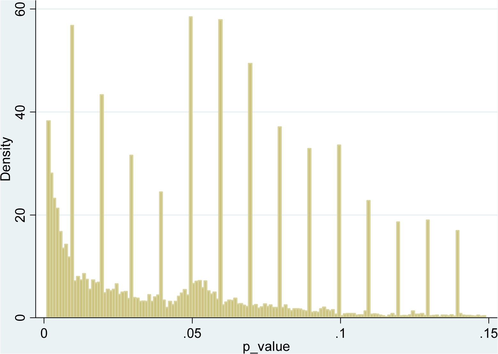<br>
</div>

> "The data set consists of over 135’000 records. The data have been harvested by means of computer-based search from (...) five Journals of Experimental Psychology in the period January 1996-March 2008." 

`Source` [Krawczyk, M., 2015, PLOS ONE](https://journals.plos.org/plosone/article?id=10.1371/journal.pone.0127872)
]


---
# Fishing and p-hacking: exercise

.pull-left[
## Exercise
- Check out [https://projects.fivethirtyeight.com/p-hacking/](https://projects.fivethirtyeight.com/p-hacking/)
- Spend five minutes to hack your way to scientific glory
- More background [here](https://fivethirtyeight.com/features/science-isnt-broken).
]

.pull-right[
<br>
<div align="center">
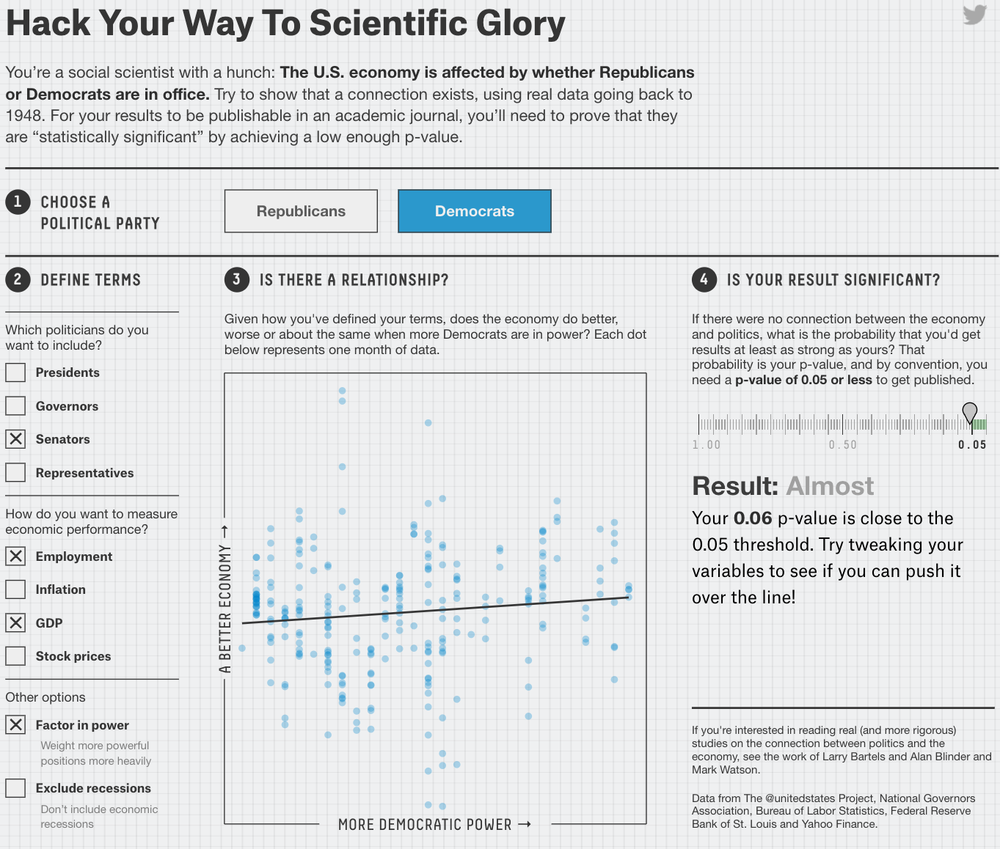
</div>
]


---
# The effect of pre-registration

.pull-left[
## The idea

- Pre-registration implies registering (e.g., by putting it online) your study (hypotheses, methods, analyses) before it is conducted
- Major change in research practice over the last years; check out the [Open Science Framework (OSF) Registry](https://osf.io/registries/osf/new) and  the [American Economic Association (AEA) RCT Registry](https://docs.socialscienceregistry.org/)


## Why this matters

> "17 of 30 studies (57\%) published prior to 2000 showed a significant benefit of intervention on the primary outcome in comparison to only 2 among the 25 (8\%) trials published after 2000." (see plot) 
]

.pull-right-center[
<div class=font50><b>Figure:</b> Relative risk of showing benefit or harm of treatment by year of publication for large NHLBI trials on pharmaceutical and dietary supplement interventions.</div><br>

<div align="center">
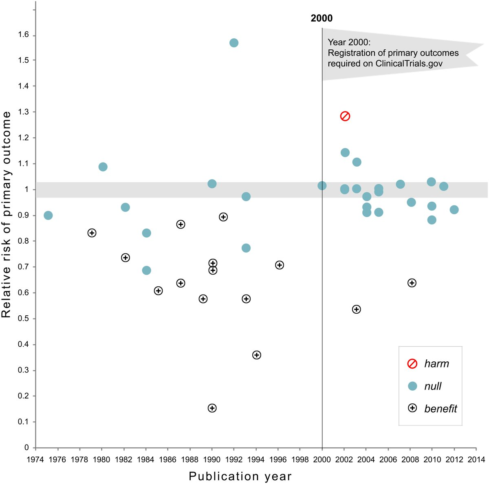
</div>

`Source` [Kaplan et al. 2015; PLOS ONE](https://journals.plos.org/plosone/article?id=10.1371/journal.pone.0132382)
]


---
# Statistical power

.pull-left[
## The concept
- We are used to guard against false positives (significance tests!), but false negatives can hurt, too – in particular if a study/experiment was very costly to run
- Statistical power is the **probability of correctly rejecting the null hypothesis when it is false**
- The ability to distinguish signal from noise, where the signal is the treatment effect of interest
- P("There is an effect and I see it"): Power = 1 - Type II error
- The higher the statistical power for an experiment, the lower the probability of a Type II error
]

.pull-right[
<br>
<div align="center">
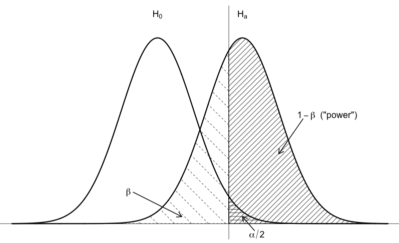
</div>
]

---
# Power analysis

.pull-left-wide2[
## Motivation
- Is your sample big enough to uncover an effect of a certain size? Run a power analysis (ideally before data collection)!
- [Power analysis](https://egap.org/resource/10-things-to-know-about-statistical-power/) is the process of determining the probability of detecting an effect of a given size with a given sample size
- If you can afford it, adapt sample size and/or design on the basis of your power calculations

## Calculation
- Multiple power formulas for different experimental (and observational) designs
- Formula can be rearranged to, e.g., determine $N$
- Many off-the-shelf power calculators out there, e.g. [here](https://egap.shinyapps.io/power-app/) (explainer [here](https://www.povertyactionlab.org/sites/default/files/research-resources/ExerciseC_PowerCalc_Participants.pdf))
- In practice, doing power analyses requires you to make more or less strong assumptions about effect size 
]

.pull-right-small2[
## Formula

Power calculation for two-group difference-in-means test with equal variances and group sizes:

$\text{power} = \Phi(\frac{|\mu_{t}-\mu_{c}|\sqrt{N}}{2\sigma}-\Phi^{-1}(1-\frac{\alpha}{2}))$

- $\Phi$ is the CDF of the Normal distribution $\rightarrow$ power assumed to follow the Normal
- $\mu_{t,c}$ is the average outcome in treatment/control group $\rightarrow$ effect
- $\sigma$ is the standard deviation of outcomes $\rightarrow$ noisiness
- $\alpha$ is chosen significance level, often 0.05 by convention
- $N$ is the total number of subjects
]

---
# Power analysis: example

.pull-left[
## Example
- You want to detect a 5% increase in voter turnout due to a new campaign
- You have a sample of 500 voters
- Assume a standard deviation of 20% in voter turnout
- Assume a significance level of 0.05
- What is the power of your study?
- Use e.g., [EGAP calculator](https://egap.shinyapps.io/power-app/)

## Calculation
- $\mu_{t}-\mu_{c} = 0.05$
- $\sigma = 0.2$
- $N = 500$
- $\alpha = 0.05$
- Power = ?
]

.pull-right[
## Probability density function (PDF) vs. Cumulative density function (CDF)
<br>
<div align="center">
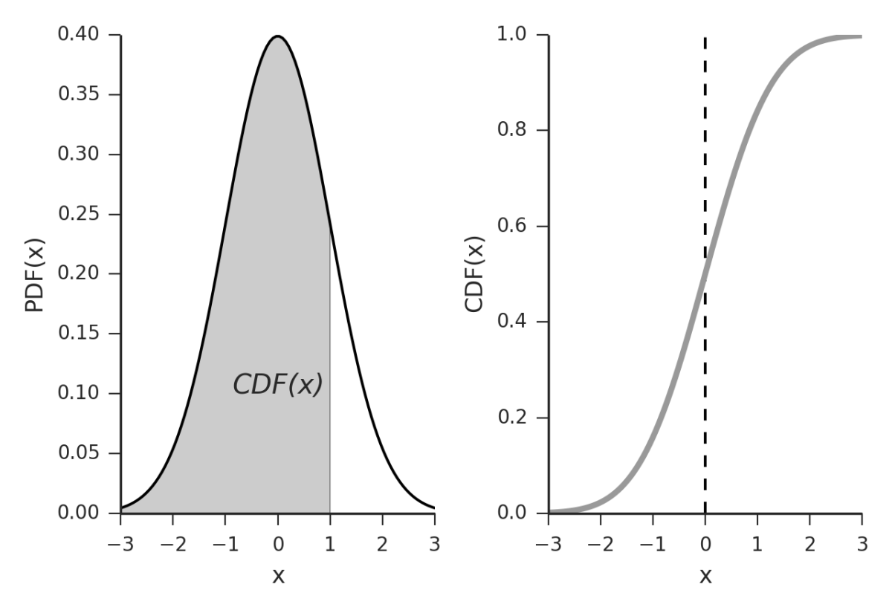
</div>
]


---
# Bad analytics: lessons learned

.pull-left-wide[
## Checklist

- **Check the evidence.** Is it really statistically significant?
- **Look at the theory and evidence.** Is it plausible?
- **Look at the design.** Can you spot any major flaws?
- **Look at the effect size.** Is it meaningful? Is it too good to be true?
- **Look at the sample size.** Is it reasonably large? Is the study well-powered?
- **Check whether the study was pre-registered.** Spot ad-hoc hypotheses.
- **Don't trust any single study.** Look for meta-analyses!
]

.pull-right-small[
<br>
<div align="center">

</div>
]


---

class: inverse, center, middle
name: inference

# Bad inference: correlation does not imply causation
<html><div style='float:left'></div><hr color='#EB811B' size=1px style="width:1000px; margin:auto;"/></html>

---
# A classic

<div align="center">
<br>

</div>

`Source` [XKCD 552](https://xkcd.com/552/)


---
class: exercise, center

# Exercise

<br><br>

# Guess the correlations!

<div align="center">
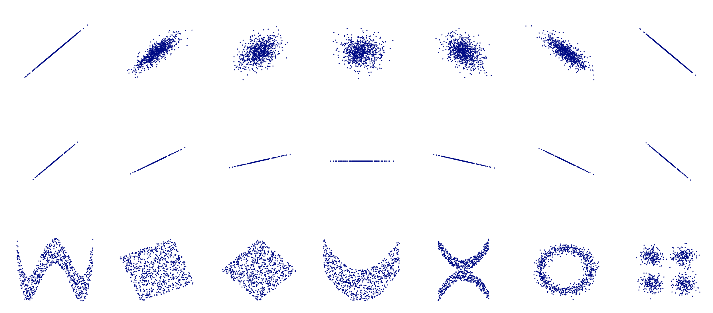
</div>


---
class: exercise, center

# Exercise

<br><br>

# Guess the correlations!

<div align="center">

</div>


---
class: exercise, center

# Exercise

<br><br>

# Guess the correlations!

<div align="center">
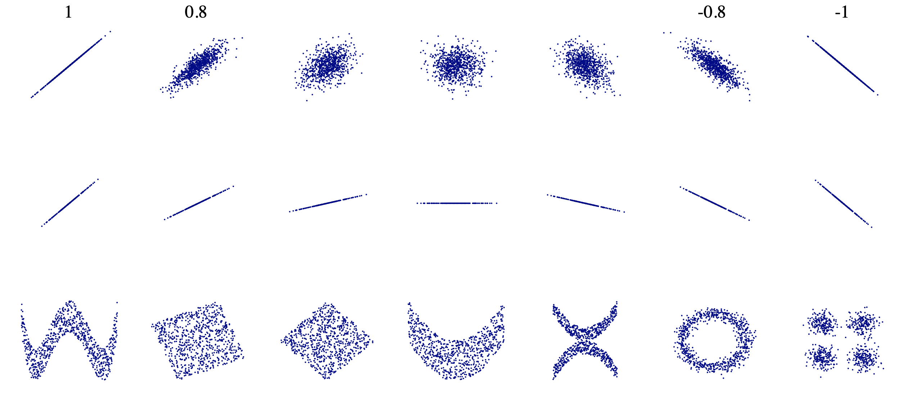
</div>

---
class: exercise, center

# Exercise

<br><br>

# Guess the correlations!

<div align="center">
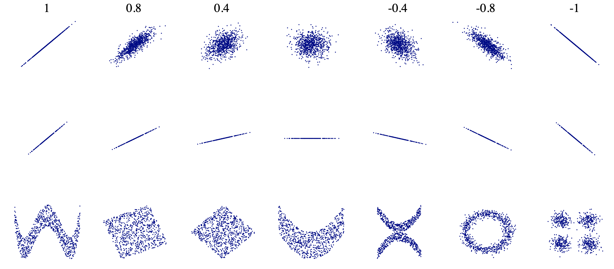
</div>

---
class: exercise, center

# Exercise

<br><br>

# Guess the correlations!

<div align="center">
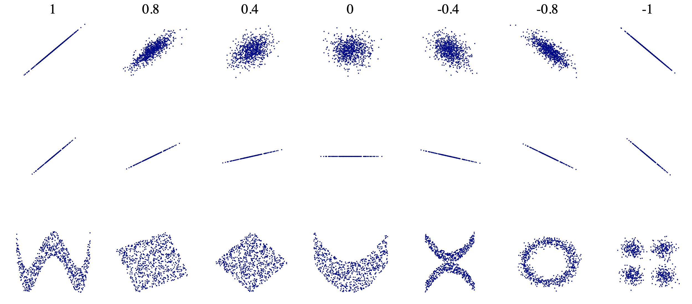
</div>

---
class: exercise, center

# Exercise

<br><br>

# Guess the correlations!

<div align="center">

</div>


---
class: exercise, center

# Exercise

<br><br>

# Guess the correlations!

<div align="center">
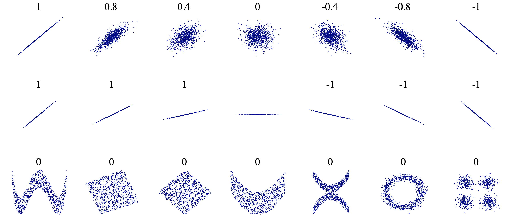
</div>

---
# Getting better at guessing correlations

## Check out http://guessthecorrelation.com/

<br>
<div align="center">
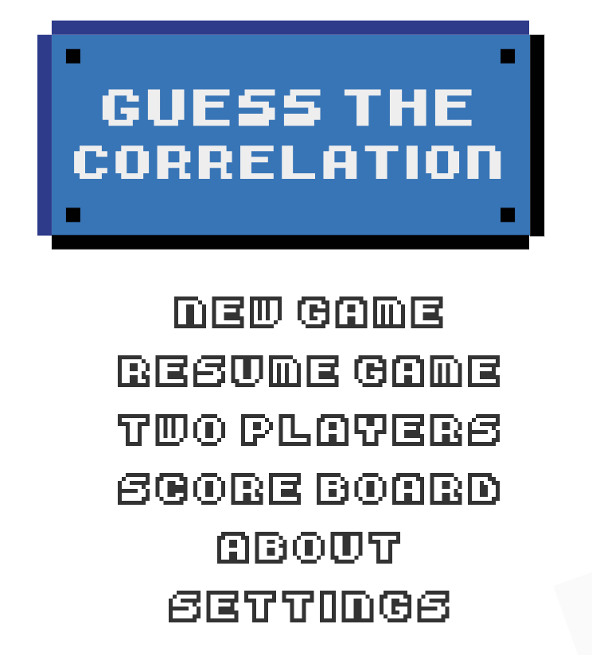
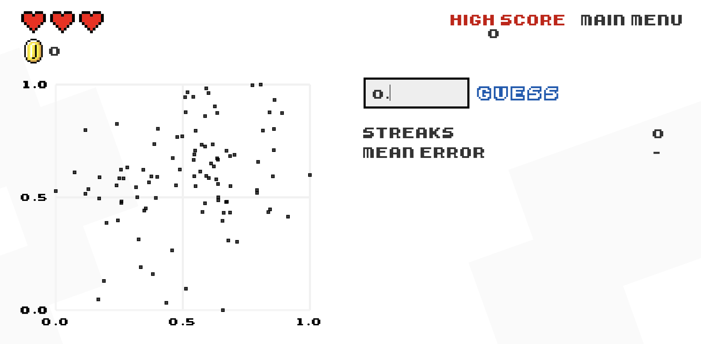
</div>


---
# The math of correlation, explained

.pull-left[
## The Pearson correlation coefficient

- Measures the **strength and direction** of a **linear relationship** between two variables
- Ranges from -1 to 1
- Formula to compute it:

$r_{xy} = \frac{\text{covariation of X and Y}}{\text{separate variation of X and Y}} = \frac{Cov(x, y)}{s_x s_y} = \sum_i \frac{(x_i - \bar{x})(y_i - \bar{y})}{s_x s_y}$
 ]
 

.pull-right[
## Pearson's r is...

- positive when variables A and B increase together
- negative when A[B] increases and B[A] decreases
- 1 when A and B increase together perfectly
- -1 when A increases and B decreases perfectly
- 0 when A and B don't covary
]

<div align="center">

</div>


---
# Correlation does not imply causation

.pull-left[
## Correlation

Two variables are **correlated** when knowing the value of one gives you information about the likely value of the other.

## Causation

Two events are **causally related** when the occurrence of one is a result of the occurrence of another.

## The causal fallacy

Two variables that are correlated are not necessarily in a cause-and-effect relationship.

- cum hoc ergo propter hoc ("with this, therefore because of this")
- post hoc ergo propter hoc ("after this, therefore because of this")
]

.pull-right[

]


---
# Spurious correlations

<div align="center">
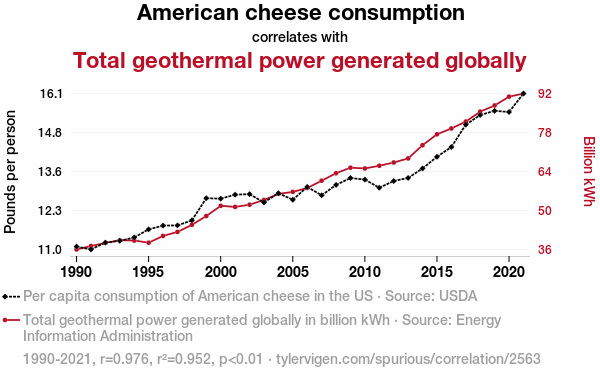
</div>

`Source` [Tyler Vigen, http://tylervigen.com/spurious-correlations](http://tylervigen.com/spurious-correlations)

---
# Spurious correlations

<div align="center">
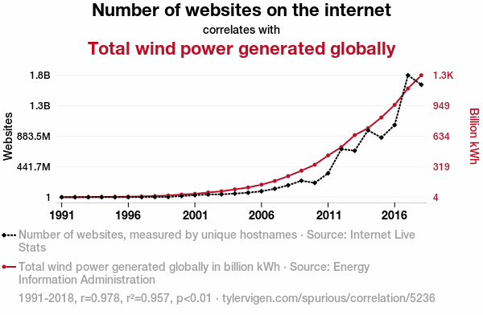
</div>

`Source` [Tyler Vigen, http://tylervigen.com/spurious-correlations](http://tylervigen.com/spurious-correlations)


---
# Spurious correlations

<div align="center">
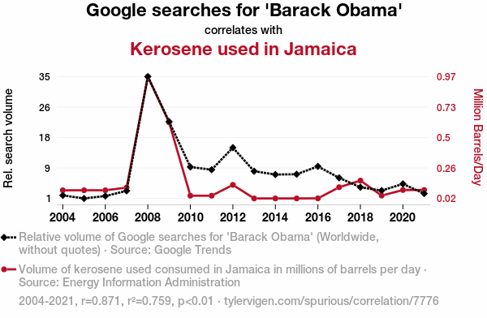
</div>

`Source` [Tyler Vigen, http://tylervigen.com/spurious-correlations](http://tylervigen.com/spurious-correlations)


---
# So, what does it imply when variables A and B are correlated?

## Some possible explanations

- A causes B (direct causation)
- B causes A (reverse causation)
- A and B are consequences of a common cause (confounding)
- A causes C which causes B (mediation)
- A and B both cause C which is conditioned on (collider bias)
- There is no connection between A and B, the empirical correlation is a coincidence (spurious correlation)

## How to distinguish between these?

- **Experimental designs** (randomized controlled trials)
- **Natural experiments** (quasi-experiments)
- **Observational data** (careful analysis of confounders and colliders)
- **Common sense** (does it make sense that A causes B?)
- **Rival explanations** (can we rule out other explanations?)

We'll look into those strategies tomorrow.


---
# Bad inference: lessons learned

.pull-left[
## What does this mean for you?

- Don't be fooled by **high correlation or large effect size**.
- Don't be fooled by **statistical significance**.
- Don't be fooled by **huge variance explained (R squared)**. 
]

.pull-right[
## Instead, ask yourself these questions

1. Does it really make sense that A causes B?
2. Do we have evidence to rule out other rival explanations?
3. Is the evidence built on a clean experimental design?
4. Is the evidence built on a natural experiment with a convincing story?
5. In the absence of (quasi-)experiments, is the evidence built on a careful analysis of observational data, taking care of plausible confounders and colliders?
]


