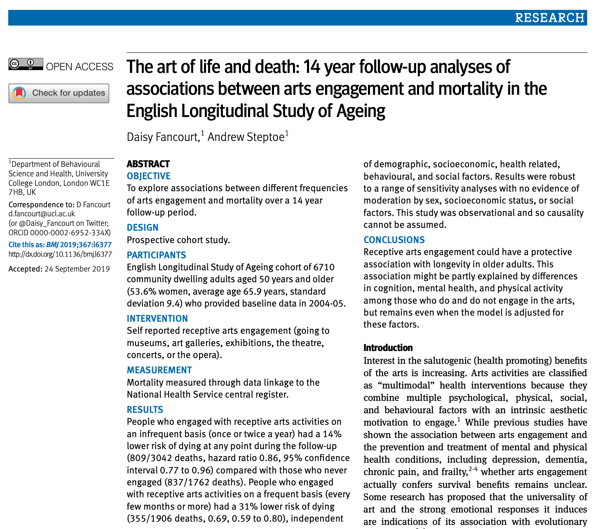

```{css, echo=FALSE} 
@media print { # print out incremental slides; see https://stackoverflow.com/questions/56373198/get-xaringan-incremental-animations-to-print-to-pdf/56374619#56374619
  .has-continuation {
    display: block !important;
  }
}
```

```{r setup, include=FALSE}
# figures formatting setup
options(htmltools.dir.version = FALSE)
library(knitr)
opts_chunk$set(
  prompt = T,
  fig.align="center", #fig.width=6, fig.height=4.5, 
  # out.width="748px", #out.length="520.75px",
  dpi=300, #fig.path='Figs/',
  cache=T, #echo=F, warning=F, message=F
  engine.opts = list(bash = "-l")
  )

## Next hook based on this SO answer: https://stackoverflow.com/a/39025054
knit_hooks$set(
  prompt = function(before, options, envir) {
    options(
      prompt = if (options$engine %in% c('sh','bash')) '$ ' else 'R> ',
      continue = if (options$engine %in% c('sh','bash')) '$ ' else '+ '
      )
})

library(tidyverse)
library(hrbrthemes)
library(fontawesome)
```


# The plan for today

.pull-left-wide[

## Sessions

1. Causal reasoning for policy evaluation

2. Regression and matching

3. Quasi-experiments

4. Spotting crimes against causality

## Learning goals

- To practice how to think causal, i.e. practice causal reasoning
- To learn a set of statistical strategies to uncover causal relationships
- To nurture the competence of spotting bad causal evidence

]

.pull-right-small[

]


---

# Table of contents

<br><br>

1. [Why causation matters](#whycausationmatters)

2. [Counterfactual thinking](#counterfactualthinking)

3. [Causal designs: experimental and observational](#designs)


---
class: inverse, center, middle
name: welcome

# Why causation matters
<html><div style='float:left'></div><hr color='#EB811B' size=1px style="width:1000px; margin:auto;"/></html>


---

# The causal revolution I: The power of experimentation

.pull-left[
<div align="center">

</div>

#### "For their experimental approach to alleviating global poverty"

]

.pull-right[
## From the press release

"This year’s Laureates have introduced a new approach to obtaining reliable answers about the best ways to fight global poverty. In brief, it involves dividing this issue into smaller, more manageable, questions – for example, the most effective interventions for improving educational outcomes or child health. They have shown that these smaller, more precise, **questions are often best answered via carefully designed experiments among the people who are most affected.**

In the mid-1990s, Michael Kremer and his colleagues demonstrated how powerful this approach can be, using field experiments to test a range of interventions that could improve school results in western Kenya. (...) Their experimental research methods now entirely dominate development economics."
]


---
# The causal revolution II: Causality with observational data

.pull-left[
<div align="center">

</div>

#### "For (...) empirical contributions to labour economics [and] for their methodological contributions to the analysis of causal relationships"
]

.pull-right[
## From the press release

"Many of the big questions in the social sciences deal with cause and effect. How does immigration affect pay and employment levels? How does a longer education affect someone’s future income? These questions are difficult to answer because we have nothing to use as a comparison. We do not know what would have happened if there had been less immigration or if that person had not continued studying.

However, this year’s Laureates have shown that it is possible to answer these and similar questions using **natural experiments**. The key is to use situations in which chance events or policy changes result in groups of people being treated differently, in a way that resembles clinical trials in medicine."
]


---
# The language of causal reasoning

.pull-left[

## Causal vocabulary is all around us

- **What if** everyone (or just a few) had access to universal health care?
- Do social media platforms **affect** election outcomes?
- Can hate speech regulation have unintended **consequences** for people's behavior?
- Will global warming slow down **because of** global measures to reduce C02 emissions?

In the context of impact evaluations, causal language should be used mindfully. In many cases, causal statements are not supported by the design of the study or the data at hand.

]

.pull-right[
<div align="center">

</div>
]


---
# Causal reasoning in practice

## Implications of research design for causal reasoning

.pull-left[

- How to design an **RCT** that cleanly identifies the effect of policy measure X on outcome Y?
- In the absence of an experimental design, how to use **observational data**, e.g., survey data, time-series cross-sectional data and and thus lots of information (variables) on the observations to infer causal effects?
- Should you **control** for covariate Z, or could that actually induce problems?
- What to do when you think you should control for U but **can't observe** it?
- You think X affects Y **through another variable M**. What does that even mean? How could you find out?

All this represents **causal reasoning**. We are going to learn how to apply it systematically.
]

.pull-right[
<div align="center">

</div>
]


---
class: inverse, center, middle
name: counterfactualthinking

# Counterfactual thinking
<html><div style='float:left'></div><hr color='#EB811B' size=1px style="width:1000px; margin:auto;"/></html>


---
# Getting started with causation

.pull-left-wide[

## Causation - a working definition

- A.k.a. **causality, cause and effect**
- The idea that one variable [event, process, object; the **cause**] causes another variable [event, process, object, outcome; the **effect**]

## Causal reasoning

- The process of studying and identifying causality
- Causal reasoning involves...
	- Ruling out non-causal sources of association and
	- Inferring from the conditions of the occurrence (or absence) of an effect

## Causal inference

- In Scott Cunningham's words: "Causal inference is the **leveraging of theory** and deep knowledge of institutional details to **estimate the impact of events and choices on a given outcome of interest**."
]

.pull-right-small-center[
<div align="center">
<br>


</div>
]


---
# Does going to the opera make you live longer?

.pull-left[
<div align="center">

</div>
]

.pull-right[
<div align="center">

</div>

`Source` [Cramer, NYTimes (2019)](https://www.nytimes.com/2019/12/22/us/arts-health-effects-ucl-study.html)
]

---
# Does going to the opera make you live longer?

.pull-left[
<div align="center">

</div>
]

.pull-right[
<div align="center">

</div>

`Source` [Fancourt, Steptoe / BMJ (2019)](https://www.bmj.com/content/367/bmj.l6377)
]

---
# Does going to the opera make you live longer?

.pull-left[
<div align="center">

</div>
]

.pull-right[

## Different sources of association between X and Y

1. X may have caused Y.

<div align="center">

</div>
]

---
# Does going to the opera make you live longer?

.pull-left[
<div align="center">

</div>
]

.pull-right[

## Different sources of association between X and Y

1. X may have caused Y.
2. Y may have caused X.

<div align="center">

</div>
]


---
# Does going to the opera make you live longer?

.pull-left[
<div align="center">

</div>
]

.pull-right[

## Different sources of association between X and Y

1. X may have caused Y.
2. Y may have caused X.
3. X and Y may share one or more common causes.

<div align="center">

</div>
]


---
# Does going to the opera make you live longer?

.pull-left[
<div align="center">

</div>
]

.pull-right[

## Different sources of association between X and Y

1. X may have caused Y.
2. Y may have caused X.
3. X and Y may share one or more common causes.
4. The association may have been induced by conditioning on a common effect of X and Y.

<div align="center">

</div>

]


---
# Does going to the opera make you live longer?

.pull-left[
<div align="center">

</div>
]

.pull-right[

## Different sources of association between X and Y

1. X may have caused Y.
2. Y may have caused X.
3. X and Y may share one or more common causes.
4. The association may have been induced by conditioning on a common effect of X and Y.
5. Chance.

]


---
# Thinking in terms of counterfactuals

.pull-left-vwide[
## The Neyman-Rubin causal model

- The Neyman-Rubin causal model (or just Rubin causal model, RCM) is a
formal approach to do causal inference that fueled the potential outcomes framework (POF)
- Up until today, it's the mainstream framework to (statistically) talk
about causation

## The idea of potential outcomes

- The POF assumes that each subject has a **potential outcome under both treatment states**
- Evidently, each subject can only be observed in one treatment state at any point in time
- Therefore, the individual treatment effect is a non-observable counterfactual ("the fundamental problem of causal inference", Holland 1986)
- The idea is to think about the **counterfactual** outcome that would have been observed had the treatment been different
]

.pull-right-vsmall[
<div align="center">
<br>
<br>

</div>
]

---
# Thinking in terms of counterfactuals

.pull-left[

## Potential outcomes under treatment and control

- Assume we have a binary treatment variable $X$ (e.g., going to the opera)
- We observe the outcome $Y$ (e.g., longevity)
- The potential outcomes are $Y(1)$ and $Y(0)$

| **Group** | Longevity (under treatment) | Longevity (under control) |
|-----------|-----------------------------|---------------------------|
| Going to opera | Observable as $Y$ | Counterfactual |
| Not going to opera | Counterfactual | Observable as $Y$ |
]

--

.pull-right[

## The fundamental problem of causal inference

- Why is the causal effect of X on Y not simply the difference between the upper-left and lower-right cell in the table?
- We can only observe one of the two potential outcomes!
- Causal inference implies answering **'What if'** questions, i.e. imagine a counterfactual world in which the treatment was different for a given unit

## Addressing the dilemma

- We can try and design studies in a way so that the expected outcome under a treatment state are the same for all units
- Or, we can try to (statistically) adjust such that the observed data is as close as possible to the counterfactual data

]


---
class: inverse, center, middle
name: designs

# Causal designs: experimental and observational
<html><div style='float:left'></div><hr color='#EB811B' size=1px style="width:1000px; margin:auto;"/></html>


---
# Why experiments?

.pull-left[
## Dilemmas of observational research

- When does correlation imply causation?
- How can we be sure we did not overlook an important cause?

## The promises of experimental designs

- Randomization!
- Researchers set the treatment, but chance decides who gets it and who doesn't
- By randomly assigning the treatment, it is designed to be statistically independent from any other variable.

<div align="center">

</div>
]

.pull-right[

<div align="center">
<br>
<br>
</div>

`Source` [Matt Salganik, Bit by Bit](https://www.bitbybitbook.com/)
]

---
# Issues to consider when running (and judging) experiments

.pull-left[
## 1. Balance: Are treatment and control groups balanced on relevant covariates (potential confounders)?
-	Run mean comparisons and significance tests
- Condition on pre-treatment covariates
- Ideally, condition on pre-treatment outcomes

]

--

.pull-right[
## 2. Power: Is your sample big enough to uncover an effect of a certain size?}
- The higher the statistical power for a given experiment, the lower the probability of making a Type II (false negative) error. Power = 1 - Type II error 
- Run a power analysis (ideally before data collection)
- If you can afford it, adapt sample size and/or design on the basis of your power calculations
]


---
# Issues to consider when running (and judging) experiments

.pull-left-wide2[
## 3. Compliance: Do participants participate as intended?
-	Often we cannot force subjects to take specific treatments, and **noncompliance** is an issue
- Intent-to-Treat (ITT) effect $\neq$ treatment effect
- Selection bias: self-selection into treatment/control groups

|  | Drinks no coffee | Drinks coffee | Total
|-----------|-----------------------------|---------------------------|---|
| Assigned to Control | 80 | 20 | 100 |
| Assigned to Treatment | 10 | 90 | 100 |
| Total | 90 | 110 | 200 |

- Encouragement design: Randomize the encouragement to receive the treatment rather than the receipt of the treatment itself
]

--

.pull-right-small2[
## 4. External validity: How does the experimental setting connect to the "real world"?
- Is the treatment comparable to interventions you want to compare it to?
- Is the outcome an actual measure of interest?
- How "different" is your sample from the target population on relevant characteristics?
]

---
# Example: Tracking and promoting usage of a COVID-19 contact tracing app

.pull-left[
<div align="center">

</div>
]

.pull-right-center[
<div align="center">
<br><br>
<br>
</div>
[https://go.nature.com/3auwDjA](https://go.nature.com/3auwDjA)
]

---
# Study design

<div align="center">
<br>
</div>

---
# Experimental intervention

.pull-left[

## How can app usage be promoted?

- Information about app: goal, functionality, privacy
- Pro-social appeal: https://youtu.be/dyhDd_vrGEE
- Self-interest appeal: https://youtu.be/suOCvlW8_R0
]

.pull-right[
<div align="center">

<br>

<br>

<br>
</div>
]

---
# Experimental results

<div align="center">

</div>


---
# Observational designs

.pull-left[
## Dilemmas of experimental research
- High internal validity at the cost of external validity
-  Many of the actual treatments of interest cannot be (ethically) randomized (think: COVID, certain policies, election outcomes, ...)

## (Some of the) problems with observational data
- Confounding
- Selection bias
- Limited generalizability of case studies
]

--

.pull-right[
## The silver lining
- The causal revolution: innovative research designs exploiting observational data to do causal inference
- ... often with the help of natural or quasi-experiments

<div align="center">
<br>
</div>
]


---
# Further reading

<div align="center">
<br><br><br>


</div>


