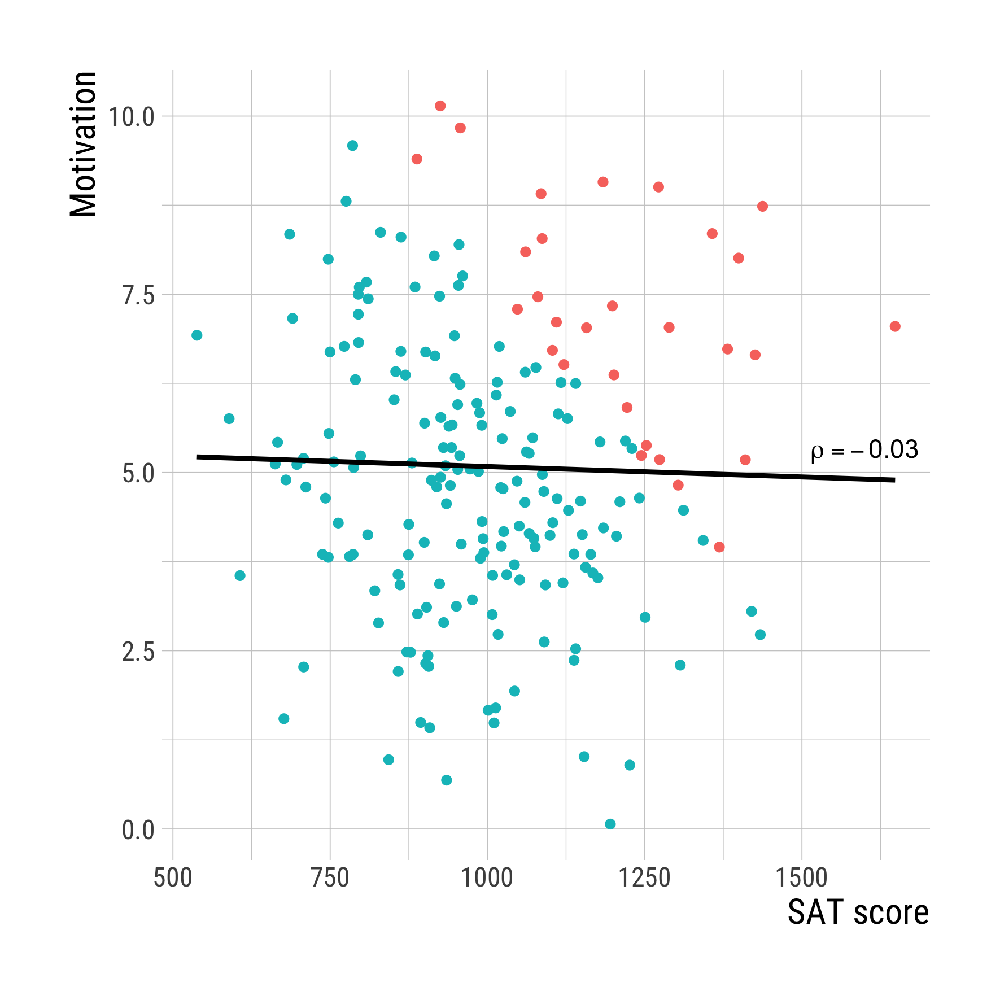

```{css, echo=FALSE} 
@media print { # print out incremental slides; see https://stackoverflow.com/questions/56373198/get-xaringan-incremental-animations-to-print-to-pdf/56374619#56374619
  .has-continuation {
    display: block !important;
  }
}
```

```{r setup, include=FALSE}
# figures formatting setup
options(htmltools.dir.version = FALSE)
library(knitr)
opts_chunk$set(
  prompt = T,
  fig.align="center", #fig.width=6, fig.height=4.5, 
  # out.width="748px", #out.length="520.75px",
  dpi=300, #fig.path='Figs/',
  cache=T, #echo=F, warning=F, message=F
  engine.opts = list(bash = "-l")
  )

## Next hook based on this SO answer: https://stackoverflow.com/a/39025054
knit_hooks$set(
  prompt = function(before, options, envir) {
    options(
      prompt = if (options$engine %in% c('sh','bash')) '$ ' else 'R> ',
      continue = if (options$engine %in% c('sh','bash')) '$ ' else '+ '
      )
})

library(tidyverse)
library(hrbrthemes)
library(fontawesome)
```


# Table of contents

<br><br>

1. [Causal reasoning with DAGs](#dags)

2. [Causal inference with regression](#regression)

3. [Variable selection for regression](#regressiondags)


---
class: inverse, center, middle
name: dags

# Causal reasoning with DAGs
<html><div style='float:left'></div><hr color='#EB811B' size=1px style="width:1000px; margin:auto;"/></html>


---
# Your most important toolset for causal reasoning

<div align="center">
<br>


<br>

</div>


---
# Origins of causal graphs

.pull-left-wide[
## A pioneer of causal graphs

- Path diagrams were originally developed by **Sewall Wright** (geneticist) in the early 1920s.
- Sewell's father, Philip Wright, used them to demonstrate the use of instrumental variables regression (Pearl and Mackenzie, *Book of Why*)
- Path analysis gained popularity in social science, particularly sociology and psychology, in the form of structural equation modeling.

## A godfather of causality

- Up until today, causal graphs are not very popular in economics, where the potential outcomes framework (POF) dominates
- Computer scientist **Judea Pearl** developed causal inference framework based on directed acyclic graphs (DAGs); widely considered godfather of causal graphs analysis
]

.pull-right-small[
<div align="center">
<br>


</div>
]


---
# Causal graphs: an intuitive tool for causal reasoning

.pull-left[
## Why causal graphs are useful

- Graphs are often used informally to express beliefs about relations among variables in an intuitive manner
-  Graphs allow **non-mathematicians** to draw rigorous conclusions about the nature of statistical associations
- Informal use can be expanded by adopting formal rules so that they meet the criteria for **Directed Acyclic Graphs** (Pearl 2009 [2000]) 
- They are practical for **choosing "control" variables** for regression/matching, assessing natural experiments, etc.
- They provide a **unified framework** to think about causal inference, sample selection, measurement error, and other methodological problems
]

.pull-right[
<br>
<div align="center">
<br>

</div>
]

---
# Basic functioning of causal graphs

.pull-left[
## Variables

- Variables are also called **nodes**.
- Each variable may take multiple values, e.g. "treated" and "not treated". 
- They are scale-agnostic (can be categorical, continuous).
- Usually one of the variables is treated as outcome variable of interest (often "Y").
- Variables that are unobservable or unmeasured but that play an important role in the graph should be added too (usually marked as hollow dots or circles)

<div align="center">

</div>
]

.pull-right[
## Arrows
- Connections joining variables are called **edges**.
- If an edge is an **arrow**, this implies a causal relationship between variables.
- The arrow makes a qualitative, not a quantitative statement. The effect can be positive or negative and of arbitrary size.

<div align="center">

</div>
]

---
# Basic functioning of causal graphs

.pull-left[
## Endogeneity and exogeneity

- A variable without a parent is **exogenous**, otherwise it is **endogenous**. 
- Describing a variable as truly exogenous (here: Z) is a strong statement. It means it has no cause that is of relevance here.


<div align="center">

</div>
]

.pull-right[
## Paths
- A **path** is a sequence of arrows that links one node to another, regardless of the direction of arrowheads. 
- Retracing of arrows or going through the same variable twice is not possible.
- A **causal path** is a path traced out entirely along arrows tail-to-head.

<div align="center">

</div>
]


---
# DAGs

.pull-left[
## What are DAGs?
- **Directed Acyclic Graphs** (DAGs) are a type of causal graph.
- Acyclic means that there are no loops in the graph.
- DAGs encode the researcher's **qualitative** causal assumptions about the data-generating process in the population
- Constructing them requires **theoretical and empirical knowledge** or assumptions (whatever you have should go into it - theory, model, observation, experience, prior studies, intuition)
]

.pull-right[
## Different DAG styles

<br>
<div align="center">

<br>


</div>
]


---
class: split-three white

# Basic patterns in DAGs

.pull-left-small2-center[

X is **confounder**.

The "fork" pattern.

<div align="center">

</div>
]

.pull-right-small2-center[

X is **collider**.

The "reversed fork" pattern.

<div align="center">

</div>
]

.pull-right-small2-center[

X is **mediator**. 

The "chain" pattern.

<div align="center">

</div>
]

<br><br>

Dissecting more complex graphs into these basic patterns can help to understand the causal structure of the data-generating process. This will be **key to understanding how to adjust for confounding** in regression analysis.


---
class: inverse, center, middle
name: regression

# Causal inference with regression
<html><div style='float:left'></div><hr color='#EB811B' size=1px style="width:1000px; margin:auto;"/></html>


---
# Example: health expenditure and life expectancy

<div align="center">

</div>

---
# Example: health expenditure and life expectancy

.pull-left-wide2[
<div align="center">

</div>
]

.pull-right-small2[
<div align="center">


</div>
]


---
# Regression mechanics

.pull-left[
## Ordinary Least Squares

- **OLS** is a method for estimating the unknown parameters in a linear regression model.
- It addresses a simple mechanical problem: how to minimize the sum of the squared differences between the observed and predicted values? $\sum_{i=1}^{n} (Y_i-\hat{Y}_i)^2$
- The solution is to find the values of the coefficients that minimize the sum of squared residuals.

## Relevance for policy analysis

- Crude but simple model of a relationship between X and Y: a linear fit
- "What is our best guess for Y (outcome, KPI) given particular value of X (policy)?"
]

.pull-right[
<div align="center">
<br>

</div>
]

---
# Regression mechanics

.pull-left-wide[
## Bivariate regression

- In bivariate regression, the formula for the slope is $\hat{\beta_1} = \frac{cov(x,y)}{var(x)} = \frac{\sum_{i=1}^{n} (X_i - \bar{X})(Y_i - \bar{Y})}{\sum_{i=1}^{n} (X_i - \bar{X})^2}$
- The intercept can then be derived as $\hat{\beta_0} = \bar{y} - \hat{\beta_1} \bar{x}$
- Compare with correlation: bivariate regression gives us more precise information on the strength of a relationship

## Multiple regression

- With multiple regression, we choose the line that minimizes: $\sum_{i=1}^{n} (y_i-\hat{\beta_0}-\hat{\beta_1}x_{i1}-\ldots-\hat{\beta_k}x_{ik})^2$
- This allows for "controlled comparisons": we can isolate the statistical effect of one variable while holding others "constant"
- Whether this is a causal effect depends on the causal structure of the data-generating process (see later)
]

--

.pull-right-small[

## Intercept and slope in action

Which parameter(s) are changing?

<div align="center">


</div>
]


---
# Regression mechanics

.pull-left[
## Example

- What's the effect of education on income?
- Income measured in hourly wage
- Education measured in years 
- "Slider/dimmer" logic

<div align="center">

</div>
]

.pull-right[
<div align="center">

</div>
]

---
# Regression mechanics

.pull-left[
## Example

- And what's the effect of gender on income?
- Income measured in hourly wage
- Gender measured binary (female vs. non-female)
- "Switch" logic

<div align="center">

</div>
]

.pull-right[
<div align="center">

</div>
]

---
# Regression mechanics

.pull-left[
## Example

- And what's the effect of education, gender, and ethnicity on income?
- Predictor variables measured as before
- Education measured in years

<div align="center">

</div>
]

.pull-right[
<div align="center">

</div>
]


---
# Goodness of fit

.pull-left-wide2[
## R-Squared
- Some people are obsessed with $R^2$. Is that justified?
- $R^2$ is a PRE (proportional reduction of error) measure.
- It compares the **total sum of squares (TSS)** from the mean to the **explained sum of squares (ESS)** improvement from the OLS fit.
- $R^2$ is the proportion of the variance in the dependent variable that is predictable from the independent variable(s): $R^2 = \frac{ESS}{TSS}=\frac{\sum(\hat{y}_i-\bar{y}_i)^2}{\sum (y_i-\bar{y}_i)^2}$
- Here is an [interactive visualization](https://alexander-n.github.io/r-squared/).
- Adjusted $R^2$ (aka $\bar{R}^2$) corrects for the number of parameters estimated in a model but loses the nice interpretation of $R^2$.

## Why R-Squared is of limited use for impact evaluation
- Usually the interest is not in predicting the outcome variable but in estimating the causal effect of a treatment on an outcome.
- $R^2$ can be high even if the treatment effect is zero.
]

.pull-right-small2[
<div align="center">
<br><br>

</div>
]


---
class: inverse, center, middle
name: dags

# Variable selection for regression
<html><div style='float:left'></div><hr color='#EB811B' size=1px style="width:1000px; margin:auto;"/></html>


---
# Causal inference with observational data

## Back to the original problem

- We want to estimate the causal effect of a treatment on an outcome.
- Observational data is often not that useful evidence for that purpose because correlations can be misleading.
- Correlational patters should **not** serve as input for evidence-based policymaking.

## Is regression-based inference with observational data pointless?

- Not necessarily. If we **control for all relevant confounders**, we can still isolate the effect of interest.
- This gives us three important tasks:
	1. Identifying the causal structure between all variables affecting the relationship between treatment and outcome of interest.
	2. Identifying all variables that need to be adjusted for to estimate the causal effect, and those that must not be adjusted for (mediators, colliders).
	3. Measure what is necessary and run the regression.
- **This is where DAGs come in**: they help us deal with the first two tasks.


---
# Confounders

.pull-left[
## Dealing with confounders
- A confounder induces statistical association between its effects.
- **Conditioning** on a confounder (or a descendant of a confounder) on the path **blocks the path**.
- In DAGs, conditioning is usually indicated with a **box around the variable**.
- Failing to condition on a relevant confounder induces non-causal statistical association or **omitted variable bias**.
]

.pull-right[
<div align="center">

</div>
<br>
<div align="center">

</div>
]

---
# Conditioning on a confounder: example

.pull-left[
<div align="center">

</div>
]

.pull-right[
<div align="center">

</div>
]

---
# Mediators

.pull-left-wide[
## Dealing with mediators
- Chains of mediation D $\rightarrow$ M $\rightarrow$ Y let us express how exactly a treatment impacts the outcome.
- Mediators express a **mechanism** by which one variable affects another.
- Example: Coffee (D) leads to better stats exam results (Y) because the caffeine (M) stimulates the nervous system and prevents drowsiness.

## Beware of post-treatment bias
- Conditioning on a mediator on the path blocks the path.
- Often, we are interested in total effects (e.g., ATE) including both direct and indirect routes.
- Conditioning on a mediator may thus lead to **overcontrol or post-treatment bias**.
- "Controlling away" for consequences of the treatment!
]

.pull-right-small[
<div align="center">

</div>
<br>
<div align="center">

</div>
]


---
# Variable selection - post-treatment bias

.pull-left[
## Post-treatment bias: avoidable
- Causal effect (CE) of party ID on the vote
	- Do control for race
	- Do not control for short-term voting intentions
	
-  CE of nuclear desaster on attitudes towards nuclear energy
	- Do control for political context
	- Do not control for media coverage
]

--

.pull-right[
## Post-treatment bias: unavoidable?
- CE of democratization on civil war: **control for GDP**?
	- Yes, since GDP $\rightarrow$ democratization
	- No, since democratization $\rightarrow$ GDP

- CE of education on income: **control for IQ**?
	- Yes, since IQ $\rightarrow$ education
	- No, since education $\rightarrow$ IQ		
	
]


---
# Colliders

.pull-left[
## What are colliders?
- Colliders are variables that are caused by two other variables.
- They are the opposite of mediators: they block the path between two variables.

## Conditioning on colliders
- Conditioning on a collider (or a descendant of a collider) opens the path between its causes.
- This can lead to **spurious association** between the causes, which is called **collider bias** or **endogenous selection bias**. 
- This type of bias is much less well known than omitted variable bias but can be fatal in causal inference.
]

.pull-right[
<div align="center">

</div>
<br>
<div align="center">

</div>
]

---
# Conditioning on a collider: example

.pull-left[
<div align="center">

</div>
]

.pull-right[
<div align="center">

</div>
]

**Example:** $Y$ motivation, $D$ SAT score, $X$ admission to college (red: admitted, blue: rejected)


---
# Regression adjustment with DAGs

.pull-left[
## Selecting relevant covariates

1. Draw a DAG using your theoretical and empirical knowledge
2. Find the causal and non-causal paths between treatment and outcome
3. Identify conditions that satisfy the back-door criterion with regards to treatment and outcome
4. Include these variables into the model specification
5. Withstand the temptation to give any other coefficient than that for the treatment a causal interpretation - the status of covariates is path-specific!
]

.pull-right[
<div align="center">
<br><br>

</div>
]

---
# Regression adjustment with DAGs

.pull-left[
## The back-door criterion

A set of observed variables $Z$ satisfies the back-door criterion relative to the total causal effect of a treatment on an outcome if
- $Z$ blocks all back-door paths from treatment to outcome and
- No variable in $Z$ lies on or descends from a causal path from treatment to outcome

## Example

- What variables should we control for to identify the effect of $D$ on $Y$?
]

.pull-right[
<div align="center">
<br><br>

</div>
]


---
# "Does going to the opera make you live longer?" revisited

.pull-left[
<div align="center">

</div>
]

.pull-right[
## From the paper:

> "We adjusted models for **demographic variables** (age, sex, marital status, ethnicity, educational qualifications, wealth, employment status, and occupational status); **health related variables** (eyesight, hearing, depressive symptoms, other psychiatric conditions, diagnosis of cancer, lung disease or cardiovascular disease, history of any other long-term condition, smoking, alcohol consumption, sedentary behaviours, mobility, problems in undertaking activities of daily living, osteoporosis, and cognition); and **social covariates** (loneliness, number of close friends, living alone, frequency of civic engagement, frequency of social engagement, and whether participants had a hobby or pastime)."
]


---
# "Does going to the opera make you live longer?" revisited

.pull-left[
<div align="center">

</div>
]

.pull-right[
## What's the underlying causal reasoning here?

- What's our idea of how all variables are related?

<div align="center">
<br>

</div>
]


---
# "Does going to the opera make you live longer?" revisited

.pull-left[
<div align="center">

</div>
]

.pull-right[
## What's the underlying causal reasoning here?

- What's our idea of how all variables are related?
- But that's not nearly the end of the story.
- Think about other variables (observed and unobserved). What would this imply for our causal inference?

<div align="center">
<br>

</div>
]


---
# Lessons learned

.pull-left[
## On regression for impact evaluation
- The regression way of estimating causal effects is a powerful tool is 
	(1) to find the factors responsible for a priori differences between groups (confounders), and to include these variables in the equation,
	(2) in the hope that an unbiased estimate is obtained
- DAGs are a powerful tool to find the set of confounders we need to control for, but they're not a panacea
]

--

.pull-right[
## On selecting relevant covariates
- Specifying regression models for causal inference is a **theoretical**, not a statistical problem
- That's why our robot overlords are not going to take over any time soon - inferring from experience, drawing on knowledge of related studies, thinking hard about the missing components of the treatment selection mechanism - that's what we (as scientists, policy-makers) are good at!
- But don't make it a mechanical exercise
]

--

<br>

> "Regression models make it all too easy to substitute technique for work (...) Regression models often seem to be used to compensate for problems in measurement, data collection, and study design. By the time the models are deployed, the scientific position is nearly hopeless." (Freedman, 1991)


