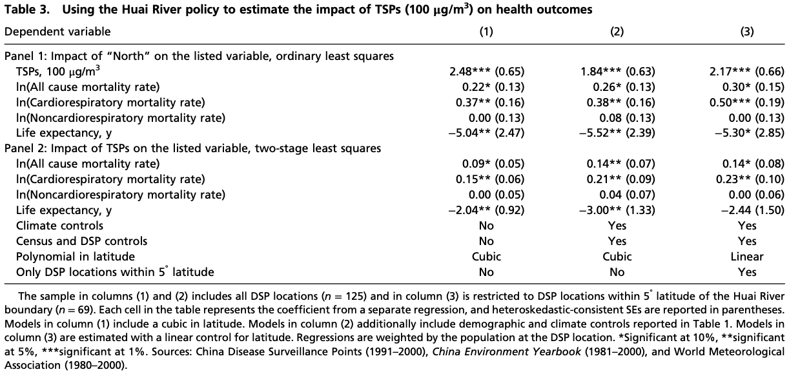
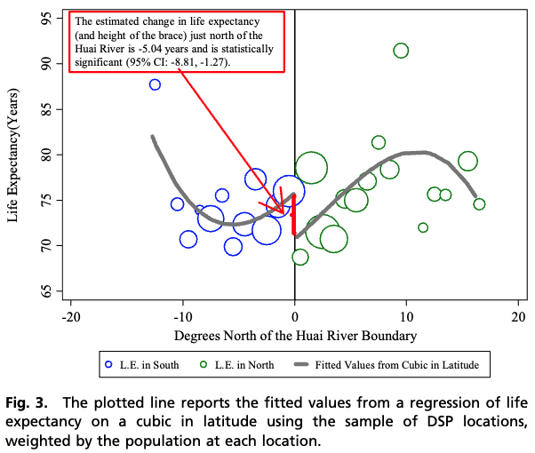
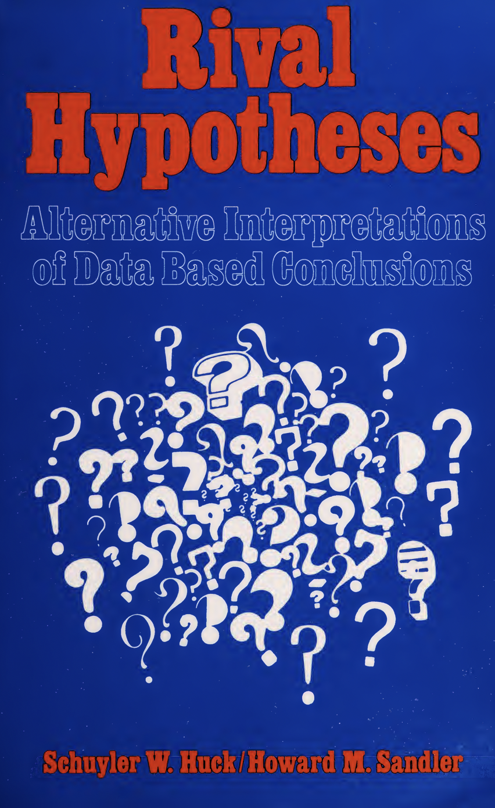

```{css, echo=FALSE} 
@media print { # print out incremental slides; see https://stackoverflow.com/questions/56373198/get-xaringan-incremental-animations-to-print-to-pdf/56374619#56374619
  .has-continuation {
    display: block !important;
  }
}
```

```{r setup, include=FALSE}
# figures formatting setup
options(htmltools.dir.version = FALSE)
library(knitr)
opts_chunk$set(
  prompt = T,
  fig.align="center", #fig.width=6, fig.height=4.5, 
  # out.width="748px", #out.length="520.75px",
  dpi=300, #fig.path='Figs/',
  cache=T, #echo=F, warning=F, message=F
  engine.opts = list(bash = "-l")
  )

## Next hook based on this SO answer: https://stackoverflow.com/a/39025054
knit_hooks$set(
  prompt = function(before, options, envir) {
    options(
      prompt = if (options$engine %in% c('sh','bash')) '$ ' else 'R> ',
      continue = if (options$engine %in% c('sh','bash')) '$ ' else '+ '
      )
})

library(tidyverse)
library(hrbrthemes)
library(fontawesome)
```


---
class: inverse, center, middle
name: crimes

# Crimes against causality
<html><div style='float:left'></div><hr color='#EB811B' size=1px style="width:1000px; margin:auto;"/></html>


---
class: inverse, center, middle

.wide-container[
<div align="center">


</div>
]


---
class: inverse, center, middle

.wide-container[
<div align="center">

</div>
]


---
# What those books are about

.pull-left[

**Critical Thinking Detective**

<i>"This colorful 32-page book offers a collection of fun, easy-to-use detective cases for Grades 4–12+. Some cases may be more challenging for younger students, but teachers and parents can always provide hints when needed. The cases <mark>develop critical thinking skills</mark> by requiring students to read carefully and <mark>analyze and synthesize information to guide their decision-making</mark>. The cases also develop observation skills, reading comprehension, deductive and inductive thinking skills. The ability to identify and evaluate evidence is the very heart of critical thinking."</i>
]

--

.pull-right[

**The Sherlock Holmes Case Book**

<i>"Join the world's greatest fictional detective and use your own powers of deduction to solve these puzzling mysteries. The Sherlock Holmes Case Book: Solve-It-Yourself Mysteries is a remarkable collection of crimes from Dr John Watson's case notes that features all of the twists and turns that have come to be expected from a Holmes case – but now it is up to you to solve them.

There are 10 cases to be cracked, each of which <mark>requires the reader to use logic and powers of perception to answer a question at three points – the beginning, the middle and the end</mark>."</i>
]


---
# The Holmesian "science of deduction and analysis"

.wide-container[
<div align="center">

</div>
]


---
# The Holmesian "science of deduction and analysis"

.pull-left-wide2[

> "[F]rom a drop of water [...] a logician could infer the possibility of an Atlantic or a Niagara without having seen or heard of one or the other [...]. By a man's finger-nails, by his coat-sleeve, by his boot, by his trouser-knees, by the callosities of his forefinger and thumb, by his expression, by his shirt-cuffs—by each of these things a man’s calling is plainly revealed. That all united should fail to enlighten the competent inquirer in any case is almost inconceivable."

<div align="right">Arthur Conan Doyle, <i>A Study in Scarlet</i></div>

> "How often have I said to you that when you have eliminated the impossible, whatever remains, however improbable, must be the truth?"

<div align="right">Arthur Conan Doyle, <i>The Sign of the Four</i></div>


**↪ Great literature, but a nonsensical strategy for causal reasoning.**
]

.pull-right-small2[
<div align="center">
<br><br>

</div>
]


---
# Causal thinking as detective work

.pull-left-wide[
## The premise

- Observational **causal inference** is like detective work<sup>1</sup>
- We have to **piece together evidence** to solve a puzzle of whether the suspect - the treatment - in fact causally changed the outcome
- To that end, we need to **eliminate alternative explanations**

## The equipment

- **Our toolbox:** Critical thinking and logic, observation (data collection), perception (measurement), external knowledge, and statistical methods
- Without the qualitative skills, the quantitative methods are pointless

.footnote[<sup>1</sup>"Observational" does some heavy lifting here; for the experimental causal inference analogy, we'd probably the ones committing the murder.]
]


.pull-right-small[
<div align="center">
<br>

</div>
]


---
class: inverse, center, middle
name: crimescene1

# Warming-up
<html><div style='float:left'></div><hr color='#EB811B' size=1px style="width:1000px; margin:auto;"/></html>

---
# A few easy cases

<br>

.pull-left[
## Shoes hurt (?)

> Survey data revealed that people who sleep with their shoes on are much more likely to wake up with a headache. 

## Sweetened beverages are fattening (?)

> Individuals regularly consuming sugar sweetened beverages are shown to have a 30% higher BMI.
]

.pull-right[
## Lock-downs caused deaths due to COVID-19 (?)

> European countries that had stricter & longer lock-down periods had a higher COVID-19 death rate.

## UN missions fail to protect civilians (?)

> UN peace keeping missions in civil war scenarios are strongly associated with higher death rates among civilians.
]


---
class: inverse, center, middle
name: crimescene1

# Causal crime scene #1
<html><div style='float:left'></div><hr color='#EB811B' size=1px style="width:1000px; margin:auto;"/></html>

---
# The scene: Do storks deliver babies?

<div align="center">

</div>

`Source` [Matthews, Roger, 2000, Teaching Statistics](https://doi.org/10.1111/1467-9639.00013)


---
# Additional evidence

<div align="center">

</div>


---
# Additional evidence

<div align="center">

</div>


---
# A solution to the case

.pull-left[

<br><br>

|                       	| Evidence and conclusions                           	|
|-----------------------	|----------------------------------------------------	|
| **The crime scene**   	| Storks correlate with birth rates                  	|
| **The suspect(s)**    	| Area, breeding grounds, urban/rural divide, chance 	|
| **The murder weapon** 	| Confounding                                        	|

]

.pull-right[
<div align="center">
<br>

</div>
]


---
class: inverse, center, middle
name: crimescene2

# Causal crime scene #2
<html><div style='float:left'></div><hr color='#EB811B' size=1px style="width:1000px; margin:auto;"/></html>


---
# The scene: Are certain music genres deadlier than others?

.pull-left[
<div align="center">

</div>

`Source` [The Conversation](https://theconversation.com/music-to-die-for-how-genre-affects-popular-musicians-life-expectancy-36660), `Background (w/ author response)` [Calling Bullshit](https://callingbullshit.org/case_studies/case_study_musician_mortality.html)
]

.pull-right[
> [Study author Dianna Kenny] found that musicians from older genres – including blues, jazz, country and gospel – have similar lifespans to American people their own age. The life expectancy for R&B musicians is slightly lower, while the life expectancy for newer genres like rock, techno, punk, metal, rap and hip hop is significantly shorter."

<div align="right">Ana Swanson, <a href="https://www.washingtonpost.com/news/wonk/wp/2015/04/15/the-causes-of-musicians-deaths-by-genre/">Washington Post</a></div>

> "It's a cautionary tale to some degree," Kenny told the Washington Post. "People who go into rap music or hip hop or punk, they're in a much more occupational hazard profession compared to war. We don't lose half our army in a battle."

<div align="right">Dianna Kenny, <a href="https://www.washingtonpost.com/news/morning-mix/wp/2015/03/25/over-half-of-dead-hip-hop-artists-were-murdered-study-finds/">quoted by Washington Post</a></div>
]


---
# Additional evidence

.pull-left[
<div align="center">

</div>
]

--

.pull-right[
## Some issues

1. **Sanity check:** Are some genres really that deadly? E.g., do rap musicians really die at an average age of ~30?
2. **Right censoring:** Some genres are younger than others and the data are conditional on musicians having died already. Most rap and hip-hop stars are still alive today; we don't know how long they'll live!
3. **Conditional probabilities:** The probabilities of each cause of death are conditional on death having already occurred at the time of the study.
4. (Minor issue) A line graph for categorical data?  [Not a good idea.](https://www.jmp.com/en_gb/statistics-knowledge-portal/exploratory-data-analysis/line-graph.html#:~:text=Line%20graphs%20do%20not%20make,might%20have%20a%20defined%20order.)
]


---
# A solution to the case

.pull-left[

|                       	| Evidence and conclusions                           	|
|-----------------------	|----------------------------------------------------	|
| **The crime scene**   	| Musical genre correlates with age at death                 	|
| **The suspect(s)**    	| Life style (e.g. drug consumption), age of genre, incomplete data collection 	|
| **The murder weapon** 	| Confounding via data censoring                                        	|

> "In other words, it's not that rap stars will likely die young; it's that the rap stars who have died certainly died young because rap hasn't been around long enough for it to be otherwise." <div align="right">Carl Bergstrom and Jevin West, <a href="https://callingbullshit.org/case_studies/case_study_musician_mortality.html">Calling Bullshit</a><sup>1</sup></div>

<div class="font50"><br><br><sup>1</sup>Note that (1) the author, Dianna Kenny, has provided a nice and plausible response and that (2) a <a href="http://dx.doi.org/10.21091/mppa.2016.1007">more rigorous study</a> seems to provide evidence consistent with the original patterns.</div>
]

.pull-right-center[
<div align="center">
<br>
<b>Inspector Lestrade:</b><br>

<br>
<b>Sherlock:</b><br>

</div>
]


---
class: inverse, center, middle
name: crimescene3

# Causal crime scene #3
<html><div style='float:left'></div><hr color='#EB811B' size=1px style="width:1000px; margin:auto;"/></html>


---
# The scene: Is air pollution affecting life expectancy?

.pull-left[
<div align="center">

</div>
]

.pull-right[
<br>
<div align="center">

</div>
]


---
# Additional evidence

<br>

.pull-left[
<div align="center">

</div>
]

.pull-right[
<div align="center">

</div>
]


---
# Additional evidence (from a later study)

.pull-left[
<div align="center">

</div>
]

.pull-right[
<br>
<div align="center">

</div>
]


---
# Additional evidence (from a later study)

<br>

.pull-left[
<div align="center">

</div>
]

.pull-right[
<div align="center">

</div>
]


---
# A solution to the case

.pull-left[

<br><br>

|                       	| Evidence and conclusions                           	|
|-----------------------	|----------------------------------------------------	|
| **The crime scene**   	| Living north versus south of river Huai linked to lower LE 	|
| **The suspect(s)**    	| Quasi-experimental exposure to $PM_{10}$ 	|
| **The murder weapon** 	| Likely $PM_{10}$?                       	|
]

.pull-right[
## Some thoughts

1. A quasi-experimental design does not protect you from measurement or model specification issues.

2. Using higher-order polynomials in RDDs can be problematic and generate bias (see [Gelman and Zelizer, 2015](https://journals.sagepub.com/doi/full/10.1177/2053168015569830).

3. The follow-up study seemed to address many of those issues.

4. Science (sometimes) is a self-correcting enterprise. Progress through higher quality of evidence is possible.
]


<!--
 The scene: Is there racial bias in police shootings?

[Why Statistics Don’t Capture The Full Extent Of The Systemic Bias In Policing
](https://fivethirtyeight.com/features/why-statistics-dont-capture-the-full-extent-of-the-systemic-bias-in-policing/)
-->


---
# More causal murders to be discovered

<div align="center">


</div>

---
# More causal murders to be discovered

<div align="center">


</div>


---
# A checklist for policy supporting research

.pull-left[
<div align="center">


</div>
]

.pull-right[
<div align="center">

</div>
]

<div class="font50"><b>Source: </b>Kamen and Tamás, 2014, "Should I take this seriously? A simple checklist for calling bullshit on policy supporting research", <a href="https://doi.org/10.1007/s11135-013-9830-8">Quality & Quantity</a></div>


