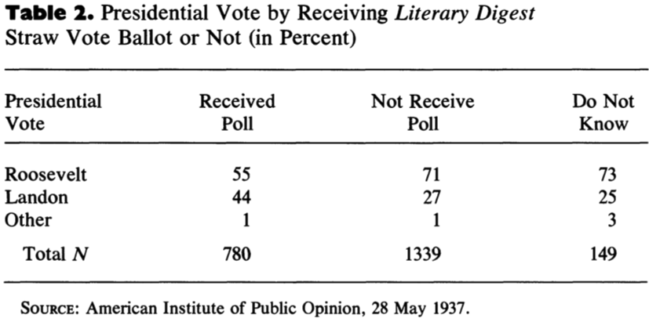
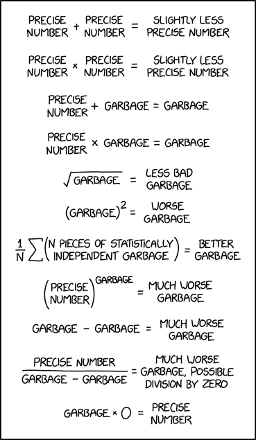

```{css, echo=FALSE} 
@media print { # print out incremental slides; see https://stackoverflow.com/questions/56373198/get-xaringan-incremental-animations-to-print-to-pdf/56374619#56374619
  .has-continuation {
    display: block !important;
  }
}
```

```{r setup, include=FALSE}
# figures formatting setup
options(htmltools.dir.version = FALSE)
library(knitr)
opts_chunk$set(
  prompt = T,
  fig.align="center", #fig.width=6, fig.height=4.5, 
  # out.width="748px", #out.length="520.75px",
  dpi=300, #fig.path='Figs/',
  cache=T, #echo=F, warning=F, message=F
  engine.opts = list(bash = "-l")
  )

## Next hook based on this SO answer: https://stackoverflow.com/a/39025054
knit_hooks$set(
  prompt = function(before, options, envir) {
    options(
      prompt = if (options$engine %in% c('sh','bash')) '$ ' else 'R> ',
      continue = if (options$engine %in% c('sh','bash')) '$ ' else '+ '
      )
})

library(tidyverse)
library(hrbrthemes)
library(fontawesome)
```


# Table of contents

<br><br>

1. [What is big data?](#whatisbigdata)

2. [The big data paradox](#bigdataparadox)

3. [Garbage in, garbage out](#garbageingarbageout)

4. [Opportunities of big data for the public good](#opportunities)


---
class: inverse, center, middle
name: whatisbigdata

# What is big data?
<html><div style='float:left'></div><hr color='#EB811B' size=1px style="width:1000px; margin:auto;"/></html>


---
# What is big data?

<div align="center">

</div>


---
# Massive amounts of data around us<sup>1</sup>

.pull-left-wide2[
<div align="center">

</div>

`Source` Reinsel et al., 2017, ["Data Age 2025"](https://www.seagate.com/files/www-content/our-story/trends/files/Seagate-WP-DataAge2025-March-2017.pdf)

.footnote[<div class="font80"><sup>1</sup>Don't take any of those numbers too seriously. Those are very difficult to measure and numbers you find online are at times differing by oders of magnitude. Also, they are a moving target.</div>]
]

.pull-right-small2[

<div align="center">

</div>

`Source` [eDiscoveryToday, LTMG](https://ediscoverytoday.com/2023/04/20/2023-internet-minute-infographic-by-ediscovery-today-and-ltmg-ediscovery-trends/
)
]


---
# The age of big data - big trends

<br><br>

1. Proliferation of **human-generated data** at scale, in particular in the digital sphere

2.  Use of **new data types**: Text, video, digital traces

3.  **Computational and storage costs** fallen dramatically

4.  Mainstreaming of **machine learning** and **AI** technologies

5.  (Limited) **democratization of access** to large data resources

6.  **Embracement of computational methods** development across many disciplines

7.  **Shift in research avant-garde** from academia to industry


---
class: inverse, center, middle
name: bigdataparadox

# The big data paradox
<html><div style='float:left'></div><hr color='#EB811B' size=1px style="width:1000px; margin:auto;"/></html>


---
# An early big data disaster

<div align="center">

</div>

---
# Literary Digest's 1936 election poll

.pull-left[
## Background

- The weekly magazine *Literary Digest* had correctly predicted the outcomes of all presidential elections between 1920 and 1932 using straw polls.
- Their 1936 poll of 10m voters indicated that Republican candidate Alfred Landon would be the overwhelming winner.

## Aftermath

- The poll was a disaster: Landon lost in a landslide to Franklin D. Roosevelt, who carried 46 out of 48 states and won 60.8% of the popular vote.
- The outcome was correctly predicted by George Gallup with sample of 50k people.
- The magazine went bankrupt in 1938.
]

.pull-right[
<br>
<div align="center">

</div>
]


---
# Literary Digest's 1936 election poll

<div align="center">

</div>

---
# Literary Digest's 1936 election poll

.pull-left[
## Anatomy of a debacle

1. **Sampling frame**: (1) own readers, (2) registered automobile owners, (3) registered telephone users
2. **Data collection**: everyone was mailed a mock ballot and asked to return marked ballot
3. **Response rate**: 2.4m out of 10m

**Selection bias** as a consequence of **coverage** and **nonresponse bias**: overrepresentation of wealthier individuals with a preference for Landon


<br><br><br><br><br>
`Source` [Peverill Squire, 1988, Public Opinion Quarterly](https://www.jstor.org/stable/2749114)
]

.pull-right[
<div align="center">



</div>
]

---
# Take surveys with a pinch of salt

<div align="center">
<br><br><br><br>

</div>


---
# A modern big data polling disaster

.pull-left[
<div align="center">

</div>
]

.pull-right[
<div align="center"><br><br>

</div>
]


---
# A modern big data polling disaster

.pull-left-wide[
<div align="center"><br><br><br>

</div>
]

.pull-right-small[
<div align="center"><br><br>

</div>
]


---
# The big data paradox

.pull-left[
> "[W]hen biased samples are large, they are doubly misleading: they produce confidence intervals with incorrect centres and substantially underestimated widths. This is the **Big Data Paradox**: the bigger the data, the surer we fool ourselves when we fail to account for bias in data collection."

<div align="right">Bradley et al. (2021), <i>Nature</i></div>

> "[T]he 'bigness' of such Big Data (for population inferences) should be measured by the relative size f = n/N of the sample to the population, not by the absolute size n of the sample."

<div align="right">Xiao-Li Meng (2018), <i>The Annals of Applied Statistics</i></div>

]

--

.pull-right[
## Finite population correction to the rescue?

- Intuition tells us that when the sample size becomes big relative to the population size, we should be less likely to err.
- That's true, but the gain is relatively slow.
- For instance, the finite population correction factor for the standard error of a quantity of interest  given by $\sqrt{\frac{N-n}{N-1}}$. 

## Example

- We run a survey of 100k people in a population of 3.7m.
- For $N=3.7m$ and $n=100k$, this is $\sqrt{0.973}$.
]

---
class: inverse, center, middle
name: garbageingarbageout

# Garbage in, garbage out
<html><div style='float:left'></div><hr color='#EB811B' size=1px style="width:1000px; margin:auto;"/></html>


---
# Garbage in, garbage out

.pull-left[
## THE GIGO principle
- The quality of information coming out of a model (e.g., predictions) cannot be better than the quality of information that went in.
- The principle is particularly relevant in the context of big data, where data quality is often poor.
- This is particularly relevant in the context of machine learning, where models can be very complex and opaque.
]

.pull-right[
<div align="center"><br><br>

</div>
]


---
# Google Flu Trends - the big promise

<div align="center">

</div>

`Source` Ginsberg et al., 2009, [Nature](https://www.nature.com/articles/nature07634)

---
# Google Flu Trends - the big promise

<div align="center">
<br>

</div>


---
# Google Flu Trends - the failure


.pull-left-wide2[
<div align="center">

</div>

`Source` Lazer et al., 2014, [Science](https://science.sciencemag.org/content/343/6176/1203)

]

.pull-right-small2[
<div align="center"><br>

</div>
]


---
# Detecting criminality with face images

<div align="center">

</div>


---
# Detecting criminality with face images

<div align="center">

</div>


---
# Detecting criminality with face images

<div align="center"><br>


</div>


---
# Garbage in, garbage out: lessons learned

.pull-left[
1. **Measurement** and **selection issues** are still key in Big Data analytics

2. Don't trust **measures** that haven't been **properly validated**

3. Look out for what goes into a model (the **input**: cases, variables/features)

4. Look for proper **out-of-sample validation** of models

5. Beware of **uncritical use of online/social media** as a data source
]

.pull-right-center[
<div align="center">

</div>
`Source` XKCD, [2295](https://xkcd.com/2295/), (explained [here](https://www.explainxkcd.com/wiki/index.php/2295:_Garbage_Math))
]


---
class: inverse, center, middle
name: opportunities

# Opportunities of big data for the public good
<html><div style='float:left'></div><hr color='#EB811B' size=1px style="width:1000px; margin:auto;"/></html>


---
# The age of big data - the age of dystopia?

.pull-left[
<div align="center"><br><br>


</div>
]

.pull-right[
<div align="center">


</div>
]


---
# Boost public services with AI for individualized health care

<div align="center"><br><br>


</div>

`More information` [Google Deepmind](https://deepmind.google/discover/blog/we-are-very-excited-to-announce-the-launch-of-deepmind-health/), [Data breach](https://www.bbc.com/news/technology-58761324)

---
# Boost public services with AI for individualized health care

<div align="center">

</div>


---
# Climate Change AI

.pull-left-small-center[
<div align="center"><br><br><br><br><br>

</div>

`Source` [Climate Change AI](https://www.climatechange.ai/)
]

.pull-right-wide-center[
<div align="center"><br><br><br><br>


</div>
]


---
# Climate Change AI
<div align="center">


</div>

`Source` [Geraedts et al., 2024](https://iopscience.iop.org/article/10.1088/2515-7620/ad11ab/pdf)


---
# LLMs for more efficient administration?

<div align="center">


</div>


