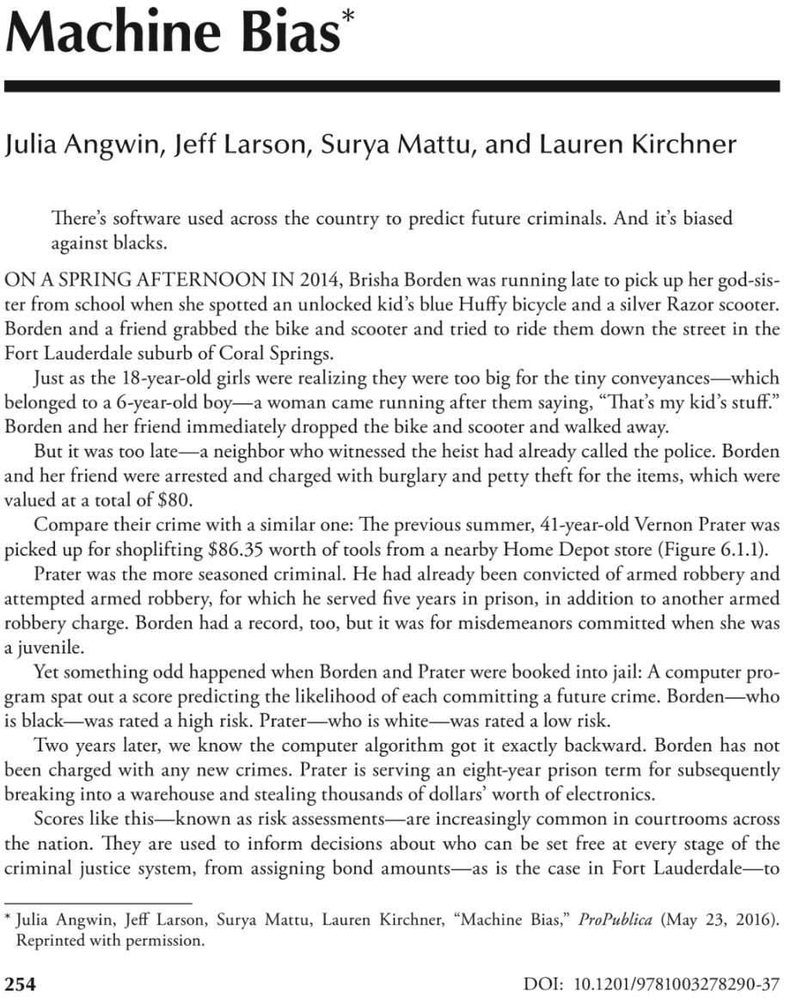

```{css, echo=FALSE} 
@media print { # print out incremental slides; see https://stackoverflow.com/questions/56373198/get-xaringan-incremental-animations-to-print-to-pdf/56374619#56374619
  .has-continuation {
    display: block !important;
  }
}
```

```{r setup, include=FALSE}
# figures formatting setup
options(htmltools.dir.version = FALSE)
library(knitr)
opts_chunk$set(
  prompt = T,
  fig.align="center", #fig.width=6, fig.height=4.5, 
  # out.width="748px", #out.length="520.75px",
  dpi=300, #fig.path='Figs/',
  cache=T, #echo=F, warning=F, message=F
  engine.opts = list(bash = "-l")
  )

## Next hook based on this SO answer: https://stackoverflow.com/a/39025054
knit_hooks$set(
  prompt = function(before, options, envir) {
    options(
      prompt = if (options$engine %in% c('sh','bash')) '$ ' else 'R> ',
      continue = if (options$engine %in% c('sh','bash')) '$ ' else '+ '
      )
})

library(tidyverse)
library(hrbrthemes)
library(fontawesome)
```


# Table of contents

<br><br>

1. [Machine learning, deep learning, AI](#definitions)

2. [Basic concepts in machine learning](#mlconcepts)

3. [Overview of ML landscape](#landscape)

3. [Performance metrics](#metrics)

4. [AI for public policy](#aipp)


---
# Types of data-driven research and their role for policy

.pull-left-small2[
## 1. Description
- What is the state of the world?
- What are the trends over time?
- What are the differences between groups?

## The value for policy-making
- At the center of **monitoring**
- "How many people consume misinformation online?"
- "How many people are unemployed in a certain district?"
- "How does the distribution of income vary across educational segments of the population?"
]

.pull-left-small2[
## 2. Explanation
- What is the effect of a policy?
- Does the effect vary across groups?
- What are the mechanisms behind the effect?

## The value for policy-making
- At the center of **evaluation**
- "Did the minimum wage increase lead to a decrease in employment?"
- "Did the campaign affect the exposure to misinformation differently across groups?"
- "Why did the intervention not lead to the expected results?"
]

.pull-left-small2[
## 3. Prediction
- What is the path of an indicator?
- (When) will future events happen?
- What class does this observation most likely belong to?

## The value for policy-making
- At the center of **forecasting** but also **targeting** and **measurement**
- "Will there be conflict?"
- "How many people will be unemployed in a certain district next year?"
- "Which individuals are most likely to be affected by a policy?"
]


---
class: inverse, center, middle
name: definitions

# Machine learning, deep learning, AI
<html><div style='float:left'></div><hr color='#EB811B' size=1px style="width:1000px; margin:auto;"/></html>


---
# What is AI?

.pull-left[
## Artificial intelligence

> "Artificial intelligence (AI) is intelligence - perceiving, synthesizing, and inferring information - demonstrated by machines, as opposed to intelligence displayed by non-human animals and humans. Example tasks in which this is done include speech recognition, computer vision, translation between (natural) languages, as well as other mappings of inputs."

<div align="right">Wikipedia, <i>Artificial intelligence</i></div>

> "The effort to automate intellectual tasks normally performed humans."

<div align="right">Chollet and Allaire, 2018, <i>Deep Learning with R</i></div>
]

.pull-right-center[
<div align="center">

</div>

`Source` [Wikipedia](https://en.wikipedia.org/wiki/Artificial_intelligence)

<div align="center">


</div>
]

---
# What is AI?

.pull-left[
## Machine learning

> "Machine learning (ML) is a field of inquiry devoted to understanding and building methods that 'learn' (...) It is seen as a part of artificial intelligence."

<div align="right">Wikipedia, <i>Machine learning</i></div>

> "Machine learning is a specific subfield of AI that aims at automatically developing programs (called models) purely from exposure to training data. This process of turning models data into a program is called learning."

<div align="right">Chollet and Allaire, 2018, <i>Deep Learning with R</i></div>
]

.pull-right-center[
<div align="center">

</div>

`Source` [Wikipedia](https://en.wikipedia.org/wiki/Artificial_intelligence)

<div align="center">

</div>
]

---
# What is AI?

.pull-left[
## Data mining

> "Application of machine learning methods to large databases is called data mining. The analogy is that a large volume of earth and raw material is extracted from a mine, which when processed leads to a small amount of very precious material; similarly, in data mining, a large volume of data is processed to construct a simple model with valuable use, for example, having high predictive accuracy."

<div align="right">Alpaydin, 2014, <i>Introduction to Machine Learning</i></div>
]

.pull-right-center[
<div align="center">

</div>

`Source` [Wikipedia](https://en.wikipedia.org/wiki/Artificial_intelligence)

<div align="center">

</div>
]


---
# What is AI?

.pull-left[
## Deep learning

> "Deep learning is the subset of machine learning methods based on neural networks with representation learning. The adjective "deep" refers to the use of multiple layers in the network."

<div align="right">Wikipedia, <i>Deep learning</i></div>
]


.pull-right-center[
<div align="center">

</div>

`Source` [Wikipedia](https://en.wikipedia.org/wiki/Artificial_intelligence)

<div align="center">

</div>
]


---
# Corporate investment in AI

<div align="center">

</div>


---
class: inverse, center, middle
name: mlconcepts

# Basic concepts in machine learning
<html><div style='float:left'></div><hr color='#EB811B' size=1px style="width:1000px; margin:auto;"/></html>


---
# Regression vs. classification

.pull-left[
## Regression
- Predicts a continuous outcome
- Example: Predicting house prices, GDP growth, temperature

## Classification
- Predicts a categorical outcome
- Example: Predicting whether a person will default on a loan, whether an email is spam, whether a patient has a disease

]

--

.pull-right[
## Classifcation problems in the wild

Classification problems occur often, perhaps even more so than regression problems, e.g.:

1. A woman arrives at the emergency room with a set of symptoms. Which condition does she have?
2. An online banking service must be able to determine whether or not a transaction is fraudulent, on the basis of the user’s IP address, past transaction history, and so forth.
3. On the basis of DNA sequence data for a number of patients with and without a given disease, a biologist would like to figure out which DNA mutations are deleterious (disease-causing) and which are not.

Decision-making problems often are classification problems!
]

---
# Supervised and unsupervised learning

.pull-left-wide2[
## Supervised learning
- The algorithm learns from labeled data, i.e., data with known outcomes
- The algorithm is trained on a training dataset and evaluated on a test dataset
- The goal is to the predict unobserved outcomes

## Unsupervised learning
- The algorithm learns from unlabeled data
- There are inputs but no supervising output; we can still learn about relationships and structure from such data

## Analogies
- Supervised: Child in school learns math (with teacher’s input)
- Unsupervised: Child at home plays with toys (without teacher’s input)
]


.pull-right-small2[
<div align="center"><br><br>

</div>
]


---
# Training, validation and test dataset

<div align="center">

</div>


---
# Overfitting

<div align="center">

</div>

---
# Overfitting

<div align="center">

</div>

---
# Overfitting

<div align="center">

</div>

---
# Overfitting

<div align="center">

</div>

---
# Overfitting

<div align="center">

</div>

---
# Overfitting

<div align="center">

</div>

---
# Overfitting

<div align="center">

</div>


---
# Overfitting in classification

<div align="center">

</div>

---
# Overfitting in classification

<div align="center">


</div>


---
# Overfitting in classification

<div align="center">

</div>

**Explained:** The green line represents an overfitted model and the black line represents a regularized model. While the green line best follows the training data, it is too dependent on that data and it is likely to have a higher error rate on new unseen data, compared to the black line.


---
# Overfitting, ultimately explained

<br><br>

<div align="center">

</div>


---
class: inverse, center, middle
name: landscape

# Overview of ML landscape
<html><div style='float:left'></div><hr color='#EB811B' size=1px style="width:1000px; margin:auto;"/></html>


---
# The ML landscape ([Microsoft.com](https://learn.microsoft.com/en-us/azure/machine-learning/algorithm-cheat-sheet?view=azureml-api-1))

<div align="center">

</div>

---
# ML decision tree

<div align="center">

</div>

`Source` [Sundararajan et al. 2021](https://www.um.edu.mt/library/oar/bitstream/123456789/107610/1/A%20contemporary%20review%20on%20drought%20modeling%20using%20machine%20learning%20approaches%202021.pdf)


---
# Affiliation of AI researchers

<div align="center">

</div>


---
class: inverse, center, middle
name: metrics

# Performance metrics
<html><div style='float:left'></div><hr color='#EB811B' size=1px style="width:1000px; margin:auto;"/></html>


---
# AI performance in knowledge tests

<div align="center">

</div>

---
# AI capabilities vs. human performance

<div align="center">

</div>


---
# ML performance benchmarking in the wild

<div align="center">

</div>

`Source` Oueslati, 2024, Watching the Watchers: A Comparative Audit of Cloud‑Based Commercial Content Moderation Services.


---
# ML performance benchmarking in the wild

<div align="center">

</div>

`Source` Wiik, 2024, GPT-4o vs. GPT-4 vs. Gemini 1.5 — Performance Analysis (Accuracy).


---
# Assessing classification performance

.pull-left[
## Accuracy

- Accuracy = $\frac{\text{Number of correct predictions}}{\text{Total number of predictions}} = \frac{TP + TN}{TP + TN + FP + FN}$
- Error rate: $1 - \text{Accuracy}$

## Usefulness
- Accuracy is a simple and intuitive metric.
- But it can be misleading, especially in imbalanced datasets where the classes are not evenly represented.
- Example: In a dataset with 90% of class A and 10% of class B, a model that predicts all instances as class A will have an accuracy of 90%, but it will not be useful for predicting class B instances.
]

--

.pull-right[
## Example

<div align="center"><br>

</div>

What is the **accuracy** of our recidivism classifier?
]


---
# Assessing classification performance

.pull-left[
## Precision

- Precision = $\frac{\text{Number of true positive predictions}}{\text{Number of positive predictions}} = \frac{TP}{TP + FP}$

## Usefulness
- Precision focuses on the accuracy of positive predictions and is useful when the cost of false positives is high.
]

--

.pull-right[
<div align="center">

</div>
]


---
# Assessing classification performance

.pull-left[
## Precision

- Precision = $\frac{\text{Number of true positive predictions}}{\text{Number of positive predictions}} = \frac{TP}{TP + FP}$

## Usefulness
- Precision focuses on the accuracy of positive predictions and is useful when the cost of false positives is high.
]

.pull-right[
## Example

<div align="center"><br>

</div>

What is the **precision** of our recidivism classifier?
]


---
# Assessing classification performance

.pull-left[
## Recall (Sensitivity)
- Recall = $\frac{\text{Number of true positive predictions}}{\text{Number of true positives}} = \frac{TP}{TP + FN}$
- "True positive rate"

## Usefulness
- Recall focuses on capturing all positive instances and is important when the cost of false negatives is high.
- Example: In a medical diagnosis, recall is important to ensure that all patients with a disease are correctly identified.
- The complementary measure is specificity (true negative rate; e.g. how many healthy people are identified as not having the condition)
]

.pull-right[
<div align="center">

</div>
]


---
# Assessing classification performance

.pull-left[
## Recall (Sensitivity)
- Recall = $\frac{\text{Number of true positive predictions}}{\text{Number of true positives}} = \frac{TP}{TP + FN}$
- "True positive rate"

## Usefulness
- Recall focuses on capturing all positive instances and is important when the cost of false negatives is high.
- Example: In a medical diagnosis, recall is important to ensure that all patients with a disease are correctly identified.
- The complementary measure is specificity (true negative rate; e.g. how many healthy people are identified as not having the condition)
]

.pull-right[
## Example

<div align="center"><br>

</div>

What is the **recall** of our recidivism classifier?
]


---
# Assessing classification performance

.pull-left[
## F1 score
- F1 score = $2 \times \frac{\text{Precision} \times \text{Recall}}{\text{Precision} + \text{Recall}} = \frac{2TP}{2TP + FP + FN}$
- F1 score is the harmonic mean of precision and recall.


## Usefulness
- It provides a balance between precision and recall, especially when there is an imbalance between the classes.
- F1 score ranges from 0 to 1, where 1 indicates perfect precision and recall, and 0 indicates poor performance.
]

.pull-right[
## Illustration

<div align="center"><br>

</div>

Normalised harmonic mean plot where x is precision, y is recall and the vertical axis is F1 score, in % points

`Source` [Andong87](https://commons.wikimedia.org/w/index.php?curid=24020909) 
]


---
# Assessing classification performance

.pull-left[
## F1 score
- F1 score = $2 \times \frac{\text{Precision} \times \text{Recall}}{\text{Precision} + \text{Recall}} = \frac{2TP}{2TP + FP + FN}$
- F1 score is the harmonic mean of precision and recall.


## Usefulness
- It provides a balance between precision and recall, especially when there is an imbalance between the classes.
- F1 score ranges from 0 to 1, where 1 indicates perfect precision and recall, and 0 indicates poor performance.
]

.pull-right[
## Example

<div align="center"><br>

</div>

What is the **F1 score** of our recidivism classifier?
]


---
# Why performance metrics can matter

## Scenario

- **Outcome:** Recidivism where individual recidivates (1) or not (0)
- **False Positive (FP):** Model predicts an individual will recidivate when they actually do not. 
- **False Negative (FN):** Model predicts an individual will not recidivate when they actually do.
  - This could result in individuals who are at risk, being released without proper intervention, potentially leading to repeat offenses.

## Assigning costs

- What are downstream costs of FP and FN?
- At which level do the costs apply - individual, societal, ...?


## Ethical and economic reasoning

- How should we weigh the costs of FP and FN?
- What should we prioritize in our model - reducing FP, FN, or balancing both?


---
class: inverse, center, middle
name: aipp

# AI for public policy
<html><div style='float:left'></div><hr color='#EB811B' size=1px style="width:1000px; margin:auto;"/></html>


---
# The COMPAS algorithm to predict criminals' recidivism

.pull-left[
## Background

- Correctional Offender Management Profiling for Alternative Sanctions (COMPAS) is a decision support tool developed by Northpointe (now Equivant) used by U.S. courts to **assess the likelihood of recidivism**
- Produced several scales (Pretrial release risk, General recidivism, Violent recidivism) based on factors such as age, criminal history, and substance abuse
- The algorithm is proprietary and its inner workings are not public

<br><br><br>

`Source` [Practitioner's Guide to COMPAS Core](https://s3.documentcloud.org/documents/2840784/Practitioner-s-Guide-to-COMPAS-Core.pdf)
]

.pull-right[
<div align="center">


</div>
]


---
# The COMPAS algorithm to predict criminals' recidivism

.pull-left[
## The ProPublica and other investigations

- In 2016, ProPublica published an investigation showing that COMPAS was **biased against African Americans**
- **Bias:** The algorithm was more likely for African Americans to wrongly predict that defendants would re-offend.
- **Accuracy:** only 20% of people predicted to commit violent crimes actually went on to do so (in a later study estimated with 65%, still worse than a group of humans with little expertise)

<br><br><br><br><br>
`Source` [ProPublica 2016](https://www.propublica.org/article/how-we-analyzed-the-compas-recidivism-algorithm)
]

.pull-right[
<div align="center">

</div>
]


---
# The COMPAS algorithm to predict criminals' recidivism

.pull-left[
## The ProPublica and other investigations

- In 2016, ProPublica published an investigation showing that COMPAS was **biased against African Americans**
- **Bias:** The algorithm was more likely for African Americans to wrongly predict that defendants would re-offend.
- **Accuracy:** only 20% of people predicted to commit violent crimes actually went on to do so (in a later study estimated with 65%, still worse than a group of humans with little expertise)

<br><br><br><br>

`Source` [Dressel and Fair, 2018, Science Advances](https://www.science.org/doi/epdf/10.1126/sciadv.aao5580)
]

.pull-right[
<div align="center">


</div>
]


---
# Discussion

.pull-left[

<br><br>

1. Where do you see **potential** for AI in public policy-making?

2. Are there **applications of AI in Georgian government** that you are aware of?

3. What role does **AI** play **in your personal (professional) life**?
]

.pull-right[
<div align="center"><br><br>

</div>
]

