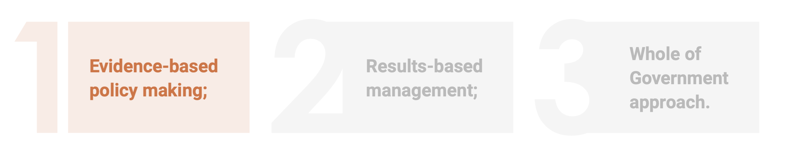

```{css, echo=FALSE} 
@media print { # print out incremental slides; see https://stackoverflow.com/questions/56373198/get-xaringan-incremental-animations-to-print-to-pdf/56374619#56374619
.has-continuation {
display: block !important;
}
}
```

```{r setup, include=FALSE}
# figures formatting setup
options(htmltools.dir.version = FALSE)
library(knitr)
opts_chunk$set(
  prompt = T,
  fig.align="center", #fig.width=6, fig.height=4.5, 
  # out.width="748px", #out.length="520.75px",
  dpi=300, #fig.path='Figs/',
  cache=T, #echo=F, warning=F, message=F
  engine.opts = list(bash = "-l")
)

## Next hook based on this SO answer: https://stackoverflow.com/a/39025054
knit_hooks$set(
  prompt = function(before, options, envir) {
    options(
      prompt = if (options$engine %in% c('sh','bash')) '$ ' else 'R> ',
      continue = if (options$engine %in% c('sh','bash')) '$ ' else '+ '
    )
  })

library(tidyverse)
library(hrbrthemes)
library(fontawesome)
library(RefManageR)

RefManageR::BibOptions(
  check.entries = FALSE,  
  bib.style = "authoryear", 
  cite.style = "authoryear", 
  style = "markdown",
  hyperlink = TRUE, 
  dashed = TRUE)

bib <-  RefManageR::ReadBib("grateful-refs.bib")


```

<br>

### Me

`r fa('address-book')` I am [Sebastian Ramirez-Ruiz](https://seramirezruiz.github.io/), or just Sebastian.

`r fa('envelope')` [ramirez-ruiz@hertie-school.org](mailto:ramirez-ruiz@hertie-school.org)

`r fa('graduation-cap')` Doctoral Candidate and Reseach Associate | Hertie School Data Science Lab

--

I am a **computational social scientist** researching opinion and preference formation, as well as the use of research evidence in policy- and decision-making employing alternative sources of data and experiments.

---

# The plan for this block


| Time         | Session                                                                                                      | Speaker(s)                                                                 |
|--------------|--------------------------------------------------------------------------------------------------------------|----------------------------------------------------------------------------|
| 09:45 – 10:00| Arrival and Coffee                                                                                           |                                                                            |
| 10:00 – 11:30| **Session I: What is evidence? And, how can it<br>inform policy?**                                              | Sebastian Ramirez-Ruiz                                                     |
| 11:30 – 11:45| Coffee Break                                                                                                 |                                                                            |
| 11:45 – 13:15| **Session II: Evidence Synthesis and Meta-Analysis**                                                         | Sebastian Ramirez-Ruiz                                                     |
| 13:15 – 14:15| Lunch Break                                                                                                  |                                                                            |
| 14:15 – 15:45| **Session III: Navigating the World of Evidence: A<br>Practical Workshop for Effective Research**               | Sebastian Ramirez-Ruiz                                                     |
| 15:45 – 16:00| Coffee Break                                                                                                 |                                                                            |
| 16:00 – 17:30| **Session IV: How to read an academic study?**                                                               | Sebastian Ramirez-Ruiz                                                     |
---
# Day 4: Informed consumption of evidence

## Sessions

--
1. What is evidence? And how can it inform policy?

--
2. Evidence synthesis and meta-analysis

--
3. Navigating the world of evidence: A practical workshop for effective research

--
4. How to read an academic study?

--

## Learning goals

--
- To familiarize ourselves with the **scientific research** process and different types of **evidence**.

--
- To evaluate the **strengths** and **limitations** of using evidence to inform policy decisions.

--
- To develop skills to critically **evaluate** the quality and reliability of different types of **evidence**

---
class: midtext

# A show of hands!

### Raise your hand if you:

--
- have heard the term evidence-based policymaking

--
- can define what evidence-based policymaking means

--
- can give us an example of evidence-based policymaking from your own work

--
- have relied on your past experiences to inform your policy work

--
- have integrated input from potential beneficiaries into policy

--
- have ever produced an impact evaluation report

--
- have read an evaluation report [academic article] in the past six months

--
- have ever read an evaluation report [academic article] for work

--
- have used an evaluation report [academic article] to inform policy


---

# Georgia's principles of Good Governance

--

<div align="center">
<br>
<br>
<p style="color:#cc0065;font-style:italic;font-size:70%">Source: Policy Planning, Monitoring and Evaluation Handbook<br>Planning Unit, Administration of the Government of Georgia</p>
</div>


---


# Georgia's principles of Good Governance

<div align="center">
<br><br><br><br>
<p style="font-weight:bold;font-size:120%">The three <span style="color:#BE6238">"main principles"</span> of Good Governance</p>

--

<br>
<p style="color:#cc0065;font-style:italic;font-size:70%">Source: Policy Planning, Monitoring and Evaluation Handbook<br>Planning Unit, Administration of the Government of Georgia</p>
</div>

---

# Georgia's principles of Good Governance

<div align="center">
<br><br><br><br>
<p style="font-weight:bold;font-size:120%">The three <span style="color:#BE6238">"main principles"</span> of Good Governance</p>
<br>
<p style="color:#cc0065;font-style:italic;font-size:70%">Source: Policy Planning, Monitoring and Evaluation Handbook<br>Planning Unit, Administration of the Government of Georgia</p>

</div>


---

# Table of contents

</br></br>

1. [What is evidence?](#whatisevidence)
2. [Evidence-based policy-making (EBPM)](#ebpm)
3. [How can evidence inform the policy-making process?](#inform-ebpm)
4. [Outlook: Data science for EBPM](#ds-ebpm)

---
class: inverse, center, middle
name: whatisevidence

# What is evidence?
<html><div style='float:left'></div><hr color='#EB811B' size=1px style="width:1000px; margin:auto;"/></html>

---

# A general overview of evidence

--

.pull-center[
<br><br>
**Evidence:** *facts*, *signs* or *objects* that are used to prove whether something is true or not.
]

--

<br>

.content-box-gray[
Evidence can be made up of a range of components – *not only scientific* – and is never used in isolation. Scientific evidence typically [relies on] surveys, quantitative/statistical data, qualitative data, and [the] analysis thereof. However, evidence also includes economic, attitudinal, behavioural and anecdotal [insight], together with … experience, history, analogies, local knowledge and culture `r Citep(bib, "strydom2010evidence", .opts = list(max.names = 1, longnamesfirst = FALSE))`
]

---

# A general overview of evidence


.pull-center[
<br><br>
**Evidence:** *facts*, *signs* or *objects* that are used to prove whether something is true or not.
]

<br>

.content-box-gray[
<span style="color:#d3d3d3">Evidence can be made up of a range of components –</span> *not only scientific* <span style="color:#d3d3d3">– and is never used in isolation. Scientific evidence typically [relies on] surveys, quantitative/statistical data, qualitative data, and [the] analysis thereof. However, evidence also includes economic, attitudinal, behavioural and </span>anecdotal [insight], together with … experience, history, analogies, local knowledge and culture `r Citep(bib, "strydom2010evidence", .opts = list(max.names = 1, longnamesfirst = FALSE))`
]

---

# A general overview of evidence

.pull-center[
<br><br>
**Evidence:** *facts*, *signs* or *objects* that are used to prove whether something is true or not.
]

--

<br><br>

.pull-left[

## Anecdotal evidence

- Individual *stories*, *experiences*, or *accounts* that are not necessarily scientifically or statistically verified but provide insights or *illustrations of a particular phenomenon* or issue.
]

--

.pull-right[
## Insight from Experience 

- Knowledge gained through direct involvement or personal encounters with a subject matter. This could include *professional expertise*, *practical know-how*, or *lessons learned* from past events.
]

--


.pull-left[
## History: 

- *Past events*, *trends*, or *developments* that provide *context* or precedents for understanding current situations or predicting future outcomes.
]

--

.pull-right[
## Analogies: 

- *Comparisons* between *similar situations* or phenomena to draw parallels or illustrate a point. Analogies can help clarify complex concepts or make unfamiliar ideas more *relatable*
]

---

# A general overview of evidence

.pull-center[
<br><br>
These <i style="color:#cc0065">information points</i> can be very <i style="color:#cc0065">valuable for policy-making</i><br><br>
]

<br>

.pull-left-gray[
## Anecdotal evidence

- Individual *stories*, *experiences*, or *accounts* that are not necessarily scientifically or statistically verified but provide insights or *illustrations of a particular phenomenon* or issue.
]


.pull-right-gray[
## Insight from Experience 

- Knowledge gained through direct involvement or personal encounters with a subject matter. This could include *professional expertise*, *practical know-how*, or *lessons learned* from past events.
]


.pull-left-gray[
## History: 

- *Past events*, *trends*, or *developments* that provide *context* or precedents for understanding current situations or predicting future outcomes.
]


.pull-right-gray[
## Analogies: 

- *Comparisons* between *similar situations* or phenomena to draw parallels or illustrate a point. Analogies can help clarify complex concepts or make unfamiliar ideas more *relatable*
]

---

# A general overview of evidence

.pull-center[
<br><br>
These <i style="color:#cc0065">information points</i> can be very <i style="color:#cc0065">valuable for policy-making</i><br>and now let's take a second to think about your work and what we have spoken about in the past days...
]

--

.pull-left[
<div align="center">
<br>

</div>
]

--

.pull-right[
## Take a couple of minutes with your neighbor

- Have you ever encountered evidence that approximates the ideals of **causally identified** evidence points?
.text-invisible[- Do you think that evidence .i-pink[permeates] your daily work as a policy maker?
- What types of evidence do you find .i-pink[admissible]? (*relevant*, *material*, and *competent*)
- What do you think can make a piece of evidence be the policy analogue of a .i-pink[smoking gun]?
]]

---

# A general overview of evidence

.pull-center[
<br><br>
These <i style="color:#cc0065">information points</i> can be very <i style="color:#cc0065">valuable for policy-making</i><br>and now let's take a second to think about your work and what we have spoken about in the past days...
]


.pull-left[
<div align="center">
<br>

</div>
]

.pull-right[
## Take a couple of minutes with your neighbor

- Have you ever encountered evidence that approximates the ideals of **causally identified** evidence points?
- Do you think that evidence .i-pink[permeates] your daily work as a policy maker?
.text-invisible[- What types of evidence do you find .i-pink[admissible]? (*relevant*, *material*, and *competent*)
- What do you think can make a piece of evidence be the policy analogue of a .i-pink[smoking gun]?
]]

---

# A general overview of evidence

.pull-center[
<br><br>
These <i style="color:#cc0065">information points</i> can be very <i style="color:#cc0065">valuable for policy-making</i><br>and now let's take a second to think about your work and what we have spoken about in the past days...
]


.pull-left[
<div align="center">
<br>

</div>
]


.pull-right[
## Take a couple of minutes with your neighbor

- Have you ever encountered evidence that approximates the ideals of **causally identified** evidence points?
- Do you think that evidence .i-pink[permeates] your daily work as a policy maker?
- What types of evidence do you normally encounter and find .i-pink[admissible]? (*relevant*, *material*, and *competent*)
.text-invisible[- What do you think can make a piece of evidence be the policy analogue of a .i-pink[smoking gun]?
]]

---
# A general overview of evidence

.pull-center[
<br><br>
These <i style="color:#cc0065">information points</i> can be very <i style="color:#cc0065">valuable for policy-making</i><br>and now let's take a second to think about your work and what we have spoken about in the past days...
]


.pull-left[
<div align="center">
<br>

</div>
]

.pull-right[
## Take a couple of minutes with your neighbor

- Have you ever encountered evidence that approximates the ideals of **causally identified** evidence points?
- Do you think that evidence .i-pink[permeates] your daily work as a policy maker?
- What types of evidence do you normally encounter and find .i-pink[admissible]? (*relevant*, *material*, and *competent*)
- What do you think can make a piece of evidence be the policy analogue of a .i-pink[smoking gun]?
]


---
class: inverse, center, middle
name: ebpm

# Evidence-based policy-making
<html><div style='float:left'></div><hr color='#EB811B' size=1px style="width:1000px; margin:auto;"/></html>

---

# What is evidence-based policy-making?


.pull-center[
<br><br>
**Evidence-based policy-making:** the process of generating policy <i style="color:#cc0065">backed up</i> by a solid<br>body of <i style="color:#cc0065">scientific research</i> or derived from or informed by <i style="color:#cc0065">objective evidence</i>.
]

--

.content-box-gray[
*Evidence-based policymaking* involves utilizing .i-pink[high-quality information] to guide decisions regarding government policies. .text-invisible[This process entails .i-pink[systematically] collecting robust data and analyzing them with .i-pink[rigorous] research methods to generate reliable evidence. Such evidence can offer .i-pink[insights] into the .i-pink[effectiveness] of policies and programs, operational mechanisms, and .i-pink[performance] trends over time.]
]

---

# What is evidence-based policy-making?


.pull-center[
<br><br>
**Evidence-based policy-making:** the process of generating policy <i style="color:#cc0065">backed up</i> by a solid<br>body of <i style="color:#cc0065">scientific research</i> or derived from or informed by <i style="color:#cc0065">objective evidence</i>.
]


.content-box-gray[
*Evidence-based policymaking* involves utilizing *high-quality information* to guide decisions regarding government policies. This process entails .i-pink[systematically] collecting robust data and analyzing them with .i-pink[rigorous] research methods to generate reliable evidence. .text-invisible[Such evidence can offer .i-pink[insights] into the .i-pink[effectiveness] of policies and programs, operational mechanisms, and .i-pink[performance] trends over time.]
]

---

# What is evidence-based policy-making?


.pull-center[
<br><br>
**Evidence-based policy-making:** the process of generating policy <i style="color:#cc0065">backed up</i> by a solid<br>body of <i style="color:#cc0065">scientific research</i> or derived from or informed by <i style="color:#cc0065">objective evidence</i>.
]

.content-box-gray[
*Evidence-based policymaking* involves utilizing *high-quality information* to guide decisions regarding government policies. This process entails *systematically* collecting robust data and analyzing them with *rigorous* research methods to generate reliable evidence. Such evidence can offer .i-pink[insights] into the .i-pink[effectiveness] of policies and programs, operational mechanisms, and .i-pink[performance] trends over time.
]

---

# The case for evidence-based policy-making

--

## Improved decision-making

.pull-center[<br>
.content-box-gray-wide[
<i style="font-weight:bold; color:#cc0065">Policy issue:</i> **Discrimination in labor markets** has been well documented by showing minority candidates tend to receive fewer interview invitations than other candidates The subject of such discrimination varies by context but has prompted calls for hiring procedures that may shield information on a candidate’s national origin, gender, race, and/or ethnicity in some countries.
<br>
]
]
<br>

--
- <h3>How could you use policy to tackle this issue?</h3>

--
- <h3>What policy instruments could you leverage?</h3>

--
- <h3>Which metrics could be markers of success/failure?</h3>

---

# Improved decision-making (cont.)

<br><br><br>

- **Background:** France's immigrant population, particularly from West and North Africa, faces higher unemployment rates, often attributed to educational disparities and discrimination.

--

- **Policy Initiative:** In 2006, France introduced a law to anonymize job application materials but later shifted to a voluntary program in 2009 through Pôle Emploi (*France's unemployment government agency*).

--

- **Research Methodology:** .i-pink[Academic collaboration] with Pôle Emploi allowed for evaluating the impact of anonymous resumes on interview and hiring rates.

--

- **Implementation:** Over 1,000 firms participated, with resumes randomly assigned to either anonymous or standard format groups.

---
class: inverse, center, middle
name: improved-dm
background-color: #FFFFFF


<b style="font-weight:bold;text-align:center;color:#2b7282;font-size:150%;">What do you think they found out?</b>
<html><div style='float:left'></div><hr color='#EB811B' size=1px style="width:1000px; margin:auto;"/></html>

---

# Improved decision-making (cont.)

<br><br><br>

- **Findings:**
    - No significant change in the number of interviews or job offers in either group.
    - Anonymizing resumes led to <i style="color:#cc0065">decreased interview and hiring rates for minority candidates</i>.
    - The interview gap between minority and non-minority candidates widened by 10.7 percentage points.

--

- **Implications:**
    - Participating firms, more likely to hire minorities traditionally, were impacted negatively by anonymized resumes. 
    - Anonymization may hinder the identification and assessment of minority candidates.

--

- **Policy Outcome:** The discussion prompted by the evaluation led to the abandonment of the policy in 2015.

---

# Improved decision-making (cont.)
<br>

.content-box-gray[
A core argument for evidence-based policy-making is that the .i-pink[use of evidence] can **enhance decision-making** by pinpointing effective solutions, improving outcomes, and optimizing resource allocation. Supported by scientific rigor, evidence can informs us about what works, guiding policy effectiveness, program efficiency, and addressing social challenges.]

--

In principle, evidence can:

--

- help us .i-pink[understand] policies.
.text-invisible[- inform when we may need to .i-pink[reassess] a policy solution (*scale down, redesign, or drop altogether*).
- point to directions for .i-pink[replicating] and .i-pink[expanding] successful practices.]

---

# Improved decision-making (cont.)
<br>

.content-box-gray[
A core argument for evidence-based policy-making is that the .i-pink[use of evidence] can **enhance decision-making** by pinpointing effective solutions, improving outcomes, and optimizing resource allocation. Supported by scientific rigor, evidence can informs us about what works, guiding policy effectiveness, program efficiency, and addressing social challenges.]


In principle, evidence can:

- help us .i-pink[understand] policies.
- inform when we may need to .i-pink[reassess] a policy solution (*scale down, redesign, or drop altogether*).
.text-invisible[- point to directions for .i-pink[replicating] and .i-pink[expanding] successful practices.]

---

# Improved decision-making (cont.)
<br>

.content-box-gray[
A core argument for evidence-based policy-making is that the .i-pink[use of evidence] can **enhance decision-making** by pinpointing effective solutions, improving outcomes, and optimizing resource allocation. Supported by scientific rigor, evidence can informs us about what works, guiding policy effectiveness, program efficiency, and addressing social challenges.]


In principle, evidence can:

- help us .i-pink[understand] policies.
- inform when we may need to .i-pink[reassess] a policy solution (*scale down, redesign, or drop altogether*).
- point to directions for .i-pink[replicating] and .i-pink[expanding] successful practices.

---
class: midtext

# Challenges to evidence-based policymaking

--

.pull-left[
## Supply-side challenges

]


.pull-right[
## Demand-side challenges

]

---
class: midtext

# Challenges to evidence-based policymaking


.pull-left[
## Supply-side challenges

1. **Data Availability and Quality**
    - Insufficient or low-quality data.
]

.pull-right[
## Demand-side challenges

]

---
class: midtext

# Challenges to evidence-based policymaking

.pull-left[
## Supply-side challenges

1. **Data Availability and Quality**
    - Insufficient or low-quality data.
2. **Research Funding and Resources**
    - Limited funding for research can restrict the scope and depth of studies.
]

.pull-right[
## Demand-side challenges

]


---
class: midtext

# Challenges to evidence-based policymaking

.pull-left[
## Supply-side challenges

1. **Data Availability and Quality**
    - Insufficient or low-quality data.
2. **Research Funding and Resources**
    - Limited funding for research can restrict the scope and depth of studies.
3. **Technical Expertise**
    - Shortage of skilled researchers and analysts.
]

.pull-right[
## Demand-side challenges

]


---
class: midtext

# Challenges to evidence-based policymaking

.pull-left[
## Supply-side challenges

1. **Data Availability and Quality**
    - Insufficient or low-quality data.
2. **Research Funding and Resources**
    - Limited funding for research can restrict the scope and depth of studies.
3. **Technical Expertise**
    - Shortage of skilled researchers and analysts.
4. **Time Constraints**
    - Mismatch between the timelines of research cycles and policy decision-making cycles.
]

.pull-right[
## Demand-side challenges

]


---
class: midtext

# Challenges to evidence-based policymaking

.pull-left[
## Supply-side challenges

1. **Data Availability and Quality**
    - Insufficient or low-quality data.
2. **Research Funding and Resources**
    - Limited funding for research can restrict the scope and depth of studies.
3. **Technical Expertise**
    - Shortage of skilled researchers and analysts.
4. **Time Constraints**
    - Mismatch between the timelines of research cycles and policy decision-making cycles.
5. **Ethical and Privacy Concerns**
    - Issues related to data privacy and ethical considerations in data collection and usage.
]

.pull-right[
## Demand-side challenges

]


---
class: midtext

# Challenges to evidence-based policymaking

.pull-left[
## Supply-side challenges

1. **Data Availability and Quality**
    - Insufficient or low-quality data.
2. **Research Funding and Resources**
    - Limited funding for research can restrict the scope and depth of studies.
3. **Technical Expertise**
    - Shortage of skilled researchers and analysts.
4. **Time Constraints**
    - Mismatch between the timelines of research cycles and policy decision-making cycles.
5. **Ethical and Privacy Concerns**
    - Issues related to data privacy and ethical considerations in data collection and usage.
6. **Political and Institutional Barriers**
    - Political pressure to influence the direction and outcomes of studies.
    - Bureaucratic inertia and resistance to adopting new research methodologies or findings.
]

.pull-right[
## Demand-side challenges

]


---
class: midtext

# Challenges to evidence-based policymaking

.pull-left[
## Supply-side challenges

1. **Data Availability and Quality**
    - Insufficient or low-quality data.
2. **Research Funding and Resources**
    - Limited funding for research can restrict the scope and depth of studies.
3. **Technical Expertise**
    - Shortage of skilled researchers and analysts.
4. **Time Constraints**
    - Mismatch between the timelines of research cycles and policy decision-making cycles.
5. **Ethical and Privacy Concerns**
    - Issues related to data privacy and ethical considerations in data collection and usage.
6. **Political and Institutional Barriers**
    - Political pressure to influence the direction and outcomes of studies.
    - Bureaucratic inertia and resistance to adopting new research methodologies or findings.
]


.pull-right[
## Demand-side challenges

1. **Political Will and Ideology**
    - Political ideology over evidence.
    - Unpopular policies despite strong evidence?

]

---
class: midtext

# Challenges to evidence-based policymaking

.pull-left[
## Supply-side challenges

1. **Data Availability and Quality**
    - Insufficient or low-quality data.
2. **Research Funding and Resources**
    - Limited funding for research can restrict the scope and depth of studies.
3. **Technical Expertise**
    - Shortage of skilled researchers and analysts.
4. **Time Constraints**
    - Mismatch between the timelines of research cycles and policy decision-making cycles.
5. **Ethical and Privacy Concerns**
    - Issues related to data privacy and ethical considerations in data collection and usage.
6. **Political and Institutional Barriers**
    - Political pressure to influence the direction and outcomes of studies.
    - Bureaucratic inertia and resistance to adopting new research methodologies or findings.
]


.pull-right[
## Demand-side challenges

1. **Political Will and Ideology**
    - Political ideology over evidence.
    - Unpopular policies despite strong evidence?
2. **Public Perception and Trust**
    - Public skepticism or mistrust of scientific evidence.
]

---
class: midtext

# Challenges to evidence-based policymaking

.pull-left[
## Supply-side challenges

1. **Data Availability and Quality**
    - Insufficient or low-quality data.
2. **Research Funding and Resources**
    - Limited funding for research can restrict the scope and depth of studies.
3. **Technical Expertise**
    - Shortage of skilled researchers and analysts.
4. **Time Constraints**
    - Mismatch between the timelines of research cycles and policy decision-making cycles.
5. **Ethical and Privacy Concerns**
    - Issues related to data privacy and ethical considerations in data collection and usage.
6. **Political and Institutional Barriers**
    - Political pressure to influence the direction and outcomes of studies.
    - Bureaucratic inertia and resistance to adopting new research methodologies or findings.
]


.pull-right[
## Demand-side challenges

1. **Political Will and Ideology**
    - Political ideology over evidence.
    - Unpopular policies despite strong evidence?
2. **Public Perception and Trust**
    - Public skepticism or mistrust of scientific evidence.
3. **Resource Constraints**
    - Limited budgets to implement.
    - Competing priorities of immediate needs over long-term evidence-based solutions.
]

---
class: midtext

# Challenges to evidence-based policymaking

.pull-left[
## Supply-side challenges

1. **Data Availability and Quality**
    - Insufficient or low-quality data.
2. **Research Funding and Resources**
    - Limited funding for research can restrict the scope and depth of studies.
3. **Technical Expertise**
    - Shortage of skilled researchers and analysts.
4. **Time Constraints**
    - Mismatch between the timelines of research cycles and policy decision-making cycles.
5. **Ethical and Privacy Concerns**
    - Issues related to data privacy and ethical considerations in data collection and usage.
6. **Political and Institutional Barriers**
    - Political pressure to influence the direction and outcomes of studies.
    - Bureaucratic inertia and resistance to adopting new research methodologies or findings.
]


.pull-right[
## Demand-side challenges

1. **Political Will and Ideology**
    - Political ideology over evidence.
    - Unpopular policies despite strong evidence?
2. **Public Perception and Trust**
    - Public skepticism or mistrust of scientific evidence.
3. **Resource Constraints**
    - Limited budgets to implement.
    - Competing priorities of immediate needs over long-term evidence-based solutions.
4. **Complexity and Uncertainty**
    - Complexity of translating scientific evidence into practical and actionable policies.
]

---
class: midtext

# Challenges to evidence-based policymaking

.pull-left[
## Supply-side challenges

1. **Data Availability and Quality**
    - Insufficient or low-quality data.
2. **Research Funding and Resources**
    - Limited funding for research can restrict the scope and depth of studies.
3. **Technical Expertise**
    - Shortage of skilled researchers and analysts.
4. **Time Constraints**
    - Mismatch between the timelines of research cycles and policy decision-making cycles.
5. **Ethical and Privacy Concerns**
    - Issues related to data privacy and ethical considerations in data collection and usage.
6. **Political and Institutional Barriers**
    - Political pressure to influence the direction and outcomes of studies.
    - Bureaucratic inertia and resistance to adopting new research methodologies or findings.
]


.pull-right[
## Demand-side challenges

1. **Political Will and Ideology**
    - Political ideology over evidence.
    - Unpopular policies despite strong evidence?
2. **Public Perception and Trust**
    - Public skepticism or mistrust of scientific evidence.
3. **Resource Constraints**
    - Limited budgets to implement.
    - Competing priorities of immediate needs over long-term evidence-based solutions.
4. **Complexity and Uncertainty**
    - Complexity of translating scientific evidence into practical and actionable policies.
5. **Interest Groups and Lobbying**
    - Pressure from powerful stakeholders.
]


---
class: midtext

# Challenges to evidence-based policymaking

.pull-left[
## Supply-side challenges

1. **Data Availability and Quality**
    - Insufficient or low-quality data.
2. **Research Funding and Resources**
    - Limited funding for research can restrict the scope and depth of studies.
3. **Technical Expertise**
    - Shortage of skilled researchers and analysts.
4. **Time Constraints**
    - Mismatch between the timelines of research cycles and policy decision-making cycles.
5. **Ethical and Privacy Concerns**
    - Issues related to data privacy and ethical considerations in data collection and usage.
6. **Political and Institutional Barriers**
    - Political pressure to influence the direction and outcomes of studies.
    - Bureaucratic inertia and resistance to adopting new research methodologies or findings.
]


.pull-right[
## Demand-side challenges

1. **Political Will and Ideology**
    - Political ideology over evidence.
    - Unpopular policies despite strong evidence?
2. **Public Perception and Trust**
    - Public skepticism or mistrust of scientific evidence.
3. **Resource Constraints**
    - Limited budgets to implement.
    - Competing priorities of immediate needs over long-term evidence-based solutions.
4. **Complexity and Uncertainty**
    - Complexity of translating scientific evidence into practical and actionable policies.
5. **Interest Groups and Lobbying**
    - Pressure from powerful stakeholders.
6. **Institutional and Cultural Resistance**
    - Institutional inertia and resistance to change within government bodies.
    - Cultural resistance to new policies that challenge traditional practices or norms.
]

---
class: inverse, center, middle
name: inform-ebpm

# How can evidence inform the policy-making process?
<html><div style='float:left'></div><hr color='#EB811B' size=1px style="width:1000px; margin:auto;"/></html>

---

# When is knowledge used?

.pull-center[
<br>
A key concern for us is to establish whether evidence will be, or is, .i-pink['used'], but what does '**using evidence**'<br>actually mean? And, how can evidence go on and .i-pink[inform policy decisions]?
]
<br><br>

--

.content-box-gray-wide[

Largely, research has conceptualized **knowledge use** under three larger "buckets":

.text-invisible[- .i-pink[Instrumental] use to facilitate **decision making**.
- .i-pink[Conceptual] use to facilitate **understanding** or reflection on problems; issues or solutions.
- .i-pink[Symbolic or tactical] use consisting of using evidence to achieve **strategic** or **political objectives**.]]

---

# When is knowledge used?

.pull-center[
<br>
A key concern for us is to establish whether evidence will be, or is, .i-pink['used'], but what does '**using evidence**'<br>actually mean? And, how can evidence go on and .i-pink[inform policy decisions]?
]
<br><br>


.content-box-gray-wide[

Largely, research has conceptualized **knowledge use** under three larger "buckets":

- .i-pink[Instrumental] use to facilitate **decision making**.
- .i-pink[Conceptual] use to facilitate **understanding** or reflection on problems; issues or solutions.
- .i-pink[Symbolic or tactical] use consisting of using evidence to achieve **strategic** or **political objectives**.]


---

# When is knowledge used? (cont.)


.pull-left[
<br><br>
## 1. Knowledge-driven model

Think of use of evidence as a sequential process. The notion is that some new knowledge discloses some opportunity that may have relevance for public policy. (*Basic research -> Applied research -> Development -> Application*)

]

.pull-right[

<div align="center">
<br><br><br>

</div>

]

---

# When is knowledge used? (cont.)


.pull-left[
<br><br>
## 2. Problem-solving model: 

A problem exists and a decision has to be made, information or understanding is lacking either to generate a solution to the problem or to select among alternative solutions, .i-pink[research provides the missing knowledge]. With the gap filled, a decision is reached. (*Application of evidence to pending decisions*)

]

.pull-right[

<div align="center">
<br><br><br>

</div>

]
---

# When is knowledge used? (cont.)


.pull-left[
<br><br>
## 3. Interactive model:

A dynamic process where multiple stakeholders make sense of a problem with their talents, beliefs, and understandings. The use of evidence is .i-pink[only one part of a complicated process] that also uses experience, political insight, pressure, social technologies, and judgment.

]

.pull-right[

<div align="center">
<br><br><br>

</div>

]

---

# When is knowledge used? (cont.)


.pull-left[
<br><br>
## 4. Political model:

Actors with predetermined positions. Evidence can still be used. It becomes .i-pink[ammunition] for the side that finds its conclusions congenial and supportive.

]

.pull-right[

<div align="center">
<br><br><br>

</div>

]

---

# When is knowledge used? (cont.)


.pull-left[
<br><br>
## 5. Tactical model:

Evidence is not used for its substance, but to show that .i-pink[something was done]. Evidence is used as proof of responsiveness, tactic for delaying action, deflecting criticism, or enhancing agency prestige. (*People seem to agree this matters, so we may as well integrate it in some way*)

]

.pull-right[

<div align="center">
<br><br><br>

</div>

]

---

# When is knowledge used? (cont.)


.pull-left[
<br><br>
## 6. Enlightment model: 

Scientific research and evaluation concepts and perspectives shape policy indirectly. They sensitize decision-makers to new issues and changes policy agendas. It is not the findings of a single study nor even of a body of related studies that directly affect policy. Rather it is the .i-pink[concepts and theoretical perspectives] that permeate the policy-making process.

]

.pull-right[

<div align="center">
<br><br><br>

</div>

]

---
# When is knowledge used? (cont.)

.pull-left[

## Let's break into small groups and take some minutes to discuss.

- What is in your .i-pink[opinion] the **most desirable** model of evidence use in policy?
- What is in your .i-pink[experience] the **most common** model of evidence use in policy?
- Are your answers to the **most desirable** and  **most common** models the same?
    - If there is a divergence, what do you think are core drivers of this split between the desirable and effective state-of-affairs?
    - If they are the same, what do you think are conditions that facilitate this?
- Can you think of instances where some uses of evidence may be more **advantageous**?
]

.pull-right[

<div align="center">
<br><br><br>

</div>

]

---
class: midtext

# When is knowledge used? (cont.)

- **Knowledge-driven model:** Think of use of evidence as a sequential process. The notion is that some new knowledge discloses some opportunity that may have relevance for public policy. (*Basic research -> Applied research -> Development -> Application*)

- **Problem-solving model:** A problem exists and a decision has to be made, information or understanding is lacking either to generate a solution to the problem or to select among alternative solutions, .i-pink[research provides the missing knowledge]. With the gap filled, a decision is reached. (*Application of evidence to pending decisions*)

- **Interactive model:** A dynamic process where multiple stakeholders make sense of a problem with their talents, beliefs, and understandings. The use of evidence is .i-pink[only one part of a complicated process] that also uses experience, political insight, pressure, social technologies, and judgment.

- **Political model:** Actors with predetermined positions. Evidence can still be used. It becomes .i-pink[ammunition] for the side that finds its conclusions congenial and supportive.

- **Tactical model:** Evidence is not used for its substance, but to show that .i-pink[something was done]. Evidence is used as proof of responsiveness, tactic for delaying action, deflecting criticism, or enhancing agency prestige. (*People seem to agree this matters, so we may as well integrate it in some way*)

- **Enlightment model:** Scientific research and evaluation concepts and perspectives shape policy indirectly. They sensitize decision-makers to new issues and changes policy agendas. It is not the findings of a single study nor even of a body of related studies that directly affect policy. Rather it is the .i-pink[concepts and theoretical perspectives] that permeate the policy-making process.

---

# When is it justified to claim EBPM?

--

<br>
.content-box-gray-wide[
According to `r Citet(bib, "gade2023justified", .opts = list(max.names = 1, longnamesfirst = FALSE))`, claiming that a specific practice or policy is evidence-based is possible *if*, and *only if*, three conditions are met: <br>

1. The individual or organization possesses <i style="color:#cc0065">comparative evidence</i> about the effects of the specific practice or policy in comparison to the effects of <i style="color:#cc0065">at least one alternative</i> practice or policy
.text-invisible[2. The specific practice or policy is <i style="color:#cc0065">supported by this evidence</i> according to at least one of the individual’s or organization’s preferences in the given practice or policy area
3. The individual or organization can <i style="color:#cc0065">provide a sound account</i> for this support by </i>explaining the evidence</i> and preferences that lay the foundation for the claim.
]]

---

# When is it justified to claim EBPM?

<br>
.content-box-gray-wide[
According to `r Citet(bib, "gade2023justified", .opts = list(max.names = 1, longnamesfirst = FALSE))`, claiming that a specific practice or policy is evidence-based is possible *if*, and *only if*, three conditions are met: <br>

1. The individual or organization possesses <i style="color:#cc0065">comparative evidence</i> about the effects of the specific practice or policy in comparison to the effects of <i style="color:#cc0065">at least one alternative</i> practice or policy
2. The specific practice or policy is <i style="color:#cc0065">supported by this evidence</i> according to at least one of the individual’s or organization’s preferences in the given practice or policy area
.text-invisible[3. The individual or organization can <i style="color:#cc0065">provide a sound account</i> for this support by </i>explaining the evidence</i> and preferences that lay the foundation for the claim.
]]


---

# When is it justified to claim EBPM?

<br>
.content-box-gray-wide[
According to `r Citet(bib, "gade2023justified", .opts = list(max.names = 1, longnamesfirst = FALSE))`, claiming that a specific practice or policy is evidence-based is possible *if*, and *only if*, three conditions are met: <br>

1. The individual or organization possesses <i style="color:#cc0065">comparative evidence</i> about the effects of the specific practice or policy in comparison to the effects of <i style="color:#cc0065">at least one alternative</i> practice or policy
2. The specific practice or policy is <i style="color:#cc0065">supported by this evidence</i> according to at least one of the individual’s or organization’s preferences in the given practice or policy area
3. The individual or organization can <i style="color:#cc0065">provide a sound account</i> for this support by </i>explaining the evidence</i> and preferences that lay the foundation for the claim.
]

---

# When is it justified to claim EBPM? (cont.)

<br>
.content-box-gray-wide[
According to `r Citet(bib, "gade2023justified", .opts = list(max.names = 1, longnamesfirst = FALSE))`, claiming that a specific practice or policy is evidence-based is possible *if*, and *only if*, three conditions are met: <br>

1. We are not justified to say a policy is evidence-based if <i style="color:#cc0065">we do not possess any evidence about its effects in comparison with the effects of any other practices/policies</i>.
.text-invisible[2. We are not justified to say a policy is evidence-based if <i style="color:#cc0065">we do not believe that the evidence supports this practice/policy</i>.
3. We are not justified to say a policy is evidence-based if <i style="color:#cc0065">we cannot explain which evidence we possess or what our preferences are regarding this practice/policy</i>.
]]


---

# When is it justified to claim EBPM? (cont.)

<br>
.content-box-gray-wide[
According to `r Citet(bib, "gade2023justified", .opts = list(max.names = 1, longnamesfirst = FALSE))`, claiming that a specific practice or policy is evidence-based is possible *if*, and *only if*, three conditions are met: <br>

1. We are not justified to say a policy is evidence-based if <i style="color:#cc0065">we do not possess any evidence about its effects in comparison with the effects of any other practices/policies</i>.
2. We are not justified to say a policy is evidence-based if <i style="color:#cc0065">we do not believe that the evidence supports this practice/policy</i>.
.text-invisible[3. We are not justified to say a policy is evidence-based if <i style="color:#cc0065">we cannot explain which evidence we possess or what our preferences are regarding this practice/policy</i>.
]]

---

# When is it justified to claim EBPM? (cont.)

<br>
.content-box-gray-wide[
According to `r Citet(bib, "gade2023justified", .opts = list(max.names = 1, longnamesfirst = FALSE))`, claiming that a specific practice or policy is evidence-based is possible *if*, and *only if*, three conditions are met: <br>

1. We are not justified to say a policy is evidence-based if <i style="color:#cc0065">we do not possess any evidence about its effects in comparison with the effects of any other practices/policies</i>.
2. We are not justified to say a policy is evidence-based if <i style="color:#cc0065">we do not believe that the evidence supports this practice/policy</i>.
3. We are not justified to say a policy is evidence-based if <i style="color:#cc0065">we cannot explain which evidence we possess or what our preferences are regarding this practice/policy</i>.
]

--

<br>
.pull-center[
What do you think about this take? Is it too <i style="color:#cc0065">restrictive</i>? Is there <i style="color:#cc0065">something missing<i/>?
]

---

class: inverse, center, middle
name: ds-ebpm

# Outlook: Data science for EBPM
<html><div style='float:left'></div><hr color='#EB811B' size=1px style="width:1000px; margin:auto;"/></html>

---

# What is data science?

.pull-center[
<br><br>
**Data science** is an .i-pink[interdisciplinary] field that employs statistics, scientific computing, methods,<br> algorithms, and systems to .i-pink[extract knowledge and insights] from .i-pink[diverse data types], ranging from structured to unstructured data</i>.
]

--

<div align="center">

</div>

---
background-image: url("../pics/vintage-pipeline.jpeg")
background-size: contain
background-color: #000000

# The data science pipeline


---

# The data science pipeline

.pull-left[

**Preparatory work**

- **Problem definition** predict, infer, describe
- **Design** conceptualize, build data collection device
- **Data collection** recruit, collect, monitor

]

---

# The data science pipeline

.pull-left[

**Preparatory work**

- **Problem definition** predict, infer, describe
- **Design** conceptualize, build data collection device
- **Data collection** recruit, collect, monitor

**Data operation**

]

.pull-right-center[
<br><br><br>
<div align="center">

</div>
]

---

# The data science pipeline

.pull-left[

**Preparatory work**

  - **Problem definition** predict, infer, describe
  - **Design** conceptualize, build data collection device
  - **Data collection** recruit, collect, monitor

**Data operation**

   - **Wrangle**: import, tidy, manipulate
   
]

.pull-right-center[
<br><br><br>
<div align="center">

</div>
]


---

# The data science pipeline

.pull-left[

**Preparatory work**

  - **Problem definition** predict, infer, describe
  - **Design** conceptualize, build data collection device
  - **Data collection** recruit, collect, monitor

**Data operation**

   - **Wrangle**: import, tidy, manipulate
   - **Explore**: visualize, describe, discover


]

.pull-right-center[
<br><br><br>
<div align="center">

</div>
]


---

# The data science pipeline

.pull-left[

**Preparatory work**

  - **Problem definition** predict, infer, describe
  - **Design** conceptualize, build data collection device
  - **Data collection** recruit, collect, monitor

**Data operation**

   - **Wrangle**: import, tidy, manipulate
   - **Explore**: visualize, describe, discover
   - **Model**: build, test, infer, predict


]

.pull-right-center[
<br><br><br>
<div align="center">

</div>
]


---

# The data science pipeline

.pull-left[

**Preparatory work**

  - **Problem definition** predict, infer, describe
  - **Design** conceptualize, build data collection device
  - **Data collection** recruit, collect, monitor

**Data operation**

   - **Wrangle**: import, tidy, manipulate
   - **Explore**: visualize, describe, discover
   - **Model**: build, test, infer, predict

**Dissemination**

  - **Communicate**: to the public, media, policymakers
  - **Publish**: journals/proceedings, blogs, software
  - **Productize**: make usable, robust, scalable


]

.pull-right-center[
<br><br><br>
<div align="center">

</div>
]


---

# The data science pipeline

.pull-left[

**Preparatory work**

  - **Problem definition** predict, infer, describe
  - **Design** conceptualize, build data collection device
  - **Data collection** recruit, collect, monitor

**Data operation**

   - **Wrangle**: import, tidy, manipulate
   - **Explore**: visualize, describe, discover
   - **Model**: build, test, infer, predict

**Dissemination**

  - **Communicate**: to the public, media, policymakers
  - **Publish**: journals/proceedings, blogs, software
  - **Productize**: make usable, robust, scalable

**Meta skill: programming**

]

.pull-right-center[
<br><br><br>
<div align="center">

</div>
]

---

# Mapping science onto policy

<br>
.content-box-gray-wide[
According to the `r Citet(bib, "national2012using", .opts = list(max.names = 1, longnamesfirst = FALSE))`, science can have five tasks related to policy: 

1. .i-pink[identify problems], such as endangered species, obesity, unemployment, and vulnerability to natural disasters or terrorist acts; 
.text-invisible[2. .i-pink[measure] their magnitude and seriousness; 
3. .i-pink[review] alternative policy interventions; 
4. systematically assess the .i-pink[likely consequences] of particular policy actions—intended and unintended, desired and unwanted; and 
5. .i-pink[evaluate] what, in fact, results from policy. 
]]

---

# Mapping science onto policy

<br>
.content-box-gray-wide[
According to the `r Citet(bib, "national2012using", .opts = list(max.names = 1, longnamesfirst = FALSE))`, science can have five tasks related to policy: 

1. .i-pink[identify problems], such as endangered species, obesity, unemployment, and vulnerability to natural disasters or terrorist acts; 
2. .i-pink[measure] their magnitude and seriousness; 
.text-invisible[3. .i-pink[review] alternative policy interventions; 
4. systematically assess the .i-pink[likely consequences] of particular policy actions—intended and unintended, desired and unwanted; and 
5. .i-pink[evaluate] what, in fact, results from policy. 
]]

---

# Mapping science onto policy

<br>
.content-box-gray-wide[
According to the `r Citet(bib, "national2012using", .opts = list(max.names = 1, longnamesfirst = FALSE))`, science can have five tasks related to policy: 

1. .i-pink[identify problems], such as endangered species, obesity, unemployment, and vulnerability to natural disasters or terrorist acts; 
2. .i-pink[measure] their magnitude and seriousness; 
3. .i-pink[review] alternative policy interventions; 
.text-invisible[4. systematically assess the .i-pink[likely consequences] of particular policy actions—intended and unintended, desired and unwanted; and 
5. .i-pink[evaluate] what, in fact, results from policy. 
]]

---

# Mapping science onto policy

<br>
.content-box-gray-wide[
According to the `r Citet(bib, "national2012using", .opts = list(max.names = 1, longnamesfirst = FALSE))`, science can have five tasks related to policy: 

1. .i-pink[identify problems], such as endangered species, obesity, unemployment, and vulnerability to natural disasters or terrorist acts; 
2. .i-pink[measure] their magnitude and seriousness; 
3. .i-pink[review] alternative policy interventions; 
4. systematically assess the .i-pink[likely consequences] of particular policy actions—intended and unintended, desired and unwanted; and 
.text-invisible[5. .i-pink[evaluate] what, in fact, results from policy. 
]]

---

# Mapping science onto policy

<br>
.content-box-gray-wide[
According to the `r Citet(bib, "national2012using", .opts = list(max.names = 1, longnamesfirst = FALSE))`, science can have five tasks related to policy: 

1. .i-pink[identify problems], such as endangered species, obesity, unemployment, and vulnerability to natural disasters or terrorist acts; 
2. .i-pink[measure] their magnitude and seriousness; 
3. .i-pink[review] alternative policy interventions; 
4. systematically assess the .i-pink[likely consequences] of particular policy actions—intended and unintended, desired and unwanted; and 
5. .i-pink[evaluate] what, in fact, results from policy. 
]


---

# Mapping science onto policy

<br>
.content-box-gray-wide[
According to the `r Citet(bib, "national2012using", .opts = list(max.names = 1, longnamesfirst = FALSE))`, science can have five tasks related to policy: 

1. .i-pink[identify problems], such as endangered species, obesity, unemployment, and vulnerability to natural disasters or terrorist acts; 
2. .i-pink[measure] their magnitude and seriousness; 
3. .i-pink[review] alternative policy interventions; 
4. systematically assess the .i-pink[likely consequences] of particular policy actions—intended and unintended, desired and unwanted; and 
5. .i-pink[evaluate] what, in fact, results from policy. 
]

.pull-center[<br>
Through **data science**, we can leverage large, often under-used, data sources and tap<br>on their full potential to extract policy insights related to each of those tasks.]

---

# Mapping science onto policy (cont.)


<br>
<div align="center">


</div>


Some of the things we can do: .i-pink[(identify problems; measure)]

--

- Monitor SDG advancement by extracting meaningful measures of the global digital gender gap using Facebook ad data `r Citep(bib, "fatehkia2018using", before = "e.g., ", .opts = list(max.names = 1, longnamesfirst = FALSE))`

--

- Measure poverty remotely by combining satellite imagery and machine learning `r Citep(bib, "jean2016combining", before = "e.g., ", .opts = list(max.names = 1, longnamesfirst = FALSE))`

--

- Infer public transport demand and infrastructure usage by combining mobile phone, geospatial, census records, and survey data `r Citep(bib, "toole2015path", before = "e.g., ", .opts = list(max.names = 1, longnamesfirst = FALSE))`

--

- ...

---

# Mapping science onto policy (cont.)


<br>
<div align="center">


</div>


Some of the things we can do: .i-pink[(review; assess likely consequences; evaluate)]

--

- Conduct large, low-cost, experiments and assess compliance with interventions with consensual data tracking `r Citep(bib, c("guess2023social", "munzert2021tracking"), before = "e.g., ", .opts = list(max.names = 1, longnamesfirst = FALSE))`

--

- Design more cost-efficient experiments with balanced treatment assignments `r Citep(bib, "arbour2021efficient", before = "e.g., ", .opts = list(max.names = 1, longnamesfirst = FALSE))`

--

- Extracting more precise causal estimates through estimators that leverage increased computational power, such as double ML and synthetic controls `r Citep(bib, c("knaus2022double","abadie2015comparative"), before = "e.g., ", .opts = list(max.names = 1, longnamesfirst = FALSE))`

--

- ...

---
class: inverse, center, middle
name: DS-promises
background-color: #FFFFFF


<span style="text-align:center;color:#2b7282;font-size:150%;">Through data science, we can leverage large, often under-used, data sources and tap on their full</span><span style="font-weight:bold;text-align:center;color:#2b7282;font-size:130%;"> potential to extract policy insights</span><span style="text-align:center;color:#2b7282;font-size:150%;"> related to each of those tasks.</span>
<html><div style='float:left'></div><hr color='#EB811B' size=1px style="width:1000px; margin:auto;"/></html>

---


class: inverse, center, middle
name: questions

# Questions?
<html><div style='float:left'></div><hr color='#EB811B' size=1px style="width:1000px; margin:auto;"/></html>


---

class: inverse, center, middle
name: qr-code
background-color: #FFFFFF


<div align="center">
<br>
<b style="color:#000000;">Auxiliary activity</b><br>
</div>

---


# A tale of two policy challenges

.pull-left-tiny-text[
<br><br><br><br>
<div align="center">

<br>
<i style="color:#cc0065; font-weight:bold">Seatbelts</i>
</div>
]

.pull-right-tiny-text[
<br><br>
In the mid-20th century, automobile accidents were a leading cause of injury and death. Despite early evidence suggesting the .i-pink[effectiveness of seatbelts] in *preventing serious injuries during crashes*, widespread adoption lagged.

.text-invisible[However, as scientific research continued to demonstrate the potential of seatbelts, policymakers began to take notice. In the 1960s and 1970s, pioneering legislation mandating use emerged in several jurisdictions. This move was further .i-pink[catalyzed by influential studies] highlighting the dramatic reduction in injury severity among those who wore them during accidents.

Over time, as more states and countries enacted seatbelt laws and launched public awareness campaigns emphasizing their importance, seatbelt usage became not only commonplace but legally obligatory in many places. The result was a significant decrease in the number of fatalities and serious injuries in automobile accidents.
]]

---

# A tale of two policy challenges

.pull-left-tiny-text[
<br><br><br><br>
<div align="center">

<br>
<i style="color:#cc0065; font-weight:bold">Seatbelts</i>
</div>
]

.pull-right-tiny-text[
<br><br>
In the mid-20th century, automobile accidents were a leading cause of injury and death. Despite early evidence suggesting the .i-pink[effectiveness of seatbelts] in *preventing serious injuries during crashes*, widespread adoption lagged.

However, as scientific research continued to demonstrate the potential of seatbelts, policymakers began to take notice. In the 1960s and 1970s, pioneering legislation mandating use emerged in several jurisdictions. This move was further .i-pink[catalyzed by influential studies] highlighting the dramatic reduction in injury severity among those who wore them during accidents.

.text-invisible[Over time, as more states and countries enacted seatbelt laws and launched public awareness campaigns emphasizing their importance, seatbelt usage became not only commonplace but legally obligatory in many places. The result was a significant decrease in the number of fatalities and serious injuries in automobile accidents.
]]

---

# A tale of two policy challenges

.pull-left-tiny-text[
<br><br><br><br>
<div align="center">

<br>
<i style="color:#cc0065; font-weight:bold">Seatbelts</i>
</div>
]

.pull-right-tiny-text[
<br><br>
In the mid-20th century, automobile accidents were a leading cause of injury and death. Despite early evidence suggesting the .i-pink[effectiveness of seatbelts] in *preventing serious injuries during crashes*, widespread adoption lagged.

However, as scientific research continued to demonstrate the potential of seatbelts, policymakers began to take notice. In the 1960s and 1970s, pioneering legislation mandating use emerged in several jurisdictions. This move was further .i-pink[catalyzed by influential studies] highlighting the dramatic reduction in injury severity among those who wore them during accidents.

Over time, as more states and countries enacted seatbelt laws and launched public awareness campaigns emphasizing their importance, seatbelt usage became not only commonplace but legally obligatory in many places. The result was a significant decrease in the number of fatalities and serious injuries in automobile accidents.
]

---

# A tale of two policy challenges (cont.)


.pull-left-tiny-text[
<br><br><br><br>
<div align="center">

<br>
<i style="color:#cc0065; font-weight:bold">Leaded gasoline</i>
</div> <br>

]

.pull-right-tiny-text[
<br>
For about 50 years after the discovery of leaded gasoline, virtually all cars around the world pumped lead into the air. The use of lead as an additive served boost octane levels and prevent engine knocking. However, scientific research began to accumulate evidence showing the .i-pink[harmful effects of lead exposure], particularly on children's cognitive development and overall health.

.text-invisible[Despite the mounting scientific evidence, policymakers and industry leaders resisted calls to phase out leaded gasoline due to concerns about economic costs and potential disruptions to the industry. Around the 1980s, after significant public health campaigns and further scientific research, that *some* governments began to regulate and eventually phase out leaded gasoline.

It was not, however, until **2021**, that it was completely phased out across the globe. The .i-pink[delay in action] resulted in millions of people being exposed to harmful levels of lead for decades, leading to irreversible health consequences and societal costs.
]]

---

# A tale of two policy challenges (cont.)


.pull-left-tiny-text[
<br><br><br><br>
<div align="center">

<br>
<i style="color:#cc0065; font-weight:bold">Leaded gasoline</i>
</div> <br>

]

.pull-right-tiny-text[
<br>
For about 50 years after the discovery of leaded gasoline, virtually all cars around the world pumped lead into the air. The use of lead as an additive served boost octane levels and prevent engine knocking. However, scientific research began to accumulate evidence showing the .i-pink[harmful effects of lead exposure], particularly on children's cognitive development and overall health.

Despite the mounting scientific evidence, policymakers and industry leaders resisted calls to phase out leaded gasoline due to concerns about economic costs and potential disruptions to the industry. Around the 1980s, after significant public health campaigns and further scientific research, that *some* governments began to regulate and eventually phase out leaded gasoline.

.text-invisible[It was not, however, until **2021**, that it was completely phased out across the globe. The .i-pink[delay in action] resulted in millions of people being exposed to harmful levels of lead for decades, leading to irreversible health consequences and societal costs.
]]

---

# A tale of two policy challenges (cont.)


.pull-left-tiny-text[
<br><br><br><br>
<div align="center">

<br>
<i style="color:#cc0065; font-weight:bold">Leaded gasoline</i>
</div> <br>

]

.pull-right-tiny-text[
<br>
For about 50 years after the discovery of leaded gasoline, virtually all cars around the world pumped lead into the air. The use of lead as an additive served boost octane levels and prevent engine knocking. However, scientific research began to accumulate evidence showing the .i-pink[harmful effects of lead exposure], particularly on children's cognitive development and overall health.

Despite the mounting scientific evidence, policymakers and industry leaders resisted calls to phase out leaded gasoline due to concerns about economic costs and potential disruptions to the industry. Around the 1980s, after significant public health campaigns and further scientific research, that *some* governments began to regulate and eventually phase out leaded gasoline.

It was not, however, until **2021**, that it was completely phased out across the globe. The .i-pink[delay in action] resulted in millions of people being exposed to harmful levels of lead for decades, leading to irreversible health consequences and societal costs.
]

---
class: inverse, center, middle
name: ebpm-case-1
background-color: #FFFFFF

<span style="text-align:center;color:#2b7282;font-size:130%;">1. What do you think made these cases go in </span><span style="font-weight:bold;text-align:center;color:#2b7282;font-size:130%;">different directions?</span><br>
.text-invisible[<span style="font-weight:bold;text-align:center;color:#2b7282;font-size:130%;">2. Ultimately, leaded gasoline was phased out globally. Would you still<br>consider this a success story of evidence permeating policy decisions?</span>]
<html><div style='float:left'></div><hr color='#EB811B' size=1px style="width:1000px; margin:auto;"/></html>

---

class: inverse, center, middle
name: ebpm-case-2
background-color: #FFFFFF

<span style="text-align:center;color:#2b7282;font-size:130%;">1. What do you think made these cases go in </span><span style="font-weight:bold;text-align:center;color:#2b7282;font-size:130%;">different directions?</span><br>
<span style="text-align:center;color:#2b7282;font-size:130%;">2. Ultimately, leaded gasoline was phased out globally. Would you still<br>consider this a </span><span style="font-weight:bold;text-align:center;color:#2b7282;font-size:130%;">success story</span><span style="text-align:center;color:#2b7282;font-size:130%;"> of evidence permeating policy decisions?</span>
<html><div style='float:left'></div><hr color='#EB811B' size=1px style="width:1000px; margin:auto;"/></html>

