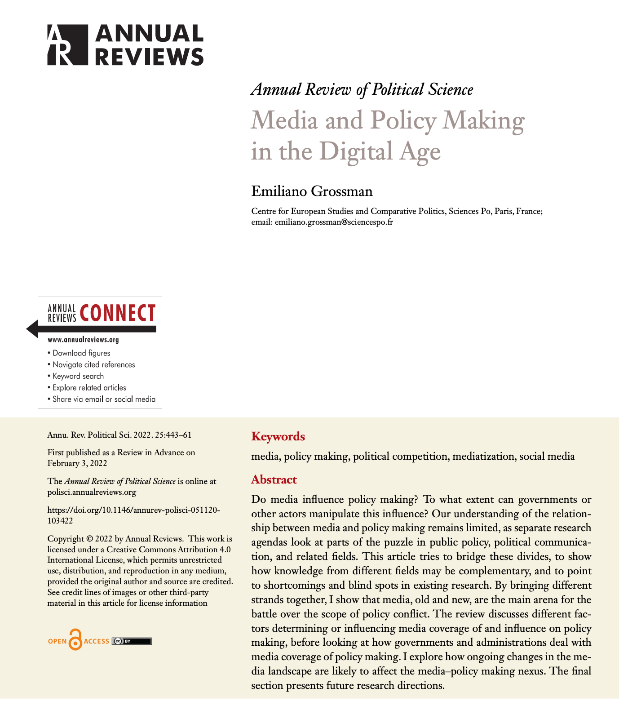
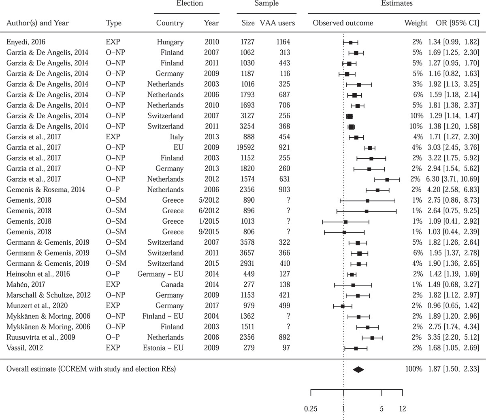

```{css, echo=FALSE} 
@media print { # print out incremental slides; see https://stackoverflow.com/questions/56373198/get-xaringan-incremental-animations-to-print-to-pdf/56374619#56374619
.has-continuation {
display: block !important;
}
}
```

```{r setup, include=FALSE}
# figures formatting setup
options(htmltools.dir.version = FALSE)
library(knitr)
opts_chunk$set(
  prompt = T,
  fig.align="center", #fig.width=6, fig.height=4.5, 
  # out.width="748px", #out.length="520.75px",
  dpi=300, #fig.path='Figs/',
  cache=T, #echo=F, warning=F, message=F
  engine.opts = list(bash = "-l")
)

## Next hook based on this SO answer: https://stackoverflow.com/a/39025054
knit_hooks$set(
  prompt = function(before, options, envir) {
    options(
      prompt = if (options$engine %in% c('sh','bash')) '$ ' else 'R> ',
      continue = if (options$engine %in% c('sh','bash')) '$ ' else '+ '
    )
  })

library(tidyverse)
library(hrbrthemes)
library(fontawesome)
library(RefManageR)

RefManageR::BibOptions(
  check.entries = FALSE,  
  bib.style = "authoryear", 
  cite.style = "authoryear", 
  style = "markdown",
  hyperlink = TRUE, 
  dashed = TRUE)

bib <-  RefManageR::ReadBib("grateful-refs.bib")


```

```{r setup-2, include=FALSE}
# figures formatting setup
options(htmltools.dir.version = FALSE)
library(knitr)
opts_chunk$set(
  comment = "  ",
  prompt = T,
  fig.align="center", #fig.width=6, fig.height=4.5, 
  # out.width="748px", #out.length="520.75px",
  dpi=300, #fig.path='Figs/',
  cache=F, #echo=F, warning=F, message=F
  engine.opts = list(bash = "-l")
  )

## Next hook based on this SO answer: https://stackoverflow.com/a/39025054
knit_hooks$set(
  prompt = function(before, options, envir) {
    options(
      prompt = if (options$engine %in% c('sh','bash')) '$ ' else 'R> ',
      continue = if (options$engine %in% c('sh','bash')) '$ ' else '+ '
      )
})

library(tidyverse)
library(nycflights13)
library(kableExtra)
```


# Table of contents

<br>

1. [The knowledge cummulation challenge](#aggregation-challenge)

2. [Overview of evidence synthesis](#evidence-synthesis)

4. [Narrative reviews: A primer](#narrative-reviews)

4. [Systematic reviews: A primer](#systematic-reviews)

5. [Meta-analysis: A primer](#meta-analysis)

6. [Evidence synthesis for policy](#es-in-policy)

6. [Coordinated trials](#coordinated-efforts)

---
class: midtext

# A show of hands!

### Raise your hand if you:

--
- have heard the terms narrative review, systematic review, or meta-analysis

--
- can define what a systematic review entails

--
- can explain the difference between a narrative review and a systematic review

--
- have ever conducted a systematic review or meta-analysis

--
- have combined evidence from multiple studies in your work

--
- have interpreted findings from a meta-analytic study

--
- have used evidence synthesis to inform policy decisions

--
- are familiar with the steps involved in conducting a systematic review

--
- have critiqued or evaluated a meta-analysis study

--
- have integrated findings from systematic reviews into policy recommendations

--
- have trained or guided others in evidence synthesis methodologies

--
- have read a systematic review or meta-analysis in the past six months

<!-- ############################################ -->
---
class: inverse, center, middle
name: aggregation-challenge

# The knowledge cummulation challenge

<html><div style='float:left'></div><hr color='#EB811B' size=1px style="width:1000px; margin:auto;"/></html>

---

# Macro-level questions, micro-level answers...


.pull-left-vsmall-3[
## Motivation

Understand whether freedom of the press fosters better government. 

## Evidence

Experiment that shows that voters are more likely to vote against politicians when they learn that the politicians are underperforming

<b style="color:#cc0065">What can you learn?</b>
]

.text-invisible[
.pull-left-vsmall-3[
## Motivation

Understand whether larger endowments of natural resources weaken state-society linkages. 

## Evidence

Experiment that shows that voters who are told that revenues are derived from natural resources – rather than taxes – exhibit less concern about government expenditures

<b style="color:#cc0065">What can you learn?</b>
]

.pull-left-vsmall-3[
## Motivation

Understand whether inter-ethnic violence is caused by residential segregation.

## Evidence

Experiment that shows that prejudice decreases among individuals exposed to higher levels of contact with out-group members.

<b style="color:#cc0065">What can you learn?</b>
]
]
<br><br><br>

`Source` `r Citep(bib, "humphreys2020aggregation", .opts = list(max.names = 2, longnamesfirst = FALSE))`

---

# Macro-level questions, micro-level answers...

.text-invisible[
.pull-left-vsmall-3[
## Motivation

Understand whether freedom of the press fosters better government. 

## Evidence

Experiment that shows that voters are more likely to vote against politicians when they learn that the politicians are underperforming

<b style="color:#cc0065">What can you learn?</b>
]
]

.pull-left-vsmall-3[
## Motivation

Understand whether larger endowments of natural resources weaken state-society linkages. 

## Evidence

Experiment that shows that voters who are told that revenues are derived from natural resources – rather than taxes – exhibit less concern about government expenditures

<b style="color:#cc0065">What can you learn?</b>
]

.text-invisible[
.pull-left-vsmall-3[
## Motivation

Understand whether inter-ethnic violence is caused by residential segregation.

## Evidence

Experiment that shows that prejudice decreases among individuals exposed to higher levels of contact with out-group members.

<b style="color:#cc0065">What can you learn?</b>
]
]

<br><br><br>

`Source` `r Citep(bib, "humphreys2020aggregation", .opts = list(max.names = 2, longnamesfirst = FALSE))`

---

# Macro-level questions, micro-level answers...

.text-invisible[
.pull-left-vsmall-3[
## Motivation

Understand whether freedom of the press fosters better government. 

## Evidence

Experiment that shows that voters are more likely to vote against politicians when they learn that the politicians are underperforming

<b style="color:#cc0065">What can you learn?</b>
]

.pull-left-vsmall-3[
## Motivation

Understand whether larger endowments of natural resources weaken state-society linkages. 

## Evidence

Experiment that shows that voters who are told that revenues are derived from natural resources – rather than taxes – exhibit less concern about government expenditures

<b style="color:#cc0065">What can you learn?</b>
]
]

.pull-left-vsmall-3[
## Motivation

Understand whether inter-ethnic violence is caused by residential segregation.

## Evidence

Experiment that shows that prejudice decreases among individuals exposed to higher levels of contact with out-group members.

<b style="color:#cc0065">What can you learn?</b>
]

<br><br><br>

`Source` `r Citep(bib, "humphreys2020aggregation", .opts = list(max.names = 2, longnamesfirst = FALSE))`

---

# Macro-level questions, micro-level answers... (cont.)

.pull-center[

.content-box-gray-wide[
## Challenge to knowledge cummulation
In all three cases, a .i-pink[macro-level question motivates the research, but the researcher has micro-level experimental evidence at hand]. The micro-level experiments seem to provide relevant evidence, but it is unclear what inferences to draw from this micro evidence for the macro questions.
]
]

--

## Challenges to studying the "macro"

- Suitable research designs
- Resource constraints
- Professional incentives (*one-time hitters problem*)
- ...

--

## Think of validity concerns from previous sessions

- Balance between the internally and externally valid...

---

# Causal decision-making and causal effect estimation...


<div align="center">

</div>
`Source` `r Citep(bib, "fernandez2022causal", .opts = list(max.names = 2, longnamesfirst = FALSE))`

---

# Defend the premise

<h2>Let's pick sides:</h2> Turn to the person right next to you. The person whose birthday is the closest to today will stand for .i-pink[Premise A].

--

.pull-left[

- <h2>Activity:</h2>  You have just been assigned to one of two premises to defend, regardless of your personal views. You will need to construct a coherent argument and anticipate counterarguments.

- **Argument Construction** (3 minutes)
    - A clear thesis statement. 
    - Three supporting points.
    - Acknowledgment of potential counterarguments and responses to them.

- **Discuss and try to convince each other** (7 minutes)

]


.pull-right[
<div align="center">
<br><br><br>

</div>

]

---

# Defend the premise

<h2>Let's pick sides:</h2> Turn to the person right next to you. The person whose birthday is the closest to today will stand for .i-pink[Premise A].


.pull-left[

- <h2>Activity:</h2>  You have just been assigned to one of two premises to defend, regardless of your personal views. You will need to construct a coherent argument and anticipate counterarguments.

- **Argument Construction** (3 minutes)
    - A clear thesis statement. 
    - Three supporting points.
    - Acknowledgment of potential counterarguments and responses to them.

- **Discuss and try to convince each other** (7 minutes)

]


.pull-right[
- <h2>Premise A:</h2> 
<br>Policymakers should focus on **what works**, prioritizing effective outcomes over understanding the underlying reasons.

<br>

- <h2>Premise B:</h2> 
<br>Policymakers should care about **why something works**, as understanding the underlying reasons can lead to more sustainable and adaptable policies.

]

<!-- ############################################ -->
---
class: inverse, center, middle
name: evidence-synthesis

# Overview of evidence synthesis

<html><div style='float:left'></div><hr color='#EB811B' size=1px style="width:1000px; margin:auto;"/></html>

---

# Evidence synthesis

<br>

.pull-left[

## Why should we care about evidence synthesis?

.text-invisible[- Evidence synthesis involves *combining information from multiple studies investigating the same topic* to comprehensively understand their findings. 
- It consists of converting scientific outputs - such as articles, reports and data - into **reliable** and **digestible evidence** that can inform management or policy.
- Synthesis can help determine the **current state of affairs** in a research field's conceptualization of an issue,  how **effective** a particular intervention is.
- It is very **popular** in evidence-based health practice.]

]

.pull-right[
<br>
<div align="center">
<br>

</div>
]

---

# Evidence synthesis

<br>

.pull-left[

## Why should we care about evidence synthesis?

- Evidence synthesis involves *combining information from multiple studies investigating the same topic* to comprehensively understand their findings. 
.text-invisible[- It consists of converting scientific outputs - such as articles, reports and data - into **reliable** and **digestible evidence** that can inform management or policy.
- Synthesis can help determine the **current state of affairs** in a research field's conceptualization of an issue,  how **effective** a particular intervention is.
- It is very **popular** in evidence-based health practice.]

]

.pull-right[
<br>
<div align="center">
<br>

</div>
]

---

# Evidence synthesis

<br>

.pull-left[

## Why should we care about evidence synthesis?

- Evidence synthesis involves *combining information from multiple studies investigating the same topic* to comprehensively understand their findings. 
- It consists of converting scientific outputs - such as articles, reports and data - into **reliable** and **digestible evidence** that can inform management or policy.
.text-invisible[- Synthesis can help determine the **current state of affairs** in a research field's conceptualization of an issue,  how **effective** a particular intervention is.
- It is very **popular** in evidence-based health practice.]

]

.pull-right[
<br>
<div align="center">
<br>

</div>
]

---

# Evidence synthesis

<br>

.pull-left[

## Why should we care about evidence synthesis?

- Evidence synthesis involves *combining information from multiple studies investigating the same topic* to comprehensively understand their findings. 
- It consists of converting scientific outputs - such as articles, reports and data - into **reliable** and **digestible evidence** that can inform management or policy.
- Synthesis can help determine the **current state of affairs** in a research field's conceptualization of an issue,  how **effective** a particular intervention is.
.text-invisible[- It is very **popular** in evidence-based health practice.]

]

.pull-right[
<br>
<div align="center">
<br>

</div>
]

---

# Evidence synthesis

<br>

.pull-left[

## Why should we care about evidence synthesis?

- Evidence synthesis involves *combining information from multiple studies investigating the same topic* to comprehensively understand their findings. 
- It consists of converting scientific outputs - such as articles, reports and data - into **reliable** and **digestible evidence** that can inform management or policy.
- Synthesis can help determine the **current state of affairs** in a research field's conceptualization of an issue,  how **effective** a particular intervention is.
- It is very **popular** in evidence-based health practice.

]

.pull-right[
<br>
<div align="center">
<br>

</div>
]

---

# Evidence synthesis (cont.)

<br>

.pull-left[

<br>
<div align="center">
<br>

</div>
]

.pull-right[

## Who can benefit from evidence synthesis?

.text-invisible[
- **Researchers and funders** who need information about the .i-pink[gaps] in the evidence, helping to direct future research efforts and funding priorities.
- **Policymakers and administrators** who need information to .i-pink[make decisions], ensuring policies are based on the *best available* evidence.
- **Policy practitioners** who need information about .i-pink[implementation], ensuring policies are effectively put into practice..
- **General public** who stand to benefit from **well-informed** policies that are designed to improve societal outcomes based on robust evidence.
]

]

---

# Evidence synthesis (cont.)

<br>

.pull-left[

<br>
<div align="center">
<br>

</div>
]

.pull-right[

## Who can benefit from evidence synthesis?


- **Researchers and funders** who need information about the .i-pink[gaps] in the evidence, helping to direct future research efforts and funding priorities.
.text-invisible[- **Policymakers and administrators** who need information to .i-pink[make decisions], ensuring policies are based on the *best available* evidence.
- **Policy practitioners** who need information about .i-pink[implementation], ensuring policies are effectively put into practice..
- **General public** who stand to benefit from **well-informed** policies that are designed to improve societal outcomes based on robust evidence.
]

]

---

# Evidence synthesis (cont.)

<br>

.pull-left[

<br>
<div align="center">
<br>

</div>
]

.pull-right[

## Who can benefit from evidence synthesis?


- **Researchers and funders** who need information about the .i-pink[gaps] in the evidence, helping to direct future research efforts and funding priorities.
- **Policymakers and administrators** who need information to .i-pink[make decisions], ensuring policies are based on the *best available* evidence.
.text-invisible[- **Policy practitioners** who need information about .i-pink[implementation], ensuring policies are effectively put into practice..
- **General public** who stand to benefit from **well-informed** policies that are designed to improve societal outcomes based on robust evidence.
]

]

---

# Evidence synthesis (cont.)

<br>

.pull-left[

<br>
<div align="center">
<br>

</div>
]

.pull-right[

## Who can benefit from evidence synthesis?


- **Researchers and funders** who need information about the .i-pink[gaps] in the evidence, helping to direct future research efforts and funding priorities.
- **Policymakers and administrators** who need information to .i-pink[make decisions], ensuring policies are based on the *best available* evidence.
- **Policy practitioners** who need information about .i-pink[implementation], ensuring policies are effectively put into practice..
.text-invisible[- **General public** who stand to benefit from **well-informed** policies that are designed to improve societal outcomes based on robust evidence.
]

]

---

# Evidence synthesis (cont.)

<br>

.pull-left[

<br>
<div align="center">
<br>

</div>
]

.pull-right[

## Who can benefit from evidence synthesis?


- **Researchers and funders** who need information about the .i-pink[gaps] in the evidence, helping to direct future research efforts and funding priorities.
- **Policymakers and administrators** who need information to .i-pink[make decisions], ensuring policies are based on the *best available* evidence.
- **Policy practitioners** who need information about .i-pink[implementation], ensuring policies are effectively put into practice..
- **General public** who stand to benefit from **well-informed** policies that are designed to improve societal outcomes based on robust evidence.

]

---

# Types of evidence synthesis

<br>
.pull-left[
## Narrative reviews

Summarize and interpret the literature on a particular topic.

- **Purpose:** To present a comprehensive overview and insights based on the author's expertise.
- **Strengths:**
    - Broad overview of the topic
    - Flexible and easy to consume
- **Limitations:**
    - Lack of reproducibility
    - Prone to author bias
]

.pull-right[
<div align="center">
<br>

</div>
`Source` `r Citep(bib, "grossman2022media", .opts = list(max.names = 1, longnamesfirst = FALSE))`
]

---

# Types of evidence synthesis

<br>

.pull-left[
## Systematic reviews

Uses a structured and predefined methodology to gather and analyze all relevant studies on a specific research question.

- **Purpose:** To minimize bias and provide high-quality evidence by synthesizing all available research.
- **Strengths:**
    - Comprehensive and transparent
    - Reproducible and less biased
- **Limitations:**
    - Resource-intensive
    - Subject to available materials (i.e., publication bias)
]


.pull-right[
<div align="center">
<br>

</div>
`Source` `r Citep(bib, "lorenz2023systematic", .opts = list(max.names = 1, longnamesfirst = FALSE))`
]

---

# Types of evidence synthesis

<br>
.pull-left[
## Meta-analyses

A type of systematic review that uses statistical methods to combine the results of multiple studies.

- **Purpose:** To increase statistical power and resolve uncertainties when individual studies disagree.
- **Strengths:**
    - Provides pooled estimates of effects
    - Identifies patterns and overall trends
- **Limitations:**
    - Requires high-quality data (Garbage-in/garbage-out)
    - Heterogeneity among studies can complicate analysis
]

.pull-right[
<div align="center">
<br>

</div>
`Source` `r Citep(bib, "munzert2021meta", .opts = list(max.names = 2, longnamesfirst = FALSE))`
]


<!-- ############################################ -->
---
class: inverse, center, middle
name: narrative-reviews

# Narrative reviews: A primer

<html><div style='float:left'></div><hr color='#EB811B' size=1px style="width:1000px; margin:auto;"/></html>

---

# Narrative review

.content-box-gray-wide[
## <b>What</b> is a narrative review?
A narrative review is a comprehensive, qualitative summary of research on a specific topic, typically based on a non-systematic search and selection of studies, providing a broader understanding through descriptive synthesis.
]

--

<br>

.pull-left[
## Key characteristics of a systematic review

- Broad .i-pink[topic scope] allowing for flexibility in including relevant studies
- Selective .i-pink[literature inclusion] based on the author’s expertise and perspective
- Focus on .i-pink[summarizing and synthesizing] existing knowledge rather than systematic data extraction
]

--

.pull-right[
<br>
- Emphasis on .i-pink[contextualizing findings] within a theoretical or conceptual framework
- Narrative .i-pink[discussion] that highlights trends, gaps, and inconsistencies in the literature
]


---


# Narrative review (cont.)


<div align="center">

</div>
`Source` `r Citep(bib, "grossman2022media", .opts = list(max.names = 1, longnamesfirst = FALSE))`

<!-- ############################################ -->

---
class: inverse, center, middle
name: systematic-reviews

# Systematic reviews: A primer

<html><div style='float:left'></div><hr color='#EB811B' size=1px style="width:1000px; margin:auto;"/></html>

---

# Systematic review

.content-box-gray-wide[
## <b>What</b> is a systematic review?
A review that is conducted according to clearly stated, scientific research methods, and is designed to minimize biases and errors inherent to traditional, narrative reviews.
]

--

<br>

.pull-left[
## Key characteristics of a systematic review

- Clearly stated .i-pink[objectives]
- Comprehensive .i-pink[search strategy] to retrieve relevant studies (both *published* and *unpublished*)
- Explicit criteria for the .i-pink[inclusion] or exclusion of the retrieved studies
]

--

.pull-right[
<br>
- Clear .i-pink[presentation of characteristics] of the studies included and an analysis of methodological quality
- Comprehensive overview of all studies excluded and .i-pink[justification for exclusion]
]

---


# Systematic review (cont.)


<div align="center">
<br>

</div>

---


# Systematic review (cont.)


<div align="center">

</div>
`Source` `r Citep(bib, "lorenz2023systematic", .opts = list(max.names = 1, longnamesfirst = FALSE))`

---

# Systematic review (cont.)


<div align="center">

</div>
`Source` `r Citep(bib, "lorenz2023systematic", .opts = list(max.names = 1, longnamesfirst = FALSE))`

---

# Systematic review (cont.)


<div align="center">

</div>
`Source` `r Citep(bib, "lorenz2023systematic", .opts = list(max.names = 1, longnamesfirst = FALSE))`


---

# Systematic review

.content-box-gray-wide[
## <b>What</b> is a systematic review?
A review that is conducted according to clearly stated, scientific research methods, and is designed to minimize biases and errors inherent to traditional, narrative reviews.
]

--

<br>


## Expected output from the systematic review

- **Comparison with Existing Literature**: How the findings align or contrast with previous research.

--
- **Implications for Research, Practice, and Policy**: Potential impact on practice, policy, or further research.

--
- **Synthesis of Findings**: Aggregated data from the studies, which may include quantitative data synthesis (meta-analysis) or qualitative synthesis.


<!-- ############################################ -->
---
class: inverse, center, middle
name: meta-analysis

# Meta-analyses: A primer

<html><div style='float:left'></div><hr color='#EB811B' size=1px style="width:1000px; margin:auto;"/></html>

---

# Meta-analyses

.content-box-gray-wide[
## <b>What</b> is a meta-analysis?
A particular flavor of systematic review, and statistical technique, conducted to combine the results of independent, but similar, studies to obtain an overall estimate of treatment effects.
]

--

<br>

## Important to consider

- **All meta-analyses** are based on a systematic review of the literature, but not all systematic reviews include a meta-analysis (i.e., the search strategy procedures align)

--
- During the process researchers need to consider the risk of missing unpublished studies, which might skew results (*File-drawer problem*)

--
- A big challenge for meta-analyses is the **standardization** of definitions of .i-pink[variables] and .i-pink[outcomes] across studies to ensure comparability

---

# Meta-analyses (cont.)


<div align="center">
<br>

</div>

---

# Meta-analyses (cont.)


<div align="center">

</div>
`Source` `r Citep(bib, "munzert2021meta", .opts = list(max.names = 2, longnamesfirst = FALSE))`

---

# Meta-analyses (cont.)

<div align="center">

</div>
`Source` `r Citep(bib, "munzert2021meta", .opts = list(max.names = 2, longnamesfirst = FALSE))`

---

# Meta-analyses (cont.)

<div align="center">

<h2 style="text-align:center">Aggregate effects</h2>
</div>
`Source` `r Citep(bib, "munzert2021meta", .opts = list(max.names = 2, longnamesfirst = FALSE))`

---

# Meta-analyses (cont.)

<div align="center">
<br><br><br>

<h2 style="text-align:center">Subgroup analyses <i>(nuance)</i></h2><br>
</div>
`Source` `r Citep(bib, "munzert2021meta", .opts = list(max.names = 2, longnamesfirst = FALSE))`


<!-- ############################################ -->
---
class: inverse, center, middle
name: es-in-policy

# Evidence synthesis for policy

<html><div style='float:left'></div><hr color='#EB811B' size=1px style="width:1000px; margin:auto;"/></html>

---
class: midtext

# Why evidence synthesis matters for policymakers?

<br><br><br>

.pull-left-vsmall[
## Informed<br>decision-making

- **Comprehensive Insights**: Provides a thorough understanding of what works, what doesn’t, and why.
- **Risk Reduction**: Minimizes the risk of implementing ineffective or harmful policies.

]

.text-invisible[
.pull-left-vsmall[
## Resource<br>optimization

- **Efficient Use of Funds**: Can help allocate resources to initiatives backed by strong evidence, ensuring cost-effectiveness.
- **Avoids Duplication**: Can help prevent redundancy by identifying already existing research and practices.
]


.pull-left-vsmall[
## Accountability and transparency

- **Evidence-Based Justifications**: Can offer a clear rationale for policy choices, enhancing credibility and public trust.
- **Clear Communication**: Facilitates transparent communication with stakeholders about the basis for decisions.
]


.pull-left-vsmall[
## Adaptive<br>policy-making

- **Stay Updated**: Keeps policymakers informed of the latest research and emerging trends.
- **Flexible Adjustments**: Allows for the modification of policies in response to new evidence.
]
]

---
class: midtext

# Why evidence synthesis matters for policymakers?

<br><br><br>

.text-invisible[
.pull-left-vsmall[
## Informed<br>decision-making

- **Comprehensive Insights**: Provides a thorough understanding of what works, what doesn’t, and why.
- **Risk Reduction**: Minimizes the risk of implementing ineffective or harmful policies.

]
]

.pull-left-vsmall[
## Resource<br>optimization

- **Efficient Use of Funds**: Can help allocate resources to initiatives backed by strong evidence, ensuring cost-effectiveness.
- **Avoids Duplication**: Can help prevent redundancy by identifying already existing research and practices.
]

.text-invisible[
.pull-left-vsmall[
## Accountability and transparency

- **Evidence-Based Justifications**: Can offer a clear rationale for policy choices, enhancing credibility and public trust.
- **Clear Communication**: Facilitates transparent communication with stakeholders about the basis for decisions.
]


.pull-left-vsmall[
## Adaptive<br>policy-making

- **Stay Updated**: Keeps policymakers informed of the latest research and emerging trends.
- **Flexible Adjustments**: Allows for the modification of policies in response to new evidence.
]
]
---
class: midtext

# Why evidence synthesis matters for policymakers?

<br><br><br>

.text-invisible[
.pull-left-vsmall[
## Informed<br>decision-making

- **Comprehensive Insights**: Provides a thorough understanding of what works, what doesn’t, and why.
- **Risk Reduction**: Minimizes the risk of implementing ineffective or harmful policies.

]

.pull-left-vsmall[
## Resource<br>optimization

- **Efficient Use of Funds**: Can help allocate resources to initiatives backed by strong evidence, ensuring cost-effectiveness.
- **Avoids Duplication**: Can help prevent redundancy by identifying already existing research and practices.
]
]

.pull-left-vsmall[
## Accountability and transparency

- **Evidence-Based Justifications**: Can offer a clear rationale for policy choices, enhancing credibility and public trust.
- **Clear Communication**: Facilitates transparent communication with stakeholders about the basis for decisions.
]


..text-invisible[
pull-left-vsmall[
## Adaptive<br>policy-making

- **Stay Updated**: Keeps policymakers informed of the latest research and emerging trends.
- **Flexible Adjustments**: Allows for the modification of policies in response to new evidence.
]
]
---
class: midtext

# Why evidence synthesis matters for policymakers?

<br><br><br>

.text-invisible[
.pull-left-vsmall[
## Informed<br>decision-making

- **Comprehensive Insights**: Provides a thorough understanding of what works, what doesn’t, and why.
- **Risk Reduction**: Minimizes the risk of implementing ineffective or harmful policies.

]

.pull-left-vsmall[
## Resource<br>optimization

- **Efficient Use of Funds**: Can help allocate resources to initiatives backed by strong evidence, ensuring cost-effectiveness.
- **Avoids Duplication**: Can help prevent redundancy by identifying already existing research and practices.
]


.pull-left-vsmall[
## Accountability and transparency

- **Evidence-Based Justifications**: Can offer a clear rationale for policy choices, enhancing credibility and public trust.
- **Clear Communication**: Facilitates transparent communication with stakeholders about the basis for decisions.
]
]

.pull-left-vsmall[
## Adaptive<br>policy-making

- **Stay Updated**: Keeps policymakers informed of the latest research and emerging trends.
- **Flexible Adjustments**: Allows for the modification of policies in response to new evidence.
]

---
class: midtext

# Why evidence synthesis matters for policymakers?

<br><br><br>

.pull-left-vsmall[
## Informed<br>decision-making

- **Comprehensive Insights**: Provides a thorough understanding of what works, what doesn’t, and why.
- **Risk Reduction**: Minimizes the risk of implementing ineffective or harmful policies.

]


.pull-left-vsmall[
## Resource<br>optimization

- **Efficient Use of Funds**: Can help allocate resources to initiatives backed by strong evidence, ensuring cost-effectiveness.
- **Avoids Duplication**: Can help prevent redundancy by identifying already existing research and practices.
]


.pull-left-vsmall[
## Accountability and transparency

- **Evidence-Based Justifications**: Can offer a clear rationale for policy choices, enhancing credibility and public trust.
- **Clear Communication**: Facilitates transparent communication with stakeholders about the basis for decisions.
]


.pull-left-vsmall[
## Adaptive<br>policy-making

- **Stay Updated**: Keeps policymakers informed of the latest research and emerging trends.
- **Flexible Adjustments**: Allows for the modification of policies in response to new evidence.
]


---

# In-house evidence synthesis: The German case

.pull-left-small[
<div align="center">
<br>

</div>
]

--

.pull-right-wide[

<br><br><br>

.content-box-gray-wide[

## History

The **Research Services in Parliament** (*WD*) was established in the early 1960s for legislative independence. It operates as a separate directorate within the Bundestag's administration.
  ]
]

---

# In-house evidence synthesis: The German case

.pull-left-small[
<div align="center">
<br>

</div>
]


.pull-right-wide[

<br><br><br>

.content-box-gray-wide[

## Roles and purpose

- **Service Providers**: Support Members of the Bundestag with academically sound information.
- **Knowledge Managers**: Ensure informed decision-making for legislation and government oversight.
  ]
]

---


# In-house evidence synthesis: The German case

.pull-left-small[
<div align="center">
<br>

</div>
]


.pull-right-wide[

<br><br>

.content-box-gray-wide[

## Principles

- **Audience specificity**: Tailor-made responses, from brief notes to in-depth studies.
- **Interdisciplinarity**: Addresses complex issues like energy policy through a multi-disciplinary approach.
- **Political Neutrality**: Non-partisan service, confidentiality maintained, equitable response to all members.
]
]

---


# In-house evidence synthesis: The German case

.pull-left-small[
<div align="center">
<br>

</div>
]


.pull-right-wide[

<br>

.content-box-gray-wide[

## Functions

- **On-Demand Research**: Custom research based on individual parliamentary requests and collaboration with external experts and institutions.
- **Proactive Briefings**: Produce dossiers on emerging political issues. As, well as making materials accessible via their public platforms.
- **Topical Term Series**: Popular among parliamentarians, educators, and journalists.
]
]

<!-- ############################################ -->

---


class: inverse, center, middle
name: coordinated-efforts

# Coordinated trials

<html><div style='float:left'></div><hr color='#EB811B' size=1px style="width:1000px; margin:auto;"/></html>

---


# Coordinated trials

.content-box-gray-wide[
## <b>What</b> are coordinated trials?
Coordinated trials involve multiple research sites working together under a common protocol to answer specific research questions, allowing for larger and more diverse study populations, and improving the generalizability of the findings.
]

--

<br>

.pull-left[
## Key characteristics of a coordinated trial

- Clearly defined .i-pink[research objectives] and hypotheses
- Standardized .i-pink[protocols and procedures] across all participating sites to ensure consistency
- Centralized .i-pink[coordination and management] to oversee the trial’s progress and ensure compliance
]

--

.pull-right[
- Rigorous .i-pink[data collection and analysis] methods to enhance data quality and reliability
- Effective .i-pink[communication and collaboration] among sites to address challenges and share findings
- Comprehensive .i-pink[reporting and dissemination] of results to contribute to the broader scientific community
]

---
class: midtext

# Community policing

.pull-left[
## The argument for it...

- **Collaborative Approach**: Emphasizes partnership between law enforcement agencies and the communities they serve.

- **Problem-Solving Orientation**: Focuses on identifying and addressing the root causes of crime and disorder.

- **Community Engagement**: Involves active participation of community members in crime prevention and public safety efforts.

- **Building Trust and Relationships**: Aims to foster trust, transparency, and mutual respect between police and community members.

- **Proactive Strategies**: Utilizes proactive strategies such as community outreach, problem-solving, and crime prevention initiatives.
]

.pull-right[
<div align="center">
<br><br><br><br>

</div>

]

--

## <span style="color:#cc0065">There is mixed evidence about this approach to policing with a large focus on U.S. based studies</span>

---

class: inverse, center, middle
name: qr-code
background-color: #FFFFFF


<div align="center">
<br>
<b style="color:#000000;">Let's take a couple of minutes to read this policy brief</b><br>

</div>

---

# Coordinated trials (cont.)

<div align="center">

</div>
`Source` `r Citep(bib, "blair2021community", .opts = list(max.names = 1, longnamesfirst = FALSE))`

---
class: inverse, center, middle
name: questions

# Questions?
<html><div style='float:left'></div><hr color='#EB811B' size=1px style="width:1000px; margin:auto;"/></html>
