```{css, echo=FALSE} 
@media print { # print out incremental slides; see https://stackoverflow.com/questions/56373198/get-xaringan-incremental-animations-to-print-to-pdf/56374619#56374619
.has-continuation {
display: block !important;
}
}
```

```{r setup, include=FALSE}
# figures formatting setup
options(htmltools.dir.version = FALSE)
library(knitr)
opts_chunk$set(
  prompt = T,
  fig.align="center", #fig.width=6, fig.height=4.5, 
  # out.width="748px", #out.length="520.75px",
  dpi=300, #fig.path='Figs/',
  cache=T, #echo=F, warning=F, message=F
  engine.opts = list(bash = "-l")
)

## Next hook based on this SO answer: https://stackoverflow.com/a/39025054
knit_hooks$set(
  prompt = function(before, options, envir) {
    options(
      prompt = if (options$engine %in% c('sh','bash')) '$ ' else 'R> ',
      continue = if (options$engine %in% c('sh','bash')) '$ ' else '+ '
    )
  })

library(tidyverse)
library(hrbrthemes)
library(fontawesome)
library(RefManageR)

RefManageR::BibOptions(
  check.entries = FALSE,  
  bib.style = "authoryear", 
  cite.style = "authoryear", 
  style = "markdown",
  hyperlink = TRUE, 
  dashed = TRUE)

bib <-  RefManageR::ReadBib("grateful-refs.bib")


```


# Table of contents

</br></br>

1. [Where do you get your evidence?](#whereevidence)

2. [How to look for evidence?](#lookfor)

3. [Evaluating what you've found](#assessevidence)

4. [AI tools for literature mapping](#ai-tools)

5. [How to manage your literature?](#managelit)

---

class: midtext

# A show of hands!

### Raise your hand if you:

- have experience conducting academic or policy research

--
- have used online databases to search for academic articles

--
- can define effective search strategies for literature reviews

--
- have evaluated the credibility and relevance of sources for your research

--
- are familiar with AI tools for literature mapping and evidence synthesis

--
- have used AI tools to enhance your research efficiency

--
- have compiled evidence from multiple sources for a research project

--
- have sorted and organized academic and policy evidence systematically

--
- have faced challenges in finding relevant research for your work

--
- have integrated findings from multiple studies into a coherent narrative

--
- have used bibliographic management software (e.g., Zotero, Mendeley)

--
- have taught or mentored others in research methodologies and best practices


---
class: inverse, center, middle
name: whereevidence

# Where do you get your evidence?
<html><div style='float:left'></div><hr color='#EB811B' size=1px style="width:1000px; margin:auto;"/></html>

---

# Why reviewing existing evidence matters

.pull-left[
<br>
## The Importance of Mapping the Literature

- **Comprehensive Understanding**: Mapping the literature provides a sharper picture of what research .i-pink[has already been done], helping to identify .i-pink[gaps] and .i-pink[avoid duplication].
- **Informed Decision-Making**: Access to a wide range of studies allows for more informed and evidence-based policy decisions.
- **Contextual Insights**: Understanding the .i-pink[historical and current trends] in the field can contextualize new findings within the broader landscape of knowledge.
]

.pull-right[
<div align="center">
<br><br>
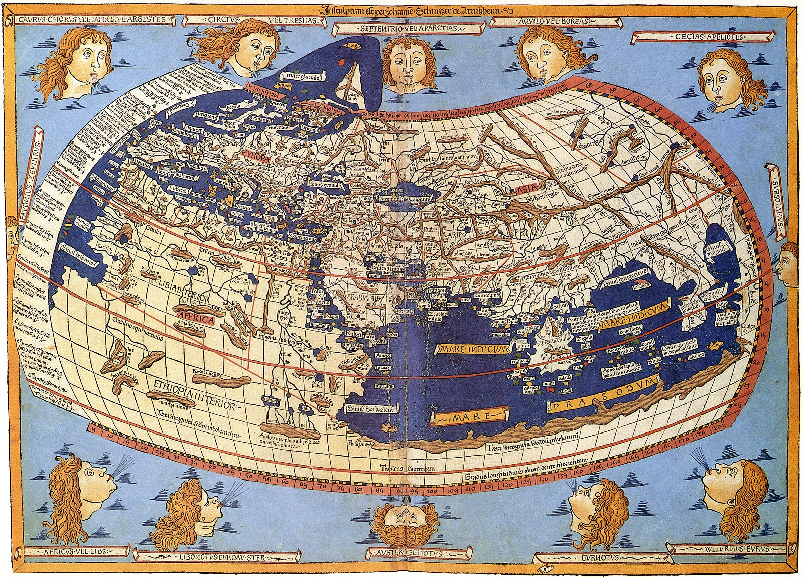
</div>
]

---

# Why reviewing existing evidence matters (cont.)
.pull-left[

## Knowledge Accumulation

- **Building on Previous Work**: Reviewing existing evidence helps in building upon prior research, .i-pink[ensuring continuity and progress] in the field.
- **Innovative Solutions**: By understanding what has worked (and what hasn’t) in the past, researchers and policymakers can .i-pink[develop more innovative and effective solutions].
- **Credibility, Certainty, and Rigor**: A thorough literature review can enhance your .i-pink[certainty about potential actions], as well as the credibility of your work, demonstrating a rigorous and methodical approach to research.

]

.pull-right[
<div align="center">
<br><br>

</div>
]

---

class: inverse, center, middle
name: databases

# Research Databases and Tools
<html><div style='float:left'></div><hr color='#EB811B' size=1px style="width:1000px; margin:auto;"/></html>

---

# Research databases

.pull-left[
<br>
## What is a Research Database?

A research database is an organized .i-pink[collection of sources, data, and references] to academic articles, books, reports, and other scholarly materials, typically accessible online.

- Purpose: Designed to help researchers (*and users in general*) locate and retrieve relevant information quickly and efficiently.

- Features: Often includes search functionalities, filters, and tools to refine and manage results.

]


.pull-right[
<div align="center">
<br><br>

</div>
]

---
class: midtext

# Scholarly publishing

.pull-left[
<div align="center">

</div>

## Traditional

- **Access**: 
    - Restricted to subscribers or institutional members.
- **Cost**: 
    - Often high subscription fees for institutions; individual articles can be expensive.
- **Reach**: 
    - Limited to those who can afford access or have institutional subscriptions.
- **Copyright**: 
    - Typically held by the publisher, with limited rights for authors to share their work.

]

--

.pull-right[
<div align="center">

</div>

## Open access

- **Access**: 
    - Free and unrestricted access to everyone.
- **Cost**: 
    - Often funded by author fees (Article Processing Charges, APCs) or institutional support.
- **Reach**: 
    - Wider audience including researchers, practitioners, and the general public.
- **Copyright**: 
    - Authors often retain copyright, with more freedom to share and distribute their work.
]

---
class: midtext

# Preprints and self-archiving

.pull-left[

## Preprints

Early versions of research papers .hlred[shared publicly before formal peer review].

- **Purpose**: Facilitate early dissemination of findings and foster feedback from the research community.
- **Platforms**: Common platforms include arXiv, OSF, Zenodo, and SSRN.
- **Benefits**:
    - Rapid Sharing: Accelerates the dissemination of research findings.
    - Community Feedback: Receives early input and suggestions from peers.
    - Visibility: Increases visibility and citation potential prior to formal publication.
- **Considerations**:
    - Quality Control: Lacks formal peer review initially.
    - Acceptance: Some journals may have policies regarding preprint submissions.
]

.pull-right[
<div align="center">
<br><br>
<br>
<br>

</div>

]

---

#  Overview of key databases

.pull-left-small[
<br><br><br>
- **Google Scholar** 
- JSTOR
- PubMed
- Scopus
- Web of Science
- OpenAlex
]

.pull-right-wide[
<div align="center">
<br>
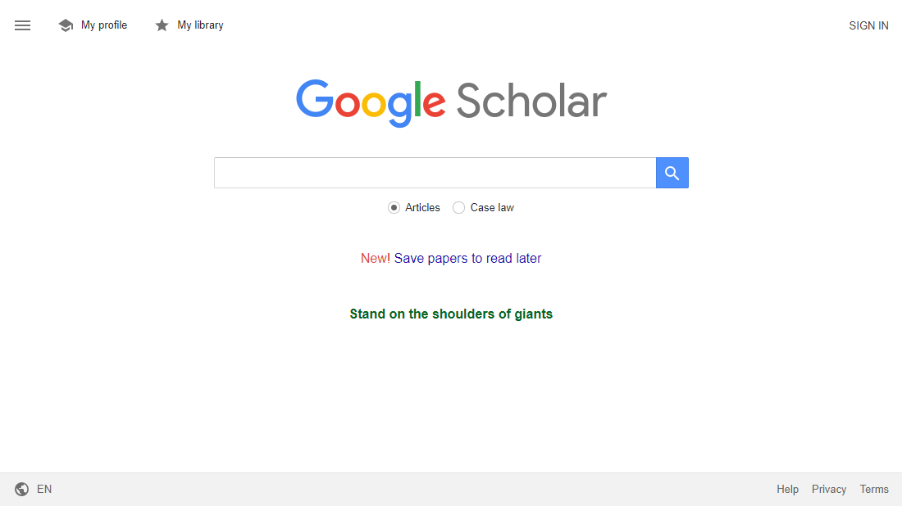
</div>

A freely accessible .i-pink[web search engine] that indexes the full text or metadata of .i-pink[scholarly literature] across an array of publishing formats and disciplines.
]

---

#  Overview of key databases

.pull-left-small[
<br><br><br>
- Google Scholar 
- **JSTOR**
- PubMed
- Scopus
- Web of Science
- OpenAlex
]

.pull-right-wide[
<div align="center">
<br>
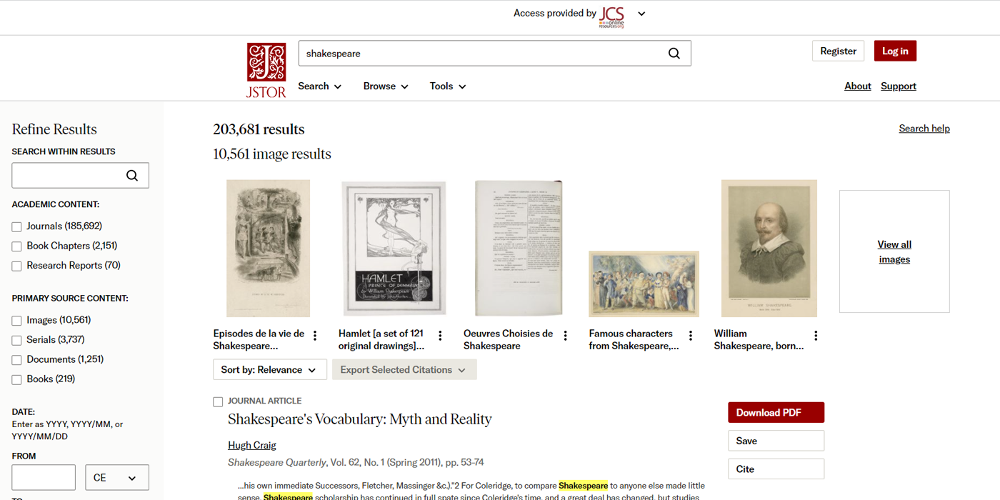
</div>

A .i-pink[subscription digital library] of academic journals, books, and primary sources, containing digitized back issues of academic journals in the .i-pink[humanities and social sciences].
]

---

#  Overview of key databases

.pull-left-small[
<br><br><br>
- Google Scholar 
- JSTOR
- **PubMed**
- Scopus
- Web of Science
- OpenAlex
]

.pull-right-wide[
<div align="center">
<br>
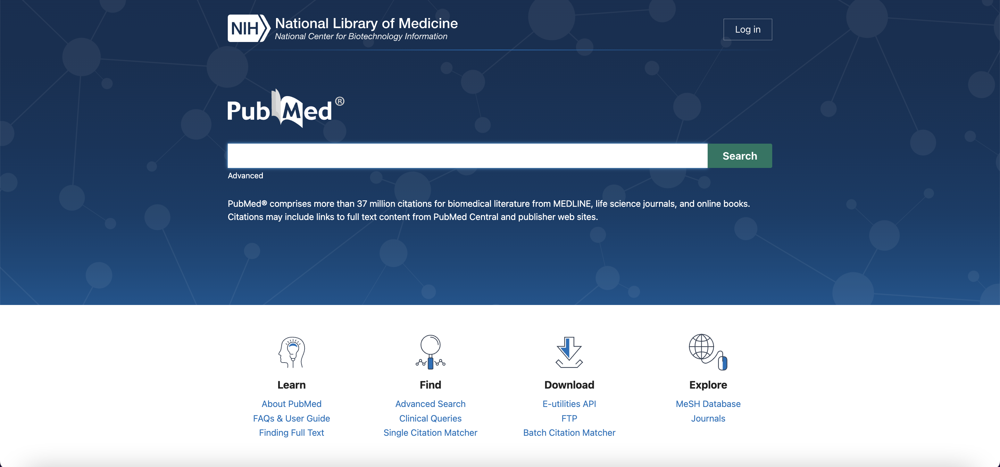
</div>

A .i-pink[free database] including primarily references and abstracts on .i-pink[life sciences and biomedical] topics maintained by The United States National Library of Medicine (NLM).
]

---

#  Overview of key databases

.pull-left-small[
<br><br><br>
- Google Scholar 
- JSTOR
- PubMed
- **Scopus**
- Web of Science
- OpenAlex
]

.pull-right-wide[
<div align="center">
<br>
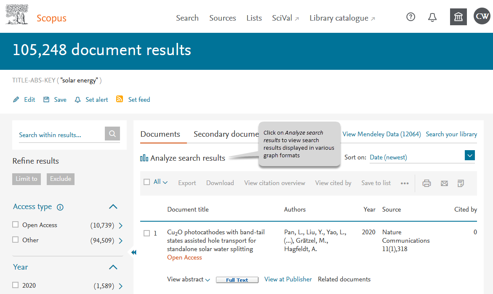
</div>
A .i-pink[subscription abstract and citation database] by the academic publisher Elsevier covering .i-pink[life, social, physical, and health sciences].
]

---

#  Overview of key databases

.pull-left-small[
<br><br><br>
- Google Scholar 
- JSTOR
- PubMed
- Scopus
- **Web of Science**
- OpenAlex
]

.pull-right-wide[
<div align="center">
<br>
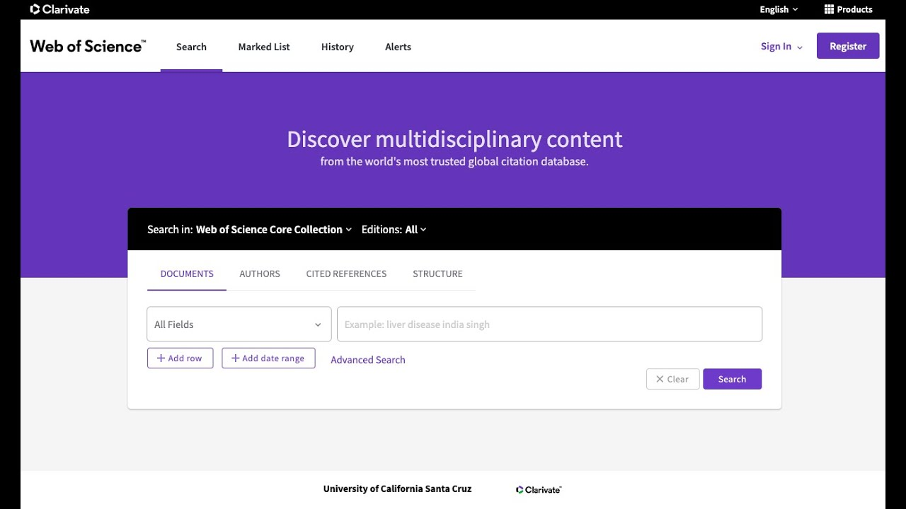
</div>
A .i-pink[paid-access platform] that provides access to multiple databases that provide reference and citation data from academic journals, conference proceedings, and other documents in .i-pink[various academic disciplines].
]

---

#  Overview of key databases

.pull-left-small[
<br><br><br>
- Google Scholar 
- JSTOR
- PubMed
- Scopus
- Web of Science
- **OpenAlex**
]


.pull-right-wide[
<br>
<div align="center">
<br>
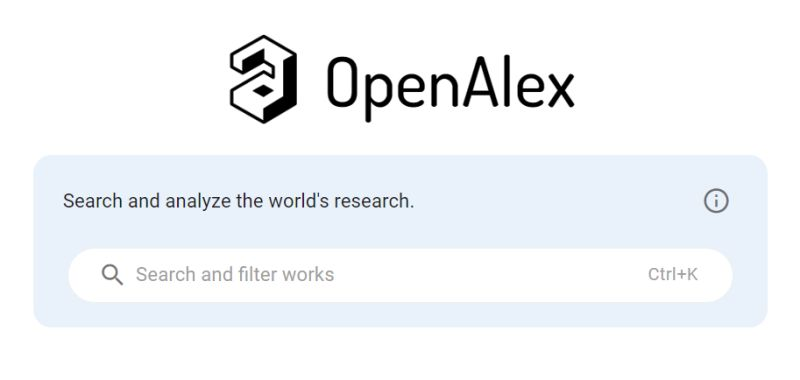
</div>
An .i-pink[open catalog] of publication sources, author information, and research topics. It also shows connections between these data points to provide a comprehensive, .i-pink[interlinked view of the global research system].
]


---

# Unpaywall

<div align="center">

</div>
[`You can download the Google Chrome extension`](https://unpaywall.org/products/extension)


---
class: midtext

# Overview of key <i>policy specific</i> databases

.pull-left-small[
<br>
## Overton

- Searchable database of policy documents, guidelines, think tank publications, and working papers.
- Data collected from 188 countries and over 1,000 sources.
- Parses documents to find references, people, and key concepts.
- Links content to news stories, academic research, and other policy outputs.
- Enables tracking of citations and mentions of your work.
- Helps identify real-world impact and influence of your ideas and reports.


]


.pull-right-wide[
<br>
<div align="center">
<br>
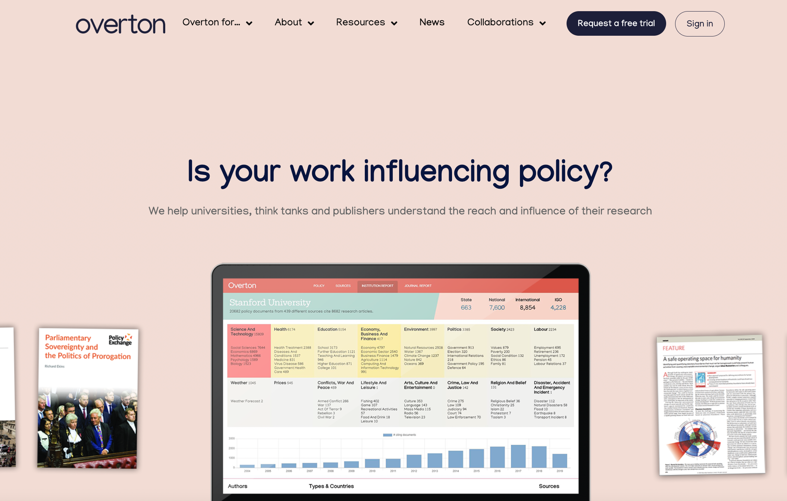
</div>
]

---
class: midtext

# Overview of key <i>policy specific</i> databases

.pull-left-small[
<br>
## Policy Commons

- Access exclusive reports from over 30,000 policy organizations, including overlooked small entities.
- Features documents from 210 countries, with unique content from the Global South.
- Includes 500,000 pages of "lost" research from 670+ inactive think tanks, adding 100,000 pages annually.
- Advanced search capabilities: phrase searching, Boolean operators, fielded searching, and NEAR searching.

]


.pull-right-wide[
<br>
<div align="center">
<br>
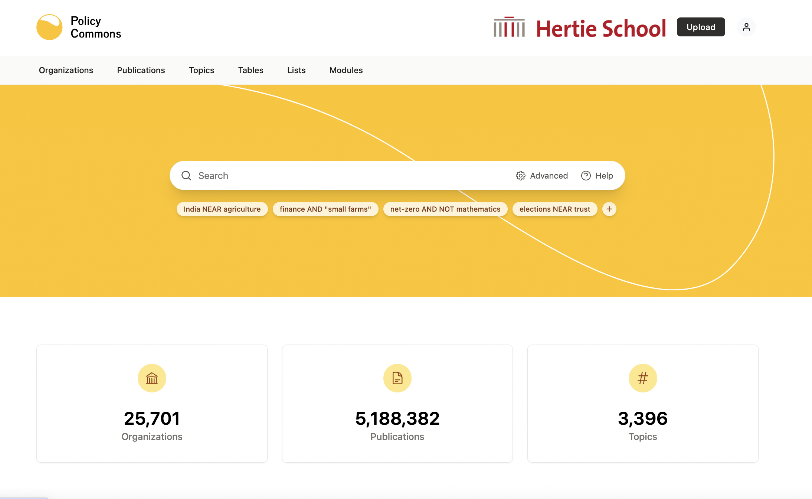
</div>
]

---
class: inverse, center, middle
name: lookfor

# How to look for evidence?
<html><div style='float:left'></div><hr color='#EB811B' size=1px style="width:1000px; margin:auto;"/></html>

---

# Defining what you're looking for

.hlred[The first step is to identify your search terms] (i.e., what you're looking for)

--

.pull-left[
- .hlblue[Identify your keywords]
    - Consider alternative keywords
    - Spelling and terminology variants
    - Subject specific terminology
    - Acronyms and abbreviations
    - Terminology change over time
    
- .hlblue[Identify experts and key contributors]
    - Who are the key thinkers, writers, and experts in your research area?
    - It may be worth including these names in your searches
    - Some background reading will be helpful
]

---

# Build a search query

.hlred[A next step is to combine your search terms] 

--

.pull-left[
- .hlblue[Boolean searches]
     - AND, OR and NOT operators
     - Grouping terms with parentheses `()`
     - Explicit search with quotation marks `""`
     
- .hlblue[Wildcards]
     - Truncate with an asterisk `?`
     - Greedy search with an asterisk `*`
     - Phrase search around quotation marks `""`


> red AND (automobile OR car)<br>red AND (auto* OR "race car")
]

.pull-right[
<br>
<div align="center">
<br><br>
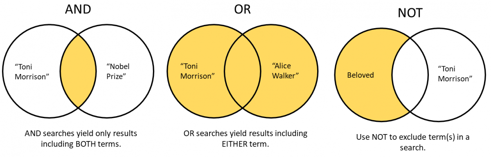
</div>
`Source`: [Duke University Libraries](https://library.duke.edu/using/catalog-search-tips/expert)
]

---

class: inverse, center, middle
name: search-cct
background-color: #FFFFFF


<b style="font-weight:bold;text-align:center;color:#2b7282;font-size:150%;">Let's collect some literature!</b><br><span style="text-align:center;color:#2b7282;font-size:150%;">Do a quick `Google Scholar` search for studies on the effects of conditional cash transfers on education)</span>
<html><div style='float:left'></div><hr color='#EB811B' size=1px style="width:1000px; margin:auto;"/></html>

---
class: inverse, center, middle
name: assessevidence

# Evaluating what you've found
<html><div style='float:left'></div><hr color='#EB811B' size=1px style="width:1000px; margin:auto;"/></html>

---
# Evaluating sources (cont.)

.pull-center[
Many librarians encourage the .i-pink[CRAAP test<sup>1</sup>] as a starting point to evaluate the suitability of the sources.
]

.footnote[<sup>1</sup> This is a simplification of a very complex evaluation process. We will think deeper about this next session.]

--

.pull-left[
<br><br>
- .hlred[Currency]: The **timeliness** of the information.
    - When was the information published or posted?
    - Has it been revised or updated?
    - Do you need the most current information for your topic?
]

.pull-right[
<div align="center">
<br><br>

</div>
]

---
# Evaluating sources (cont.)

.pull-center[
Many librarians encourage the .i-pink[CRAAP test<sup>1</sup>] as a starting point to evaluate the suitability of the sources.
]

.footnote[<sup>1</sup> This is a simplification of a very complex evaluation process. We will think deeper about this next session.]


.pull-left[
<br><br>
- .hlred[Relevance]: The **importance** of the information for **your needs**.
    - Does the information directly relate to your topic?
    - Does it help you answer questions?
    - Who is the intended audience?
]

.pull-right[
<div align="center">
<br><br>

</div>
]
---
# Evaluating sources (cont.)

.pull-center[
Many librarians encourage the .i-pink[CRAAP test<sup>1</sup>] as a starting point to evaluate the suitability of the sources.
]

.footnote[<sup>1</sup> This is a simplification of a very complex evaluation process. We will think deeper about this next session.]


.pull-left[
<br><br>
- .hlred[Authority]: The **source** of the information.
    - Who is the author or publisher?
    - Are they qualified to write about the topic?
    - “Peer reviewed” is a good indicator for this
]

.pull-right[
<div align="center">
<br><br>

</div>
]
---
# Evaluating sources (cont.)

.pull-center[
Many librarians encourage the .i-pink[CRAAP test<sup>1</sup>] as a starting point to evaluate the suitability of the sources.
]

.footnote[<sup>1</sup> This is a simplification of a very complex evaluation process. We will think deeper about this next session.]


.pull-left[
<br>
- .hlred[Accuracy]: The **reliability** and correctness of the information.
    - Is the information supported by evidence?
    - Can you verify the information with another source?
    - Has the information been reviewed or refereed?
    - Does the language seem unbiased and free of emotion?
    - Can you identify any spelling, grammar or typographical errors?

]

.pull-right[
<div align="center">
<br><br>

</div>
]

---
# Evaluating sources (cont.)

.pull-center[
Many librarians encourage the .i-pink[CRAAP test<sup>1</sup>] as a starting point to evaluate the suitability of the sources.
]

.footnote[<sup>1</sup> This is a simplification of a very complex evaluation process. We will think deeper about this next session.]


.pull-left[
<br>
- .hlred[Purpose]: The **reason** the information **exists**.
    - What is the purpose of the information?
    - Does the point of view appear objective and impartial?
    - Is the information fact, opinion or propaganda?
    - Are there political, ideological, cultural, religious, institutional or personal biases?
]

.pull-right[
<div align="center">
<br><br>

</div>
]
---

# Evaluating common non-academic sources in policy

.hlblue[Employing lateral reading], that is evaluating the credibility of a source by comparing it with other sources.

--

- .hlred[Verify the Source]: Determine the credibility of the organization or institution that published the document. Ask questions such as:
    - Who funds or sponsors the organization or think tank?
    - What is their reputation and track record in producing accurate and unbiased research?
    - Are there any known biases associated with the organization?
- .hlred[Check for Independent Analysis]: Look for analyses or critiques of the policy document from other reputable sources. Consider:
    - Are there other organizations or experts in the field who have reviewed or commented on the document?
    - Do they offer different perspectives or highlight any inconsistencies or shortcomings?
- .hlred[Evaluate Authorship and Expertise]: Assess the qualifications and expertise of the authors or researchers behind the document. Consider:
    - What are their credentials and affiliations?
    - Have they published other works in the field, and what is the reception of those works?
    - Are there any conflicts of interest that might influence their findings or conclusions?
    
---

# Evaluating common non-academic sources in policy (cont.)

.hlblue[Employing lateral reading], that is evaluating the credibility of a source by comparing it with other sources.

- .hlred[Weigh against Counterarguments]: Seek outcounterarguments to the policy proposals or recommendations presented in the document. Ask yourself:
    - How do other organizations or experts interpret the same data or evidence?
    - Are there dissenting opinions within the academic or policy community?
    - Do alternative analyses provide a more comprehensive understanding of the issue?
- .hlred[Cross-Reference with Established Facts]: Verify any factual claims or statistics cited in the document by consulting reliable sources or databases. Consider:
    - Are the data sources cited in the document reputable and up-to-date?
    - Do the findings align with established research or empirical evidence?
    - Have fact-checking organizations or experts reviewed the accuracy of the information?
    

---
class: inverse, center, middle
name: ai-tools

# AI tools for literature mapping
<html><div style='float:left'></div><hr color='#EB811B' size=1px style="width:1000px; margin:auto;"/></html>

---

# Introduction to AI Tools

.pull-left-small[
## Multitools
- .hlred[Chatbots] (ChatGPT, Gemini, Microsoft Copilot)

## Specific keys
- Open source apps (e.g., [citationchaser](https://estech.shinyapps.io/citationchaser/))
- Literature mapping tools (Elicit, Litmaps, Research Rabbit, Concensus, Scite)
]

.pull-right-wide[
<div align="center">
<br><br>
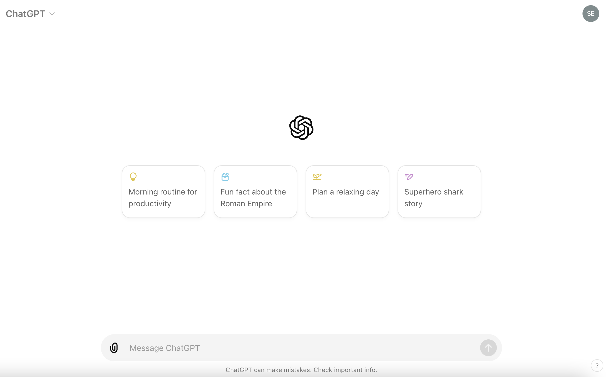
</div>
]

---


# Introduction to AI Tools

.pull-left-small[
## Multitools
- Chatbots (ChatGPT, Gemini, Microsoft Copilot)

## Specific keys
- .hlred[Open source apps] (e.g., [citationchaser](https://estech.shinyapps.io/citationchaser/))
- Literature mapping tools (Elicit, Litmaps, Research Rabbit, Concensus, Scite)
]

.pull-right-wide[
<div align="center">
<br><br>
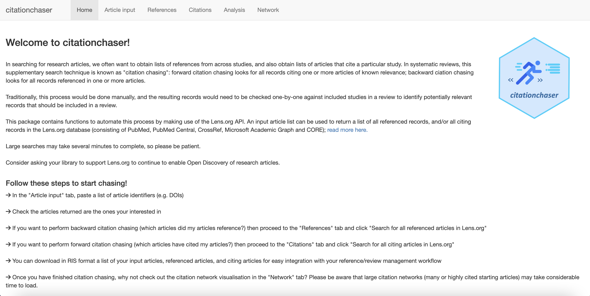
</div>
]

---


# Introduction to AI Tools

.pull-left-small[
## Multitools
- Chatbots (ChatGPT, Gemini, Microsoft Copilot)

## Specific keys
- Open source apps (e.g., [citationchaser](https://estech.shinyapps.io/citationchaser/))
- .hlred[Literature mapping tools] (Elicit, Litmaps, Research Rabbit, Concensus, Scite)
]

.pull-right-wide[
<div align="center">
<br>
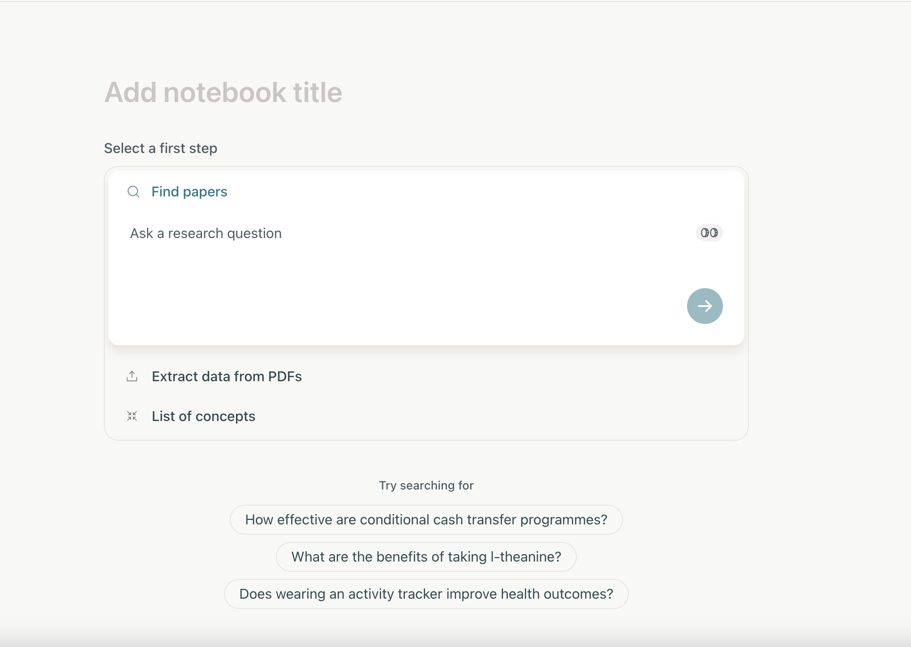
</div>
]

---

# Use with care

## Limitations of AI tools

- **Quality of Data Input:** AI tools heavily rely on the quality and relevance of the data inputted. If the initial data used to train the AI model is biased or incomplete, it can affect the accuracy of the results generated by the tool. (**Garbage in/garbage out**)

--
- **Limited Contextual Understanding:** AI tools may lack the ability to understand the broader context of a research topic or the specific needs of a policymaker. This can lead to oversights or inaccuracies in the synthesis of evidence.

--
- **Inability to Handle Ambiguity:** AI tools may struggle with ambiguity or uncertainty present in research literature. They may not effectively handle conflicting findings or nuanced interpretations, which are common in complex policy areas.

--
- **Risk of Overlooking Unconventional Sources:** AI tools often prioritize well-established sources and may overlook valuable insights from non-traditional or emerging sources of evidence, such as preprints, grey literature, or community reports.

--
- **Difficulty in Adapting to Rapidly Evolving Fields:** In fast-paced fields where new research emerges frequently, AI tools may struggle to keep pace with the latest developments and may not provide up-to-date synthesis of evidence.

---

# Use with care (cont.)

## Limitations of AI tools

- **Lack of Transparency:** Some AI algorithms operate as black boxes, meaning they lack transparency in how they arrive at their conclusions. This can make it challenging for users to understand and interpret the rationale behind the recommendations or results provided by the tool.

--
- **Dependency on Technical Skills:** Using AI tools often requires a certain level of technical proficiency, including understanding how to interpret and adjust algorithm parameters. This can create barriers for users who lack the necessary skills or training.

--
- **Cost and Accessibility:** Some AI-powered tools may come with significant costs or subscription fees, making them inaccessible to users with limited budgets or resources, particularly in resource-constrained settings.

--
- **Ethical Considerations:** AI tools may inadvertently perpetuate biases present in the data or algorithm design, leading to unintended consequences such as reinforcing existing disparities or overlooking marginalized voices.

--
- **Human Oversight and Validation Required:** Despite the automation provided by AI tools, human oversight and validation are still essential to ensure the accuracy, relevance, and ethical integrity of the synthesized evidence.

--
- .hlred[LLMs tend to hallucinate sources]

---

class: inverse, center, middle
name: managelit

# How to manage your literature?
<html><div style='float:left'></div><hr color='#EB811B' size=1px style="width:1000px; margin:auto;"/></html>

---
class: midtext

# Citation managers

.pull-center[
A software tool that helps researchers .hlred[collect, organize, cite, and share references] for academic writing and research projects.
]

--

## Functions

- .hlblue[Reference Collection]:
    - Save citations from databases, websites, and PDFs.
    - Import references from various sources.
- .hlblue[Organization]:
    - Create libraries and folders to categorize references.
    - Use tags and notes for better organization.
- .hlblue[Citation and Bibliography Generation]:
    - Automatically generate in-text citations and bibliographies in multiple citation styles (e.g., APA, MLA, Chicago).
    - Seamlessly integrate with word processors like Microsoft Word, Google Docs, and Overleaf.
- .hlblue[Collaboration]:
    - Share libraries with colleagues.
    - Collaborate on projects with group libraries.
- .hlblue[PDF Management]:
    - Store, annotate, and organize PDFs and other documents.

---
class: midtext

# Software recommendations

.pull-left-small[
## Zotero

Zotero is a free, open-source, citation manager.

- .mlblue[Web Browser Integration]: Save references directly from your web browser.
- .mlblue[PDF Management]: Annotate and organize PDFs.
- .mlblue[Tagging and Notes]: Use tags and notes to organize and comment on your references.
- .mlblue[Group Libraries]: Collaborate with others by sharing references in group libraries.
- .mlblue[Citation Styles]: Supports thousands of citation styles for generating bibliographies.


]

.pull-right-wide[
<div align="center">
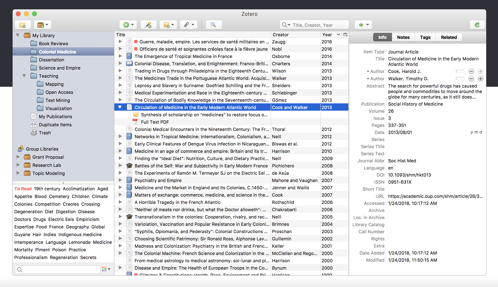
</div>

## Other solutions

- Mendeley, EndNote, RefWorks, Citavi
]

---

class: inverse, center, middle
name: questions

# Questions?
<html><div style='float:left'></div><hr color='#EB811B' size=1px style="width:1000px; margin:auto;"/></html>