```{css, echo=FALSE} 
@media print { # print out incremental slides; see https://stackoverflow.com/questions/56373198/get-xaringan-incremental-animations-to-print-to-pdf/56374619#56374619
.has-continuation {
display: block !important;
}
}
```

```{r setup, include=FALSE}
# figures formatting setup
options(htmltools.dir.version = FALSE)
library(knitr)
opts_chunk$set(
  prompt = T,
  fig.align="center", #fig.width=6, fig.height=4.5, 
  # out.width="748px", #out.length="520.75px",
  dpi=300, #fig.path='Figs/',
  cache=T, #echo=F, warning=F, message=F
  engine.opts = list(bash = "-l")
)

## Next hook based on this SO answer: https://stackoverflow.com/a/39025054
knit_hooks$set(
  prompt = function(before, options, envir) {
    options(
      prompt = if (options$engine %in% c('sh','bash')) '$ ' else 'R> ',
      continue = if (options$engine %in% c('sh','bash')) '$ ' else '+ '
    )
  })

library(tidyverse)
library(hrbrthemes)
library(fontawesome)
library(RefManageR)

RefManageR::BibOptions(
  check.entries = FALSE,  
  bib.style = "authoryear", 
  cite.style = "authoryear", 
  style = "markdown",
  hyperlink = TRUE, 
  dashed = TRUE)

bib <-  RefManageR::ReadBib("grateful-refs.bib")


```

```{r setup-2, include=FALSE}
# figures formatting setup
options(htmltools.dir.version = FALSE)
library(knitr)
opts_chunk$set(
  comment = "  ",
  prompt = T,
  fig.align="center", #fig.width=6, fig.height=4.5, 
  # out.width="748px", #out.length="520.75px",
  dpi=300, #fig.path='Figs/',
  cache=F, #echo=F, warning=F, message=F
  engine.opts = list(bash = "-l")
  )

## Next hook based on this SO answer: https://stackoverflow.com/a/39025054
knit_hooks$set(
  prompt = function(before, options, envir) {
    options(
      prompt = if (options$engine %in% c('sh','bash')) '$ ' else 'R> ',
      continue = if (options$engine %in% c('sh','bash')) '$ ' else '+ '
      )
})

library(tidyverse)
library(nycflights13)
library(kableExtra)
```


# Table of contents

<br>

1. [Why data visualization?](#whyviz)

2. [Data visualization as a method](#method)

3. [Ingredients of data visualization](#plotingredients)<sup>1</sup>

4. [Types of data visualization](#plottypes)

4. [Data visualization in policy](#whydatavizpolicy)

.footnote[<sup>1</sup> This section draws on materials from Claus Wilke's excellent book [*Fundamentals of Data Visualization*](https://clauswilke.com/dataviz/).]

---


background-image: url("../pics/d5-s1-georgia-raw.png")
background-size: contain
background-color: #000000

# Any ideas?

---


background-image: url("../pics/d5-s1-georgia-map.png")
background-size: contain
background-color: #000000

# How about now?


<!-- ############################################ -->
---
class: inverse, center, middle
name: whyviz

# Why data visualization?

<html><div style='float:left'></div><hr color='#EB811B' size=1px style="width:1000px; margin:auto;"/></html>


---
# Why data visualization?

.pull-left[

### A new method for the policy toolbox

- Data visualization is a method for **making sense** (<i style="color:#cc0065">and not just pictures</i>) of data.
- Note that this is more than data visualization in the narrow sense, i.e. the act of <i style="color:#cc0065">encoding quantitative information</i> in visual objects.
- Decision-makers are mostly interested in <i style="color:#cc0065">patterns</i>, not individual and exact values.
- Two ways to make sense of quantitative information:

<div align="center">

</div>
]

--

.pull-right[

### The case for visualization

- Visualization **provides useful summaries** for large, complicated data sets – in fact, the utility of visualization increases with data size.
- Visualization **lets you see things** that would otherwise be invisible, in particular relationships among data (patterns, trends, exceptions). 
- Visualization comes with **little or no assumptions** about the nature of the data.
- Visualization facilitates interaction between researcher and data – **it’s a hypothesis generating device**.

<i> "The critical question is how best to transform the data into something that people can understand for optimal decision making." </i>
[Colin Ware, 2013](https://books.google.de/books?id=qFmS95vf6H8C&pg=PA5)
]


---
# 1854 Broad Street cholera outbreak

.pull-left[
<div align="center">
<br>

</div>
]

--

.pull-right[
- One of the most famous data viusalizations of all times: [John Snow](https://en.wikipedia.org/wiki/John_Snow)'s cholera case map.
- The [Broad Street cholera outbreak](https://en.wikipedia.org/wiki/1854_Broad_Street_cholera_outbreak) in in Soho, London in 1854 was studied by physician John Snow to study its causes (rival hypotheses: germ-contaminated water vs. airborne transmission).
- The germ theory was not established at this point but the map helped highlight how cases clustered around a contaminated pump (which was by far not the only source of contaminated water though).
- Fun fact: this is what doing good data viz gives you:

<div align="center">

</div>
]


---
# Graphs vs. tables I: model estimates

.pull-left[
<div align="center">
<br>

</div>
]

--

.pull-right[
<div align="center">
<br>
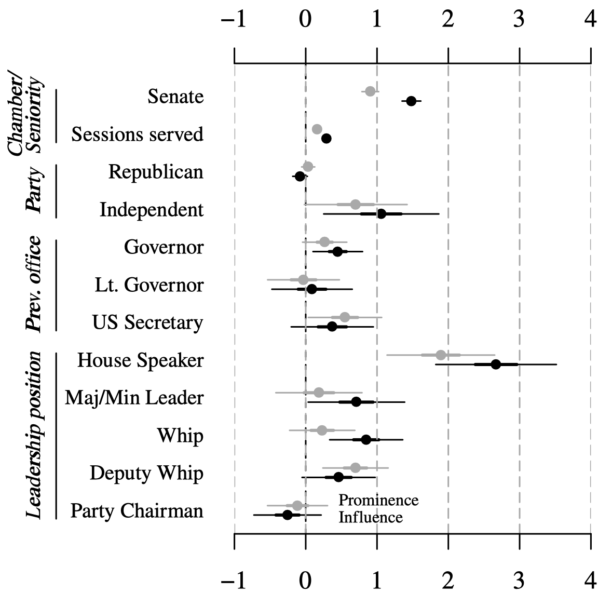
</div>
]


---
# Graphs vs. tables II: amounts

<div align="center">
<br>
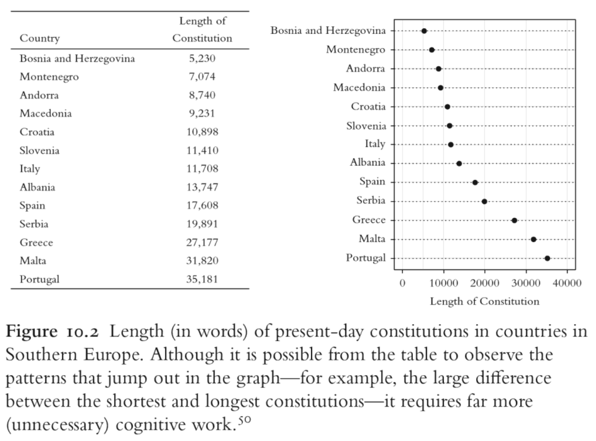
</div>


---
# Graphs vs. tables III: relationships

.pull-left[
- The table on the right comprises data sets I through IV, each consisting of eleven $(x,y)$ points.
- .hlred[Carefully study the table]. How do $x$ and $y$ as well as their relationship compare across datasets?
]

.pull-right[
<br>
<div align="center">

</div>
]

---
# Graphs vs. tables III: relationships (cont.)

.pull-left[
- The table on the right comprises data sets I through IV, each consisting of eleven $(x,y)$ points.
- .hlred[Carefully study the table]. How do $x$ and $y$ as well as their relationship compare across datasets?
- It shows that all the data sets have nearly identical simple descriptive statistics in terms of mean, standard deviation, correlation, and linear fit!
]

.pull-right[
<br>
<div align="center">

</div>
]

---
# Graphs vs. tables III: relationships (cont.)

.pull-left[
- The table on the right comprises data sets I through IV, each consisting of eleven $(x,y)$ points.
- .hlred[Carefully study the table]. How do $x$ and $y$ as well as their relationship compare across datasets?
- It shows that all the data sets have nearly identical simple descriptive statistics in terms of mean, standard deviation, correlation, and linear fit!
- .hlred[Plotting the data reveals wildly different distributions], countering the impression that "numerical calculations are exact, but graphs are rough" ([Anscombe 1973](https://www.tandfonline.com/doi/abs/10.1080/00031305.1973.10478966)).
- Graphs 3, Tables 0. Case closed.<sup>1</sup>

.footnote[<sup>1</sup> That being said, there is a case to be made for tables under certain circumstances. But even tables can (and should) be seen as another form for visualization with clear design principles. To design appealing tables with R, check out the [`gt` package](https://gt.rstudio.com/) together with [`gtExtras`](https://jthomasmock.github.io/gtExtras/).
]
]

.pull-right[
<br>
<div align="center">

</div>
]


<!-- ############################################ -->
---
class: inverse, center, middle
name: method

# Data visualization as a method

<html><div style='float:left'></div><hr color='#EB811B' size=1px style="width:1000px; margin:auto;"/></html>


---
# Different goals, different looks


.pull-left[
## Exploratory visualization

- "Analytic plots"
- Mostly for ourselves
- Often quick and dirty

### Goals

- What's in the data?
- Get a sense of size and complexity of data.
- Explore and interact.
- "Forces us to notice what we never expected to see" (Tukey 1977)
]

--

.pull-right[
## Explanatory visualization

- "Presentation plots"
- For others after the research is completed
- Few, carefully crafted, attractive graphs

### Goals

- Communicate content of data.
- Tell a story with data.
- Attract attention and interest.
- "Forces readers to see the information the designer wanted to convey" (Kosslyn 1994)
]

---
# Different goals, different looks (cont.)

.pull-left[
## Exploratory visualization

<div align="center">
<br>
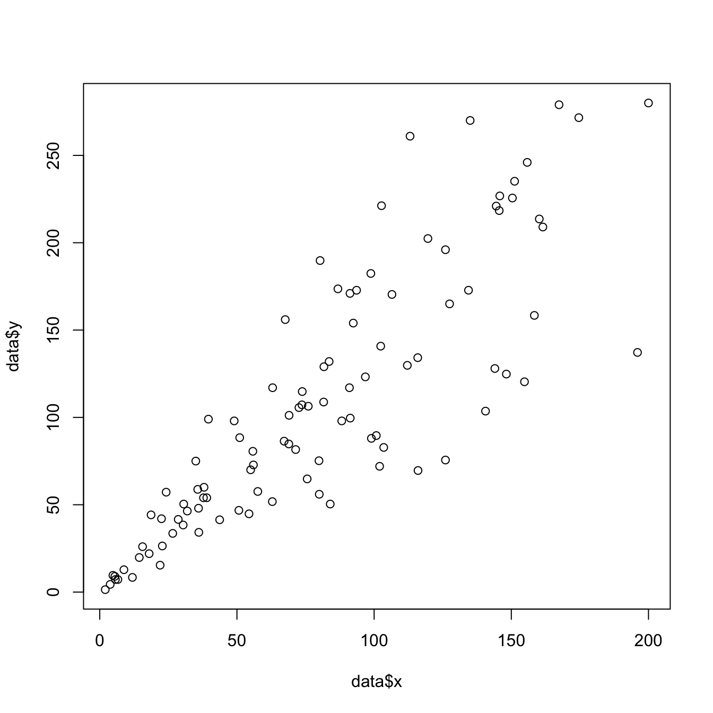
</div>
]

.pull-right[
## Explanatory visualization

<div align="center">
<br>
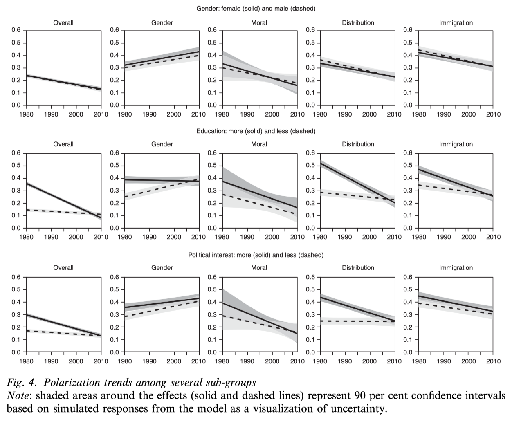
</div>
]


---
# The handcraft of visualization

.pull-left[
### A tool for comparison

- "The fundamental analytical act in statistical reasoning is to answer the question 'compared to what?'
- Whether we are evaluating changes over space or time, searching big data bases, adjusting and controlling for variables, designing experiments, specifying multiple regressions, or doing just about any kind of evidence-based reasoning, the essential point is to make intelligent and appropriate comparisons.
- Thus visual displays, if they are to assist thinking, should show comparisons."

<div align="right">
Edward Tufte, <a href="http://atc.berkeley.edu/201/readings/Tufte_BE_2006.pdf">Beautiful Evidence</a>, p.127.
</div>
]

--

.pull-right[
### Visualization as an iterative process

- The choice of the .i-pink[right graphical format ultimately depends on the task] or problem it is trying to solve.
- Always .i-pink[try different graphical formats] on the same data – they may reveal different aspects.
- Constructing visualizations is almost always an .hlred[iterative process] – the first graph is rarely also the final one.

<div align="center">

</div>
]


---
# Plotting as an iterative process

<div align="center">

</div>
`Credit and code` [Cedric Scherer](https://www.cedricscherer.com/2019/05/17/the-evolution-of-a-ggplot-ep.-1/)


---
# Visualization in the data science workflow

.pull-left[
Data visualization is a key skill for communicating insights from data. It is relevant in every step of the workflow.
]

.pull-right[

<div align="center">
<br>

</div>
]

---
# Visualization in the data science workflow

.pull-left[
Data visualization is a key skill for communicating insights from data. It is relevant in every step of the workflow.

**Wrangle**
- Sanity checks
- Identification of outliers
- Guidance of recoding operations
]

.pull-right[

<div align="center">
<br>

</div>
]

---
# Visualization in the data science workflow

.pull-left[
Data visualization is a key skill for communicating insights from data. It is relevant in every step of the workflow.

**Wrangle**
- Sanity checks
- Identification of outliers
- Guidance of recoding operations
]

.pull-right[

<div align="center">
<br>

</div>

<div align="center">
<br>
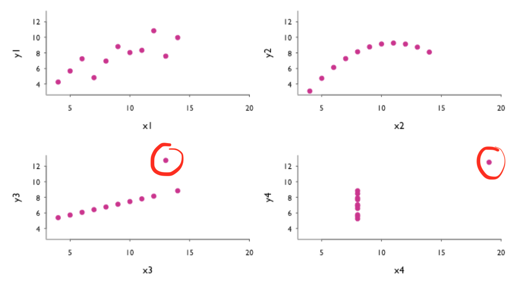
</div>
<div align="center" style="font-size:16px;">
Scatter plots to identify outliers in bivariate relationships.
</div>
]


---
# Visualization in the data science workflow

.pull-left[
Data visualization is a key skill for communicating insights from data. It is relevant in every step of the workflow.

**Wrangle**
- Sanity checks
- Identification of outliers
- Guidance of recoding operations

**Explore**
- Summarize distributions
- Discover patterns, relationships
]

.pull-right[

<div align="center">
<br>

</div>

]


---
# Visualization in the data science workflow

.pull-left[
Data visualization is a key skill for communicating insights from data. It is relevant in every step of the workflow.

**Wrangle**
- Sanity checks
- Identification of outliers
- Guidance of recoding operations

**Explore**
- Summarize distributions
- Discover patterns, relationships
]

.pull-right[

<div align="center">
<br>

</div>

<div align="center">
<br>

</div>
<div align="center" style="font-size:16px;">
Correlogram to visualize amount of association <br> between pairs of variables
</div>
]


---
# Visualization in the data science workflow (cont.)

.pull-left[
Data visualization is a key skill for communicating insights from data. It is relevant in every step of the workflow.

**Model**
- Test hypotheses
- Summarize (multiple) model estimates
- Visualize uncertainty
- Report robustness/sensitivity analyses
]

.pull-right[

<div align="center">
<br>

</div>

]

---
# Visualization in the data science workflow (cont.)

.pull-left[
Data visualization is a key skill for communicating insights from data. It is relevant in every step of the workflow.

**Model**
- Test hypotheses
- Summarize (multiple) model estimates
- Visualize uncertainty
- Report robustness/sensitivity analyses
]

.pull-right[

<div align="center">
<br>

</div>

<div align="center">
<br>

</div>
<div align="center" style="font-size:16px;">
Raw data and trend line with confidence bands<br>to visualize uncertainty of fit</div>
]

---
# Visualization in the data science workflow (cont.)

.pull-left[
Data visualization is a key skill for communicating insights from data. It is relevant in every step of the workflow.

**Model**
- Test hypotheses
- Summarize (multiple) model estimates
- Visualize uncertainty
- Report robustness/sensitivity analyses

**Communicate**
- Present raw/cooked data
- Present implications of model results
]

.pull-right[

<div align="center">
<br>

</div>

]


---
# Visualization in the data science workflow (cont.)

.pull-left[
Data visualization is a key skill for communicating insights from data. It is relevant in every step of the workflow.

**Model**
- Test hypotheses
- Summarize (multiple) model estimates
- Visualize uncertainty
- Report robustness/sensitivity analyses

**Communicate**
- Present raw/cooked data
- Present implications of model results
]

.pull-right[

<div align="center">
<br>

</div>

<div align="center">
<br>

</div>
<div align="center" style="font-size:16px;">
Choropleth map illustrating the location of civilian airfields in the German Empire, 1932. Administrative counties are shaded according to their centroid's distance to the closest airfield</div>
]


---
# Visual inference


.pull-right-small[
<div align="center">
<br>

<br>

</div>
]

--

.pull-left-wide[

### Human talent and weakness

- Humans are extremely good at recognizing patterns.
- At the same time, humans are also extremely good at inferring patterns when there are none (tendency to see patterns in random data = ".hlblue[apophenia]").
- This is somewhat linked to the fact that our species is bad at dealing with probability and randomness.

### Concerns with exploratory data analysis

- A concern that frequently arises with exploratory analysis is that it lacks the rigor of formal tests in confirmatory analysis or conventional statistical inference.
- Long-standing reservations against visualization as merely "informal" approach to data analysis and the fear that beautiful pictures may in fact not correspond to any meaningful patterns of substantive scientific interest.
]

---
# Visual inference (cont.)

.pull-left[
### Overcoming the exploratory vs. confirmatory visualization divide

- Graphical displays are implicit or explicit comparisons to a reference distribution or baseline model.
- If we discover an interesting pattern in data, this usually means that it looks different from what we expected.
- We usually have implicit models in our mind to which we compare the data ("What do we expect to see?").
- We can make these models explicit and use them to guard against "false discoveries".
- Visual discoveries correspond to the implicit or explicit rejection of null hypotheses ([Buja et al. 2009](https://royalsocietypublishing.org/doi/full/10.1098/rsta.2009.0120)).
]

.pull-right[
### Visual inference as an analogue to null hypothesis significance testing

The basic principle of formal testing remains the same in visual inference – with the exception that the test statistic is now a graphical display which is compared to a "reference distribution" of plots showing the null:

<div align="center">
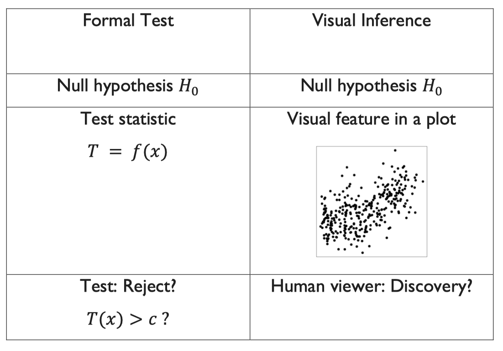
</div>
]


---
# Visual inference: the line-up protocol

This method is called "after the 'police lineup' of criminal investigations [...], because it asks the witness to identify the plot of the real data from among a set of decoys, the null plots, under the veil of ignorance" ([Buja et al. 2009](https://royalsocietypublishing.org/doi/full/10.1098/rsta.2009.0120)).

The visual hypothesis test involves the following steps:

  1. Simulate data to create $m-1$ null plots.
  2. Randomly place the plot of the real data among them, resulting in a total of $m$ plots.
  3. Ask a human viewer to choose the plot that looks the most different from the rest.
  4. If the test person succeeds and picks the plot showing the actual data, then this visual discovery can be assigned a p-value of $1/m$. In other words, the probability of picking the true plot just by chance is $1/m$.

---
# Visual inference: which plot stands out?

<div align="center">

</div>


---
# Visual inference: which plot stands out?

<div align="center">
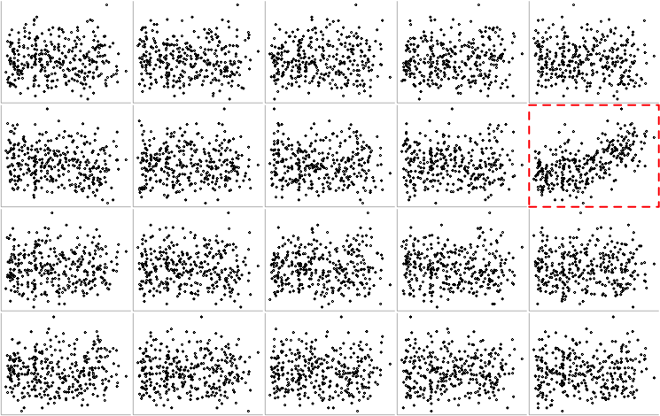
</div>


---
# Visual inference: which plot stands out?

<div align="center">
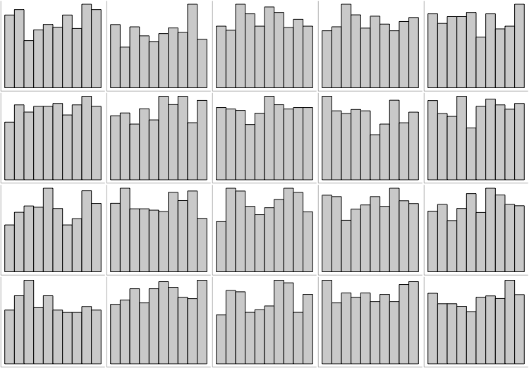
</div>

---
# None! All just show random uniform distributions.

<div align="center">

</div>


<!-- ############################################ -->
---
class: inverse, center, middle
name: plotingredients

# Ingredients of data visualization

<html><div style='float:left'></div><hr color='#EB811B' size=1px style="width:1000px; margin:auto;"/></html>


---
# Mapping data onto aesthetics

- Whenever we visualize data, we .i-pink[take data values and convert them] in a systematic and logical way into the visual elements that make up the final graphic.

--
- Even though there are many .i-pink[different types of data visualizations], all these visualizations can be described with a .i-pink[common language].

--
- All data visualizations map data values into **quantifiable features** of the resulting graphic. We refer to these features as .hlred[aesthetics].
- Key aesthetics are:

--
<div align="center">

</div>

--
- All **aesthetics fall into one of two groups**: Those that can represent continuous data (e.g., position, size, color) and those that can not (e.g., shape, line type).


---
# Coordinate systems and axes

.pull-left-wide[
- .hlred[Positions of data values matter]. Usually, we need two position scales (x and y axis of the plot).
- The combination of a set of position scales and their relative geometric arrangement is called a **coordinate system**.
- Often we have two axes representing two different **units**. 
- In a **Cartesian** coordinate system, the grid lines along an axis are spaced evenly both in data units and in the resulting visualization.
- There are scenarios where nonlinear scales are preferred. In a nonlinear scale, even spacing in data units corresponds to uneven spacing in the visualization (e.g., log scales).
- Be sure to .hlblue[label axes properly]!
]

.pull-right-small[
<div align="center">

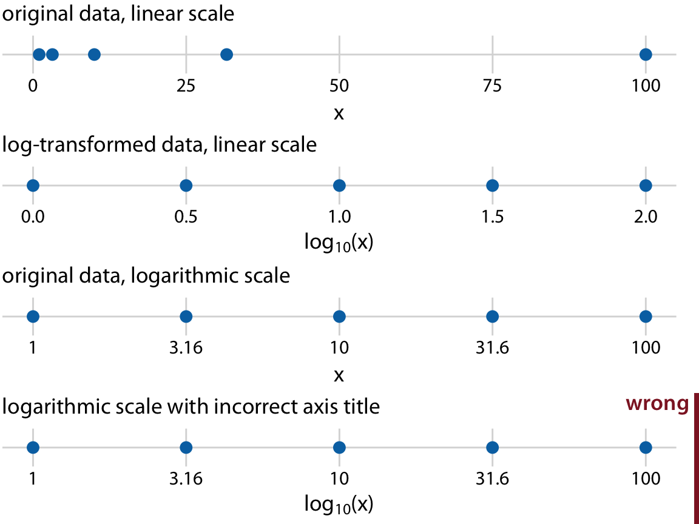
</div>
]

---
# Colors

.pull-left[
- There are **three fundamental use cases for color** in data visualizations:
  1. We can use color to distinguish groups of data from each other;
  2. We can use color to represent data values; and 
  3. We can use color to highlight.
]

.pull-right[
]

---
# Colors

.pull-left[
- There are **three fundamental use cases for color** in data visualizations:
  1. We can use color to .hlred[distinguish groups of data from each other];
  2. We can use color to represent data values; and 
  3. We can use color to highlight.
]

.pull-right[
<div align="center">


</div>
]


---
# Colors

.pull-left[
- There are **three fundamental use cases for color** in data visualizations:
  1. We can use color to distinguish groups of data from each other;
  2. We can use color to .hlred[represent data values]; and 
  3. We can use color to highlight.
]

.pull-right[
<div align="center">


</div>
]


---
# Colors

.pull-left[
- There are **three fundamental use cases for color** in data visualizations:
  1. We can use color to distinguish groups of data from each other;
  2. We can use color to represent data values; and 
  3. We can use color to .hlred[highlight].
]

.pull-right[
<div align="center">

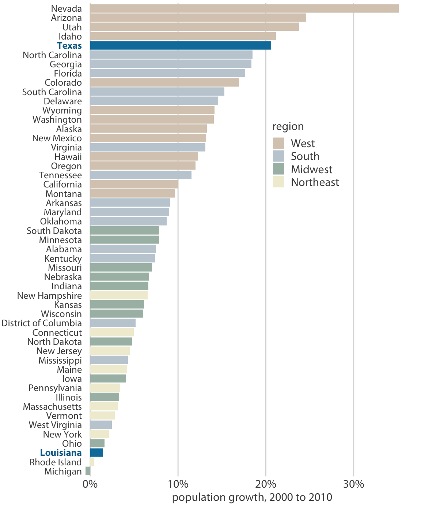
</div>
]


---
# Colors

.pull-left[
- There are **three fundamental use cases for color** in data visualizations:
  1. We can use color to distinguish groups of data from each other;
  2. We can use color to represent data values; and 
  3. We can use color to highlight.
- While colors are very powerful aesthetics, **try to avoid common pitfalls**, such as:
]

.pull-right[
]


---
# Colors

.pull-left[
- There are **three fundamental use cases for color** in data visualizations:
  1. We can use color to distinguish groups of data from each other;
  2. We can use color to represent data values; and 
  3. We can use color to highlight.
- While colors are very powerful aesthetics, try to avoid common pitfalls, such as:
  - Encoding .hlred[too much / irrelevant information]
]

.pull-right[
<div align="center">
<br>

</div>
]


---
# Colors

.pull-left[
- There are **three fundamental use cases for color** in data visualizations:
  1. We can use color to distinguish groups of data from each other;
  2. We can use color to represent data values; and 
  3. We can use color to highlight.
- While colors are very powerful aesthetics, try to avoid common pitfalls, such as:
  - Encoding too much / irrelevant information
  - Using .hlred[non-monotonic color scales] to encode data values
]

.pull-right[
<div align="center">
<br>
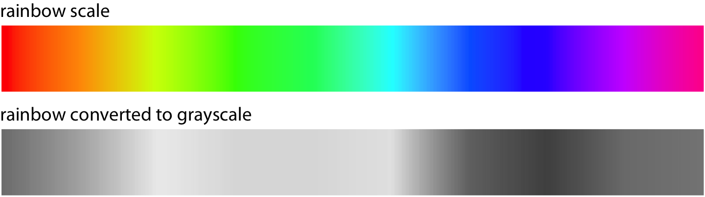
<br>

</div>
]


---
# Colors

.pull-left[
- There are **three fundamental use cases for color** in data visualizations:
  1. We can use color to distinguish groups of data from each other;
  2. We can use color to represent data values; and 
  3. We can use color to highlight.
- While colors are very powerful aesthetics, try to avoid common pitfalls, such as:
  - Encoding too much / irrelevant information
  - Using non-monotonic color scales to encode data values
  - Not designing for .hlred[color-vision deficiency]

]

.pull-right[
<div align="center">
<br>
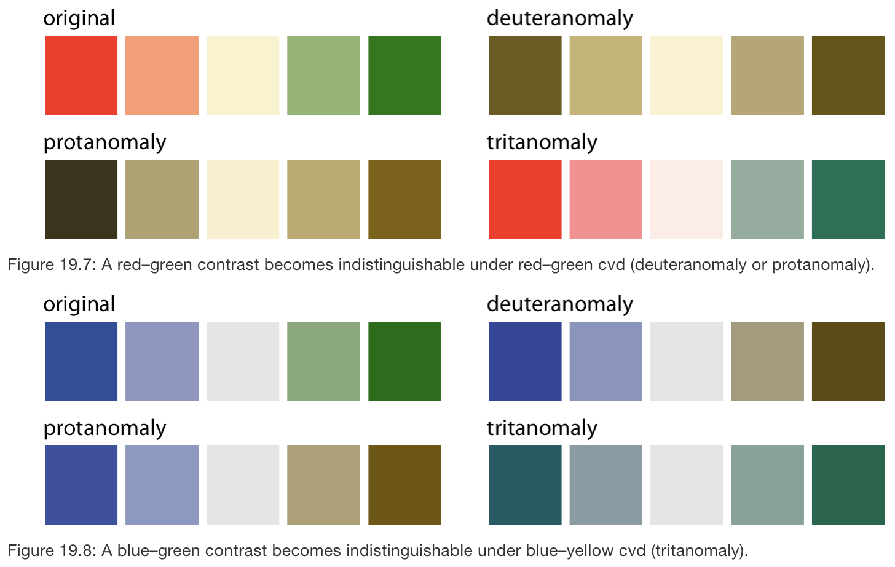
<br>
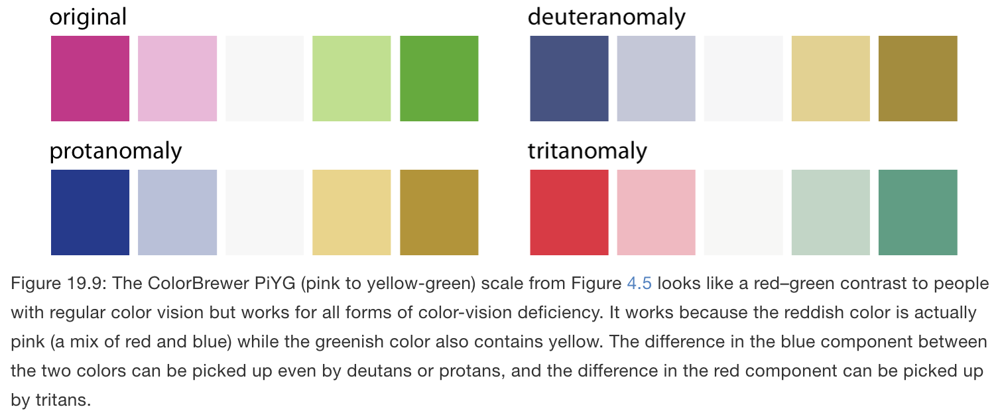

</div>
]


---
# Colors

.pull-left[
- There are **three fundamental use cases for color** in data visualizations:
  1. We can use color to distinguish groups of data from each other;
  2. We can use color to represent data values; and 
  3. We can use color to highlight.
- While colors are very powerful aesthetics, try to avoid common pitfalls, such as:
  - Encoding too much / irrelevant information
  - Using non-monotonic color scales to encode data values
  - Not designing for color-vision deficiency
- There's a whole **science around the perception of colors** in graphs, and a range of tools that help you select appropriate color schemes. My favorite is [ColorBrewer](https://colorbrewer2.org/), which is implemented in the [`RColorBrewer`](https://cran.r-project.org/web/packages/RColorBrewer/index.html) package.
]

.pull-right[
<div align="center">
<br>

<br>


</div>
]


---
# Line and point types

.pull-left[
- Different line and point types .hlred[can help distinguish different data types] (e.g., subgroups).
- For lines, we can, use solid, dashed or dotted formatting.
- For points, we can use solid dots, open circles, triangles, or really any symbol we can come up with.
- Try to avoid different line and point types. They add a lot of noise and are difficult to read.
]

.pull-right[
]

---
# Line and point types

.pull-left[
- Different line and point types .hlred[can help distinguish different data types] (e.g., subgroups).
- For lines, we can, use solid, dashed or dotted formatting.
- For points, we can use solid dots, open circles, triangles, or really any symbol we can come up with.
- Try to avoid different line and point types. They add a lot of noise and are difficult to read.
- Consider colored shapes instead of **different lines**.
]

.pull-right[
<div align="center">
<br><br>
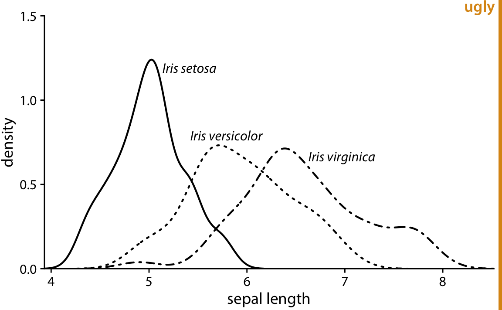
</div>
]

---
# Line and point types

.pull-left[
- Different line and point types .hlred[can help distinguish different data types] (e.g., subgroups).
- For lines, we can, use solid, dashed or dotted formatting.
- For points, we can use solid dots, open circles, triangles, or really any symbol we can come up with.
- Try to avoid different line and point types. They add a lot of noise and are difficult to read.
- Consider **colored shapes** instead of different lines.
]

.pull-right[
<div align="center">
<br><br>
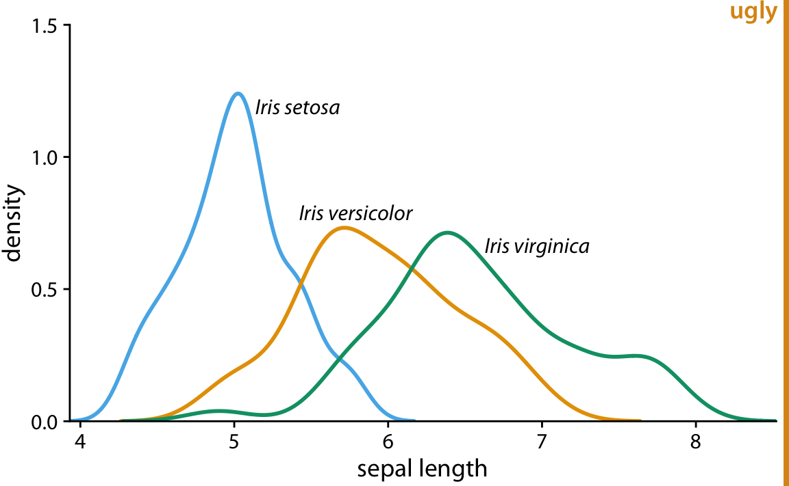
</div>
]


---
# Line and point types

.pull-left[
- Different line and point types .hlred[can help distinguish different data types] (e.g., subgroups).
- For lines, we can, use solid, dashed or dotted formatting.
- For points, we can use solid dots, open circles, triangles, or really any symbol we can come up with.
- Try to avoid different line and point types. They add a lot of noise and are difficult to read.
- Consider **colored shapes** instead of different lines.
]

.pull-right[
<div align="center">
<br><br>
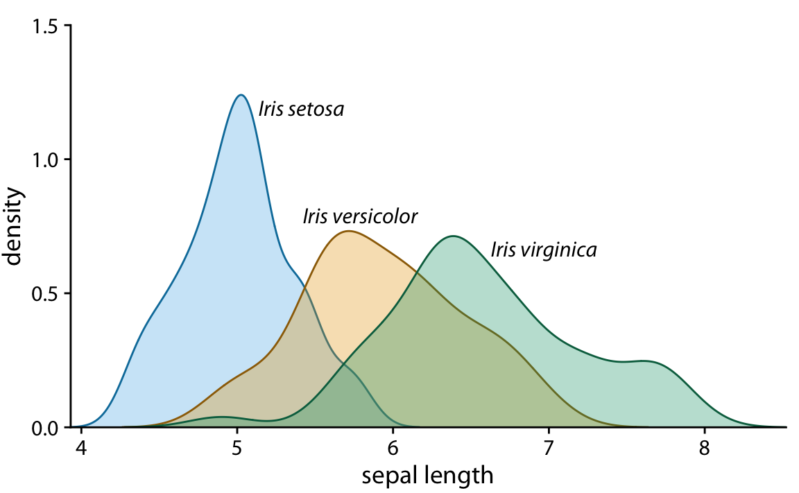
</div>
]


---
# Line and point types

.pull-left[
- Different line and point types .hlred[can help distinguish different data types] (e.g., subgroups).
- For lines, we can, use solid, dashed or dotted formatting.
- For points, we can use solid dots, open circles, triangles, or really any symbol we can come up with.
- Try to avoid different line and point types. They add a lot of noise and are difficult to read.
- Consider colored shapes instead of different lines.
- Consider colored shapes instead of **different points**.
]

.pull-right[
<div align="center">
<br><br>
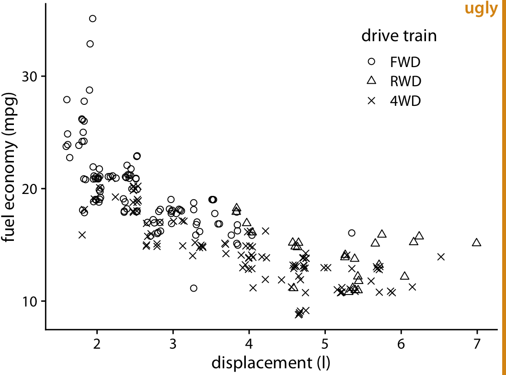
</div>
]


---
# Line and point types

.pull-left[
- Different line and point types .hlred[can help distinguish different data types] (e.g., subgroups).
- For lines, we can, use solid, dashed or dotted formatting.
- For points, we can use solid dots, open circles, triangles, or really any symbol we can come up with.
- Try to avoid different line and point types. They add a lot of noise and are difficult to read.
- Consider colored shapes instead of different lines.
- Consider **colored shapes** instead of different points.
]

.pull-right[
<div align="center">
<br><br>
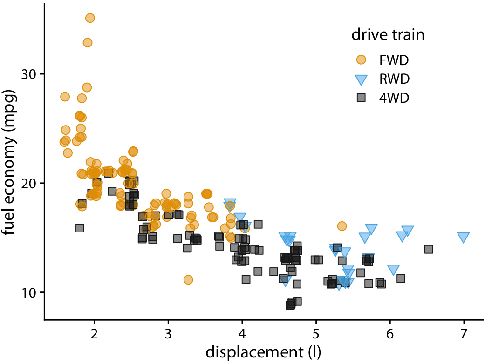
</div>
]


---
# Line and point types

.pull-left[
- Different line and point types .hlred[can help distinguish different data types] (e.g., subgroups).
- For lines, we can, use solid, dashed or dotted formatting.
- For points, we can use solid dots, open circles, triangles, or really any symbol we can come up with.
- Try to avoid different line and point types. They add a lot of noise and are difficult to read.
- Consider colored shapes instead of different lines.
- Consider colored shapes instead of different points.
- Use **redundant coding**, i.e. use color to enhance the visual appearance of the figure without relying entirely on color to convey key information.
]

.pull-right[
<div align="center">
<br><br>

</div>
]


---
# Line and point types

.pull-left[
- Different line and point types .hlred[can help distinguish different data types] (e.g., subgroups).
- For lines, we can, use solid, dashed or dotted formatting.
- For points, we can use solid dots, open circles, triangles, or really any symbol we can come up with.
- Try to avoid different line and point types. They add a lot of noise and are difficult to read.
- Consider colored shapes instead of different lines.
- Consider colored shapes instead of different points.
- Use redundant coding, i.e. use color to enhance the visual appearance of the figure without relying entirely on color to convey key information.
- To tackle **overlapping data**, use partial transparency (alpha blending) and (moderate) jittering.
]

.pull-right[
<div align="center">
<br><br>

</div>
]


---
# Line and point types

.pull-left[
- Different line and point types .hlred[can help distinguish different data types] (e.g., subgroups).
- For lines, we can, use solid, dashed or dotted formatting.
- For points, we can use solid dots, open circles, triangles, or really any symbol we can come up with.
- Try to avoid different line and point types. They add a lot of noise and are difficult to read.
- Consider colored shapes instead of different lines.
- Consider colored shapes instead of different points.
- Use redundant coding, i.e. use color to enhance the visual appearance of the figure without relying entirely on color to convey key information.
- To tackle overlapping data, use **partial transparency** (alpha blending) and (moderate) jittering.
]

.pull-right[
<div align="center">
<br><br>
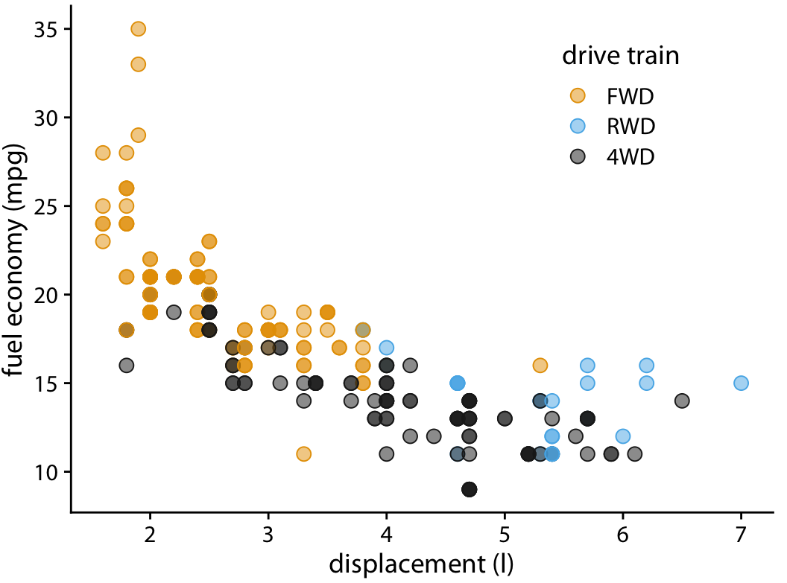
</div>
]


---
# Line and point types

.pull-left[
- Different line and point types .hlred[can help distinguish different data types] (e.g., subgroups).
- For lines, we can, use solid, dashed or dotted formatting.
- For points, we can use solid dots, open circles, triangles, or really any symbol we can come up with.
- Try to avoid different line and point types. They add a lot of noise and are difficult to read.
- Consider colored shapes instead of different lines.
- Consider colored shapes instead of different points.
- Use redundant coding, i.e. use color to enhance the visual appearance of the figure without relying entirely on color to convey key information.
- To tackle overlapping data, use partial transparency (alpha blending) and **(moderate) jittering**.
]

.pull-right[
<div align="center">
<br><br>

</div>
]

<!-- ############################################ -->
---
class: inverse, center, middle
name: plottypes

# Types of data visualization

<html><div style='float:left'></div><hr color='#EB811B' size=1px style="width:1000px; margin:auto;"/></html>


---
# Different plot types for different purposes

A common mistake in visualization is that .hlred[plot types are used for purposes they are not meant for]. You'll gain more intuition and experience in picking the right types over time. 

Before you start plotting, ask yourself:

--

.pull-left-vsmall[
#### 1. Which quantity do I want to visualize?

- Amounts
- Distributions
- Proportions
- Associations
- Structures
- Trends
- Estimates
- Predictions
- Uncertainty
]

--

.pull-right-vwide[
#### 2. Which question do I want to answer?

- "Is the *distribution* normal (or uniform or...)?" → **Histogram, density plot, Q-Q plot**
- "Are univariate *distributions* across subgroups different?" → **Boxplots, ridgelines**
- "How do *differences in amounts* between groups compare?" → **Barplot, dotplot** 
- "What is the *relationship* between x and y?" → **Scatterplot, contour plot, hex bins** 
- "What are the *correlations* in a set of variables?" → **Correlogram, small multiples** 
- "How did a *trend* develop over time?" → **Line graph, slopegraph** 
- "Are the data *clustered* by subgroup?" → **Scatterplot with color**
- "Is there a *spatial pattern*?" → **Choropleth, cartogram heatmap**
- "What are the relative and absolute *effect sizes*? → **Coefficient plot**
- "How uncertain are *estimates*? → **Error bars, confidence bands**

]


---
# A directory of visualizations

.pull-left[
### Visualizing amounts

<div align="center">
<br>

</div>

<div align="center">

</div>
]

--

.pull-right[

### Visualizing distributions
<div align="center">
<br>

</div>

<div align="center">

</div>
]


---
# A directory of visualizations (cont.)

.pull-left[
### Visualizing proportions

<div align="center">
<br>

</div>

<div align="center">

</div>

<div align="center">

</div>
]


--

.pull-right[

### Visualizing x-y relationships
<div align="center">
<br>

</div>

<div align="center">

</div>

<div align="center">

</div>
]


---
# A directory of visualizations (cont.)

.pull-left[
### Visualizing uncertainty

<div align="center">
<br>

</div>

<div align="center">

</div>

<div align="center">

</div>
]


--

.pull-right[

### Visualizing geospatial data
<div align="center">
<br>

</div>
]


---
# Small multiples

.pull-left[
- A powerful yet underestimated visualization strategy is to use [multi-panel figures](https://clauswilke.com/dataviz/multi-panel-figures.html).
- Often we want to compare relationships or trends between groups. With many groups, that's too much information for a single figure panel.
- There are various terms for multi-panel figures, including "small multiples" (Tufte 1990), "trellis plot" (Cleveland 1993) and "faceting" (Wickham 2016)
- In R we can implement this fairly easily with `ggplot`'s `facet_grid()` (or `facet_wrap()`).
- If you do small multiples, make sure to use:
  - common graph size
  - common axis scales
  - helpful alignment and order of panels
]


.pull-right[
<div align="center">
<br>

</div>
]


---
# Small multiples (cont.)

.pull-left[
- Check out the example on the right, which was also discussed [here](https://statmodeling.stat.columbia.edu/2014/04/10/small-multiples-lineplots-maps-ok-always-yes-case/) and [there](https://junkcharts.typepad.com/junk_charts/2014/02/small-multiples-with-simple-axes.html).
- What they did right (by Kaiser Fung):
  - Did not put the data on a map
  - Ordered the countries by the most recent data point rather than alphabetically
  - Scale labels are found only on outer edge of the chart area, rather than one set per panel
  - Only used three labels for the 11 years
  - Did not overdo the vertical scale either
  - The nicest feature was the XL scale applied only to South Korea. This destroys the small-multiples principle but draws attention to the top left corner, where the designer wants our eyes to go.
]

.pull-right[
<div align="center">
<br>
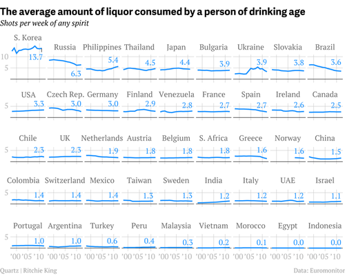
</div>
]


---
# Small multiples (cont.)

.pull-left[
- Check out the example on the right, which was also discussed [here](https://statmodeling.stat.columbia.edu/2014/04/10/small-multiples-lineplots-maps-ok-always-yes-case/) and [there](https://junkcharts.typepad.com/junk_charts/2014/02/small-multiples-with-simple-axes.html).
- What they did right (by Kaiser Fung):
  - Did not put the data on a map
  - Ordered the countries by the most recent data point rather than alphabetically
  - Scale labels are found only on outer edge of the chart area, rather than one set per panel
  - Only used three labels for the 11 years
  - Did not overdo the vertical scale either
  - The nicest feature was the XL scale applied only to South Korea. This destroys the small-multiples principle but draws attention to the top left corner, where the designer wants our eyes to go.
- Sometimes maps are not a good alternative.
]

.pull-right[
<div align="center">
<br>
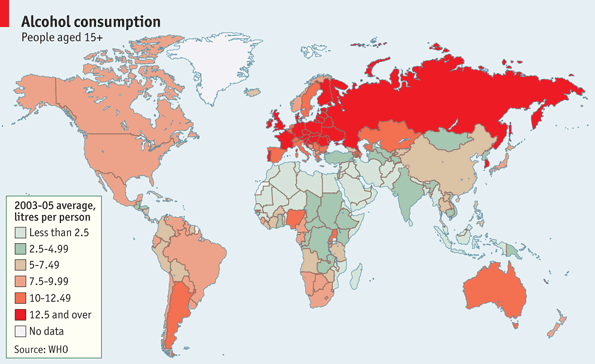
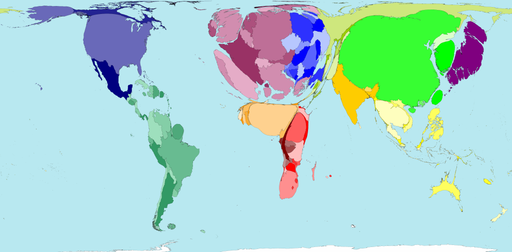
</div>
]


---
# Small multiples (cont.)

.pull-left[
- Check out the example on the right, which was also discussed [here](https://statmodeling.stat.columbia.edu/2014/04/10/small-multiples-lineplots-maps-ok-always-yes-case/) and [there](https://junkcharts.typepad.com/junk_charts/2014/02/small-multiples-with-simple-axes.html).
- What they did right (by Kaiser Fung):
  - Did not put the data on a map
  - Ordered the countries by the most recent data point rather than alphabetically
  - Scale labels are found only on outer edge of the chart area, rather than one set per panel
  - Only used three labels for the 11 years
  - Did not overdo the vertical scale either
  - The nicest feature was the XL scale applied only to South Korea. This destroys the small-multiples principle but draws attention to the top left corner, where the designer wants our eyes to go.
- Sometimes maps are not a good alternative.
- But you can do small multiples of maps!
]

.pull-right[
<div align="center">
<br>

</div>
]


---
# Visualizing many distributions at once

.pull-left[
- An increasingly popular, compact variant of small multiples for distributions is the **ridgeline plot** (they look like mountain ridgelines).
- The idea is to staggering distributions plots in the vertical direction (i.e., along the horizontal axis).
- Ridgeline plots tend to work particularly well if want to show trends in distributions over time.
]


.pull-right[
<div align="center">
<br>
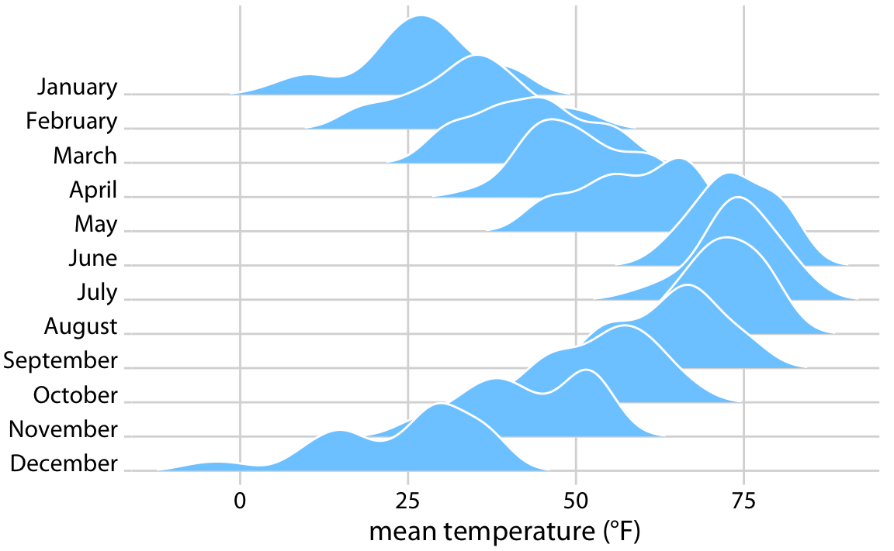


</div>
]

---
# Visualizing many distributions at once (cont.)

.pull-left[
- An increasingly popular, compact variant of small multiples for distributions is the **ridgeline plot** (they look like mountain ridgelines).
- The idea is to staggering distributions plots in the vertical direction (i.e., along the horizontal axis).
- Ridgeline plots tend to work particularly well if want to show trends in distributions over time.
- Ridgelines scale to large numbers of distributions.
]


.pull-right[
<div align="center">
<br>
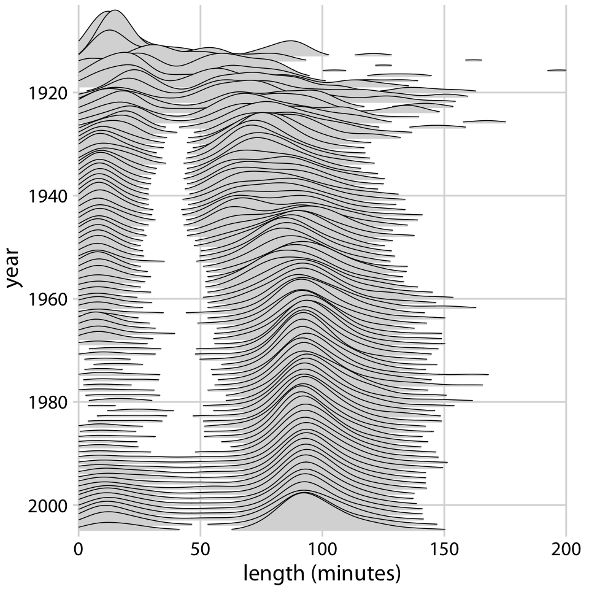
</div>
]

---
# Visualizing many distributions at once (cont.)

.pull-left[
- An increasingly popular, compact variant of small multiples for distributions is the **ridgeline plot** (they look like mountain ridgelines).
- The idea is to staggering distributions plots in the vertical direction (i.e., along the horizontal axis).
- Ridgeline plots tend to work particularly well if want to show trends in distributions over time.
- Ridgelines scale to large numbers of distributions.
- Ridgelines can be grouped.
]


.pull-right[
<div align="center">
<br>
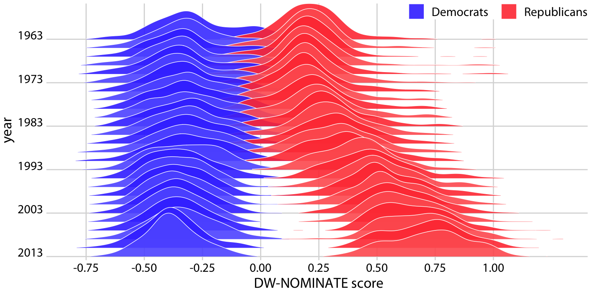
</div>
]


---
# Visualizing many distributions at once (cont.)

.pull-left[
- An increasingly popular, compact variant of small multiples for distributions is the **ridgeline plot** (they look like mountain ridgelines).
- The idea is to staggering distributions plots in the vertical direction (i.e., along the horizontal axis).
- Ridgeline plots tend to work particularly well if want to show trends in distributions over time.
- Ridgelines scale to large numbers of distributions.
- Ridgelines can be grouped.
- They are implemented in R with the [`ggridges` package](https://cran.r-project.org/web/packages/ggridges/vignettes/introduction.html).
]

.pull-right[
<div align="center">
<br>

</div>
]


<!-- ############################################ -->
---
class: inverse, center, middle
name: graphicdesign

# Some principles of graphic design

<html><div style='float:left'></div><hr color='#EB811B' size=1px style="width:1000px; margin:auto;"/></html>


---

# Graphic design and CRAP

.pull-left[
<br>
We can this of these .hlblue[four guiding principles] when creating and critiquing data visuals:

- .hlred[Contrast]


]

.pull-right[
<div align="center">
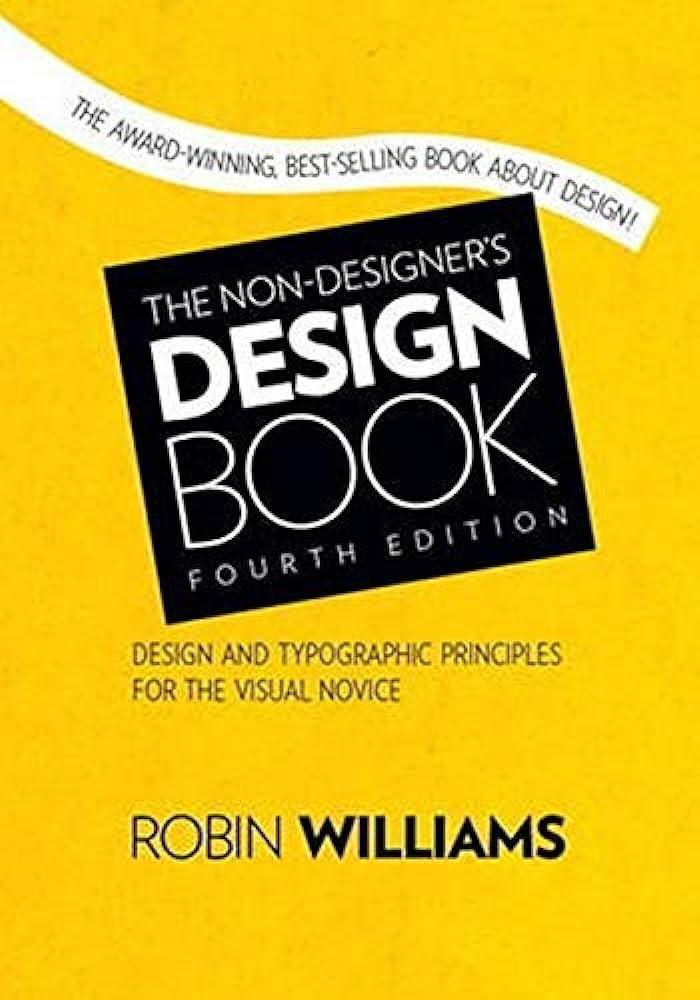
</div>
]


.footnote[Inspired by Andrew Heiss' Data Visualization with `R` course]

---

# Graphic design and CRAP

.pull-left[
<br>
We can this of these .hlblue[four guiding principles] when creating and critiquing data visuals:

- .hlred[Contrast]

- .hlred[Repetition]


]

.pull-right[
<div align="center">

</div>
]


.footnote[Inspired by Andrew Heiss' "Data Visualization with `R` course]

---

# Graphic design and CRAP

.pull-left[
<br>
We can this of these .hlblue[four guiding principles] when creating and critiquing data visuals:

- .hlred[Contrast]

- .hlred[Repetition]

- .hlred[Alignment]

]

.pull-right[
<div align="center">

</div>
]


.footnote[Inspired by Andrew Heiss' "Data Visualization with `R` course]

---

# Graphic design and CRAP

.pull-left[
<br>
We can this of these .hlblue[four guiding principles] when creating and critiquing data visuals:

- .hlred[Contrast]

- .hlred[Repetition]

- .hlred[Alignment]

- .hlred[Proximity]
]

.pull-right[
<div align="center">

</div>
]


.footnote[Inspired by Andrew Heiss' "Data Visualization with `R` course]

---

# Contrast

.pull-center[
.hlred[If two things are not the same, make them different.]
]

<br>
--

.pull-left-small[

## Some things to do:

- .hlblue[Typographic contrast]
    - Type families
    - Weights
    - Size
]


.pull-right-wide[

<div align="center">
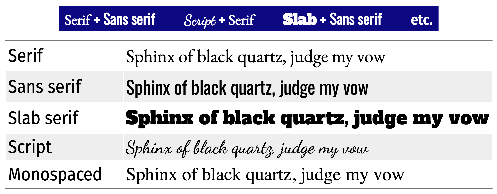
</div>

]

---

# Contrast

.pull-center[
.hlred[If two things are not the same, make them different.]
]

<br>

.pull-left-small[

## Some things to do:

- .hlblue[Typographic contrast]
    - Type families
    - Weights
    - Size
]


.pull-right-wide[

<div align="center">

</div>

]

---

# Contrast

.pull-center[
.hlred[If two things are not the same, make them different.]
]

<br>

.pull-left-small[

## Some things to do:

- .hlblue[Typographic contrast]
    - Type families
    - Weights
    - Size
]


.pull-right-wide[

<div align="center">
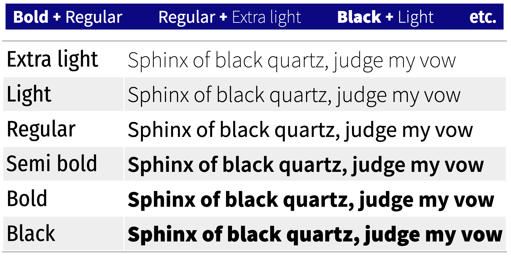
</div>

]

---

# Contrast

.pull-center[
.hlred[If two things are not the same, make them different.]
]

<br>

.pull-left-small[

## Some things to do:

- .hlblue[Typographic contrast]
    - Type families
    - Weights
    - Size
]


.pull-right-wide[

<div align="center">

</div>

]

---

# Contrast

.pull-center[
.hlred[If two things are not the same, make them different.]
]

<br>

.pull-left-small[

## Some things to do:

- .hlblue[Typographic contrast]
    - Type families
    - Weights
    - Size
]


.pull-right-wide[

<div align="center">

</div>

]

---

# Contrast

.pull-center[
.hlred[If two things are not the same, make them different.]
]

<br>

.pull-left-small[

## Some things to do:

- **Typographic contrast**
    - Type families
    - Weights
    - Size
    
- .hlblue[Color contrast]
]


.pull-right-wide[

<div align="center">
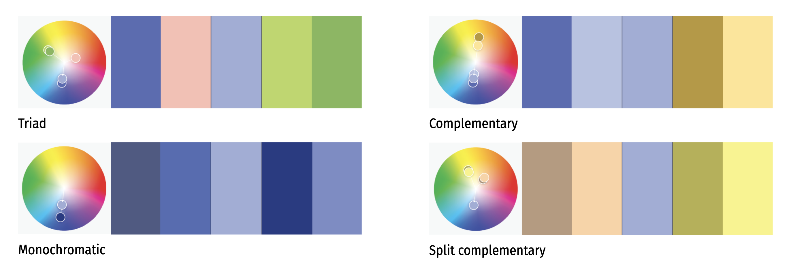
</div>

.footnote[We can check <a href="https://color.adobe.com/create/color-wheel" target:="_blank">Adobe Color</a>]
]

---


background-image: url("../pics/oxfam.png")
background-size: contain
background-color: #000000

# Repetition

---

# Alignment

.pull-center[
.hlred[Every item should have a visual connection with something else on the page.]
]

<br>

<div align="center">

</div>

---

# Alignment

.pull-center[
.hlred[Every item should have a visual connection with something else on the page.]
]

<br>

<div align="center">
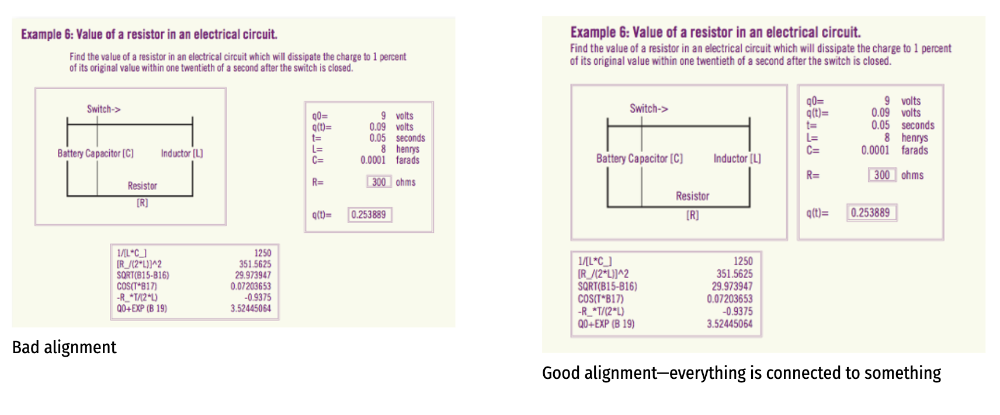
</div>

---

# Alignment

.pull-center[
.hlred[Every item should have a visual connection with something else on the page.]
]

<br>

<div align="center">
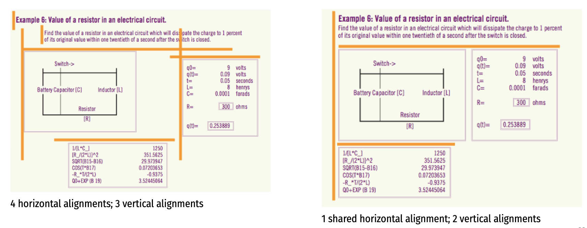
</div>

---

# Proximity

.pull-center[
.hlred[Pull related items together.]
]

<br>

<div align="center">
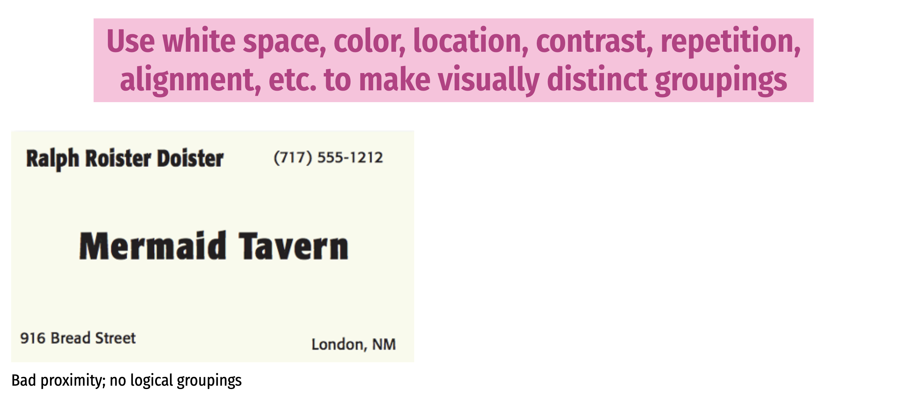
</div>

---

# Proximity

.pull-center[
.hlred[Pull related items together.]
]

<br>

<div align="center">
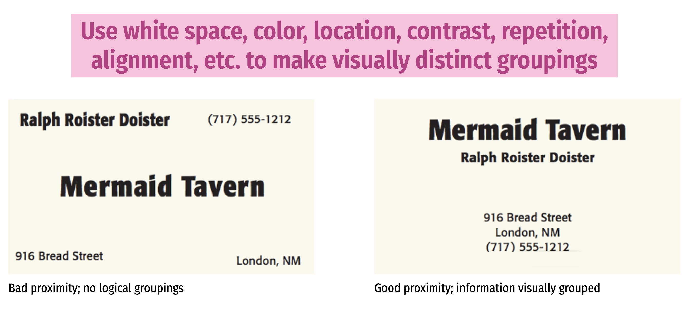
</div>

---

# CRAP


<div align="center">
<br>
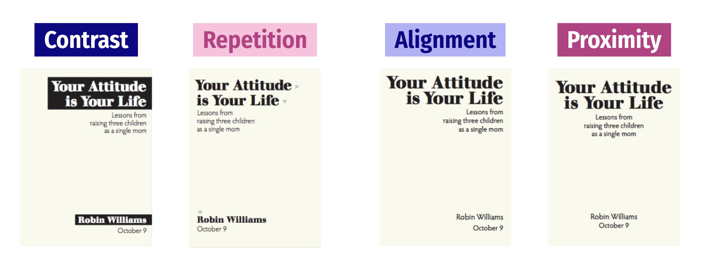
</div>

<!-- ############################################ -->
---
class: inverse, center, middle
name: whydatavizpolicy

# Why data visualization in policy-making?

<html><div style='float:left'></div><hr color='#EB811B' size=1px style="width:1000px; margin:auto;"/></html>

---

# Data visualization in policy-making

.pull-left-wide[
## Let's take a couple of minutes to consider some key questions about visualization in the policy context

- In which ways do you think data visualization can be .hlred[useful] in the context of policy-making?

]

---

# Data visualization in policy-making

.pull-left-wide[
## Let's take a couple of minutes to consider some key questions about visualization in the policy context

- In which ways do you think data visualization can be useful in the context of policy-making?
- Can you recall an instance where a visual representation of data significantly .hlred[influenced one of your (*policy*) decisions]?
]

---

# Data visualization in policy-making

.pull-left-wide[
## Let's take a couple of minutes to consider some key questions about visualization in the policy context

- In which ways do you think data visualization can be useful in the context of policy-making?
- Can you recall an instance where a visual representation of data significantly influenced one of your (*policy*) decisions?
- An argument for data visualizations is that they can help simplify complex data for stakeholders who might not have a technical background. .hlred[Do you agree?] 

]

---

# Data visualization in policy-making

.pull-left-wide[
## Let's take a couple of minutes to consider some key questions about visualization in the policy context

- In which ways do you think data visualization can be useful in the context of policy-making?
- Can you recall an instance where a visual representation of data significantly influenced one of your (*policy*) decisions?
- An argument for data visualizations is that they can help simplify complex data for stakeholders who might not have a technical background. Do you agree? .hlred[Are there any risks with simplification?]

]


---

# Data visualization in policy-making

.pull-left-wide[
## Let's take a couple of minutes to consider some key questions about visualization in the policy context

- In which ways do you think data visualization can be useful in the context of policy-making?
- Can you recall an instance where a visual representation of data significantly influenced one of your (*policy*) decisions?
- An argument for data visualizations is that they can help simplify complex data for stakeholders who might not have a technical background. Do you agree? Are there any risks with simplification?
- Do you think data visualization can .hlred[improve communication between different departments and with the public]?
]

---

# Data visualization in policy-making

.pull-left-wide[
## Let's take a couple of minutes to consider some key questions about visualization in the policy context

- In which ways do you think data visualization can be useful in the context of policy-making?
- Can you recall an instance where a visual representation of data significantly influenced one of your (*policy*) decisions?
- An argument for data visualizations is that they can help simplify complex data for stakeholders who might not have a technical background. Do you agree? Are there any risks with simplification?
- Do you think data visualization can improve communication between different departments and with the public?
- Are you .hlred[currently using data visualization] in your policy work?
]

---

# Data visualization in policy-making

.pull-left-wide[
## Let's take a couple of minutes to consider some key questions about visualization in the policy context

- In which ways do you think data visualization can be useful in the context of policy-making?
- Can you recall an instance where a visual representation of data significantly influenced one of your (*policy*) decisions?
- An argument for data visualizations is that they can help simplify complex data for stakeholders who might not have a technical background. Do you agree? Are there any risks with simplification?
- Do you think data visualization can improve communication between different departments and with the public?
- Are you currently using data visualization in your policy work? .hlred[How?]
]

---
class: midtext

# The case for data visualization in policy

- .hlred[Enhanced comprehension and communication]
    - **Simplifier of complex data**: Data visualizations can transform complex datasets into clear, understandable visuals, making it easier for policymakers and stakeholders to grasp intricate information quickly.
    - **Improved communication**: Visuals can bridge communication gaps between technical and non-technical audiences, leveling the accessibility of insights to relevant parties.
--
- .hlred[Facilitator for decision-making]
    - **Trend and pattern identification**: Visual representations can highlight trends, patterns, and anomalies that may not be evident in raw data.
    - **Transparency**: Clear visualizations can help demonstrate the basis for policy decisions.
--
- .hlred[Engagement and participation]
    - **Stakeholder inclusion**: Interactive and visually appealing data presentations can capture the interest of stakeholders, encouraging more active participation in the policy-making process.
    - **Increased understanding**: Well-designed visualizations can educate and inform the public about policy issues, leading to greater awareness and support for policy initiatives.
--
- .hlred[Resource allocation]
    - **Priority setting**: Visual data can help policymakers identify key areas that require attention and allocate resources more effectively and efficiently.
    - **Progress tracking**: Data visualizations can be used to monitor the implementation of policies and measure their changes over time, allowing for adjustments and improvements.

---
class: midtext

# The case for data visualization in policy (cont.)

- .hlred[Accountability and transparency]
    - **Reporting**: Designing visualizations make the design of a communication strategy explicit.
    - **Comparison and contrasts**: Visual data can be useful to expose disparities and inequities within groups, prompting action to address these issues.
--
- .hlred[Streamlined processes]
    - **Collaboration**: Visual tools can help different departments and agencies understand each other's data and collaborate more effectively on cross-cutting policy issues.
    - Data harmonization: Visualizations can integrate data from multiple sources, providing a comprehensive view that supports cohesive policy strategies.
--
- .hlred[Computational developments]
    - **Government data**: The increasing availability of large datasets necessitates efficient ways to process and understand data, which visualizations can provide.
     - **Interactivity**: Modern data visualization tools offer interactive features that allow users to explore data dynamically, enhancing their analytical capabilities.
--
- .hlred[Enhanced analytics]
    - **Predictive analysis**: Visualizations can assist in predictive modeling and scenario analysis, helping policymakers anticipate future trends and prepare accordingly.
    - **Management "friendly"**: Visual tools enable rapid analysis and interpretation, which is crucial for timely decision-making in fast-paced policy environments.


<!-- ############################################ -->
---
class: inverse, center, middle
name: questions

# Questions?

<html><div style='float:left'></div><hr color='#EB811B' size=1px style="width:1000px; margin:auto;"/></html>


