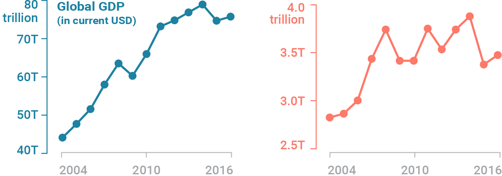

```{css, echo=FALSE} 
@media print { # print out incremental slides; see https://stackoverflow.com/questions/56373198/get-xaringan-incremental-animations-to-print-to-pdf/56374619#56374619
.has-continuation {
display: block !important;
}
}
```

```{r setup, include=FALSE}
# figures formatting setup
options(htmltools.dir.version = FALSE)
library(knitr)
opts_chunk$set(
  prompt = T,
  fig.align="center", #fig.width=6, fig.height=4.5, 
  # out.width="748px", #out.length="520.75px",
  dpi=300, #fig.path='Figs/',
  cache=T, #echo=F, warning=F, message=F
  engine.opts = list(bash = "-l")
)

## Next hook based on this SO answer: https://stackoverflow.com/a/39025054
knit_hooks$set(
  prompt = function(before, options, envir) {
    options(
      prompt = if (options$engine %in% c('sh','bash')) '$ ' else 'R> ',
      continue = if (options$engine %in% c('sh','bash')) '$ ' else '+ '
    )
  })

library(tidyverse)
library(hrbrthemes)
library(fontawesome)
library(RefManageR)

RefManageR::BibOptions(
  check.entries = FALSE,  
  bib.style = "authoryear", 
  cite.style = "authoryear", 
  style = "markdown",
  hyperlink = TRUE, 
  dashed = TRUE)

bib <-  RefManageR::ReadBib("grateful-refs.bib")


```

```{r setup-2, include=FALSE}
# figures formatting setup
options(htmltools.dir.version = FALSE)
library(knitr)
opts_chunk$set(
  comment = "  ",
  prompt = T,
  fig.align="center", #fig.width=6, fig.height=4.5, 
  # out.width="748px", #out.length="520.75px",
  dpi=300, #fig.path='Figs/',
  cache=F, #echo=F, warning=F, message=F
  engine.opts = list(bash = "-l")
  )

## Next hook based on this SO answer: https://stackoverflow.com/a/39025054
knit_hooks$set(
  prompt = function(before, options, envir) {
    options(
      prompt = if (options$engine %in% c('sh','bash')) '$ ' else 'R> ',
      continue = if (options$engine %in% c('sh','bash')) '$ ' else '+ '
      )
})

library(tidyverse)
library(nycflights13)
library(kableExtra)
```


# Table of contents

<br>

1. [Principles of good data visualization](#rules)<sup>1</sup>

2. [Good practices in data visualization](#goodpractices)

3. [The best statistical graph of all times](#bestgraph)

4. [Click- and code-based visualization tools](#clickvscode)

5. [Visualization with R and `ggplot2`](#vizr)

.footnote[<sup>1</sup> Much of this section draws on materials from Claus Wilke's excellent book [*Fundamentals of Data Visualization*](https://clauswilke.com/dataviz/).]


<!-- ############################################ -->
---
class: inverse, center, middle
name: rules

# Principles of good data visualization

<html><div style='float:left'></div><hr color='#EB811B' size=1px style="width:1000px; margin:auto;"/></html>


---
# On the shoulder of giants...

.pull-left[

"Visualization is surprisingly difficult. Even the most simple matters can easily go wrong."

"No matter how clever the choice of the information, and no matter how technologically impressive the encoding, a visualization fails if the decoding fails."

<br>

<div align="right"><i>William Cleveland</i></div>

<div align="center">
<br>

</div>
]

--

.pull-right[
"Although nothing can replace a good graphical idea applied to an interesting set of numbers, editing and revision are as essential to sound graphical work as they are to writing."

"Design cannot rescue failed content."

"Above all else show the data."

<div align="right"><i>Edward Tufte</i></div>

<div align="center">
<br>

</div>
]


---
# Fundamental principles of analytic design

<br>
In Chapter 5 of his book "[Beautiful Evidence](http://atc.berkeley.edu/201/readings/Tufte_BE_2006.pdf)", Edward Tufte outlines six fundamental principles of analytic design:

--

1. **Comparisons.** Show <i style="color:#cc0065">comparisons</i>, <i style="color:#cc0065">contrasts</i>, <i style="color:#cc0065">differences</i>.

--

2. **Causality, mechanism, structure, explanation.** Show causality, mechanism, explanation, <i style="color:#cc0065">systematic structure</i>.

--

3. **Multivariate analysis.** Show data; that is show more than 1 or 2 variables (<i style="color:#cc0065">Use additional facets to add dimensions to the 2d plane</i>.)

--

4. **Integration of evidence.** Completely integrate <i style="color:#cc0065">words</i>, <i style="color:#cc0065">numbers</i>, <i style="color:#cc0065">images</i>, <i style="color:#cc0065">diagrams</i>.

--

5. **Documentation.** <i style="color:#cc0065">Thoroughly describe</i> the evidence. Provide a detailed title, indicate the authors and sponsors, document the data sources, show complete measurement scales, point out relevant issues.

--

6. **Content counts most of all.** Analytical presentations ultimately stand or fall depending on the quality, relevance and integrity of their content ("What is the problem you want to solve?")


---
class: midtext

# Flattening the curve

### Thinking through visuals

.pull-left-small[<br>
We can illustrate these with one the **most influential graphs** of the past couple of years. This visual traveled across the world in the start of 2020. 

Can you spot how these .i-pink[principles were implemented in the different versions of the graph]?

1. **Comparisons.**
2. **Causality, mechanism, structure, explanation.**
3. **Multivariate analysis.**
4. **Integration of evidence.**
5. **Documentation.**
6. **Content counts most of all.**
]

--

.pull-right-wide[
<br>
<div align="center">
<br>
<br>
</div>
`Source` [CDC](https://stacks.cdc.gov/view/cdc/11425)
]

---
class: midtext

# Flattening the curve

### Thinking through visuals

.pull-left-small[<br>
We can illustrate these with one the **most influential graphs** of the past couple of years. This visual traveled across the world in the start of 2020. 

Can you spot how these .i-pink[principles were implemented in the different versions of the graph]?

1. **Comparisons.**
2. **Causality, mechanism, structure, explanation.**
3. **Multivariate analysis.**
4. **Integration of evidence.**
5. **Documentation.**
6. **Content counts most of all.**
]


.pull-right-wide[
<br>
<div align="center">
<br>
</div>
`Source` [The Economist](https://www.economist.com/briefing/2020/02/29/covid-19-is-now-in-50-countries-and-things-will-get-worse)
]

---
class: midtext

# Flattening the curve

### Thinking through visuals

.pull-left-small[<br>
We can illustrate these with one the **most influential graphs** of the past couple of years. This visual traveled across the world in the start of 2020. 

Can you spot how these .i-pink[principles were implemented in the different versions of the graph]?

1. **Comparisons.**
2. **Causality, mechanism, structure, explanation.**
3. **Multivariate analysis.**
4. **Integration of evidence.**
5. **Documentation.**
6. **Content counts most of all.**
]


.pull-right-wide[
<div align="center">
<br>
</div>
`Source` [NYT](https://www.nytimes.com/article/flatten-curve-coronavirus.html)
]


---
class: midtext

# Flattening the curve

### Thinking through visuals

.pull-left-small[<br>
We can illustrate these with one the **most influential graphs** of the past couple of years. This visual traveled across the world in the start of 2020. 

Can you spot how these .i-pink[principles were implemented in the different versions of the graph]?

1. **Comparisons.**
2. **Causality, mechanism, structure, explanation.**
3. **Multivariate analysis.**
4. **Integration of evidence.**
5. **Documentation.**
6. **Content counts most of all.**
]


.pull-right-wide[
<div align="center">
<br>
</div>
`Source` [Our world in data](https://ourworldindata.org/)
]

<!-- ############################################ -->
---
class: inverse, center, middle
name: goodpractices

# Good practices in data visualization

<html><div style='float:left'></div><hr color='#EB811B' size=1px style="width:1000px; margin:auto;"/></html>

---

# What is happening here?

<div align="center">

</div>

---

# What is happening here? (cont.)

<div align="center">

</div>

---

# What is happening here? (cont.)

<div align="center">

</div>

---

# What is happening here? (cont.)

<div align="center">

</div>


---

# Friends don't let friends...


.pull-center[
<br>**Truncate the axes** of a plot at arbitrary points...<br><br>
]


<div align="center">
<br>
<b>Misleading</b>
</div>

---

# instead, friends encourage...

--

.pull-center[
<br>The use of **informative axis spaces**.<br><br>
]

--

<div align="center">
<br>
.t-good[**Better**]
</div>

---

# Friends don't let friends...


.pull-center[
<br>Use **dual axis** charts...<br><br>
]


<div align="center">
<br>
<b>Misleading</b>
</div>

---

# instead, friends encourage...

--

.pull-center[
<br>The use of **side-by-side** comparisons.<br><br>
]

--

<div align="center">
<br>
.t-good[**Better**]
</div>

---

# instead, friends encourage...

--

.pull-center[
<br>The use of **indexed** comparisons.<br><br>
]

--

<div align="center">
<br>
.t-good[**Better**]
</div>

---

# Friends don't let friends...


.pull-center[
<br>Use unnecesarily *spruced up* **3D** plots...<br><br>
]


<div align="center">
<br>
<b>Misleading</b>
</div>

---

# instead, friends encourage...

--

.pull-center[
<br>The prioritization of **content** over apparent aesthetics.<br><br>
]

--

<div align="center">
<br>
.t-good[**Better**]
</div>


---
class: smalltext

# A Short List of Dos and Don'ts

1. [Follow the principle of proportional ink.](https://clauswilke.com/dataviz/proportional-ink.html)<sup>1</sup>
2. [Maximize the data–ink ratio, within reason.](https://clauswilke.com/dataviz/balance-data-context.html)
3. [Avoid invisible overplotting.](https://clauswilke.com/dataviz/overlapping-points.html)
4. [Drop all the unimportant stuff.](https://clauswilke.com/dataviz/balance-data-context.html)
5. [Don't overload graphs. Instead, use several.](https://clauswilke.com/dataviz/multi-panel-figures.html)
6. [Use color scales that match the logic of the data scale.](https://clauswilke.com/dataviz/color-pitfalls.html)
7. [Use color-vision deficient-friendly colors.](https://clauswilke.com/dataviz/color-pitfalls.html#not-designing-for-color-vision-deficiency)
8. [Only use a legend when you need one.](https://clauswilke.com/dataviz/redundant-coding.html#designing-figures-without-legends)
9. [Pay attention to legend order.](https://clauswilke.com/dataviz/figure-titles-captions.html#axis-and-legend-titles)
10. [Label axes properly (but avoid trivial information).](https://clauswilke.com/dataviz/figure-titles-captions.html#figure-titles-and-captions)
11. [Use grids and helper lines, within reason.](https://clauswilke.com/dataviz/balance-data-context.html#background-grids)
12. [Don't order alphabetically ("Alabama first"). Use natural orders instead.](https://datajournalism.com/read/longreads/the-unspoken-rules-of-visualisation)
13. [Bar chart axes should include zero.](https://datajournalism.com/read/longreads/the-unspoken-rules-of-visualisation)
14. [Put the explanatory variable on the x axis, the outcome on the y axis.](https://datajournalism.com/read/longreads/the-unspoken-rules-of-visualisation)
15. [Axes have canonical directions. Larger values are placed above/right of smaller values.](https://datajournalism.com/read/longreads/the-unspoken-rules-of-visualisation)
16. [Avoid multiple y axes at all cost.](https://blog.datawrapper.de/dualaxis/)
17. [Don't do pie charts. (Or maybe do?)](https://clauswilke.com/dataviz/visualizing-proportions.html)
18. [Don't go 3D.](https://clauswilke.com/dataviz/no-3d.html)
19. [Use readable fonts and font sizes.](https://clauswilke.com/dataviz/small-axis-labels.html)
20. [Sometimes a table is just enough.](https://clauswilke.com/dataviz/figure-titles-captions.html#figure-titles-and-captions)

.footnote[<sup>1</sup>Follow the links for more information.]

---

# Break out into pairs

.pull-left[
<br>
<span style="font-weight:bold;text-align:center;color:#2b7282;">Let's take a couple of minutes in pairs:</span> 


- **What do you think is the aim of the visualization?**

    - What does the designer want to convey? 
    - Are they effective in presenting their message?


- **Do you find any underlying issues with the visualization?**

    - Is this it the best plot type?
    - Are there any features that may mislead the viewer?
    

- **Can you think of ways to improve the visualization?**

]

.pull-right[
<div align="center">
<br>

</div>
]
    


<!-- ############################################ -->
---
class: inverse, center, middle
name: bestgraph

# The best statistical graph of all times

<html><div style='float:left'></div><hr color='#EB811B' size=1px style="width:1000px; margin:auto;"/></html>


---
# The best statistical graph of all times

.pull-left-small[
<br>
- "Indeed, among all the forms of statistical graphics, **the humble scatterplot** may be considered the most versatile, polymorphic, and generally useful invention in the entire history of statistical graphics." ([Friendly & Denis 2005](https://doi.org/10.1002/jhbs.20078))
- There's another lesson to learn here: **Keep it simple.** Reading visualizations is a skill, and most people exposed to your work will be worse at it than you.
]

.pull-right-wide[
<div align="center">
<br>

</div>
]


---
# The best statistical graph of all times

.pull-left-small[
<br>
- "Indeed, among all the forms of statistical graphics, **the humble scatterplot** may be considered the most versatile, polymorphic, and generally useful invention in the entire history of statistical graphics." ([Friendly & Denis 2005](https://doi.org/10.1002/jhbs.20078))
- There's another lesson to learn here: **Keep it simple.** Reading visualizations is a skill, and most people exposed to your work will be worse at it than you.
]

.pull-right-wide[
<div align="center">
<br>

</div>
]

<!-- ############################################ -->
---
class: inverse, center, middle
name: clickvscode

# Click- and code-based visualization tools

<html><div style='float:left'></div><hr color='#EB811B' size=1px style="width:1000px; margin:auto;"/></html>

---
 
# Click- and code-based visualization tools

.pull-left[<br>
<div align="center">

</div>

## Click-based

These tools are like .i-pink[easy-to-use apps] where you don't need to know how to code. You simply *click buttons*, *drag elements*, and *select options to create visualizations*. They're great if you want to quickly make charts and graphs without getting into the nitty-gritty of coding. Think of it like using a paint-by-numbers kit where you fill in colors without needing to mix them yourself.
]

--

.pull-right[<br>
<div align="center">

</div>

## Code-based
These are like toolkits for .i-pink[artists who prefer to paint from scratch]. Instead of clicking buttons, you write *instructions in a programming language* like `Python` or `R` to create your visualizations. This gives you a lot of **flexibility** and **control** over every detail of your chart or graph. It's like being able to mix your own colors and create any kind of painting you want, but it requires learning a bit of programming.
]

---
class: midtext

# Click-based visualization tools

.pull-left[
<br>
## Advantages

1. **Ease of Use:** Click-based tools like Tableau or Power BI offer .i-pink[intuitive interfaces] that make it easy for users to create visualizations without any programming knowledge.

2. **Rapid Prototyping:** Users can .i-pink[quickly prototype] and iterate on visualizations using click-based tools, enabling faster exploration of data and insights.

3. **Interactive Features:** Click-based tools often come with .i-pink[built-in interactive features] that allow users to explore data dynamically, such as filtering, drilling down, or zooming in on specific data points.

4. **Pre-built Templates:** Click-based tools often provide a variety of .i-pink[pre-built templates] and visualizations, saving users time and effort in design and formatting.

]

--

.pull-right[
<br>
## Disadvantages

1. **Limited Customization:** Click-based tools may have limitations in terms of customization compared to code-based tools, .i-pink[restricting] users' ability to create highly tailored visualizations.

2. **Scalability Issues:** Click-based tools may .i-pink[struggle with large datasets] or complex visualizations, leading to performance issues or limitations in functionality.

3. **Vendor Lock-in:** Users may become dependent on specific click-based tools, leading to vendor lock-in and potential .i-pink[limitations in flexibility or compatibility] with other tools.

4. **Cost:** Click-based tools often come with .i-pink[licensing fees or subscription costs], which can be prohibitive for individuals or organizations with budget constraints.

]

---
class: midtext

# Code-based visualization tools

.pull-left[
<br>
## Advantages

1. **Flexibility:** With code-based tools like `ggplot2`, users have .i-pink[full control] over customization, allowing them to create highly customized and intricate visualizations.

2. **Reproducibility:** Code-based tools facilitate reproducibility since the code can be shared and reused easily, ensuring .i-pink[consistent results across different environments].

3. **Scalability:** These tools are often more suitable for handling .i-pink[large datasets and complex visualizations], as they offer more advanced programming capabilities.

4. **Integration:** Code-based tools can be seamlessly .i-pink[integrated into data analysis workflows], allowing for direct manipulation of data and integration with statistical analysis.
]

--

.pull-right[
<br>
## Disadvantages

1. **Learning Curve:** Users without programming experience may find it .i-pink[challenging to learn] the syntax and concepts required to use code-based visualization tools effectively.

2. **Time-Consuming:** Creating visualizations from scratch using code can be .i-pink[time-consuming], especially for users who are not proficient in programming.

3. **Debugging Complexity:** Debugging code-based visualizations can be more .i-pink[complex] compared to click-based tools, especially when dealing with intricate plots or errors in the code.

4. **Maintenance:** Code-based visualizations may require more .i-pink[maintenance and updates over time], especially when libraries or dependencies change.
]

---

# Some notes on how to get visualization right

.pull-left[
1. **Always conceptualize first**.

2. Prioritize programmatic solutions to stay reproducible (i.e., <code>R</code> over Excel).

3. For conceptual charts (not: data viz!), other tools might be just fine (e.g., Powerpoint or even hand-drawn figures).

4. Don't be distracted by interactives (as offered by, e.g., highcharts.com, Tableau, and others).

5. Designing good graphs is a learnable skill. Study how others do it in your software of choice!

6. But a good visualization takes time, even if you’re experienced. Working a full day on the key plot of your analysis? No problem! If you go the coding route, this is a good investment for Future-You.
]

.pull-right[
<div align="center">

<br><br>

</div>
]

---

# Some notes on how to get visualization right

.pull-left[
1. **Always conceptualize first**.

2. .hlred[Prioritize programmatic solutions to stay reproducible] (i.e., <code>R</code> over Excel).


]

.pull-right[
<div align="center">

<br><br>

</div>
]
---

# Some notes on how to get visualization right

.pull-left[
1. **Always conceptualize first**.

2. Prioritize programmatic solutions to stay reproducible (i.e., <code>R</code> over Excel).

3. For conceptual charts (not: data viz!), .hlblue[other tools might be just fine] (e.g., Powerpoint or even hand-drawn figures).

]

.pull-right[
<div align="center">

<br><br>

</div>
]
---

# Some notes on how to get visualization right

.pull-left[
1. **Always conceptualize first**.

2. Prioritize programmatic solutions to stay reproducible (i.e., <code>R</code> over Excel).

3. For conceptual charts (not: data viz!), other tools might be just fine (e.g., Powerpoint or even hand-drawn figures).

4. .hlblue[Don't be distracted by interactives] (as offered by, e.g., highcharts.com, Tableau, and others).

]

.pull-right[
<div align="center">

<br><br>

</div>
]
---

# Some notes on how to get visualization right

.pull-left[
1. **Always conceptualize first**.

2. Prioritize programmatic solutions to stay reproducible (i.e., <code>R</code> over Excel).

3. For conceptual charts (not: data viz!), other tools might be just fine (e.g., Powerpoint or even hand-drawn figures).

4. Don't be distracted by interactives (as offered by, e.g., highcharts.com, Tableau, and others).

5. Designing good graphs is a .hlblue[learnable skill]. Study how others do it in your software of choice!

]

.pull-right[
<div align="center">

<br><br>

</div>
]
---

# Some notes on how to get visualization right

.pull-left[
1. **Always conceptualize first**.

2. Prioritize programmatic solutions to stay reproducible (i.e., <code>R</code> over Excel).

3. For conceptual charts (not: data viz!), other tools might be just fine (e.g., Powerpoint or even hand-drawn figures).

4. Don't be distracted by interactives (as offered by, e.g., highcharts.com, Tableau, and others).

5. Designing good graphs is a learnable skill. Study how others do it in your software of choice!

6. But .hlblue[a good visualization takes time], even if you’re experienced. Working a full day on the key plot of your analysis? No problem! If you go the coding route, this is a good investment for Future-You.
]

.pull-right[
<div align="center">

<br><br>

</div>
]


<!-- ############################################ -->
---
class: inverse, center, middle
name: vizr

# Visualization with R and ggplot2

<html><div style='float:left'></div><hr color='#EB811B' size=1px style="width:1000px; margin:auto;"/></html>


---
# Plotting things in R with ggplot2

.pull-center[
<br><br>
`ggplot2` is a system for declaratively creating graphics, based on *The Grammar of Graphics* (Leland Wilkinson). You provide the data, tell `ggplot2` how to map variables to aesthetics, what graphical primitives to use, and it takes care of the details. It is part of the [tidyverse](https://www.tidyverse.org/).
]


<div align="center">
<br>

<br>

</div>


---
# The grammar of graphics

.pull-left-vwide[
### The easy logic of graphical grammar

- Coding a graphic requires us to .hlred[describe each element] of it very precisely.

]

.pull-right-vsmall[
<div align="center">
<br><br><br>

</div>
<div align="center">
Grammar components as layers in ggplot2
</div>
]

---
# The grammar of graphics

.pull-left-vwide[
### The easy logic of graphical grammar

- Coding a graphic requires us to describe each element of it very precisely.
- To do so, `ggplot` and its creator [Hadley Wickham](https://www.jstor.org/stable/pdf/25651297.pdf) build on and extend a particular grammar - the .hlred["Grammar of Graphics"] by [Wilkinson, Anand, and Grossmann](https://ieeexplore.ieee.org/document/1532142).

]

.pull-right-vsmall[
<div align="center">
<br><br><br>

</div>
<div align="center">
Grammar components as layers in ggplot2
</div>
]

---
# The grammar of graphics

.pull-left-vwide[
### The easy logic of graphical grammar

- Coding a graphic requires us to describe each element of it very precisely.
- To do so, `ggplot` and its creator [Hadley Wickham](https://www.jstor.org/stable/pdf/25651297.pdf) build on and extend a particular grammar - the "Grammar of Graphics" by [Wilkinson, Anand, and Grossmann](https://ieeexplore.ieee.org/document/1532142).
- Building plots with `ggplot2` emphasizes the .hlred[concept of layers], which are specified function by function and assembled with `+`.

]

.pull-right-vsmall[
<div align="center">
<br><br><br>

</div>
<div align="center">
Grammar components as layers in ggplot2
</div>
]

---
# The grammar of graphics

.pull-left-vwide[
### The easy logic of graphical grammar

- Coding a graphic requires us to describe each element of it very precisely.
- To do so, `ggplot` and its creator [Hadley Wickham](https://www.jstor.org/stable/pdf/25651297.pdf) build on and extend a particular grammar - the "Grammar of Graphics" by [Wilkinson, Anand, and Grossmann](https://ieeexplore.ieee.org/document/1532142).
- Building plots with `ggplot2` emphasizes the **concept of layers**, which are specified function by function and assembled with `+`.
- With this particular grammar, we talk less about chart **types** and more about specific chart **elements**.

]

.pull-right-vsmall[
<div align="center">
<br><br><br>

</div>
<div align="center">
Grammar components as layers in ggplot2
</div>
]

---
# The grammar of graphics

.pull-left-vwide[
### The easy logic of graphical grammar

- Coding a graphic requires us to describe each element of it very precisely.
- To do so, `ggplot` and its creator [Hadley Wickham](https://www.jstor.org/stable/pdf/25651297.pdf) build on and extend a particular grammar - the "Grammar of Graphics" by [Wilkinson, Anand, and Grossmann](https://ieeexplore.ieee.org/document/1532142).
- Building plots with `ggplot2` emphasizes the **concept of layers**, which are specified function by function and assembled with `+`.
- With this particular grammar, we talk less about chart *types* and more about specific chart *elements*.
- For instance, **we don't say**: 
<div style="margin-left: 1em;">
  <i>"R, give me a small multiple scatter plot."</i>
  </div>

  </div>
]

.pull-right-vsmall[
<div align="center">
<br><br><br>

</div>
<div align="center">
Grammar components as layers in ggplot2
</div>
]

---
# The grammar of graphics

.pull-left-vwide[
### The easy logic of graphical grammar

- Coding a graphic requires us to describe each element of it very precisely.
- To do so, `ggplot` and its creator [Hadley Wickham](https://www.jstor.org/stable/pdf/25651297.pdf) build on and extend a particular grammar - the "Grammar of Graphics" by [Wilkinson, Anand, and Grossmann](https://ieeexplore.ieee.org/document/1532142).
- Building plots with `ggplot2` emphasizes the **concept of layers**, which are specified function by function and assembled with `+`.
- With this particular grammar, we talk less about chart *types* and more about specific chart *elements*.
- For instance, we don't say: 
<div style="margin-left: 1em;">
  <i>"R, give me a small multiple scatter plot."</i>
  </div>
- Instead, **we say**: 
<div style="margin-left: 1em;">
  <i>"Using this dataset, map wealth to the x-axis, health to the y-axis, add points, color by continent, size by population, scale the y-axis with a log, and facet by year."</i>
  </div>
]

.pull-right-vsmall[
<div align="center">
<br><br><br>

</div>
<div align="center">
Grammar components as layers in ggplot2
</div>
]


---

class: smalltext 

# Components of grammar of graphics

| Element 	| Description 	| Essential? 	| Example 	|
|---	|---	|---	|---	|
| Data 	| This is the dataset being plotted containing the variables to be plotted on the graph. 	| Yes 	| `ggplot(data = mpg)` 	|
| Aesthetics 	| Aesthetics refers to the scales on which we map our data. Some common aesthetics to consider are axis (x,y), shape, size and color.	|  Yes	| `aes(x = displ, y = hwy, color = drv)` 	|
| Geometries 	| Geom refers to the actual visual elements used for the data in the plot, such as points, lines, and bars. 	| Yes 	| `geom_point()` 	|
| Scales 	| Scales map data values to the visual values of an aesthetic. This can be used to change a default mapping 	| No 	| `scale_colour_manual(values = c("red", "blue", "green"))` 	|
| Facets 	| Faceting refers to splitting the data into multiple subsets and then displaying plots for the specific subsets in a panel (small multiples). 	|  No	| `facet_grid(vars(drv), ncol = 1)` 	|
| Statistics 	| This refers to representing statistical information about the data, such as mean and variance, to help in understanding the data.	| No 	| `stat_count(geom="bar")` 	|
| Coordinates 	| This refers to the space on which the data is plotted (e.g., Cartesian coordinates). 	| No 	| `coord_polar()`	|
| Labels 	| This refers to additional descriptions of your plot, such as title, subtitle, caption, x and y axis label 	| No 	| `labs(x = "Height", y = "Weight", title = "Look at my plot")`	|
| Themes 	| Themes are used to change the appearance of non-data elements, such as fonts, color, or legends.	| No 	| `theme_bw()` 	|


---
# Building a plot step by step with ggplot2 

.pull-left[
### Start with data and aesthetics<sup>1</sup>
```{r mpg-layers-1, tidy=FALSE, message=FALSE, fig.show="hide", fig.dim=c(4.8, 5), out.width="100%"}
ggplot(data = mpg,                  #<<
       mapping = aes(x = displ,     #<<
                     y = hwy,       #<<
                     color = drv))  #<<
```
]

.pull-right[
`)
]

.footnote[<sup>1</sup>This example is borrowed from [Andrew Heiss](https://datavizs21.classes.andrewheiss.com/content/).]


---
# Building a plot step by step with ggplot2 (cont.)

.pull-left[
### Add a point geom
```{r mpg-layers-2, tidy=FALSE, message=FALSE, fig.show="hide", fig.dim=c(4.8, 5), out.width="100%"}
ggplot(data = mpg,
       mapping = aes(x = displ,
                     y = hwy,
                     color = drv)) +
  geom_point() #<<
```
]

.pull-right[
`)
]


---
# Building a plot step by step with ggplot2 (cont.)

.pull-left[
### Add a smooth geom
```{r mpg-layers-3, tidy=FALSE, message=FALSE, fig.show="hide", fig.dim=c(4.8, 5), out.width="100%"}
ggplot(data = mpg,
       mapping = aes(x = displ,
                     y = hwy,
                     color = drv)) +
  geom_point() +
  geom_smooth() #<<
```
]

.pull-right[
`)
]

---
# Building a plot step by step with ggplot2 (cont.)

.pull-left[
### Make it straight
```{r mpg-layers-4, tidy=FALSE, message=FALSE, fig.show="hide", fig.dim=c(4.8, 5), out.width="100%"}
ggplot(data = mpg,
       mapping = aes(x = displ,
                     y = hwy,
                     color = drv)) +
  geom_point() +
  geom_smooth(method = "lm") #<<
```
]

.pull-right[
`)
]


---
# Building a plot step by step with ggplot2 (cont.)

.pull-left[
### Use a viridis color scale
```{r mpg-layers-5, tidy=FALSE, message=FALSE, fig.show="hide", fig.dim=c(4.8, 5), out.width="100%"}
ggplot(data = mpg,
       mapping = aes(x = displ,
                     y = hwy,
                     color = drv)) +
  geom_point() +
  geom_smooth(method = "lm") +
  scale_color_viridis_d() #<<
```
]

.pull-right[
`)
]


---
# Building a plot step by step with ggplot2 (cont.)

.pull-left[
### Facet by drive
```{r mpg-layers-6, tidy=FALSE, message=FALSE, fig.show="hide", fig.dim=c(4.8, 5), out.width="100%"}
ggplot(data = mpg,
       mapping = aes(x = displ,
                     y = hwy,
                     color = drv)) +
  geom_point() +
  geom_smooth(method = "lm") +
  scale_color_viridis_d() +
  facet_wrap(vars(drv), ncol = 1) #<<
```
]

.pull-right[
`)
]


---
# Building a plot step by step with ggplot2 (cont.)

.pull-left[
### Add labels
```{r mpg-layers-7, tidy=FALSE, message=FALSE, fig.show="hide", fig.dim=c(4.8, 5), out.width="100%"}
ggplot(data = mpg,
       mapping = aes(x = displ,
                     y = hwy,
                     color = drv)) +
  geom_point() +
  geom_smooth(method = "lm") +
  scale_color_viridis_d() +
  facet_wrap(vars(drv), ncol = 1) +
  labs(x = "Displacement", y = "Highway MPG",  #<<
       color = "Drive",   #<<
       title = "Cars with bigger engines get lower mileage",  #<<
       caption = "I know nothing about cars")  #<<
```
]

.pull-right[
`)
]


---
# Building a plot step by step with ggplot2 (cont.)

.pull-left[
### Add a theme
```{r mpg-layers-8, tidy=FALSE, message=FALSE, fig.show="hide", fig.dim=c(4.8, 5), out.width="100%"}
ggplot(data = mpg,
       mapping = aes(x = displ,
                     y = hwy,
                     color = drv)) +
  geom_point() +
  geom_smooth(method = "lm") +
  scale_color_viridis_d() +
  facet_wrap(vars(drv), ncol = 1) +
  labs(x = "Displacement", y = "Highway MPG",
       color = "Drive", 
       title = "Cars with bigger engines get lower mileage",
       caption = "I know nothing about cars") +
  theme_bw() #<<
```
]

.pull-right[
`)
]


---
# Building a plot step by step with ggplot2 (cont.)

.pull-left[
### Modify the theme
```{r mpg-layers-9, tidy=FALSE, message=FALSE, fig.show="hide", fig.dim=c(4.8, 5), out.width="100%"}
ggplot(data = mpg, 
       mapping = aes(x = displ,
                     y = hwy,
                     color = drv)) +
  geom_point() +
  geom_smooth(method = "lm") +
  scale_color_viridis_d() +
  facet_wrap(vars(drv), ncol = 1) +
  labs(x = "Displacement", y = "Highway MPG",
       color = "Drive", 
       title = "Cars with bigger engines get lower mileage",
       caption = "I know nothing about cars") +
  theme_bw() +
  theme(legend.position = "bottom", #<<
        plot.title = element_text(face = "bold")) #<<
```
]

.pull-right[
`)
]


---
# Building a plot step by step with ggplot2 (cont.)

.pull-left[
### Finished!
```{r mpg-layers-finished, tidy=FALSE, message=FALSE, fig.show="hide", fig.dim=c(4.8, 5), out.width="100%"}
ggplot(data = mpg, 
       mapping = aes(x = displ,
                     y = hwy,
                     color = drv)) +
  geom_point() +
  geom_smooth(method = "lm") + 
  scale_color_viridis_d() +
  facet_wrap(vars(drv), ncol = 1) +
  labs(x = "Displacement", y = "Highway MPG",
       color = "Drive", 
       title = "Cars with bigger engines get lower mileage",
       caption = "I know nothing about cars") +
  theme_bw() +
  theme(legend.position = "bottom",
        plot.title = element_text(face = "bold"))
```
]

.pull-right[
`)
]


---
# Picking the right image file format

.pull-left[
### What are the formats?
- At the end of the visualization workflow, you have to decide [how to store/export/publish the figures](https://clauswilke.com/dataviz/image-file-formats.html).
- There are [many different file formats](https://en.wikipedia.org/wiki/Image_file_formats), but the most important difference is whether they are:
  - **Bitmap (raster graphics)**: store information as a grid of pixels
  - **Vector**: store information as geometric arrangement of individual graphical elements

### Which format to pick?
- Use `pdf/svg` whenever possible.
- Use `png` for online documents/presentations.
- Use `jpeg` as last resort (in particular if pngs are too large and loss by compression is acceptable).
]

.pull-right[
<div align="center">
<br>

<br><br>

</div>
]

---

# Why go through the trouble of programmatic solutions?

--

<iframe width="404" height="228" src="https://nsgrantham.shinyapps.io/tidytuesdayrocks/" title="tidytuesday.rocks" frameborder="0" allow="accelerometer; autoplay; clipboard-write; encrypted-media; gyroscope; picture-in-picture" style="width:100%; height:100%;" allowfullscreen></iframe>


---
# Going interactive

.pull-left-wide[
- In online presentations of your data and analyses, you might want to go interactive.
- Interactive webpages are mainly run with JavaScript, and we can use `R` to draw on JavaScript libraries to create interactive content.
- In particular, the `htmlwidgets` package provides a framework to bind `R` commands to various JavaScript libraries, including those that create data graphs.
- Many "widgets" are already available - check out http://gallery.htmlwidgets.org/.
- Other JavaScript libraries for interactive graphics can be created with R, too:
  - [`leaflet`](https://rstudio.github.io/leaflet/) to connect to the [Leaflet library](https://leafletjs.com/) and create interactive maps
  - [`plotly`](https://plotly.com/r/) to connect to [Plotly](https://plotly.com/r/is-plotly-free/) and create graphs of all kinds
- For the record: interactive ≠ animated. On the right you see animated charts. Please don't do this at home.
]

.pull-right-small[
<div align="center">
<br><br>

<br>

</div>
]


---

class: inverse, center, middle
name: improved-dm
background-color: #FFFFFF


<b style="font-weight:bold;text-align:center;color:#2b7282;font-size:150%;"></b><span style="text-align:center;color:#2b7282;font-size:150%;"> (Let's give data visualization a try in `R`)</span>
<html><div style='float:left'></div><hr color='#EB811B' size=1px style="width:1000px; margin:auto;"/></html>

