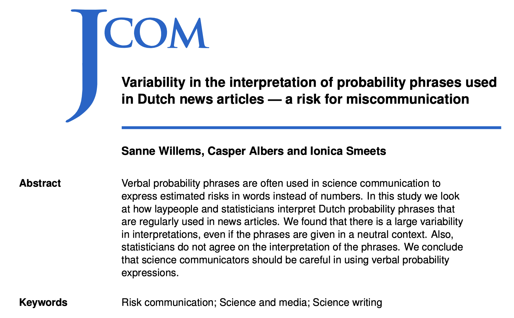
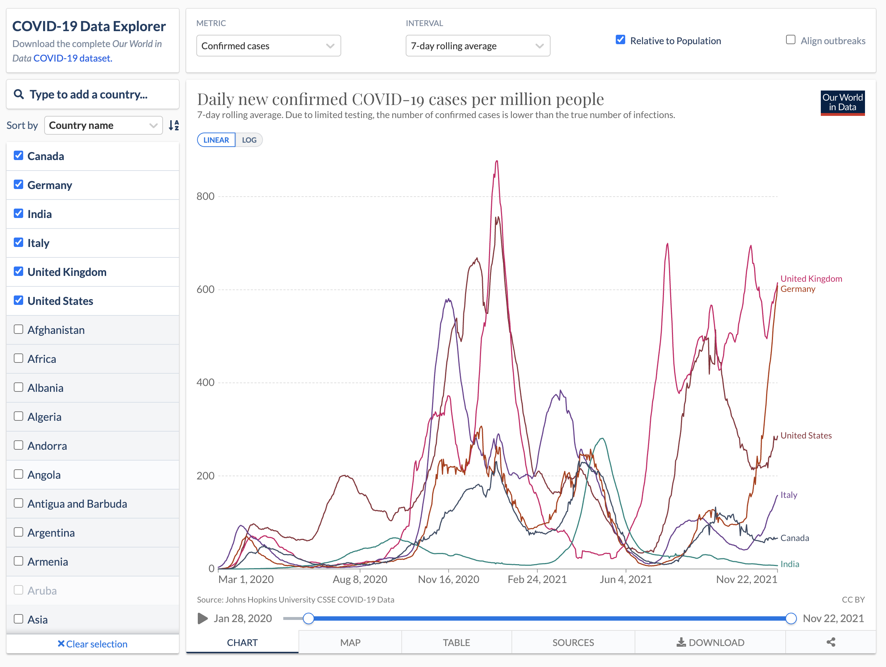
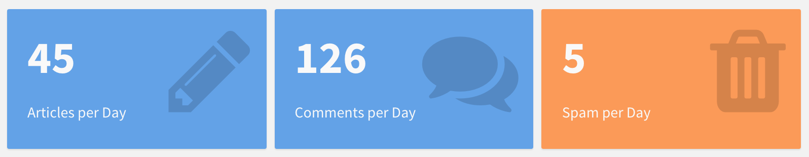
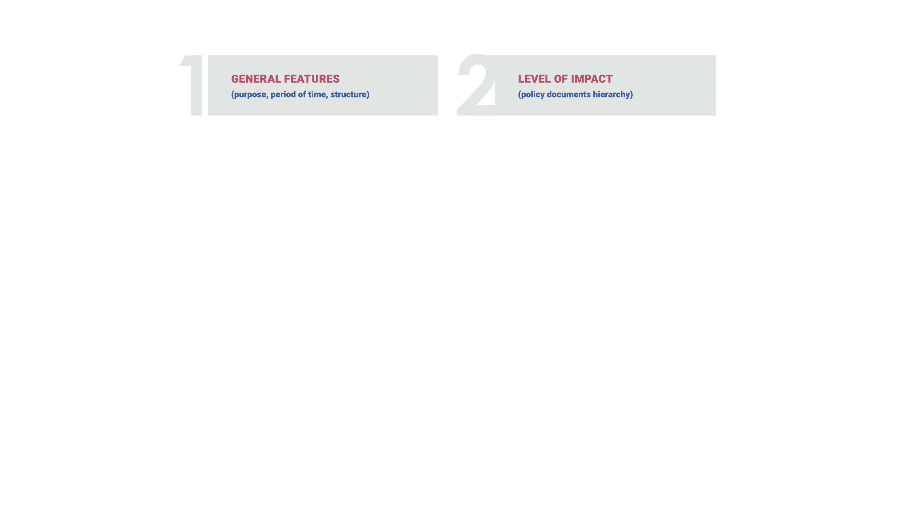

```{css, echo=FALSE} 
@media print { # print out incremental slides; see https://stackoverflow.com/questions/56373198/get-xaringan-incremental-animations-to-print-to-pdf/56374619#56374619
.has-continuation {
display: block !important;
}
}
```

```{r setup, include=FALSE}
# figures formatting setup
options(htmltools.dir.version = FALSE)
library(knitr)
opts_chunk$set(
  prompt = T,
  fig.align="center", #fig.width=6, fig.height=4.5, 
  # out.width="748px", #out.length="520.75px",
  dpi=300, #fig.path='Figs/',
  cache=T, #echo=F, warning=F, message=F
  engine.opts = list(bash = "-l")
)

## Next hook based on this SO answer: https://stackoverflow.com/a/39025054
knit_hooks$set(
  prompt = function(before, options, envir) {
    options(
      prompt = if (options$engine %in% c('sh','bash')) '$ ' else 'R> ',
      continue = if (options$engine %in% c('sh','bash')) '$ ' else '+ '
    )
  })

library(tidyverse)
library(hrbrthemes)
library(fontawesome)
library(RefManageR)

RefManageR::BibOptions(
  check.entries = FALSE,  
  bib.style = "authoryear", 
  cite.style = "authoryear", 
  style = "markdown",
  hyperlink = TRUE, 
  dashed = TRUE)

bib <-  RefManageR::ReadBib("grateful-refs.bib")


```

```{r setup-2, include=FALSE}
# figures formatting setup
options(htmltools.dir.version = FALSE)
library(knitr)
opts_chunk$set(
  comment = "  ",
  prompt = T,
  fig.align="center", #fig.width=6, fig.height=4.5, 
  # out.width="748px", #out.length="520.75px",
  dpi=300, #fig.path='Figs/',
  cache=F, #echo=F, warning=F, message=F
  engine.opts = list(bash = "-l")
  )

## Next hook based on this SO answer: https://stackoverflow.com/a/39025054
knit_hooks$set(
  prompt = function(before, options, envir) {
    options(
      prompt = if (options$engine %in% c('sh','bash')) '$ ' else 'R> ',
      continue = if (options$engine %in% c('sh','bash')) '$ ' else '+ '
      )
})

library(tidyverse)
library(nycflights13)
library(kableExtra)
```

```{r setup-3, include=FALSE}
# figures formatting setup
options(htmltools.dir.version = FALSE)
library(knitr)
opts_chunk$set(
  comment = "  ",
  prompt = T,
  fig.align="center", #fig.width=6, fig.height=4.5, 
  # out.width="748px", #out.length="520.75px",
  dpi=300, #fig.path='Figs/',
  cache=F, #echo=F, warning=F, message=F
  engine.opts = list(bash = "-l")
  )

## Next hook based on this SO answer: https://stackoverflow.com/a/39025054
knit_hooks$set(
  prompt = function(before, options, envir) {
    options(
      prompt = if (options$engine %in% c('sh','bash')) '$ ' else 'R> ',
      continue = if (options$engine %in% c('sh','bash')) '$ ' else '+ '
      )
})

library(tidyverse)
library(kableExtra)
```


# Table of contents

<br>

1. [Communicating data science](#communication)

2. [Statistical communication](#stats)

3. [Written communication](#written-comm)

4. [Interactive communication with dashboards](#dashboards)


---

class: inverse, center, middle
name: qr-code
background-color: #FFFFFF


<div align="center">
<br>
<b style="color:#000000;">Let's take a brief assessment about what we have learned</b><br>

</div>


<!-- ############################################ -->
---
class: inverse, center, middle
name: communication

# Communicating data science
<html><div style='float:left'></div><hr color='#EB811B' size=1px style="width:1000px; margin:auto;"/></html>


---
# The final piece of the pipeline

.pull-left[

**Preparatory work**

  - **Problem definition** predict, infer, describe
  - **Design** conceptualize, build data collection device
  - **Data collection** recruit, collect, monitor

**Data operation**

   - **Wrangle**: import, tidy, manipulate
   - **Explore**: visualize, describe, discover
   - **Model**: build, test, infer, predict

**Dissemination**

  - 👉👉 **Communicate**: to the public, media, policymakers
  - 👉👉 **Publish**: articles, blogs, software
  - **Productize**: make usable, robust, scalable

]

.pull-right-center[
<br><br><br>
<div align="center">

</div>
]


---
# Communicating data science

<div align="center" style="font-size:40px">
<br>
<br>
<b>"[I]t doesn’t matter how great<br>your analysis is unless you can explain it to others:<br>you need to <b>communicate</b> your results."</b>
<br><br>
</div>
<span style="float:right;">Hadley Wickham & Garrett Grolemund, <i>R for Data Science</i></span>


---
# Lasswell model of communication **for DS**   

Laswell's framework of communication<sup>1</sup> dissects the task of communication along the following dimensions: (1) Who communicates (2) what (3) in what form (4) to whom (5) to what effect?

Let's apply this to us. Data scientists communicate...
</div>

.footnote[<sup>1</sup>HD Lasswell. 1948. The structure and function of communication in society. In <i>The communication of ideas</i> (ed. Bryson L), 37-51.]

--

.pull-left-vsmall[
### What
- Estimates
- Uncertainty
- Model implications
- Substantive knowledge
- Product
- Themselves
]

--

.pull-left-vsmall[
### How
- Spoken word
- Technical reports
- Academic papers
- Web applications
- Policy briefs
]

--

.pull-left-vsmall[
### To whom
- The public
- The media
- Policymakers
- Other scientists
- Managers / co-workers
]

--

.pull-left-vsmall[
### To what end
- Inform
- Influence
- Instruct
- Motivate
- Monitor
- Document
]

--

What, how, and to what end you communicate depends on your <b>audience/stakeholders</b> because they will differ in interest, contextual knowledge, data literacy, and motives.


<!-- ############################################ -->
---
class: inverse, center, middle
name: communication

# Statistical communication
<html><div style='float:left'></div><hr color='#EB811B' size=1px style="width:1000px; margin:auto;"/></html>

---
# Statistical communication

.pull-left[
### <b>What</b> we communicate
- The quantity of interest
- The selection/generation of data
- The empirical setup
- The model mechanics and results (estimates/predictions/uncertainty)

### Common challenges
- There's epistemological and statistical uncertainty.
- Effect sizes have implications that are often not easy to grasp.
- Conclusions about data science output crucially hinge on the validity of design aspects, which are extremely difficult to communicate.
]

.pull-right-center[
<div align="center">
<br>

</div>
`Credit` [Polack et al. 2020, NEJM](https://www.nejm.org/doi/full/10.1056/nejmoa2034577)
]


---
# Uncertainty

.pull-left[

<br><br>
### Question to reflect on

Thinking about the task of publicly forecasting the U.S. presidential election using polling data, what kinds of uncertainty would you have to deal with as a forecaster?

<div align="center">
<br>

</div>
]

.pull-right-center[
<div align="center">
<br>

</div>
`Credit` [NYTimes.com at 9:20 p.m. Nov. 8, 2016](https://www.axios.com/spinning-needle-election-night-victory-d285c0da-db86-46b4-86bf-2253c5d661c2.html)
]


---
# Example: FiveThirtyEight 2020 election forecast

.pull-center[
<div align="center">
<br>

</div>
`Source` [FiveThirtyEight](https://projects.fivethirtyeight.com/2020-election-forecast/)
]


---
count: false

# Example: FiveThirtyEight 2020 election forecast

.pull-center[
<div align="center">
<br>

</div>
`Source` [FiveThirtyEight](https://projects.fivethirtyeight.com/2020-election-forecast/)
]


---
count: false

# Example: FiveThirtyEight 2020 election forecast

.pull-center[
<div align="center">
<br>

</div>
`Source` [FiveThirtyEight](https://projects.fivethirtyeight.com/2020-election-forecast/)
]


---
count: false

# Example: FiveThirtyEight 2020 election forecast

.pull-center[
<div align="center">
<br>

</div>
`Source` [FiveThirtyEight](https://projects.fivethirtyeight.com/2020-election-forecast/)
]


---
count: false

# Example: FiveThirtyEight 2020 election forecast

.pull-center[
<div align="center">
<br>

</div>
`Source` [FiveThirtyEight](https://projects.fivethirtyeight.com/2020-election-forecast/)
]


---
count: false
# Example: FiveThirtyEight 2020 election forecast

.pull-center[
<div align="center">
<br>

</div>
`Source` [FiveThirtyEight](https://projects.fivethirtyeight.com/2020-election-forecast/)
]


---
count: false
# Example: FiveThirtyEight 2020 election forecast

.pull-center[
<div align="center">
<br>

</div>
`Source` [FiveThirtyEight](https://projects.fivethirtyeight.com/2020-election-forecast/)
]

---
# Example: What is behind the visuals?

.pull-left-center[
<div align="center">
<br>

</div>
`Source` [FiveThirtyEight](https://fivethirtyeight.com/features/how-fivethirtyeights-2020-presidential-forecast-works-and-whats-different-because-of-covid-19/)

]

---
count: false
# Example: What is behind the visuals?

.pull-left-center[
<div align="center">
<br>

</div>
`Source` [FiveThirtyEight](https://fivethirtyeight.com/features/how-fivethirtyeights-2020-presidential-forecast-works-and-whats-different-because-of-covid-19/)
]


---
count: false
# Example: What is behind the visuals?

.pull-left-center[
<div align="center">
<br>

</div>
`Source` [FiveThirtyEight](https://fivethirtyeight.com/features/how-fivethirtyeights-2020-presidential-forecast-works-and-whats-different-because-of-covid-19/)
]

---
count: false
# Example: What is behind the visuals?

.pull-left-center[
<div align="center">
<br>

</div>
`Source` [FiveThirtyEight](https://fivethirtyeight.com/features/how-fivethirtyeights-2020-presidential-forecast-works-and-whats-different-because-of-covid-19/)
]

---
count: false
# Example: What is behind the visuals?

.pull-left-center[
<div align="center">
<br>

</div>
`Source` [FiveThirtyEight](https://fivethirtyeight.com/features/how-fivethirtyeights-2020-presidential-forecast-works-and-whats-different-because-of-covid-19/)
]

--
.pull-right-center[
<div align="center">
<br><br><br><br>

</div>
]


---
# Uncertainty

.pull-left[
### What we are uncertain about

- **Measurement** → uncertainty in single variables
- **Model specification** → uncertainty across multiple variables and how they connect
- **Parameter estimates** → uncertainty about bias and precision
- **Model outcomes** → uncertainty about (out-of-sample) fit
- **Generalizability** to other samples, the future

Depending on the empirical setup, various specific **sources of error** might enter (e.g., [survey data](https://academic.oup.com/poq/article/74/5/849/1817502), [digital trace data](https://academic.oup.com/poq/article/85/S1/399/6359490)).
]

.pull-right-center[
<div align="center">
<br>

</div>
`Credit` [Robert Groves, Total Survey Error](https://academic.oup.com/poq/article/74/5/849/1817502?login=true)
]


---
# Communicating uncertainty

.pull-left[
.hlred[The difficulty of communicating uncertainty]

- The concept is **complex**. Not all people think in probabilistic terms.
- **Many humans are bad at understanding (conditional and unconditional) probabilities**.
- Adding **information about uncertainty might distract**, confuse, and undermine trust.
]

.pull-right-center[
<div align="center">
<br>

</div>
`Credit` [Richard McElreath](https://twitter.com/rlmcelreath/status/1462719976259919879)
]


---
# Communicating uncertainty (cont.)

.pull-left-center[
### Visualizing uncertainty

<div align="center">
<br>

</div>

<div align="center">

</div>

<div align="center">

</div>

`Source` [Claus Wilke](https://clauswilke.com/dataviz/visualizing-uncertainty.html)
]


.pull-right-center[
### Uncertainty by numbers

<div align="center">
<br>

</div>


### Strategies by precision

<div align="center">
<br>

</div>
`Credit` [van der Bles et al. 2019](http://doi.org/10.1098/rsos.181870)
]


---
# Communicating probabilities in text form

.pull-left-center[
<div align="center">
<br>

</div>
`Source` [Willems et al. 2020](https://doi.org/10.22323/2.19020203)

]

.pull-right-center[
<div align="center">
<br>

</div>
]


<!-- ############################################ -->
---
class: inverse, center, middle
name: written-comm

# Written communication in data science workflows
<html><div style='float:left'></div><hr color='#EB811B' size=1px style="width:1000px; margin:auto;"/></html>

---
# Written communication

.pull-left[

## When to communicate in writing

- For communicating to **the public and decision makers**, who want to focus on the conclusions, not the code behind the analysis.

- For collaborating with **other data scientists**, who are interested in both your conclusions and how you reached them (i.e. the code).


]


.pull-right-center[
<div align="center">
<br>

</div>
]


---
# Written communication

.pull-left[

## When to communicate in writing

- For communicating to **the public and decision makers**, who want to focus on the conclusions, not the code behind the analysis.

- For collaborating with **other data scientists**, who are interested in both your conclusions and how you reached them (i.e. the code).

## Authoring as part of the workflow

- Many different formats, including reports, briefs, blog posts, books, presentations, ...
- .i-pink[Form follows function]: the write-up tool should talk to the analytic toolset.
]


.pull-right-center[
<div align="center">
<br>

</div>
]


---
# The continuum of written data science communication

<br><br>

.pull-left-vvsmall[
<div align="center">
<br><br>

</div>
]

.pull-left-vvsmall[
<div align="center">
<br><br>

</div>
]


.pull-left-vvsmall[
<div align="center">
<br><br>

</div>
]


.pull-left-vvsmall[
<div align="center">
<br><br>

</div>
]


.pull-left-vvsmall[
<div align="center">
<br><br>

</div>
]

.pull-left-vvsmall[
<div align="center">

</div>
]


<br>

.pull-left-vvsmall[
**Book**
<br>
<div align="center">

</div>
]

.pull-left-vvsmall[
**Conference proceeding, journal article**
<br>
<div align="center">

</div>
]

.pull-left-vvsmall[
**Technical report**
<br>
<div align="center">

</div>
]

.pull-left-vvsmall[
**Executive summary**
<br>
<div align="center">

</div>
]

.pull-left-vvsmall[
**Dashboard**
<br>
<div align="center">

</div>
]

.pull-left-vvsmall[
**Tweet**
<br>
<div align="center">

</div>
]


---
# Programmatic solutions for communicating

.pull-left[

### Open-source software can help

- R Markdown (and the `rmarkdown` package) helps you create dynamic analysis documents that combine code, rendered output (such as figures), and prose. 
- You can use it to
  - Do data science interactively with notebooks.
  - Modify the layout of your report.
  - Communicate your results with others.
- You take care of content, R Markdown of format.

### More resources

- The [official website](https://rmarkdown.rstudio.com/)
- The [R Markdown Cookbook](https://bookdown.org/yihui/rmarkdown-cookbook/)
- [R Markdown - The Definitive Guide](https://bookdown.org/yihui/rmarkdown/)
]

--

.pull-right[

### The possibilities for communicating in data sicence workflows are immense

- R Markdown can do much more than reports. You can use it to author
  - Reports (in PDF, HTML, Word, etc.)
  - Interactive documents
  - Dashboards
  - Slideshows
  - Books
  - Websites
- It stands on the shoulders of [Pandoc](https://pandoc.org/), a program that converts markup files into virtually any other format.

<div align="center">

</div>
]


---
# RMarkdown formats

.pull-left[
.pull-left-wide[
### bookdown
- A [package](https://bookdown.org/) that facilitates writing books and long-form articles/reports with R Markdown.
- See [here](https://bookdown.org/home/archive/) for an overview of books written with `bookdown`.
]
.pull-right-small[
<br>
<div align="center">

</div>
]
]

.pull-right[
.pull-left-wide[
### blogdown
- A [package](https://bookdown.org/yihui/blogdown/) that lets you create websites (not only blogs!) using R Markdown.
- It integrates [Hugo
](https://gohugo.io/) (or other site generators).
]
.pull-right-small[
<br>
<div align="center">

</div>
]
]

.pull-left[
.pull-left-wide[
<br>
### pagedown
- A [package](https://pagedown.rbind.io/) that lets you paginate the HTML output of R Markdown with CSS for print (PDF).
- Lots of different [templates](https://github.com/rstudio/pagedown) available.
]
.pull-right-small[
<br><br>
<div align="center">

</div>
]
]

.pull-right[
.pull-left-wide[
<br>
### xaringan
- A [package](https://github.com/yihui/xaringan) that lets you crate slideshows with [remark.js](https://remarkjs.com/) through R Markdown.
- These slides have been created using this package.
]
.pull-right-small[
<br><br>
<div align="center">

</div>
]
]


---
# The next generation of technical publishing: Quarto

.pull-left-wide[

### What's Quarto?

- [Quarto](https://quarto.org/) is software developed at [Posit](https://posit.co/), the company behind RStudio. 
- It's the "next generation of R Markdown" and also built on Pandoc. If you know R Markdown well, you already know Quarto well.
- It facilitates embedding code and output from R, Python, Julia, and other languages.
- It combines the functionality of R Markdown and all the other tools (bookdown, xaringan, etc.) into one single consistent system.
- Quarto is still fairly new and under active development. More and more [extensions](https://quarto.org/docs/extensions/) are coming out that increase the flexibility of the suite.
- Check out the comprehensive [guide](https://quarto.org/docs/guide/) to learn more.

### Quarto and Jupyter

- Quarto's support for both Knitr and Jupyter means that you can use it to create documentation projects that contain content from both systems.
- Something to keep in mind next semester and going forward! :)
]

.pull-right-small[
<div align="center">
<br>

<br>

</div>
]


<!-- ############################################ -->
---
class: inverse, center, middle
name: dashboards

# Interactive communication with dashboards
<html><div style='float:left'></div><hr color='#EB811B' size=1px style="width:1000px; margin:auto;"/></html>


---
background-image: url("../pics/delorean-dashboard.png")
background-size: contain
background-color: #000000

# What are dashboards?


---
# What are dashboards?

.pull-left-wide[
### Yeah, what are they really?
- A (business or data) [dashboard](https://en.wikipedia.org/wiki/Dashboard_(business) is a GUI that provides high-level overviews of performance indicators or other quantities of interest. 

]

.pull-right-small-center[
<div align="center">
<br>

</div>
`Credit` [Tim Green](https://commons.wikimedia.org/wiki/File:MG_interior_%2829094966463%29.jpg)

<div align="center">
<br>

</div>
`Credit` [HelicalInsight OpenSourceBI](https://commons.wikimedia.org/wiki/File:Marketing_dashboard.png)
]


---
# What are dashboards?

.pull-left-wide[
### Yeah, what are they really?
- A (business or data) [dashboard](https://en.wikipedia.org/wiki/Dashboard_(business) is a GUI that provides high-level overviews of performance indicators or other quantities of interest. 
]

.pull-right-small-center[
<div align="center">
<br>

</div>
`Credit` [Tim Green](https://commons.wikimedia.org/wiki/File:MG_interior_%2829094966463%29.jpg)

<div align="center">
<br>

</div>
`Credit` [HelicalInsight OpenSourceBI](https://commons.wikimedia.org/wiki/File:Marketing_dashboard.png)
]


---
# What are dashboards?

.pull-left-wide[
### Yeah, what are they really?
- A (business or data) [dashboard](https://en.wikipedia.org/wiki/Dashboard_(business) is a GUI that provides high-level overviews of performance indicators or other quantities of interest. 
- It's a **monitoring** (and not so much analysis) **tool**.
]

.pull-right-small-center[
<div align="center">
<br>

</div>
`Credit` [Tim Green](https://commons.wikimedia.org/wiki/File:MG_interior_%2829094966463%29.jpg)

<div align="center">
<br>

</div>
`Credit` [HelicalInsight OpenSourceBI](https://commons.wikimedia.org/wiki/File:Marketing_dashboard.png)
]


---
# What are dashboards?

.pull-left-wide[
### Yeah, what are they really?
- A (business or data) [dashboard](https://en.wikipedia.org/wiki/Dashboard_(business) is a GUI that provides high-level overviews of performance indicators or other quantities of interest. 
- It's a **monitoring** (and not so much analysis) **tool**.
- Think of dashboards as a **mash-up of data visualization and report**.
]

.pull-right-small-center[
<div align="center">
<br>

</div>
`Credit` [Tim Green](https://commons.wikimedia.org/wiki/File:MG_interior_%2829094966463%29.jpg)

<div align="center">
<br>

</div>
`Credit` [HelicalInsight OpenSourceBI](https://commons.wikimedia.org/wiki/File:Marketing_dashboard.png)
]


---
# What are dashboards?

.pull-left-wide[
### Yeah, what are they really?
- A (business or data) [dashboard](https://en.wikipedia.org/wiki/Dashboard_(business) is a GUI that provides high-level overviews of performance indicators or other quantities of interest. 
- It's a **monitoring** (and not so much analysis) **tool**.
- Think of dashboards as a **mash-up of data visualization and report**.
- Dashboards are increasingly popular in businesses and organizations to **synthesize data points** from operative units (for strategic and analytical purposes).
]

.pull-right-small-center[
<div align="center">
<br>

</div>
`Credit` [Tim Green](https://commons.wikimedia.org/wiki/File:MG_interior_%2829094966463%29.jpg)

<div align="center">
<br>

</div>
`Credit` [HelicalInsight OpenSourceBI](https://commons.wikimedia.org/wiki/File:Marketing_dashboard.png)
]


---
# What are dashboards?

.pull-left-wide[
### Yeah, what are they really?
- A (business or data) [dashboard](https://en.wikipedia.org/wiki/Dashboard_(business) is a GUI that provides high-level overviews of performance indicators or other quantities of interest. 
- It's a **monitoring** (and not so much analysis) **tool**.
- Think of dashboards as a **mash-up of data visualization and report**.
- Dashboards are increasingly popular in businesses and organizations to **synthesize data points** from operative units (for strategic and analytical purposes).
- Data journalism has started to embrace dashboards in the context of [elections](https://edition.cnn.com/election/2020/results/president), the [COVID-19 pandemic](https://covid19.who.int/), and [sports](https://projects.fivethirtyeight.com/2022-world-cup-predictions/).
]

.pull-right-small-center[
<div align="center">
<br>

</div>
`Credit` [Tim Green](https://commons.wikimedia.org/wiki/File:MG_interior_%2829094966463%29.jpg)

<div align="center">
<br>

</div>
`Credit` [HelicalInsight OpenSourceBI](https://commons.wikimedia.org/wiki/File:Marketing_dashboard.png)
]


---
# What are dashboards?

.pull-left-wide[
### Yeah, what are they really?
- A (business or data) [dashboard](https://en.wikipedia.org/wiki/Dashboard_(business) is a GUI that provides high-level overviews of performance indicators or other quantities of interest. 
- It's a **monitoring** (and not so much analysis) **tool**.
- Think of dashboards as a **mash-up of data visualization and report**.
- Dashboards are increasingly popular in businesses and organizations to **synthesize data points** from operative units (for strategic and analytical purposes).
- Data journalism has started to embrace dashboards in the context of [elections](https://edition.cnn.com/election/2020/results/president), the [COVID-19 pandemic](https://covid19.who.int/), and [sports](https://projects.fivethirtyeight.com/2022-world-cup-predictions/).
- **Common features** are:
  - Accessibility via web browser
  - Featuring of interactives
  - Heavy focus on comparative visualization
  - Provision of trends on key performance indicators (KPIs)
]

.pull-right-small-center[
<div align="center">
<br>

</div>
`Credit` [Tim Green](https://commons.wikimedia.org/wiki/File:MG_interior_%2829094966463%29.jpg)

<div align="center">
<br>

</div>
`Credit` [HelicalInsight OpenSourceBI](https://commons.wikimedia.org/wiki/File:Marketing_dashboard.png)
]

---
# Why are dashboards?

.pull-left[
### Why are they a thing?

- There is increasing **abundance of data** (often process-generated) that cannot speak for itself.
]

.pull-right-center[
<div align="center">
<br><br><br>

</div>
`Credit` [towardsdatascience.com](https://towardsdatascience.com/5-most-popular-business-intelligence-bi-tools-in-2019-4e060b98039a)
]

---
# Why are dashboards?

.pull-left[
### Why are they a thing?

- There is increasing **abundance of data** (often process-generated) that cannot speak for itself.
- If used wisely, these data can provide an **important part of business intelligence** and a basis for high-level [evidence-based decision-making](https://stephanieevergreen.com/dashboard-conversation/).
]

.pull-right-center[
<div align="center">
<br><br><br>

</div>
`Credit` [towardsdatascience.com](https://towardsdatascience.com/5-most-popular-business-intelligence-bi-tools-in-2019-4e060b98039a)
]

---
# Why are dashboards?

.pull-left[
### Why are they a thing?

- There is increasing **abundance of data** (often process-generated) that cannot speak for itself.
- If used wisely, these data can provide an **important part of business intelligence** and a basis for high-level [evidence-based decision-making](https://stephanieevergreen.com/dashboard-conversation/).
- Provide continuous quantification of indicators of interest (→ **monitoring**).
]

.pull-right-center[
<div align="center">
<br><br><br>

</div>
`Credit` [towardsdatascience.com](https://towardsdatascience.com/5-most-popular-business-intelligence-bi-tools-in-2019-4e060b98039a)
]

---
# Why are dashboards?

.pull-left[
### Why are they a thing?

- There is increasing **abundance of data** (often process-generated) that cannot speak for itself.
- If used wisely, these data can provide an **important part of business intelligence** and a basis for high-level [evidence-based decision-making](https://stephanieevergreen.com/dashboard-conversation/).
- Provide continuous quantification of indicators of interest (→ **monitoring**).
- **Reduce information differential** between analysts and stakeholders.
]

.pull-right-center[
<div align="center">
<br><br><br>

</div>
`Credit` [towardsdatascience.com](https://towardsdatascience.com/5-most-popular-business-intelligence-bi-tools-in-2019-4e060b98039a)
]

---
# Why are dashboards?

.pull-left[
### Why are they a thing?

- There is increasing **abundance of data** (often process-generated) that cannot speak for itself.
- If used wisely, these data can provide an **important part of business intelligence** and a basis for high-level [evidence-based decision-making](https://stephanieevergreen.com/dashboard-conversation/).
- Provide continuous quantification of indicators of interest (→ **monitoring**).
- **Reduce information differential** between analysts and stakeholders.
- Also, **measuring the health of organizations** can help stay in control (if only as a performative act) and satisfy managers' need for micromanaging.
]

.pull-right-center[
<div align="center">
<br><br><br>

</div>
`Credit` [towardsdatascience.com](https://towardsdatascience.com/5-most-popular-business-intelligence-bi-tools-in-2019-4e060b98039a)
]


---
# Dashboards in the wild

.pull-center[
<div align="center">
<br>

</div>
`Credit` [geckoboard.com](https://www.geckoboard.com/dashboard-examples/company/company-dashboard/)
]

---
# Dashboards in the wild

.pull-center[
<div align="center">
<br>

</div>
`Credit` [geckoboard.com](https://www.geckoboard.com/dashboard-examples/company/recruitment-dashboard/)
]


---
# Dashboards in the wild

.pull-center[
<div align="center">
<br>

</div>
`Credit` [idashboards.com](https://www.idashboards.com/dashboard-examples/healthcare-hospital-billing-scorecard/)
]


---
# Dashboards in the wild

.pull-center[
<div align="center">
<br>

</div>
`Credit` [idashboards.com](https://www.idashboards.com/dashboard-examples/government-parks-dashboard/)
]

---
# Dashboards in the wild

.pull-center[
<div align="center">
<br>

</div>
`Credit` [Stephen Few](http://perceptualedge.com/articles/Whitepapers/Dashboard_Design.pdf)
]


---
# Dashboards in the wild

.pull-center[
<div align="center">
<br>

</div>
`Credit` [idashboards.com](https://www.matillion.com/resources/blog/dashboard-examples-the-good-the-bad-and-the-ugly)
]


---
# Dashboards in the wild

.pull-center[
<div align="center">
<br>

</div>
`Credit` [carmel.es](https://carmel.es/2018/10/26/6-examples-of-bad-dashboard-designs/
)
]


---
# The problem(s) with dashboards

.pull-left[
## Design challenges

- **They say too little.** Loss of information is [fatal](https://stephanieevergreen.com/problem-with-dashboards/) for good decision-making when aggregating results into few KPIs.
- **They say too much** (irrelevant things). 
- Dashboards often fail not in technology but in communication (rooted in poor design).
- "Dashboards are not for show. No amount of cuteness and technical wizardry can substitute for clear communication." [Stephen Few](http://blogs.ischool.berkeley.edu/i247s12/files/2012/01/Dashboard-Design-Overview-Presentation.pdf), [Perceptual Edge](https://perceptualedge.com)
- Dashboards are a subgenre of data viz, so **all rules of good/bad viz apply**.
- So, there is hope since we do know a bit about how to design good visuals. (See [here](https://stephanieevergreen.com/dashboard-conversation/) for a nice case study on improving the design of a dashboard.)
]

--

.pull-right[
## Analytic challenges

- Dashboards cater to the desire to be able to make good decisions on the basis of few selected metrics.
- This logic reflects a **gross simplification of reality**. 
- All challenges that pop up in careful analytic work - issues of selection, measurement, causality, predictiveness - are still valid but will be obscured when aggregating data. 
- Simple metrics can still be useful, but often **you need contextual knowledge** (which is difficult to communicate in dashboards).
- Another consequence of "dashboarding" business intelligence can be that by making decisions a function of metrics, they stop working well because they will be gamed.
]

---
# Thoughtful dashboard design and usage

.footnote[<sup>1</sup>Source: [Stephen Few/Perceptual Edge](http://perceptualedge.com/articles/misc/Dashboard_Design_Requirements_Questionnaire.pdf)
]

.pull-left[
.hlred[Checklist before you start<sup>1</sup>]

1. Are you tackling a monitoring task that needs your data/metrics to be updated frequently?

2. Who will use the dashboard and to what end? What questions will they use it to answer? What actions will they take in response to these answers?

3. What specific information should be displayed, and is it meaningful without much context?

4. What could lead to the metrics being wrong/misleading?
]

--

.pull-right[
## Design advice

- Minimize distractions.

]

---
# Thoughtful dashboard design and usage

.footnote[<sup>1</sup>Source: [Stephen Few/Perceptual Edge](http://perceptualedge.com/articles/misc/Dashboard_Design_Requirements_Questionnaire.pdf)
]

.pull-left[
.hlred[Checklist before you start<sup>1</sup>]

1. Are you tackling a monitoring task that needs your data/metrics to be updated frequently?

2. Who will use the dashboard and to what end? What questions will they use it to answer? What actions will they take in response to these answers?

3. What specific information should be displayed, and is it meaningful without much context?

4. What could lead to the metrics being wrong/misleading?
]


.pull-right[
## Design advice

- Minimize distractions.
- Focus on meaningful quantities of interest, not the ones that look cool.
]

---
# Thoughtful dashboard design and usage

.footnote[<sup>1</sup>Source: [Stephen Few/Perceptual Edge](http://perceptualedge.com/articles/misc/Dashboard_Design_Requirements_Questionnaire.pdf)
]

.pull-left[
.hlred[Checklist before you start<sup>1</sup>]

1. Are you tackling a monitoring task that needs your data/metrics to be updated frequently?

2. Who will use the dashboard and to what end? What questions will they use it to answer? What actions will they take in response to these answers?

3. What specific information should be displayed, and is it meaningful without much context?

4. What could lead to the metrics being wrong/misleading?
]


.pull-right[
## Design advice

- Minimize distractions.
- Focus on meaningful quantities of interest, not the ones that look cool.
- Don't overload with information.
]

---
# Thoughtful dashboard design and usage

.footnote[<sup>1</sup>Source: [Stephen Few/Perceptual Edge](http://perceptualedge.com/articles/misc/Dashboard_Design_Requirements_Questionnaire.pdf)
]

.pull-left[
.hlred[Checklist before you start<sup>1</sup>]

1. Are you tackling a monitoring task that needs your data/metrics to be updated frequently?

2. Who will use the dashboard and to what end? What questions will they use it to answer? What actions will they take in response to these answers?

3. What specific information should be displayed, and is it meaningful without much context?

4. What could lead to the metrics being wrong/misleading?
]


.pull-right[
## Design advice

- Minimize distractions.
- Focus on meaningful quantities of interest, not the ones that look cool.
- Don't overload with information.
- Apply all rules of good data viz.
]

---
# Thoughtful dashboard design and usage

.footnote[<sup>1</sup>Source: [Stephen Few/Perceptual Edge](http://perceptualedge.com/articles/misc/Dashboard_Design_Requirements_Questionnaire.pdf)
]

.pull-left[
.hlred[Checklist before you start<sup>1</sup>]

1. Are you tackling a monitoring task that needs your data/metrics to be updated frequently?

2. Who will use the dashboard and to what end? What questions will they use it to answer? What actions will they take in response to these answers?

3. What specific information should be displayed, and is it meaningful without much context?

4. What could lead to the metrics being wrong/misleading?
]


.pull-right[
## Design advice

- Minimize distractions.
- Focus on meaningful quantities of interest, not the ones that look cool.
- Don't overload with information.
- Apply all rules of good data viz.
- Use interactives with care (e.g., to make optional content  conditionally visible)
]

---
# Thoughtful dashboard design and usage

.footnote[<sup>1</sup>Source: [Stephen Few/Perceptual Edge](http://perceptualedge.com/articles/misc/Dashboard_Design_Requirements_Questionnaire.pdf)
]

.pull-left[
.hlred[Checklist before you start<sup>1</sup>]

1. Are you tackling a monitoring task that needs your data/metrics to be updated frequently?

2. Who will use the dashboard and to what end? What questions will they use it to answer? What actions will they take in response to these answers?

3. What specific information should be displayed, and is it meaningful without much context?

4. What could lead to the metrics being wrong/misleading?
]


.pull-right[
## Design advice

- Minimize distractions.
- Focus on meaningful quantities of interest, not the ones that look cool.
- Don't overload with information.
- Apply all rules of good data viz.
- Use interactives with care (e.g., to make optional content  conditionally visible)
- Try not to exceed the boundaries of a single screen. 
]

---
# Thoughtful dashboard design and usage

.footnote[<sup>1</sup>Source: [Stephen Few/Perceptual Edge](http://perceptualedge.com/articles/misc/Dashboard_Design_Requirements_Questionnaire.pdf)
]

.pull-left[
.hlred[Checklist before you start<sup>1</sup>]

1. Are you tackling a monitoring task that needs your data/metrics to be updated frequently?

2. Who will use the dashboard and to what end? What questions will they use it to answer? What actions will they take in response to these answers?

3. What specific information should be displayed, and is it meaningful without much context?

4. What could lead to the metrics being wrong/misleading?
]


.pull-right[
## Design advice

- Minimize distractions.
- Focus on meaningful quantities of interest, not the ones that look cool.
- Don't overload with information.
- Apply all rules of good data viz.
- Use interactives with care (e.g., to make optional content  conditionally visible)
- Try not to exceed the boundaries of a single screen. 
- Ensure desktop/mobile screen responsiveness.
]


---
# Dashboards in the wild: COVID-19 edition

.pull-left-center[
<div align="center">

</div>
`Credit` [NY Times](https://www.nytimes.com/interactive/2021/us/covid-cases-deaths-tracker.html
)
]

--

.pull-right-center[
<div align="center">
<br>

</div>
`Credit` [Our World in Data](https://ourworldindata.org/explorers/coronavirus-data-explorer?zoomToSelection=true)
]


---
# Dashboards in the wild: COVID-19 edition

.pull-left-small-center[
<div align="center">
<br>

</div>
`Credit` [SZ Online](https://www.sueddeutsche.de/wissen/corona-zahlen-1.4844448)
]

--

.pull-right-wide-center[
<div align="center">
<br>

</div>
`Credit` [ZEIT Online](https://www.zeit.de/wissen/corona-karte-deutschland-aktuelle-zahlen-landkreise)
]


---
# Dashboards: another example

<div align="center">
<br>

</div>

`Source` [Lonny Chen, NECTA PSLE Dashboard 2022 |  https://bit.ly/psle2022mvp](https://bit.ly/psle2022mvp)


---
# Dashboards with R

.pull-left[
.pull-left-vwide[
### <tt>flexdashboard</tt> package
- Overview [here](https://pkgs.rstudio.com/flexdashboard).
- Good for easy dashboard building
- Just a document that looks like a dashboard
- Can be compiled into a static file (just like regular Markdown)
- Can only run interactive code client-fleside (in embedded JavaScript)
- Shiny  and `htmlwidgets` (`leaflet`, `plotly`, `highcharter`, etc.)  can be integrated (with all the up- and downsides)
]
.pull-right-vsmall[
<br>
<div align="center">

</div>
]
<br>
<div align="center">


</div>
]

.pull-right[
.pull-left-vwide[
### <tt>shiny</tt> package
- Overview [here](https://shiny.rstudio.com/).
- More complex to program, but the best option for complex apps.
- Can implement any layout.
- Needs a server behind it to execute R code on user input. 
- Can run interactive code either by processing serverside (in R) or clientside (in embedded JavaScript).
- The [shinydashboard](https://rstudio.github.io/shinydashboard/) package provides another way to create dashboards with Shiny.
]
.pull-right-vsmall[
<br>
<div align="center">

</div>
]
<br>
<div align="center">


</div>
]


---
# Dashboards with <tt>flexdashboard</tt>

.pull-left-vsmall[
### Functionality

- Use simple R Markdown to build a dashboard.
]

.pull-right-vwide[
<div align="center">
<br>


<tt>Source:</tt> <a href="https://beta.rstudioconnect.com/jjallaire/htmlwidgets-d3heatmap/htmlwidgets-d3heatmap.html">jjallaire</a>
</div>

]

---
# Dashboards with <tt>flexdashboard</tt>

.pull-left-vsmall[
### Functionality

- Use simple R Markdown to build a dashboard.
- Arrange panels as blocks with flexible syntax.
]

.pull-right-vwide[
<div align="center">
<br>

</div>
]


---
# Dashboards with <tt>flexdashboard</tt>

.pull-left-vsmall[
### Functionality

- Use simple R Markdown to build a dashboard.
- Arrange panels as blocks with flexible syntax.
]

.pull-right-vwide[
<div align="center">
<br>

</div>
]


---
# Dashboards with <tt>flexdashboard</tt>

.pull-left-vsmall[
### Functionality

- Use simple R Markdown to build a dashboard.
- Arrange panels as blocks with flexible syntax.
]

.pull-right-vwide[
<div align="center">
<br>

</div>
]


---
# Dashboards with <tt>flexdashboard</tt>

.pull-left-vsmall[
### Functionality

- Use simple R Markdown to build a dashboard.
- Arrange panels as blocks with flexible syntax.
- Add elements like gauges and value boxes.
]

.pull-right-vwide[
<div align="center">
<br>

<br>

</div>
]


---
# Dashboards with <tt>flexdashboard</tt>

.pull-left-vsmall[
### Functionality

- Use simple R Markdown to build a dashboard.
- Arrange panels as blocks with flexible syntax.
- Add elements like gauges and value boxes.
- Couple it with `shiny`.
]

.pull-right-vwide[
<div align="center">
<br>


</div>
]


---
# Dashboards with <tt>flexdashboard</tt>

.pull-left-vsmall[
### Functionality

- Use simple R Markdown to build a dashboard.
- Arrange panels as blocks with flexible syntax.
- Add elements like gauges and value boxes.
- Couple it with `shiny`.
- Customize themes.
]

.pull-right-vwide[
<div align="center">
<br>

</div>
]


---
# Dashboards with <tt>flexdashboard</tt>

.pull-left-vsmall[
### Functionality

- Use simple R Markdown to build a dashboard.
- Arrange panels as blocks with flexible syntax.
- Add elements like gauges and value boxes.
- Couple it with `shiny`.
- Customize themes.
- Explore more examples [here](https://pkgs.rstudio.com/flexdashboard/articles/examples.html).
]

.pull-right-vwide[
<div align="center">
<br>


</div>
]


---
# Web apps with <tt>shiny</tt>

.pull-left-vsmall[
### Functionality

- Shiny's functionality is too complex and rich to introduce it on a couple of slides. Wait for the labs!
- It certainly can do much more than dashboards.
- Think of it as a tool to create **web apps** that allow interaction with raw and cooked data.
]

.pull-right-vwide[
<div align="center">
<br><br><br>


</div>
]

---
# Web apps with <tt>shiny</tt>

.pull-left-vsmall[
### Example applications
- Data explorer
]

.pull-right-vwide[
<div align="center">
<br>
<a href="https://cosima-meyer.shinyapps.io/conflict-elections/"></a>
</div>
]


---
# Web apps with <tt>shiny</tt>

.pull-left-vsmall[
### Example applications
- Data explorer
- Interactive appendix
]

.pull-right-vwide[
<div align="center">
<br>
<a href="http://134.155.108.111:3838/Populism/"></a>
</div>
]


---
# Web apps with <tt>shiny</tt>

.pull-left-vsmall[
### Example applications
- Data explorer
- Interactive appendix
- Workflow apps
]

.pull-right-vwide[
<div align="center">
<br>
<a href="https://leeper.shinyapps.io/pdfcount/"></a>
</div>
]


---
# Web apps with <tt>shiny</tt>

.pull-left-vsmall[
### Example applications
- Data explorer
- Interactive appendix
- Workflow apps
- Learning tools
]

.pull-right-vwide[
<div align="center">
<br>
<a href="https://egap.shinyapps.io/Power_Calculator/"></a>
</div>
]


---
# Web apps with <tt>shiny</tt>

.pull-left-vsmall[
### Example applications
- Data explorer
- Interactive appendix
- Workflow apps
- Learning tools
- ... and so much more!
]

.pull-right-vwide[
<div align="center">
<br>
<a href="https://shiny.rstudio.com/gallery/"></a>
</div>
]


---
# More Shiny resources

.pull-left[
### Online resources
- [Shiny official website](https://shiny.rstudio.com/)
- [Shiny official tutorial](https://shiny.rstudio.com/tutorial/)
- [Shiny cheatsheet](https://shiny.rstudio.com/images/shiny-cheatsheet.pdf)
- [Mastering Shiny](https://mastering-shiny.org/), book by Hadley Wickham
- [Many useful articles about different topics](https://shiny.rstudio.com/articles/)
- Publishing own Shiny apps for free with [shinapps.io](https://www.shinyapps.io/)
- Hosting your Shiny app [on your own server](https://deanattali.com/2015/05/09/setup-rstudio-shiny-server-digital-ocean/)
- [Debugging Shiny](https://shiny.rstudio.com/articles/debugging.html)
]

.pull-right[
### An overview of Shiny extensions
- [awesome-shiny-extensions](https://github.com/nanxstats/awesome-shiny-extensions)

### Some highlights
- [shinythemes](https://rstudio.github.io/shinythemes/): Altering the overall appearance of Shiny apps
- [shinyjs](https://deanattali.com/shinyjs/): Enrich apps with JavaScript operations
- [leaflet](https://rstudio.github.io/leaflet/): Interactive maps
- [ggvis](https://ggvis.rstudio.com/): Similar to ggplot2 but with focus on web and interaction
- [shinydashboard](): Tools to create visual dashboards
]

---
class: midtext

# Communicating as a data scientist

1. .hlred[Clarity and understanding]
    - Data science involves complex concepts.
    - Clear and concise explanations are necessary for non-technical stakeholders.
    - Encourages understanding to eventually make informed decisions based on data findings.
--
2. .hlred[Cross-organiational collaboration]
    - Data scientists work with stakeholders from various departments.
    - Understanding the organizational context is essential.
    - Findings should be communicated to show their impact on different parts of the organization.
--
3. .hlred[Adaptation to changes]
    - Staying updated and communicating changes effectively is vital for organizations.
    - Helps in keeping the team or organization aligned with the latest advancements.
    - Data science is rapidly evolving with new techniques and technologies.
--
4. .hlred[Articulating importance]
    - Data science projects can improve user experience, drive innovation, and optimize operations.
    - Clearly articulating the value of these projects is key to securing investment.
    - Essential for gaining support and resources from the team or organization.

--

## Can we interchange data science with <span style="color:#cc0065">policy practitioner</span>?

---


# Why communication matters to us

<div align="center">

</div>

--

.hlred[Communication is central out the professional life as policy practitioners.] 

--

Reporting is an activity that we take on constantly, whether for colleagues, superiors, or the general public, **we create insights**. 

--

## There are ways in which we can encourage their use and support potential consumers


---

# Identifying reporting requirements

**Ask yourselves:** .hlred[What timeframe, format, and type of learning is required for reporting?]

--

.pull-left-wide[

## Communication plan

- Develop a plan that .hlblue[outlines the strategies] which will be used to communicate the results of your monitoring and/or evaluation.
]

--

.pull-left-wide[
## Reporting needs analysis

- Engage with the intended audience to .hlblue[determine their reporting needs].
]

---

# Developing reporting media

**Ask yourselves:** .hlred[What timeframe, format, and type of learning is required for reporting?]

--

## Media for individual learning <span style="color:#cc0065">(Traditionally)</span>

<br>


| Medium                              | Features                                                                                                                                                                                                                                                                               |
|------------------------------------|----------------------------------------------------------------------------------------------------------------------------------------------------------------------------------------------------------------------------------------------------------------------------------------|
| Short communications: Memos and Email, Postcards | - Can update audiences about ongoing evaluation activities and disseminate findings and recommendations in a timely manner<br>- Can convey a limited amount of information in a confined length and format<br>- Can be used to recap or follow-up on decisions or points made during a telephone or face-to-face meeting<br>- Can be cost-effective means for communicating and reporting with a broad range of audiences and stakeholders<br>- Are usually reserved for internal communications<br>- May not be a confidential means of communication |

`Source`: [(Torres et al. 1996)](https://www.google.co.uk/books/edition/_/0uvsAAAAMAAJ?hl=en&sa=X&ved=2ahUKEwi2m-zZx7SGAxUF9bsIHesIDigQre8FegQIJBAG)

---


# Developing reporting media

**Ask yourselves:** .hlred[What timeframe, format, and type of learning is required for reporting?]


## Media for individual learning <span style="color:#cc0065">(Traditionally)</span>
<br>


| Medium                              | Features                                                                                                                                                                                                                                                                               |
|------------------------------------|----------------------------------------------------------------------------------------------------------------------------------------------------------------------------------------------------------------------------------------------------------------------------------------|
| Interim/Progress Reports           | - Are often used to present the results of partial evaluation findings<br>- Are typically short reports but can be of considerable size in the case of multiyear, multisite, and/or very comprehensive evaluations<br>- Are usually produced prior to a more comprehensive report<br>- Should emphasize the provisional nature of interim reports to clients and stakeholders |

`Source`: [(Torres et al. 1996)](https://www.google.co.uk/books/edition/_/0uvsAAAAMAAJ?hl=en&sa=X&ved=2ahUKEwi2m-zZx7SGAxUF9bsIHesIDigQre8FegQIJBAG)


---


# Developing reporting media

**Ask yourselves:** .hlred[What timeframe, format, and type of learning is required for reporting?]


## Media for individual learning <span style="color:#cc0065">(Traditionally)</span>
<br>


| Medium                              | Features                                                                                                                                                                                                                                                                               |
|------------------------------------|----------------------------------------------------------------------------------------------------------------------------------------------------------------------------------------------------------------------------------------------------------------------------------------|
| Final Reports                      | - Are the most commonly used form of reporting<br>- Often uses a social science research format that includes the study's rationale, guiding questions, methodology, results, and recommendations<br>- Provide an opportunity to portray the program in a more holistic and comprehensive manner<br>- Should be designed using text, graphics, layout, and clear writing to increase accessibility and readability<br>- Provide important archival documentation often for accountability purposes |

`Source`: [(Torres et al. 1996)](https://www.google.co.uk/books/edition/_/0uvsAAAAMAAJ?hl=en&sa=X&ved=2ahUKEwi2m-zZx7SGAxUF9bsIHesIDigQre8FegQIJBAG)


---


# Developing reporting media

**Ask yourselves:** .hlred[What timeframe, format, and type of learning is required for reporting?]


## Media for individual learning <span style="color:#cc0065">(Traditionally)</span>
<br>

| Medium                              | Features                                                                                                                                                                                                                                                                               |
|------------------------------------|----------------------------------------------------------------------------------------------------------------------------------------------------------------------------------------------------------------------------------------------------------------------------------------|
| Executive Summaries                | - Are written to make vital information more accessible<br>- Are typically 1-5 pages in length<br>- Briefly describe the evaluation’s purpose, key questions, design, data collection and analysis methods<br>- Emphasize the evaluation’s findings and recommendations<br>- Can be used separately from the final report |

`Source`: [(Torres et al. 1996)](https://www.google.co.uk/books/edition/_/0uvsAAAAMAAJ?hl=en&sa=X&ved=2ahUKEwi2m-zZx7SGAxUF9bsIHesIDigQre8FegQIJBAG)


---


# Developing reporting media

**Ask yourselves:** .hlred[What timeframe, format, and type of learning is required for reporting?]


## Media for individual learning <span style="color:#cc0065">(Traditionally)</span>
<br>


| Medium                              | Features                                                                                                                                                                                                                                                                               |
|------------------------------------|----------------------------------------------------------------------------------------------------------------------------------------------------------------------------------------------------------------------------------------------------------------------------------------|
| Newsletters, Bulletins, Briefs, Brochures | - Can be disseminated to publicize upcoming evaluation activities<br>- Can be distributed after evaluation activities to reinforce emergent findings or actions taken on the evaluation’s findings<br>- Provide opportunities to reach broad groups of people<br>- Allow for presentation of text and graphics<br>- Are typically 1-4 pages in length<br>- Provides contact information |

`Source`: [(Torres et al. 1996)](https://www.google.co.uk/books/edition/_/0uvsAAAAMAAJ?hl=en&sa=X&ved=2ahUKEwi2m-zZx7SGAxUF9bsIHesIDigQre8FegQIJBAG)


---


# Developing reporting media

**Ask yourselves:** .hlred[What timeframe, format, and type of learning is required for reporting?]


## Media for individual learning <span style="color:#cc0065">(Traditionally)</span>
<br>

| Medium                              | Features                                                                                                                                                                                                                                                                               |
|------------------------------------|----------------------------------------------------------------------------------------------------------------------------------------------------------------------------------------------------------------------------------------------------------------------------------------|
| Newsmedia                          | - Can disseminate evaluation information to a broad range of stakeholders and audiences<br>- Can facilitate conversations among outside groups affected by or interested in the evaluation results<br>- Can use mass media (newspapers, TV, radio) or specialized media (trade or interest group newsletters, journals, magazines)<br>- Require careful thought and planning |

`Source`: [(Torres et al. 1996)](https://www.google.co.uk/books/edition/_/0uvsAAAAMAAJ?hl=en&sa=X&ved=2ahUKEwi2m-zZx7SGAxUF9bsIHesIDigQre8FegQIJBAG)


---


# Developing reporting media

**Ask yourselves:** .hlred[What timeframe, format, and type of learning is required for reporting?]


## Media for individual learning <span style="color:#cc0065">(Traditionally)</span>
<br>

| Media                  | Features                                                                                                                                                                                                                   |
|------------------------|----------------------------------------------------------------------------------------------------------------------------------------------------------------------------------------------------------------------------|
| Website and social media communications | - Make evaluation information available to a broad national and international audience at minimal cost<br>- Provide an opportunity to stage the presentation of information into sections, accessible to users through links that the user selects<br>- Provide useful information to evaluators who may be conducting evaluations on a similar topic or program<br>- Increase potential reach of evaluation|

`Source`: [(Torres et al. 1996)](https://www.google.co.uk/books/edition/_/0uvsAAAAMAAJ?hl=en&sa=X&ved=2ahUKEwi2m-zZx7SGAxUF9bsIHesIDigQre8FegQIJBAG)


---


# Developing reporting media

**Ask yourselves:** .hlred[What timeframe, format, and type of learning is required for reporting?]


## Media for group learning <span style="color:#cc0065">(Traditionally)</span>
<br>

| Media               | Features                                                                                                                                                                                                                                    |
|---------------------|---------------------------------------------------------------------------------------------------------------------------------------------------------------------------------------------------------------------------------------------|
| Verbal Presentations | - Are particularly useful for conveying information on complex, specialized topics<br>- Should be focused on a few selected topics<br>- Are most effective when audience members have an opportunity to interact with the information being presented<br>- Should be accompanied with visuals such as overhead transparencies, PowerPoint slides, handouts, and flip charts |

`Source`: [(Torres et al. 1996)](https://www.google.co.uk/books/edition/_/0uvsAAAAMAAJ?hl=en&sa=X&ved=2ahUKEwi2m-zZx7SGAxUF9bsIHesIDigQre8FegQIJBAG)


---


# Developing reporting media

**Ask yourselves:** .hlred[What timeframe, format, and type of learning is required for reporting?]


## Media for group learning <span style="color:#cc0065">(Traditionally)</span>
<br>

| Media                                    | Features                                                                                                                                                                                                                                                                     |
|------------------------------------------|------------------------------------------------------------------------------------------------------------------------------------------------------------------------------------------------------------------------------------------------------------------------------|
| Video & Computer Generated Presentations | - Are useful for conveying information about new or innovative programs<br>- Are useful for disseminating findings to broader audiences than those directly involved with a program<br>- Are effective for providing evaluation findings to groups whose time is limited and/or who might not be accustomed to reading evaluation reports<br>- Can be used in multisite evaluations to depict events and activities at different sites<br>- Are useful for documenting evaluation processes |

`Source`: [(Torres et al. 1996)](https://www.google.co.uk/books/edition/_/0uvsAAAAMAAJ?hl=en&sa=X&ved=2ahUKEwi2m-zZx7SGAxUF9bsIHesIDigQre8FegQIJBAG)

---


# Developing reporting media

**Ask yourselves:** .hlred[What timeframe, format, and type of learning is required for reporting?]


## Media for group learning <span style="color:#cc0065">(Traditionally)</span>
<br>

| Media                 | Features                                                                                                                                                                                                                      |
|-----------------------|-------------------------------------------------------------------------------------------------------------------------------------------------------------------------------------------------------------------------------|
| Posters and Poster Sessions | - Provide quick, visually oriented, easy to read information<br>- Typically include photographs, diagrams, graphs, tables, charts, drawings, and text on poster-size boards<br>- Provide a focused message with a clear purpose<br>- Can stand alone as a visual display |


`Source`: [(Torres et al. 1996)](https://www.google.co.uk/books/edition/_/0uvsAAAAMAAJ?hl=en&sa=X&ved=2ahUKEwi2m-zZx7SGAxUF9bsIHesIDigQre8FegQIJBAG)


---


# Developing reporting media

**Ask yourselves:** .hlred[What timeframe, format, and type of learning is required for reporting?]


## Media for group learning <span style="color:#cc0065">(Traditionally)</span>
<br>

| Media            | Features                                                                                                                                                                                     |
|------------------|----------------------------------------------------------------------------------------------------------------------------------------------------------------------------------------------|
| Working Sessions | - Identify concerns about the evaluation; establish buy-in<br>- Are useful for making decisions regarding the evaluation’s implementation and/or use of the findings<br>- Can be used to obtain input about evaluation design, procedures<br>- May be effective for engaging stakeholders and audiences in interpreting findings and developing recommendations/action plans |


`Source`: [(Torres et al. 1996)](https://www.google.co.uk/books/edition/_/0uvsAAAAMAAJ?hl=en&sa=X&ved=2ahUKEwi2m-zZx7SGAxUF9bsIHesIDigQre8FegQIJBAG)

---


# Developing reporting media

**Ask yourselves:** .hlred[What timeframe, format, and type of learning is required for reporting?]


## Media for group learning <span style="color:#cc0065">(Traditionally)</span>
<br>

| Media                                                      | Features                                                                                                                                                                                                                                                     |
|------------------------------------------------------------|--------------------------------------------------------------------------------------------------------------------------------------------------------------------------------------------------------------------------------------------------------------|
| Synchronous Electronic Communications | - Allow participants to exchange messages in real time through an electronically networked environment without being in each other’s physical presence<br>- Are useful when face-to-face meetings are impractical or impossible<br>- Can lead to more timely dissemination of findings and subsequent decision-making<br>- Provide opportunities to include stakeholders who might not otherwise be able or available to travel to a meeting<br>- Provide opportunities for interaction and collaboration |

`Source`: [(Torres et al. 1996)](https://www.google.co.uk/books/edition/_/0uvsAAAAMAAJ?hl=en&sa=X&ved=2ahUKEwi2m-zZx7SGAxUF9bsIHesIDigQre8FegQIJBAG)


---


# Developing reporting media

**Ask yourselves:** .hlred[What timeframe, format, and type of learning is required for reporting?]


## Media for group learning <span style="color:#cc0065">(Traditionally)</span>
<br>

| Media                | Features                                                                                                                                                                                                                                                          |
|----------------------|-------------------------------------------------------------------------------------------------------------------------------------------------------------------------------------------------------------------------------------------------------------------|
| Personal Discussions | - May either be planned or impromptu, and may be initiated by the evaluator or by someone else<br>- Occur face to face or over the telephone<br>- Are one of the most powerful forms of communication; they facilitate insight, understanding, and new knowledge |


`Source`: [(Torres et al. 1996)](https://www.google.co.uk/books/edition/_/0uvsAAAAMAAJ?hl=en&sa=X&ved=2ahUKEwi2m-zZx7SGAxUF9bsIHesIDigQre8FegQIJBAG)


---


# Developing reporting media

**Ask yourselves:** .hlred[What timeframe, format, and type of learning is required for reporting?]


## Media for group learning <span style="color:#cc0065">(Traditionally)</span>
<br>

| Media       | Features                                                                                                                                                                                                                                                                                                     |
|-------------|--------------------------------------------------------------------------------------------------------------------------------------------------------------------------------------------------------------------------------------------------------------------------------------------------------------|
| Photography | - Can represent the realities of program participants; conveys various perspectives<br>- Can illustrate the activities of a single participant in a program<br>- Can be used to count, measure, compare, qualify, or track artifacts or information that can be captured visually<br>- Is particularly useful when language or cultural barriers may inhibit participants' ability to verbally express their opinions, and/or easily assimilate information in written reports<br>- May stimulate audiences' participation in interpreting important events and experiences, and enables them to use the findings |


`Source`: [(Torres et al. 1996)](https://www.google.co.uk/books/edition/_/0uvsAAAAMAAJ?hl=en&sa=X&ved=2ahUKEwi2m-zZx7SGAxUF9bsIHesIDigQre8FegQIJBAG)

---

# Ensuring accessibility

**Ask yourselves:** .hlred[How can this information be easy to access and use for different users?]

--

- .hlred[Use appropriate language]: Make sure the language of a report is clear, concise and allows accessibility for all consumers. **AVOID UNNECESSARY JARGON**.

--

- .hlred[Apply graphic design principles]

--

- .hlred[Use simplified report layouts]: Three different ways of simplifying the report layouts are to eliminate chartjunk, emphasise headings as summary statements, and use descriptive subtitles.

--

- In evaluation reports, think of the .hlred[One-Three-Twenty-Five (1:3:25) principle]: Present findings in a logical and consistent manner by allowing *roughly* for a 1 page outline, a 3 page executive summary and 25 pages to present the findings and methodology.

--

- .hlred[Beware of the inclusiviy of your medium]: Think of users with auditory or visual disabilities.


---
class: center
background-image: url("../pics/connected-internet.png")

# How should we communicate today?

<!-- ############################################ -->
---
class: inverse, center, middle
name: georgiadocuments

# Policy documents in Georgia
<html><div style='float:left'></div><hr color='#EB811B' size=1px style="width:1000px; margin:auto;"/></html>


---

# Georgia's documents

<div align="center">

</div>

---

# Georgia's documents

<div align="center">

</div>

---

# Georgia's documents

<div align="center">

</div>

---

# Georgia's documents

<div align="center">

</div>

---

# Georgia's documents

<div align="center">

</div>

---

# Georgia's documents

<div align="center">

</div>

---

# Georgia's documents

<div align="center">

</div>


<!-- ############################################ -->
---
class: inverse, center, middle
name: questions

# Questions?
<html><div style='float:left'></div><hr color='#EB811B' size=1px style="width:1000px; margin:auto;"/></html>
