```{css, echo=FALSE} 
@media print { # print out incremental slides; see https://stackoverflow.com/questions/56373198/get-xaringan-incremental-animations-to-print-to-pdf/56374619#56374619
.has-continuation {
display: block !important;
}
}
```

```{r setup, include=FALSE}
# figures formatting setup
options(htmltools.dir.version = FALSE)
library(knitr)
opts_chunk$set(
  prompt = T,
  fig.align="center", #fig.width=6, fig.height=4.5, 
  # out.width="748px", #out.length="520.75px",
  dpi=300, #fig.path='Figs/',
  cache=T, #echo=F, warning=F, message=F
  engine.opts = list(bash = "-l")
)

## Next hook based on this SO answer: https://stackoverflow.com/a/39025054
knit_hooks$set(
  prompt = function(before, options, envir) {
    options(
      prompt = if (options$engine %in% c('sh','bash')) '$ ' else 'R> ',
      continue = if (options$engine %in% c('sh','bash')) '$ ' else '+ '
    )
  })

library(tidyverse)
library(hrbrthemes)
library(fontawesome)
library(RefManageR)

RefManageR::BibOptions(
  check.entries = FALSE,  
  bib.style = "authoryear", 
  cite.style = "authoryear", 
  style = "markdown",
  hyperlink = TRUE, 
  dashed = TRUE)

bib <-  RefManageR::ReadBib("grateful-refs.bib")


```


# What people think working with data looks like...

<div align="center">

</div>

---
# How it really is...

<div align="center">
<br><br><br>
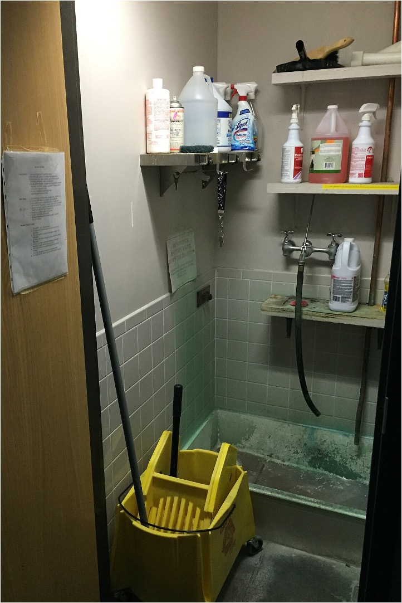
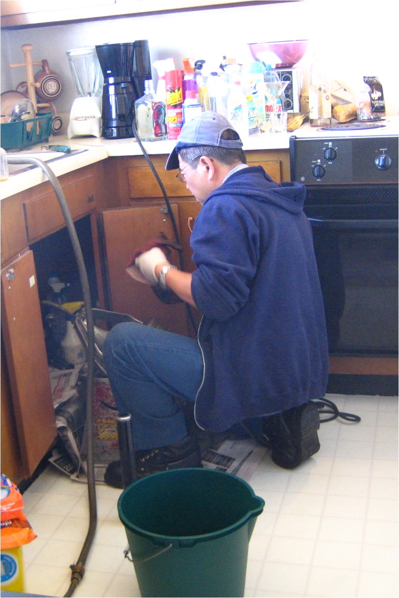


</div>

--

<h2 style="text-align:center">You have to wear many hats...</h2>

---

# Research data management (RDM) lifecycle

<div align="center">
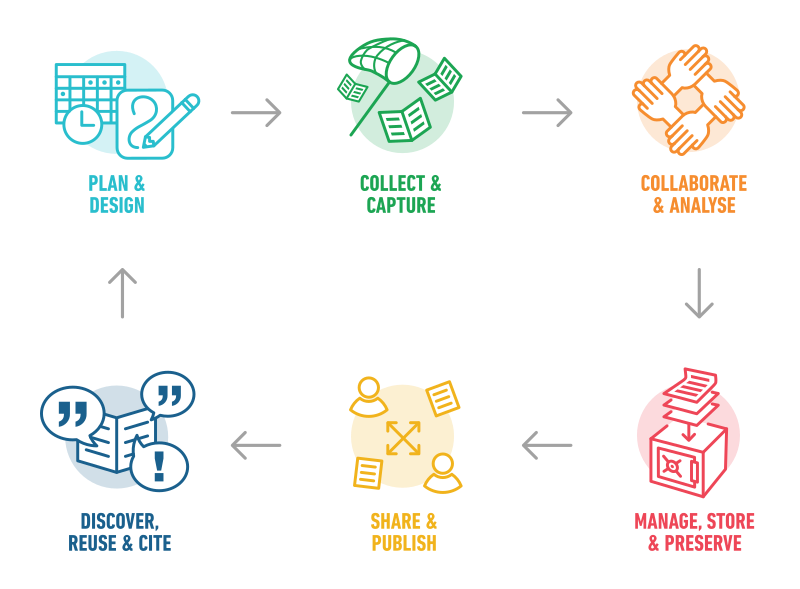
</div>


---


# Table of contents

</br></br>

1. [Data management and a data management plan (DMP)](#dmp)

2. [Protecting](#protecting)

3. [Organizing, documenting, processing, and storing](#organizing)

---

# Research data management (RDM) lifecycle

<div align="center">
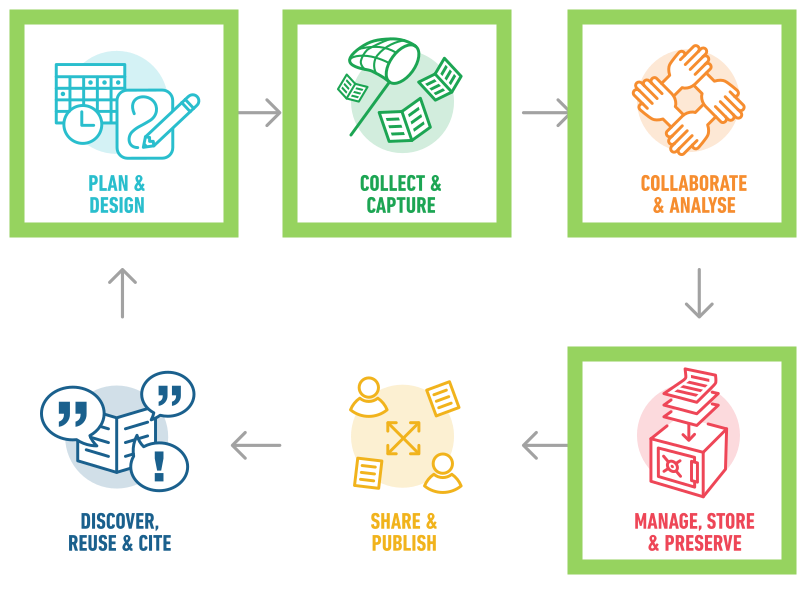
</div>


---

class: midtext

# A show of hands!

### Raise your hand if you:

- have heard the term data management plan (DMP)

--
- can define what a data management plan entails

--
- have ever created a data management plan for a project

--
- have planned data collection methods for research or policy work

--
- have implemented strategies to ensure data integrity and security

--
- are familiar with the FAIR principles (Findability, Accessibility, Interoperability, and Reuse)

--
- have incorporated open data practices into your work

--
- have archived or published datasets for public access

--
- are familiar with data protection regulations and compliance requirements

--
- have used techniques to discover and access relevant datasets

--
- have utilized data management tools or software in your projects

--
- have trained or guided others in effective data management practices


---
class: inverse, center, middle
name: dmp

# Data management and a data management plan (DMP)
<html><div style='float:left'></div><hr color='#EB811B' size=1px style="width:1000px; margin:auto;"/></html>


---

# Data

.pull-left[
<br>
## What are data?

- Data are disembodied **facts**, **signs**, and **symbols**.

.text-invisible[
- We often define them by their **source** (*e.g. administrative, historical, medical, etc.*) and their **formats** (*e.g., numerical, textual, still image, geospatial, audio, video, and software.*) 

- It is thought about as the basis under the *DIKW pyramid*.
]
]
---

# Data

.pull-left[
<br>
## What are data?

- Data are disembodied **facts**, **signs**, and **symbols**.


- We often define them by their **source** (*e.g. administrative, historical, medical, etc.*) and their **formats** (*e.g., numerical, textual, still image, geospatial, audio, video, and software.*) 

.text-invisible[
- It is thought about as the basis of the **knowledge hierarchy** under the *DIKW pyramid*.
]
]
---


# Data

.pull-left[
<br>
## What are data?

- Data are disembodied **facts**, **signs**, and **symbols**.

- We often define them by their **source** (*e.g. administrative, historical, medical, etc.*) and their **formats** (*e.g., numerical, textual, still image, geospatial, audio, video, and software.*) 

- It is thought about as the basis of the **knowledge hierarchy** under the *DIKW pyramid*.
]

.pull-right[
<div align="center">
<br><br>
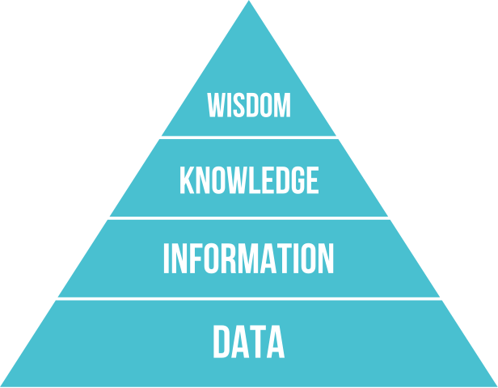
</div>
]
---

# Data in policy analysis

In a similar way to academic research, as **policy analysts you might rely on a broad range of materials**, from structured numerical datasets to interviews, field notes, and documents collected for ethnographic field studies,

--

.pull-left[
<h2 style="text-align:center">Quantitative</h2>
<br>
<div align="center">
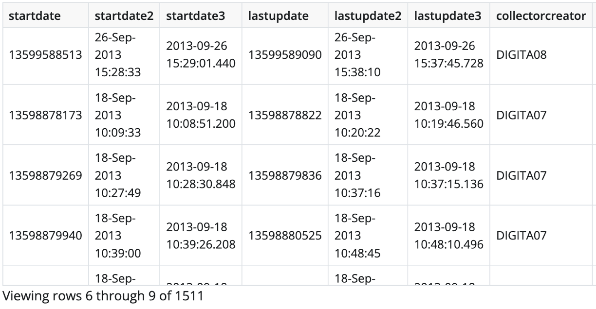
</div>

]

.pull-right[
<h2 style="text-align:center">Qualitative</h2>
<br>
<div align="center">
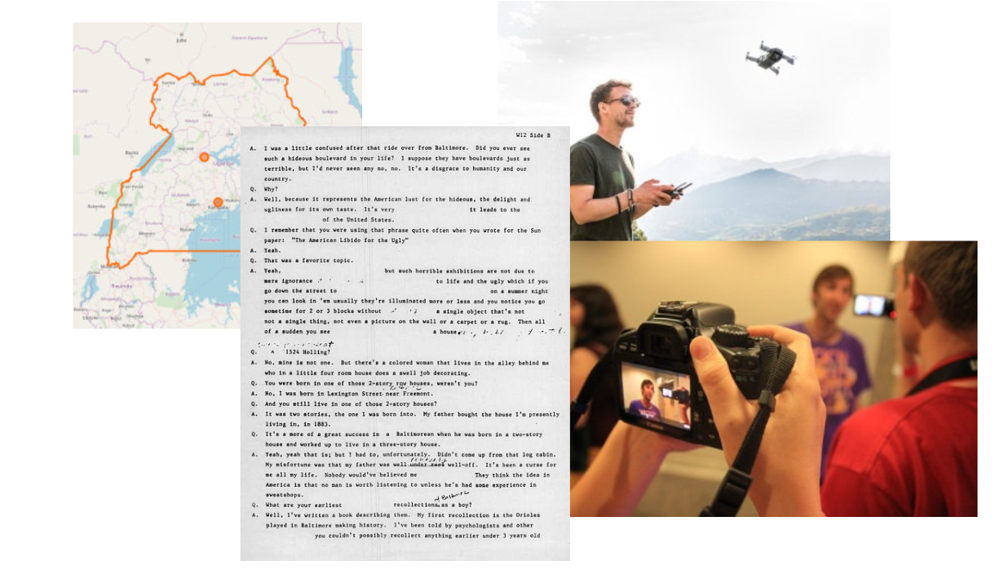
</div>
]

--

<br>
Regardless of *"type"*, in the policy world, we will likely deal largely with **collection of data about individuals** (i.e., .i-pink[human subject research]).

---
class: midtext


# Personal data

Any data that enables you to **identify a person** is classified as personal data. In the General Data Protection Regulation (GDPR) personal data are .i-pink[any information relating to] an **identified** or **identifiable** natural person known as ‘a data subject’<sup>1</sup>.

.footnote[<sup>1</sup>The GDPR applies only to the data of living persons. Data which do not count as personal data do not fall under data protection legislation, though there might still be ethical reasons for protecting this information.]
--

.pull-left-wide[

## Sensitive personal data

Certain personal data can .i-pink[require specific protection] when they reveal information that may create important *risks* for the *fundamental rights* and *freedoms* of the involved individual. In the context of GDPR, these can be:

- Racial or ethnic origin;
- Political opinions;
- Religious or philosophical beliefs;
- Trade union membership;
- Genetic data;
- Biometric data;
- Data concerning health;
- Data concerning a natural person’s sex life or sexual orientation.

]

.pull-right-small[
<div align="center">
<br>

</div>
]

---

# Research data management (RDM)

<br><br><br>


.pull-left-small[
<br>

**Research data management** is like “.i-pink[health care]” for your data:
- keeps them safe from harm,
- makes them usable and discoverable.


It entails strategies, processes and measures to maintain data quality, interpretability of research results, (re-)usability of your data.
]

.pull-right-wider[
<div align="center">
<br><br>

</div>
]


---

# Research data management (RDM)

.content-box-gray-wide[
The .i-pink[need] for thinking closely about **RDM** increases when dealing with .i-pink[sensitive personal data].
]


.pull-left-small[
<br>

**Research data management** is like “.i-pink[health care]” for your data:
- keeps them safe from harm,
- makes them usable and discoverable.


It entails strategies, processes and measures to maintain data quality, interpretability of research results, (re-)usability of your data.
]

.pull-right-wider[
<div align="center">
<br><br>

</div>
]

---

# Research data management (RDM) lifecycle

<div align="center">

</div>

---

# Data management plan (DMP)

<br><br>

.pull-left[
## Data management plans are an important tool to structure the data management of your project.

Defines strategies, measures and responsibilities for:

- processing and validating,
- storing and protecting, 
- preserving and sharing

your data throughout the data cycle.

More and more .i-pink[funding partners increasingly require them].
]

--

.pull-right[
## Components of a data management plan

1. Data summary
2. FAIR data
    - *Findable*
    - *Accessible*
    - *Interoperable*
    - *Reusable*
3. Allocation of resources
4. Data security
5. Ethical aspects
6. *Other*\*
]

---
class: midtext

# Data management plan (DMP) (cont.)

<br>

| DMP component | Issues to be addressed |
| -------------- | ---------------------- |
| **1. Data summary** | - State the purpose of the data collection/generation<br>- Explain the relation to the objectives of the project<br>- Specify the types and formats of data generated/collected<br>- Specify if existing data is being re-used (if any)<br>- Specify the origin of the data<br>- State the expected size of the data (if known)<br>- Outline the data utility: to whom will it be useful |
| <b>FAIR data:</b><br>**2.1. Making data findable, including provisions for metadata** | - Outline the discoverability of data (metadata provision)<br>- Outline the identifiability of data and refer to standard identification mechanism. Do you make use of persistent and unique identifiers such as Digital Object Identifiers?<br>- Outline naming conventions used<br>- Outline the approach towards search keywords<br>- Outline the approach for clear versioning<br>- Specify standards for metadata creation (if any). If there are no standards in your discipline describe what type of metadata will be created and how |

`Source`: [H2020 DMP Template](https://ec.europa.eu/research/participants/data/ref/h2020/other/gm/reporting/h2020-tpl-oa-data-mgt-plan-annotated_en.pdf)
---
class: midtext

# Data management plan (DMP) (cont.)

<br><br><br>

| DMP component | Issues to be addressed |
| -------------- | ---------------------- |
| <b>FAIR data:</b><br> **2.2 Making data openly accessible** | - Specify which data will be made openly available? If some data is kept closed provide rationale for doing so<br>- Specify how the data will be made available<br>- Specify what methods or software tools are needed to access the data? Is documentation about the software needed to access the data included? Is it possible to include the relevant software (e.g. in open source code)?<br>- Specify where the data and associated metadata, documentation and code are deposited<br>- Specify how access will be provided in case there are any restrictions |
| <b>FAIR data:</b><br> **2.3. Making data interoperable** | - Assess the interoperability of your data. Specify what data and metadata vocabularies, standards or methodologies you will follow to facilitate interoperability.<br>- Specify whether you will be using standard vocabulary for all data types present in your data set, to allow inter-disciplinary interoperability? If not, will you provide mapping to more commonly used ontologies? |

<br><br><br>
`Source`: [H2020 DMP Template](https://ec.europa.eu/research/participants/data/ref/h2020/other/gm/reporting/h2020-tpl-oa-data-mgt-plan-annotated_en.pdf)

---
class: midtext

# Data management plan (DMP) (cont.)


| DMP component | Issues to be addressed |
| -------------- | ---------------------- |
| <b>FAIR data:</b><br> **2.4. Increase data re-use (through clarifying licences)** | - Specify how the data will be licensed to permit the widest reuse possible<br>- Specify when the data will be made available for re-use. If applicable, specify why and for what period a data embargo is needed<br>- Specify whether the data produced and/or used in the project is usable by third parties, in particular after the end of the project? If the re-use of some data is restricted, explain why<br>- Describe data quality assurance processes<br>- Specify the length of time for which the data will remain re-usable |
| **3. Allocation of resources** | - Estimate the costs for making your data FAIR. Describe how you intend to cover these costs<br>- Clearly identify responsibilities for data management in your project<br>- Describe costs and potential value of long term preservation |
| **4. Data security** | - Address data recovery as well as secure storage and transfer of sensitive data |
| **5. Ethical aspects** | - To be covered in the context of the ethics review, ethics section of DoA and ethics deliverables. Include references and related technical aspects if not covered by the former |
| **6. Other** | - Refer to other national/funder/sectorial/departmental procedures for data management that you are using (if any) |


`Source`: [H2020 DMP Template](https://ec.europa.eu/research/participants/data/ref/h2020/other/gm/reporting/h2020-tpl-oa-data-mgt-plan-annotated_en.pdf)

---

class: inverse, center, middle
name: protecting

# Protecting
<html><div style='float:left'></div><hr color='#EB811B' size=1px style="width:1000px; margin:auto;"/></html>

---

# Data protection


.pull-left[
## Research ethics

The moral **principles** and **actions** guiding and shaping research

<b style="color:#1D375B">In policy analysis</b> is closely linked to research ethics in the social sciences.
- Initially, a 'patient protection' model from medical research.
- Today it has a broader scope, including:
    - consideration of <i style="color:#cc0065">benefits, risks, and harms</i>
    - <i style="color:#cc0065">to all persons</i> connected with and affected by the research
- Gives **responsibilities** to researchers and analysts (e.g., *legal framework*).

]

.pull-right[
<div align="center">
<br><br>

</div>

]

---
# Nuremberg code (1947)

.pull-left[
**Ethical guidelines** for the preparation and conduct of medical, psychological and other experiments on humans: 


>“The voluntary consent of the human subject is absolutely essential [...] without the intervention of any element of force, fraud, deceit, duress, over-reaching, or other ulterior form of constraint or coercion [...] should have sufficient knowledge and comprehension of the elements of the subject matter involved as to enable him to make an **understanding and enlightened decision**.”

]

.pull-right[
<div align="center">
<br>

</div>

]

---

# Reviews of ethics in academic research

<br><br>
.pull-left[
## Institutional Review Board (IRB) and ethical boards

- Administrative bodies established to **protect the rights and welfare** of research subjects
- Often housed within the academic institution
- Checks proposals and recommends changes and improvements
- .i-pink[Can kill unethical projects by denying approval]

]

.pull-right[
<div align="center">
<br>
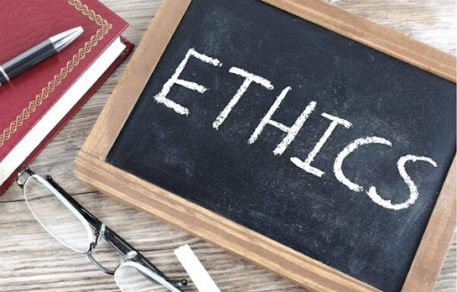
</div>

]

---
# What is "data protection"?


.pull-left[
## Data protection

- Part of fundamental .i-pink[right to privacy] (or 'informational freedom’).
- In research there might be instances of tensions of fundamental rights:
    - Freedom of research vs. freedom of personal information.
- “Privacy is a personal condition of life characterized by seclusion from, and therefore absence of acquaintance by, the public” (Neethling 2005).
- **Core**:
    - prevention of unwanted disclosure of personal information or
    - the misuse of such information.
]

.pull-right[
<div align="center">
<br><br>

</div>

]

---

# There are individuals behind the data...


<div align="center">

</div>


---

# Data protection principles under GDPR

<div align="center">
<br>
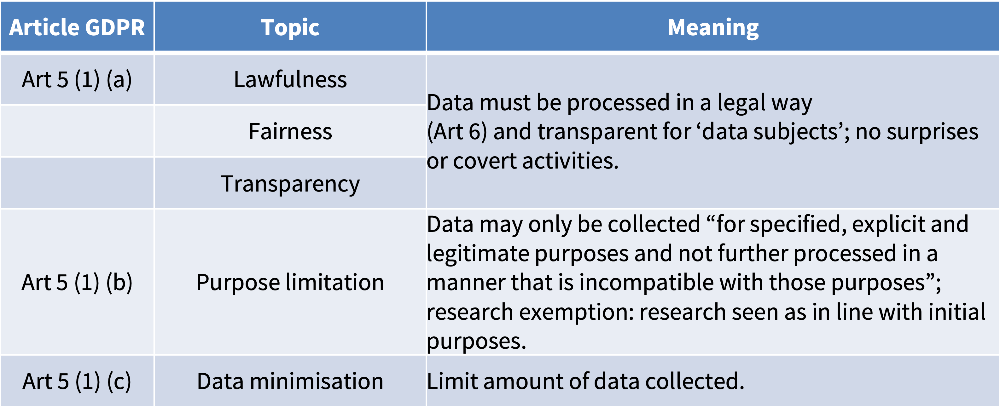
</div>

---

# Data protection principles under GDPR (cont.)

<div align="center">
<br>
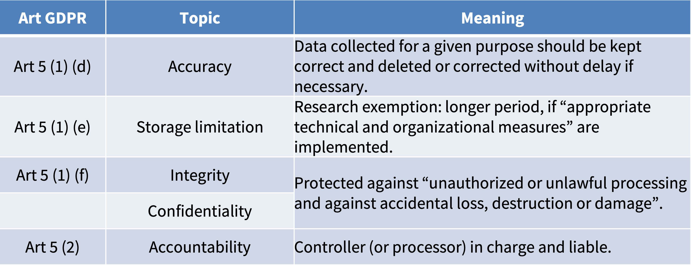
</div>

---

# GDPR

<br>

.pull-left[
## General Data Protection Regulation

- In place since May 25, 2018 (.i-pink[almost six years to the day] 😎)
    - 99 articles and 173 recitals
    - Applies directly
    - Intended to harmonize data protection law EU-wide
    - *but*, about 150 “opening clauses” or exemptions...

- GDPR (factually) integrated into a hierarchy of norms
]

.pull-right[
<div align="center">
<br><br>
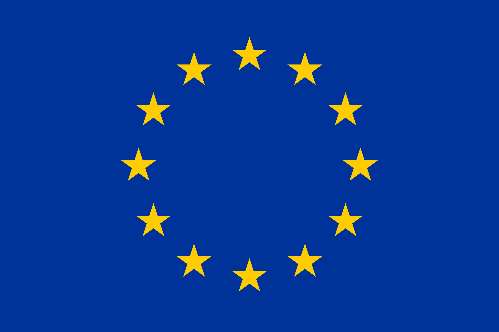
</div>

]


.footnote[<sup>1</sup> Let's check this piece out https://www.bbc.com/news/uk-wales-politics-58395974]

---

class: inverse, center, middle
name: organizing

# Organizing, documenting, processing, and storing
<html><div style='float:left'></div><hr color='#EB811B' size=1px style="width:1000px; margin:auto;"/></html>

---

# Data processing under GDPR

<div align="center">
<br>
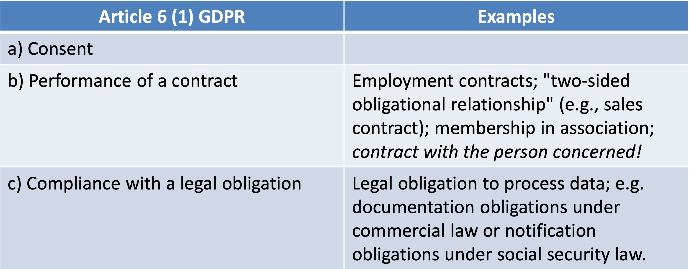
</div>

---

# Data processing under GDPR (cont.)

<div align="center">
<br>
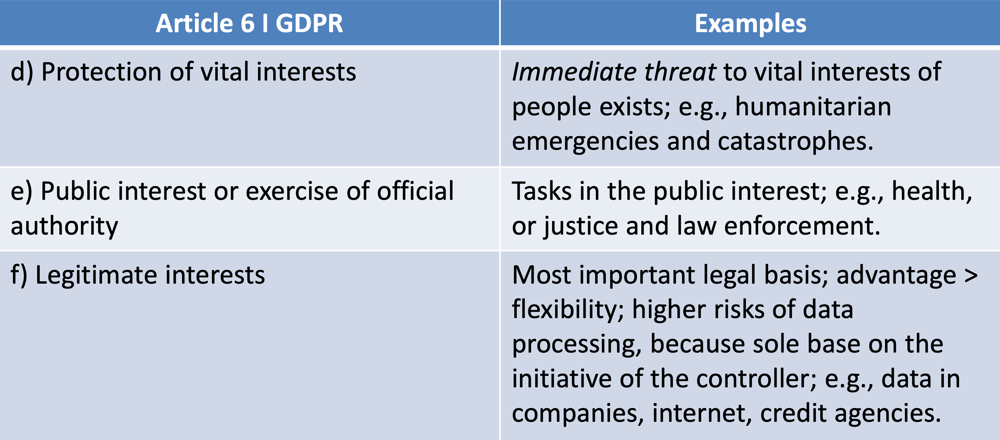
</div>


---

# Informed consent for data processing

.pull-left[


<br><br><br>
## Art 4 Par 11 GDPR


>“‘(C)onsent’ of the data subject means **any freely given, specific, informed and unambiguous indication of the data subject’s wishes** by which he or she, by a statement or by a clear affirmative action, signifies **agreement to the processing of personal data** relating to him or her;”

]

--

.pull-right[

## Conditions for consent

- Written form no longer required.
- Conditions for consent (Art 7 GDPR):
    - Requirement to provide evidence (Par1)
    - Separation requirement (Par2)
    - Easy revocability at any time (Par3) 
    - Increased requirement of voluntariness (Par4)
- More stringent for minors under 14 years of age (Art 8 GDPR).
- Important: Collection of "special categories" of personal data "prohibited" under Art 9 GDPR, unless there is a legal basis.


- **Central**: .i-pink[consent needs to be documented!]

]

---

# Can we process data without consent? (in research)

.pull-left[
## Are <span style="color:#cc0065">researchers</span> allowed to process data that was collected without consent? 

- .i-pink[It depends...]
- May need to try to gain consent after the data was gathered.
- They may skip this step, if "the provision of such information proves impossible or would involve a disproportionate effort" (Art 14 Par 5 Lit b).
- But this is no default!
- **Disproportionate really means disproportionate**.

## Consent after the fact is a balance of interests
]


.pull-right[
<div align="center">
<br><br><br>

</div>

]

---
# Consent after the dact and the balance of interests

## "Balance of interest" - checklist: 

- Legitimate interest of the researcher?
- Is the data processing necessary?
    - Are the more lenient ways to achieve research goal?
- Can the subject refuse to the processing?
- Are these data linked (or linkable) to other data?
- How long will the data be stored?
- How many people are going to access the data?
- Are the research subjects from a vulnerable group?
- Would the research subjects have to expect the processing of their data?

--

## THINK CLOSELY: if research subjects’ interest weigh more than yours, data processing is improper

---

# Secure storage

.pull-left[
<br><br>
## Technical and organizational measures (TOMs)

- **The security of out data**

> TOMs should be designed to "implement data-protection principles, such as data minimisation, in an effective manner and to integrate the necessary safeguards into the processing in order to meet the requirements of this Regulation and protect the rights of data subjects" (Art 25 Par 1 GDPR).

]


.pull-right[
<div align="center">
<br>
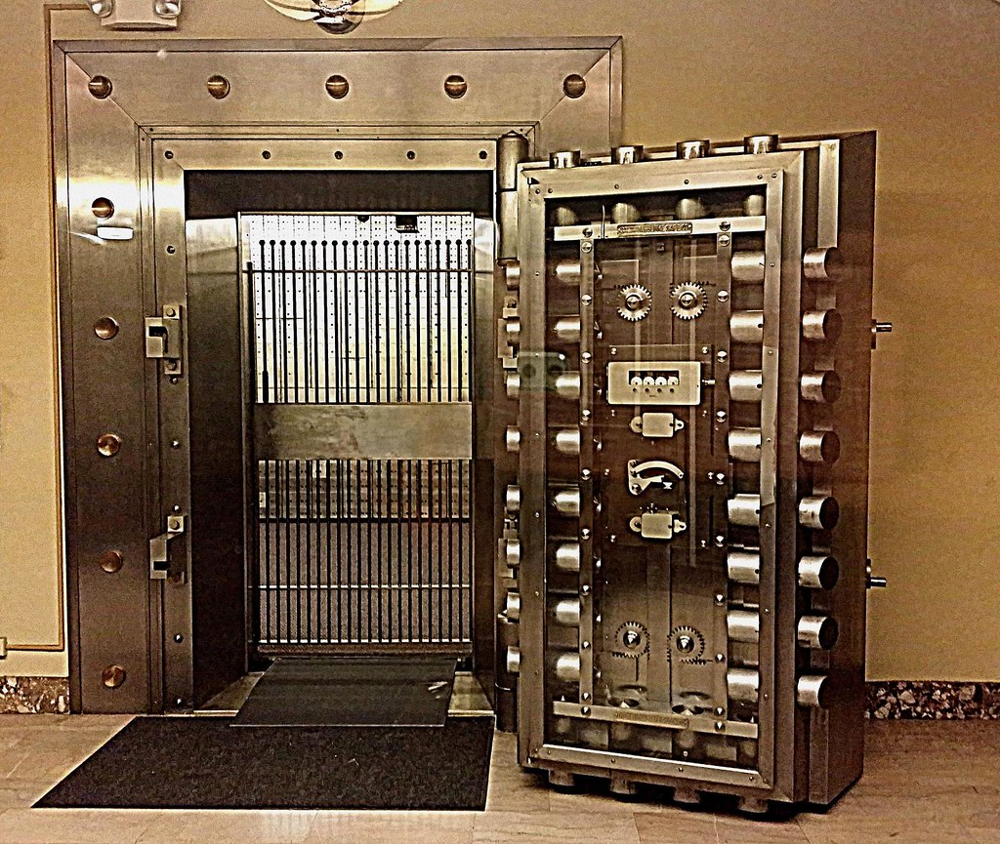
</div>

]

---

# Examples of TOMs

<div align="center">
<br><br>
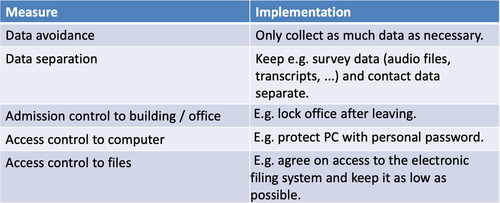
</div>

---

# Pseudonymization and anonymization

.pull-left[
## Pseudonymization

**(Art 4 Par 1 No 5 GDPR)**:
> "processing of personal data in such a manner that the personal data can no longer be attributed to a specific data subject without the use of additional information, provided that such additional information is     kept separately and     is subject to technical and organisational measures     to ensure that the personal data are not attributed to an identified or identifiable natural person;"


## With pseudonymization the <span style="color:#cc0065">possibility of establishing the true identity remains</span>
]

--

.pull-right[
## Anonymization

**(GDPR Recital 26)**:

> "information which does not relate to an identified or identifiable natural person or to personal data rendered anonymous in such a manner that the data subject is not or no longer identifiable."


## With anonymization there is <span style="color:#cc0065">no possibility of establishing the true identity</span>
]

---

# What is enough?

- This is a question that **does not have a clear answer**.

--
- Consider the **risk-based approach** of GDPR.

--
- Technical and organizational measures (TOMs) aid you in keeping the risk at bay.

--
- If working with large datasets, consider means of **Statistical Disclosure Control** (e.g. k-anonymity).

--
- If you are uncertain, turn out to a **data management and legal expert**!!!

<div align="center">
<br>

</div>


---

# Data security

.pull-center[
.content-box-gray-wide[
Does anyone know the difference between .i-pink[data protection] and .i-pink[data security]?
]
]

--

<br><br>

.pull-left[
## Data security is more encompassing and not necessarily person related.

- Encryption
- Strong passwords
- Access rights
- Back ups
]

.pull-right[
<div align="center">

</div>
]

---

# Encryption

.pull-left[
## Encryption maintains security of data
- Uses an algorithm to transform information
- Needs a "key" to decrypt

## Use encryption to
- Transfer data
- Store data (back-ups)
- On remote discs

## Tools. e.g., 7Zip, Gpg4win, Veracrypt


.footnote[Here is some extra information about encryption by the [Federal Office for Information Security 🇩🇪](https://www.bsi.bund.de/EN/Themen/Verbraucherinnen-und-Verbraucher/Informationen-und-Empfehlungen/Cyber-Sicherheitsempfehlungen/Daten-sichern-verschluesseln-und-loeschen/Datenverschluesselung/Soft-und-hardwaregestuetzte-Verschluesselung/soft-und-hardwaregestuetzte-verschluesselung_node.html)]
]

.pull-right[
<div align="center">
<br>

</div>
]

---

# Strong passwords

.pull-left[
## A strong password has:
- eight to fifteen characters or even more
- a random distribution of characters

## Combine
- upper case letters: A - Z
- lower case letters: a - z
- numerals: 0-9
- special characters: !"#$%&'()*+,-./:, etc.


## Use a <span style = "color:#cc0065">‘pass-sentence’</span> instead of a password!


.footnote[Here is some extra information about password managers by the [Federal Office for Information Security 🇩🇪](https://www.bsi.bund.de/EN/Themen/Verbraucherinnen-und-Verbraucher/Informationen-und-Empfehlungen/Cyber-Sicherheitsempfehlungen/Accountschutz/Sichere-Passwoerter-erstellen/Passwort-Manager/passwort-manager_node.html)]
]

.pull-right[
<div align="center">
<br>

</div>
]

---
# Secure back-ups

.pull-left[
## Risks:
- Technical defects
- Catastrophes
- Theft
- Forgetfulness

## Strategies
- Storage on secure servers with automatic regular backup
- Backup important files in at least three copies on spatially separated data carriers
]

--

.pull-right[
## Backup setup (3-2-1 rule)
- At least **3** copies of a file
- On at least **2** different media
- At least **1** of which is remote

**Test data recovery at the beginning and at regular intervals**

## Protect your (sensitive) data:
- Hardware (e.g. separate lockable room)
- File encryption
- Password security
- At least two people should have access to your data

]

.footnote[Here is some extra information about data backup by the [Federal Office for Information Security 🇩🇪](https://www.bsi.bund.de/EN/Themen/Verbraucherinnen-und-Verbraucher/Informationen-und-Empfehlungen/Cyber-Sicherheitsempfehlungen/Daten-sichern-verschluesseln-und-loeschen/Datensicherung-und-Datenverlust/datensicherung-und-datenverlust_node.html)]

---

# Why this matters to us?

## Let's take a look at a couple of cases

- .b-pink[What happened?]

- .b-pink[Why was it a problem?]

- .b-pink[What should have happened?]

[UK Information Commissioner's Office (ICO)](https://ico.org.uk/for-organisations/report-a-breach/personal-data-breach/personal-data-breach-examples/)

---
class: inverse, center, middle
name: questions

# Questions?
<html><div style='float:left'></div><hr color='#EB811B' size=1px style="width:1000px; margin:auto;"/></html>


