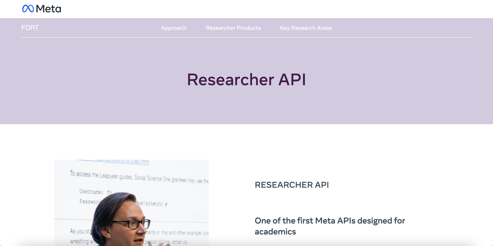

```{css, echo=FALSE} 
@media print { # print out incremental slides; see https://stackoverflow.com/questions/56373198/get-xaringan-incremental-animations-to-print-to-pdf/56374619#56374619
.has-continuation {
display: block !important;
}
}
```

```{r setup, include=FALSE}
# figures formatting setup
options(htmltools.dir.version = FALSE)
library(knitr)
opts_chunk$set(
  prompt = T,
  fig.align="center", #fig.width=6, fig.height=4.5, 
  # out.width="748px", #out.length="520.75px",
  dpi=300, #fig.path='Figs/',
  cache=T, #echo=F, warning=F, message=F
  engine.opts = list(bash = "-l")
)

## Next hook based on this SO answer: https://stackoverflow.com/a/39025054
knit_hooks$set(
  prompt = function(before, options, envir) {
    options(
      prompt = if (options$engine %in% c('sh','bash')) '$ ' else 'R> ',
      continue = if (options$engine %in% c('sh','bash')) '$ ' else '+ '
    )
  })

library(tidyverse)
library(hrbrthemes)
library(fontawesome)
library(RefManageR)

RefManageR::BibOptions(
  check.entries = FALSE,  
  bib.style = "authoryear", 
  cite.style = "authoryear", 
  style = "markdown",
  hyperlink = TRUE, 
  dashed = TRUE)

bib <-  RefManageR::ReadBib("grateful-refs.bib")


```


# What people think working with data looks like...

<div align="center">

</div>

---
# How it really is...

<div align="center">
<br><br><br>


</div>

--

<h2 style="text-align:center">You have to wear many hats...</h2>

---

# Research data management (RDM) lifecycle

<div align="center">

</div>


---


# Table of contents

</br></br>

1. [Archiving and publishing](#archive)

2. [Open government data](#opendata)

3. [Discovering](#discover)


---

# Research data management (RDM) lifecycle

<div align="center">

</div>


---

class: midtext

# A show of hands!

### Raise your hand if you:


- Can state the difference between data archiving and data publishing

--
- Can list some of the benefits of data publishing

--
- Can differentiate between different data publication services (data journals, self-archiving, a data repository)

--
- Know which data repositories fit the needs of different data sources

--
- Know of ways to promote your government data publication


---
class: inverse, center, middle
name: archive

# Archiving and publishing
<html><div style='float:left'></div><hr color='#EB811B' size=1px style="width:1000px; margin:auto;"/></html>

---

# Promises of high-quality data

.pull-center[
.content-box-gray-wide[
High-quality data have the potential to be reused in many ways. .i-pink[Archiving] and .i-pink[publishing] your data properly is at the core of making your data FAIR and will enable both your future self as well as others to get the most out of your data.
]
]

---

# Data archiving

.pull-left-small[
<br>
## Archiving data for future reference

.hlblue[Data archiving] is about storing and preserving data for the long term. When you archive your data, you make sure you can read and access the data later on. You can then also allow access to others for verification purposes when such a request arrives. In all cases, you should store your data safely, in a suitable file format, with adequate documentation.

]

.pull-right-wide[
<div align="center">
<br><br>

</div>
]

---

# Data publishing

.pull-left-small[
<br>
## Publishing data for reuse

To make your data reusable for purposes beyond the one for which you collected them, you can .hlblue[publish your data]. Publishing your data is the act of publicly disclosing the research data you have collected, making them findable, accessible, and reusable.

]

.pull-right-wide[
<div align="center">
<br><br>

</div>
]

---
# Data publication in academia

.pull-left[

## Scientific progress

Data archiving and publication has direct benefits for the research itself (more robust), for the discipline and for science in general by enabling new collaborations, new data uses and establishing links to the next generation of researchers.

## Norms of the field

Depending on field may be more prone. General practice in .i-pink[computational social science].

## Drivers

- Funders
- Publishers
]

.pull-right[
<div align="center">
<br><br><br><br><br>

</div>

]
---

# Selecting data for publication

.pull-left[
.hlred[Should you publish your data or shouldn’t you?] 
]

---
# Selecting data for publication

.pull-left[
.hlred[Should you publish your data or shouldn’t you? And if so, which part of it?] 
]

---

# Selecting data for publication

.pull-left[
.hlred[Should you publish your data or shouldn’t you? And if so, which part of it?] 

- Sometimes this question is **straightforward to answer**:
    - the funder of the research demands it
    - strong researcher inclination

- Still, .i-pink[not all data are created equal] and data publishing does involve an investment of researcher resources. **Some datasets have a more obvious reuse potential than others.**
]


---

# Selecting data for publication (cont.)

.pull-left[
## Does your dataset have reuse potential?

- Does your data have potential value in terms of reuse, 
    - national/international standing and quality, 
    - historical importance, 
    - uniqueness, 
    - originality, 
    - size, 
    - scale,
    - costs of data production or innovative nature of the research? 
- Could you foresee that secondary analyses on your data would benefit science? Or policy analysis? 

.hlblue[If your answer to any of these is yes, your dataset has serious reuse potential.]
]

---

# Selecting data for publication (cont.)

.pull-left[
## Is your dataset reusable?

To be suitable for reuse, your dataset must be **functionally usable**.

- Can the data be accessed and utilized? (e.g., .i-pink[readable format])
- Is there sufficient metadata available to allow future users to comprehend your data? (e.g., .i-pink[documentation])
- Are there any legal restrictions that prevent the data from being published?

.hlblue[If you have addressed these practical considerations and your data hold potential value for reuse, you are 'good to go'.]
]

---

# Example from our own experience


<div align="center">

</div>

`Source`: Munzert, Simon, et al. "Publishing Combined Web Tracking and Survey Data." (2023). https://doi.org/10.31219/osf.io/y4v8z

---
# How do I protect the privacy of my research subjects?

<div align="center">

</div>

`Source` Munzert, Simon, Barberá, Pablo, Guess, Andrew M., & Yang, JungHwan (2022). Media Exposure and Opinion Formation in an Age of Information Overload (MEOF). GESIS, Cologne. https://doi.org/10.4232/1.13981.

---
# How do I protect the privacy of my research subjects?

<div align="center">

</div>

`Source` Munzert, Simon, Barberá, Pablo, Guess, Andrew M., & Yang, JungHwan (2022). Media Exposure and Opinion Formation in an Age of Information Overload (MEOF). GESIS, Cologne. https://doi.org/10.4232/1.13981.

---
# How do I protect the privacy of my research subjects?

<div align="center">

</div>

`Source` Munzert, Simon, Barberá, Pablo, Guess, Andrew M., & Yang, JungHwan (2022). Media Exposure and Opinion Formation in an Age of Information Overload (MEOF). GESIS, Cologne. https://doi.org/10.4232/1.13981.


---
# How do I protect the privacy of my research subjects?

<div align="center">

</div>

`Source` Munzert, Simon, Barberá, Pablo, Guess, Andrew M., & Yang, JungHwan (2022). Media Exposure and Opinion Formation in an Age of Information Overload (MEOF). GESIS, Cologne. https://doi.org/10.4232/1.13981.


---
# How do I protect the privacy of my research subjects?

<div align="center">

</div>

`Source` Munzert, Simon, Barberá, Pablo, Guess, Andrew M., & Yang, JungHwan (2022). Media Exposure and Opinion Formation in an Age of Information Overload (MEOF). GESIS, Cologne. https://doi.org/10.4232/1.13981.

---
# How do I protect the privacy of my research subjects?

<div align="center">

</div>

`Source` Munzert, Simon, Barberá, Pablo, Guess, Andrew M., & Yang, JungHwan (2022). Media Exposure and Opinion Formation in an Age of Information Overload (MEOF). GESIS, Cologne. https://doi.org/10.4232/1.13981.


---
class: inverse, center, middle
name: question
background-color: #FFFFFF


<span style="text-align:center;color:#2b7282;font-size:150%;">Let's take one minute to discuss in which ways </span><span style="font-weight:bold;text-align:center;color:#2b7282;font-size:150%;">publishing these data can be challenging.</span><span style="text-align:center;color:#2b7282;font-size:150%;"></span>
<html><div style='float:left'></div><hr color='#EB811B' size=1px style="width:1000px; margin:auto;"/></html>


---

# Licensing your data

.pull-left[
.hlred[If you publish your data in a data repository, you may need to apply a licence agreement to your data] 
]

---

# Licensing your data

.pull-left[
.hlred[If you publish your data in a data repository, you may need to apply a licence agreement to your data] 

- A licence agreement is a legal arrangement between the depositor of the data set and the repository
    - It stipulates what users are allowed to do with the data
]

---

# Licensing your data

.pull-left[
.hlred[If you publish your data in a data repository, you may need to apply a licence agreement to your data] 

- A licence agreement is a legal arrangement between the depositor of the data set and the repository
    - It stipulates what users are allowed to do with the data


## To make re-use as likely as possible you may want to choose a licence which:

- Makes data available to the **widest audience** possible
- Makes the **widest range of uses** possible

]

---

# Overview of Creative Commons licences

| Licence       | Can I copy & redistribute the work? | Is it required to attribute the author? | Can I use the work commercially? | Am I allowed to adapt the work? | Can I change the licence when redistributing? |
|---------------|-------------------------------------|----------------------------------------|----------------------------------|---------------------------------|----------------------------------------------|
| CC0           | Y                                   | N                                      | Y                                | Y                               | Y                                              |
| CC BY         | Y                                   | Y                                      | Y                                | Y                               | Y                                              |
| CC BY-SA      | Y                                   | Y                                      | Y                                | Y                               | N                                              |
| CC BY-ND      | Y                                   | Y                                      | Y                                | N                               | Y                                              |
| CC BY-NC      | Y                                   | Y                                      | N                                | Y                               | Y                                              |
| CC BY-NC-SA   | Y                                   | Y                                      | N                                | Y                               | N                                              |
| CC BY-NC-ND   | Y                                   | Y                                      | N                                | N                               | Y                                              |


.footnote[This table is inspired by the CESSDA Guide]
---
class: midtext

# Access categories

**Publishing data in a data repository does not automatically make them openly accessible.**

---
class: midtext

# Access categories

Publishing data in a data repository does not automatically make them openly accessible. **(Sensitive) personal data can still be protected by limiting access to the data.**

---
class: midtext

# Access categories

Publishing data in a data repository does not automatically make them openly accessible. (Sensitive) personal data can still be protected by limiting access to the data. **Access controls can permit control down to an individual file level, meaning that mixed levels of access control can be applied to a data collection.**

---
class: midtext

# Access categories

Publishing data in a data repository does not automatically make them openly accessible. (Sensitive) personal data can still be protected by limiting access to the data. Access controls can permit control down to an individual file level, meaning that mixed levels of access control can be applied to a data collection.

**Many data repositories operate a three-tiered approach to data access:**

--
- .hlred[Open access]
    - Data that can be accessed by any user whether they are registered or not. Data in this category should not contain personal information unless consent is given (see ‘Informed consent’).
--
- .hlred[Access for registered users] (safeguarded)
    - Data that is accessible only to users who have registered with the archive. This data contains no direct identifiers but there may be a risk of disclosure through the linking of indirect identifiers.
--
- .hlred[Restricted access]
    - Access is limited and can only be granted upon request. This access category is for the most sensitive data that may contain disclosive information.Restricted access requires the long-term commitment of the researcher or person responsible for the data to handle the upcoming permission requests.
--
- .hlred[Embargo]
    - Besides offering the opportunity for restricted access ‘for eternity’ most data repositories allow you to place a temporary embargo on your data. During the embargo period, only the description of the dataset is published. The data themselves will become available in open access after a certain period of time.
    

---

# Other access
    
.pull-left[    
<br><br>
## Special access

- Access through a .i-pink[safe connection]
- Access in a .i-pink[safe environment]
   
## Open metadata for (sensitive) personal data 

<br><br><br>
.hlred[This was one of the solutions for our survey and web-tracking data archiving and publishing effort.]
]

--

.pull-right[

<div align="center">
<br><br>

</div>

]

---

# Other access
    
.pull-left[    
<br><br>
## Special access

- Access through a .i-pink[safe connection]
- Access in a .i-pink[safe environment]
   
## Open metadata for (sensitive) personal data 

<br><br><br>
.hlred[This was one of the solutions for our survey and web-tracking data archiving and publishing effort.]
]


.pull-right[

<div align="center">
<br><br>

</div>

]

---

class: inverse, center, middle
name: opendata

# Open Government Data
<html><div style='float:left'></div><hr color='#EB811B' size=1px style="width:1000px; margin:auto;"/></html>

---

# Data

.pull-left[
<br>
## What are data?

- Data are disembodied **facts**, **signs**, and **symbols**.

- We often define them by their **source** (*e.g. administrative, historical, medical, etc.*) and their **formats** (*e.g., numerical, textual, still image, geospatial, audio, video, and software.*) 

- It is thought about as the basis of the **knowledge hierarchy** under the *DIKW pyramid*.
]

.pull-right[
<div align="center">
<br><br>

</div>
]
---

# What is open data?

.pull-left[

## Open data

- Data that can be freely .i-pink[used], .i-pink[modified], and .i-pink[shared] by anyone

## What characteristics does it have?

- .hlblue[Non-proprietary]: Available in formats that are open and standard without any restrictions
- .hlblue[Machine-Readable]: Provided in formats that can be easily processed by computers
- .hlblue[No Restrictions]: Free from any legal, financial, or technical barriers.
- .hlblue[Comprehensive]: Covers all necessary aspects to provide a complete understanding
]

.pull-right[
<div align="center">
<br>

</div>
]
---


# Why Open Government Data (OGD)?

.pull-left[
- Public organizations **produce** and **collect** a broad range of different types of data to perform their tasks.
    - Demographic information
    - Socioeconomic data
    - Epidemiological data
    - Healthcare use
    - Industry data
    - Crime data
    - Performance
    - ...

- **These data tend to be .hlblue[extensive] and .hlblue[central]**

## Government data can be a significant resource for increased <span style="color:#cc0065">transparency</span>
]

---

# The actors behind Open Government Data


.pull-left-wide[
## There are two key civil society actors advocating for increased opennes of information, documents and datasets held by public bodies
]

--
.pull-left-wide[
- .b-pink[Right to information movement]: promotes a public right of access to information from a **human rights perspective**
]
--
.pull-left-wide[
- .b-pink[Open government data movement]: uses predominantly **social and economic arguments** to encourage the opening up of government data, such as:
    - Information hitting the public domain can create conditions for inclusive service delivery and more participation
    - Can stimulate the economy by allowing third parties to innovate using public data
]
--

.pull-left-wide[
Many argue that these data should be public domain, since .hlblue[governments hold predominantly data emanating from citizens.]
]

---

# The Open Government Data Principles

.pull-center[
.content-box-gray-wide[
These principles were presented in 2007 during an .b-pink[Open Government Working Group Meeting]
]
]

--

Government data shall be considered open if it is made public in a way that **complies with the principles** below:

--

- .hlblue[Complete]: **All public data are made available**. Public data are data that is not subject to valid privacy, security or privilege limitations.

--
- .hlblue[Primary]: Data are **as collected at the source**, with the highest possible level of granularity, not in aggregate or modified forms.

--
- .hlblue[Timely]: Data are made available as **quickly** as necessary to **preserve the value** of the data.

--
- .hlblue[Accessible]: Data are **available to the widest range of users** for the widest range of purposes.

--
- .hlblue[Machine processable]: Data are **reasonably structured** to allow automated processing.

--
- .hlblue[Non-discriminatory]: Data are **available to anyone**, with no requirement of registration.

--
- .hlblue[Non-proprietary]: Data are available in a **format over which no entity has exclusive control**.

--
- .hlblue[License-free]: Data are **not subject to any copyright, patent, trademark or trade secret regulation**. Reasonable privacy, security and privilege restrictions may be allowed.

---

# Principles for Improving Federal Transparency in the US

.pull-center[
.content-box-gray-wide[
10 principles proposed by Former US Federal Chief Information Officer .b-pink[Vivek Kundra] before the US House of Representatives in 2011
]
]

--

- .hlblue[Build end-to-end digital processes]: **Automate transfer of data** between systems to increase productivity, protect data integrity, and speed data dissemination. Capitalize on game-changing technologies to increase transparency.

--
- .hlblue[Build once, use often]: Architect **systems for re-use and share platforms to reduce costs**, streamline systems and processes, reduce errors, and foster collaboration.

--
- .hlblue[Tap into golden sources of data]: **Pull data directly from authoritative sources** to improve data quality, shorten processes and protect data integrity.

--
- .hlblue[Release machine-readable data and encourage third party applications]: Make data **machine-readable** to allow the public to easily analyse, visualise and use government information.

--
- .hlblue[Use common data standards]: Develop and use **uniform, unique identifiers and data standards** to ease the flow of data and reduce system complexity.

---

# Principles for Improving Federal Transparency in the US

.pull-center[
.content-box-gray-wide[
10 principles proposed by Former US Federal Chief Information Officer .b-pink[Vivek Kundra] before the US House of Representatives
]
]

- .hlblue[Validate data up front]: **Correct errors during collection** and at the point of entry to block bad data from ever entering the system.

--
- .hlblue[Release data in real time and preserve for future use]: **Release data as quickly as feasible** to enhance its relevance and utility while maintaining future accessibility.

--
- .hlblue[Reduce burden]: **Collect data once and use it repeatedly**. Pull from existing data sets to reduce costs and burden and to increase productivity and uniformity.

--
- .hlblue[Protect privacy and security]: **Safeguard the release of information to increase public trust**, participation, preserve privacy, and protect national security. Open Government doesn't mean vulnerable government.

--
- .hlblue[Provide equal access and incorporate user feedback]: Provide a common view of data to all **stakeholders to foster collaboration**. Incorporate user feedback to help identify high-value, meaningful data sets, set priorities, to continuously drive and improve future planning and processes.

---

# The business case for OGD

## Business Models Archetypes for value creation

Some actors make a business argument for Open Government Data. They identify some archetypes of business models that can create revenue from this practice:

--
- .b-pink[Suppliers] that publish data, including the public sector;

--
- .b-pink[Aggregators] that pool publicly available data and combine it to produce useful insights to be used by the various users;

--
- .b-pink[Apps developers] that enable users to make more informed decisions (e.g. apps building on crime data, transport data);

--
- .b-pink[Enrichers] that are large and established businesses producing significant quantities of open data and combine it with their own proprietary sources to provide services (e.g. insurers, retailers); and

--
- .b-pink[Enablers] that are organisations that don't make money out of open data but provide platforms and technologies that others can use (e.g. websites that enable data sources of all types to make subsets of their data available to seek solutions from the public.

---

# Potential beneficiaries from OGD practices

.pull-left-wide[

.hlred[Government]

]

--

.pull-left-wide[
### .b-pink[Benefits]

- **Efficiency**: Improves government operations and resource allocation.
- **Fraud Reduction**: Helps reduce fraud and errors.
- **Innovative Services**: Enables smarter, personalized public services.
- **Transparency**: Strengthens accountability and legitimacy.
- **Quality Interactions**: Enhances interactions between government and users.
]

--

.pull-left-wide[
### .b-pink[Examples]
- **Tax Gap Reduction**: More accurate tax collection.
- **Public Service Delivery**: Innovative apps and services
]


---

# Potential beneficiaries from OGD practices (cont.)

.pull-left-wide[
.hlred[Citizens]
]

--

.pull-left-wide[
### .b-pink[Benefits]

- **Participation**: Encourages public participation in designing responses to public needs.
- **Informed Choices**: Provides information for making informed personal decisions.
- **Quality of Life**: Potentially improves overall quality of life through better services.
]

--

.pull-left-wide[
### .b-pink[Examples]
- **Fix My Street (UK)**: Citizens report local issues.
- **Chicago 311**: Government portal for public service requests.
- **Personal Data Access**: Crime rates, emissions, education stats.
]

---


# Potential beneficiaries from OGD practices (cont.)

.pull-left-wide[
.hlred[Civil society]
]

--

.pull-left-wide[
### .b-pink[Benefits]

- **Informed advocacy**: Facilitates the identification of public needs.
- **Watchdogs**: Open government data allows civil society organizations (CSOs) to track government activities, expenditures, and decisions.
- **Facilitating partnerships**: Can encourage collaboration between CSOs, government agencies, and other stakeholders
]

--

.pull-left-wide[
### .b-pink[Examples]
- **Transparency International**: Corruption tracking.
- **Code for America**: Government data to build digital tools that improve public services.
- **Global Witness**: Investigate and expose illegal activities related to natural resources (land use, mining permits, deforestation)
]

---

# The uses of OGD


## 1. Data to fact

--

Individuals seek specific facts in newly open datasets.

--

### Applications:

- Civic or bureaucratic engagement
- Business planning
- Personal choices

--

### Methods:

- Online interfaces
- Downloading spreadsheets

---

# The uses of OGD (cont.)


## 2. Data to information

--

Creation of static representations and interpretations of data.

--

## Manifestations:

- Visualizations
- Blog posts
- Infographics
- Written reports

---

# The uses of OGD (cont.)


## 3. Data to Interface

--

Interactive access and exploration of datasets.

--

### Examples:

- Searchable mapping mash-ups
- Tools for browsing large datasets and crowdsourcing feedback

--

### Components:

- Static data interpretations
- Summary statistics
- Algorithmically derived assessments


---

# The uses of OGD (cont.)
 
## 4. Data to Data

--
Sharing derived data in new formats or augmented forms.

--

### Methods:

- Reformatting original datasets
- Combining with other data
- Creating APIs
- Easy downloads of dataset subsets

--

### Advantages:

- Real-time updates
- Avoids re-downloading entire files

---

# The uses of OGD (cont.)

## 5. Data to Service

Services where OGD supports operations behind the scenes.

--

### Examples:

- Routing messages reporting issues like potholes to the appropriate authority
- Use of boundary data for service efficiency


---

# The five star open data scheme

.pull-center[
.content-box-gray-wide[
The five-star data openness scheme was developed and presented in 2010 by .b-pink[Tim Berners-Lee a co-creator of the world wide web.]
]
]

--

⭐ data resources that have been made available on the network under the terms of an open license (in any format);

--

⭐⭐ resources made available in the form of structured data (for instance, an spreadsheet instead of a scan)

--

⭐⭐⭐ data in the document saved in an open format such as CSV;

--

⭐⭐⭐⭐ URI-tagged resources that are totally searchable;

--

⭐⭐⭐⭐⭐ data combined with different data that provides context to it.

---

# Challenges to OGD

- .hlred[Policy challenges]
    - Disclosure policies, limits in data transparency, copyright issues
    - Lack of procedures and standards
--
- .hlred[Technical Challenges]
    - Variability in data sets, formats, and standards
    - Complexity of data access and source identification
    - Need for IT infrastructure and privacy enhancement
--
- .hlred[Economic and Financial Challenges]
    - Financial burden on governments
    - Training, technology, and infrastructure costs
    - Proprietary software and sensitive data issues
    
---

# Challenges to OGD

- .hlred[Organizational Challenges]
    - Institutional structures and leadership
    - Independent oversight and data transparency
    - Supporting data release workflows and cultural orientation
--
- .hlred[Cultural Challenges]
    - Public interest and awareness
    - Stakeholder buy-in
--
- .hlred[Legal Challenges]
    - Variability in legal frameworks across countries
    - National security, privacy, and commercialization issues
    - Ambiguities in intellectual property rights

---


# Responses to PSI Directive

<center>
<iframe width="840" height="472" src="https://www.youtube.com/embed/6rW1qVs_xvs?si=MNcLXKfTMJ5ARuXv" title="YouTube video player" frameborder="0" allow="accelerometer; autoplay; clipboard-write; encrypted-media; gyroscope; picture-in-picture; web-share" referrerpolicy="strict-origin-when-cross-origin" allowfullscreen></iframe>

</center>

---

# OGD infrastructure providers

<div align="center">
<br><br>

</div>


---

class: inverse, center, middle
name: discover

# Discovering
<html><div style='float:left'></div><hr color='#EB811B' size=1px style="width:1000px; margin:auto;"/></html>


---

# Why data discover?

.pull-left-small[

<br><br><br><br>

- .hlred[Save costs and time]

]

.pull-right-wide[
<div align="center">
<br><br><br>

</div>
]

---

# Why data discover?

.pull-left-small[

<br><br><br><br>

- Save costs and time

- .hlred[Compare results and replicate studies]


]

.pull-right-wide[
<div align="center">
<br><br><br>

</div>
]

---

# Why data discover?

.pull-left-small[

<br><br><br><br>

- Save costs and time

- Compare results and replicate studies

- .hlred[Integrate into a larger environment]

]

.pull-right-wide[
<div align="center">
<br><br><br>

</div>
]
---

# How to find data?

--

## What do you need?

- Identify the domain
- Measures and constructs
- What data types
    
--
    
## Locate potential data hosts

- Ask (you've identified some people working on it)
- Data repositories
- Search engines and data aggregators (e.g., [Google Dataset search](https://datasetsearch.research.google.com/))
- Data catalogues ([GESIS](https://search.gesis.org/)) and data journals ([Scientific Data](https://www.nature.com/sdata/research-articles))

--

## Set up a search query

--

## Ask for help

---

# Once you have found data

## Evaluate data quality

- **What** information was collected?
- **Who** collected the data? **When**? And, **where**?
- **Why** was the data created? E.g., different purposes for data collection are research, social policy, marketing etc.
- **How** was the data collected? You need detailed information about the .p-pink[methodology].
- How was the data **processed**? 
    - Were there any changes in data? Who adjusted data in what way after it was collected? 
    - To which manipulations was the data exposed?
- Were **consistency** and **logic checks** employed? 
    - Is the data “clean”, i.e. were nonlogical and erroneous values deleted?
- What quality assurance procedures were used? Did researchers use verified measurement tools?
    - Documentation
  
---

# APIs (Application Programming Interface)

.pull-center[
.content-box-gray-wide[
A set of .b-pink[rules and protocols] for building and interacting with software applications. Act as intermediaries that allow different software systems to communicate with each other.
]
]

--

<div align="center">

</div>

---

# Rest APIs

<div align="center">
<br><br>

</div>

---

# Rest APIs

<div align="center">
<br><br>

</div>

---

# Rest APIs

<div align="center">
<br><br>

</div>

<!-- ############################################ -->
---
class: inverse, center, middle
name: activity

# Questions?

<html><div style='float:left'></div><hr color='#EB811B' size=1px style="width:1000px; margin:auto;"/></html>


